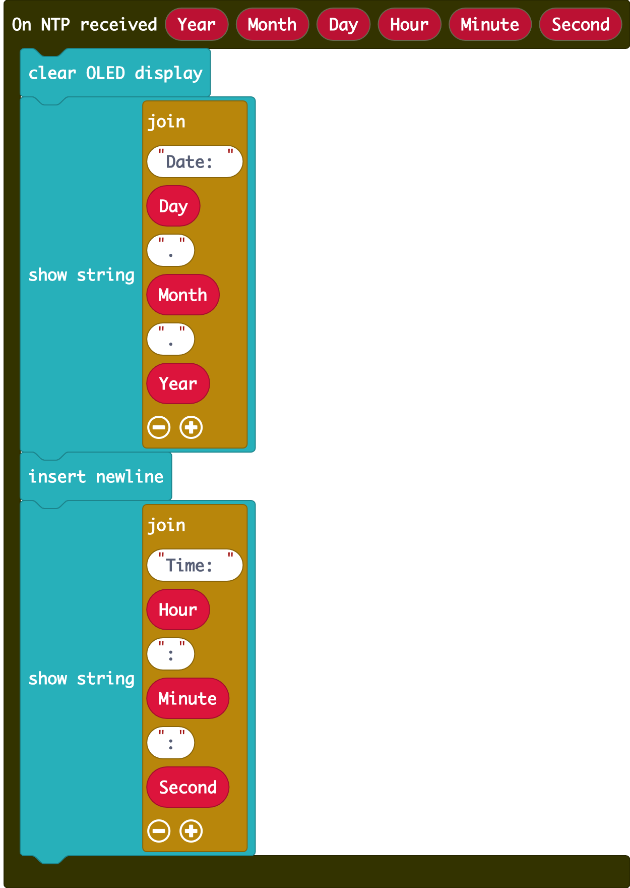

# Chapter 6: Network Time Protocol

Time synchronization is essential in the digital world, facilitating coordinated activities, accurate event logging, secure transactions, and data consistency. Network Time Protocol (NTP) is a fundamental protocol in computer networking, used to synchronize the clocks of devices over a network. 

The NTP server receives accurate Coordinated Universal Time (UTC) from an authoritative clock source, such as an atomic clock or GPS. Then, the NTP client requests and receives time from the NTP server. NTP can usually maintain accuracy to within tens of milliseconds. In this chapter, you will learn how to update the date and time in iot:bit via NTP.

## Coding (Makecode)

Goal:

Develop a program to sync the time frequently.

Step 1:Connect WiFi

Before we obtain the NTP time, we need to connect to the network. We already
know how to connect to the WiFi in the first chapter. 

Step 2: Get the NTP time

* Put a `if` statement into `forever`
* Use `WiFi connected?` as condition
* Go to IoT:bit -> IoT Services and put the `Get NTP Current Time at city HongKong (UTC+8)` or `Get NTP Current Time at Time Zone UTC +0`
* Choose your time zone
* Add a pause

Step 3: Display the date and time on OLED

* Go to IoT:bit -> IoT Services and snap the `On NTP received`
* Clear the display before each update
* Display the date in `Day.Month.Year` format
* Insert a new line
* Display the time in `Hour:Minute:Second` format

Full Solution 

MakeCode: [https://makecode.microbit.org/_Rs8Lm1Js9JCL](https://makecode.microbit.org/_Rs8Lm1Js9JCL)  

You could also download the program from the following website: 
<iframe src="https://makecode.microbit.org/#pub:_Rs8Lm1Js9JCL" width="100%" height="500" frameborder="0"></iframe>

## Result

After connecting to WiFi, whenever IoT:bit gets the NTP time, it will display the formatted date and time.

