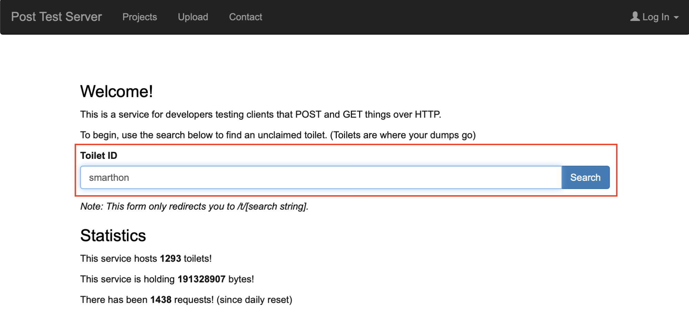
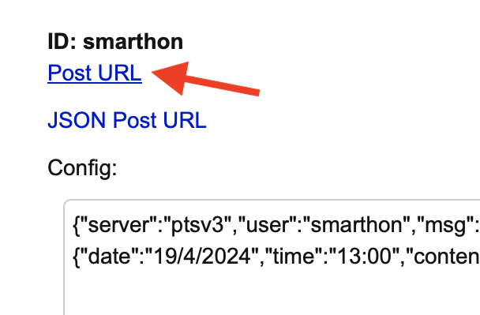
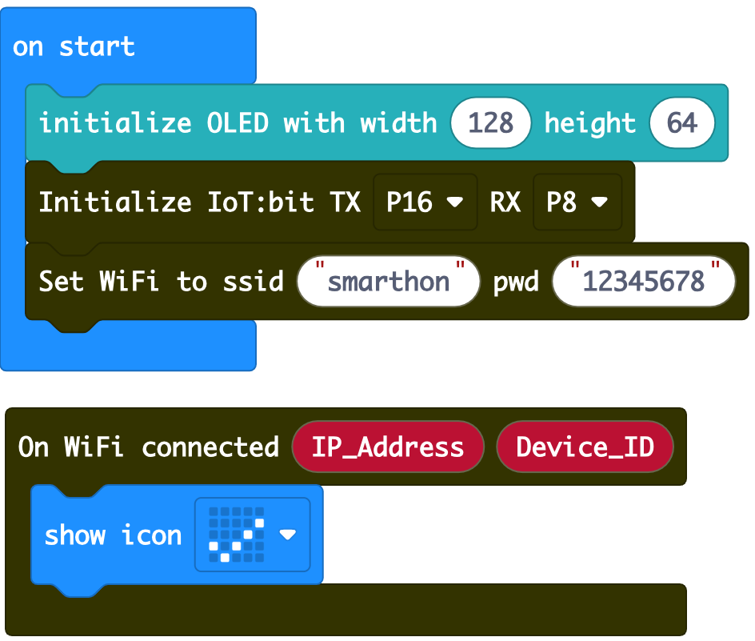
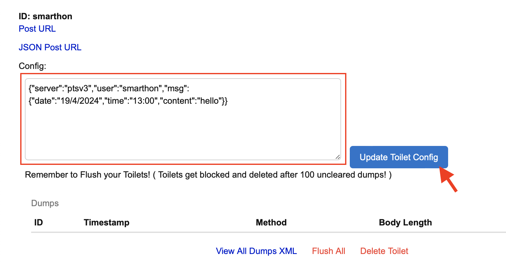
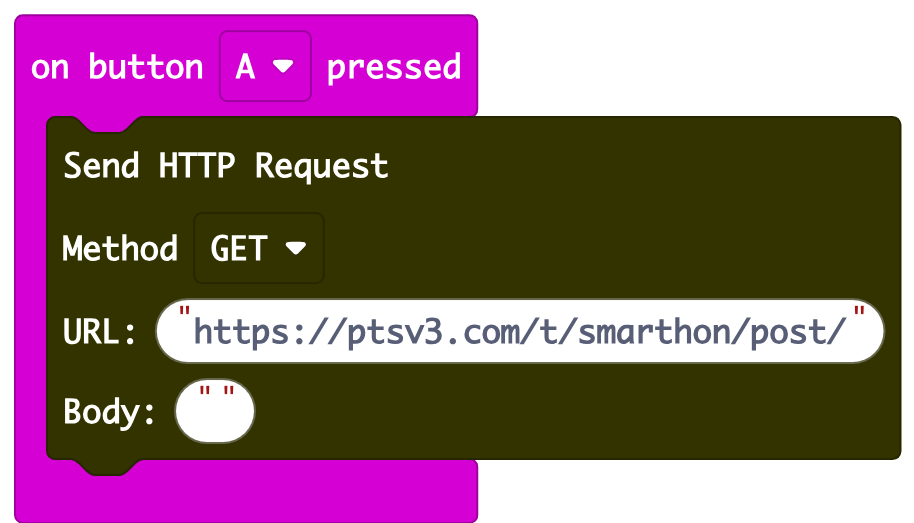
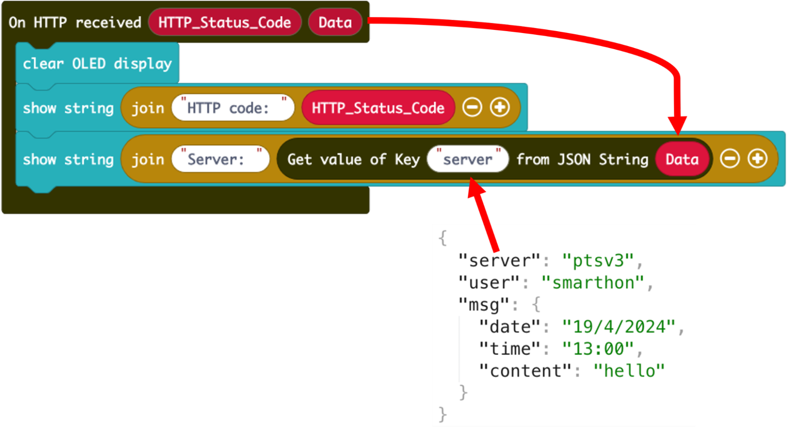
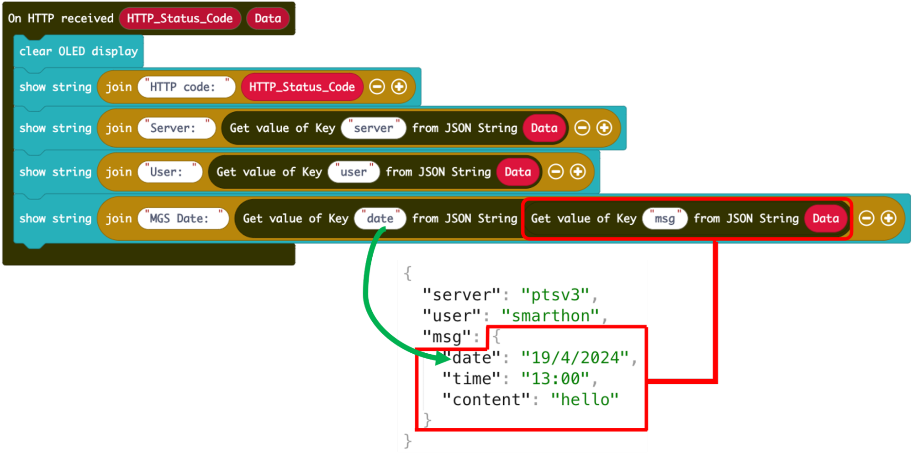
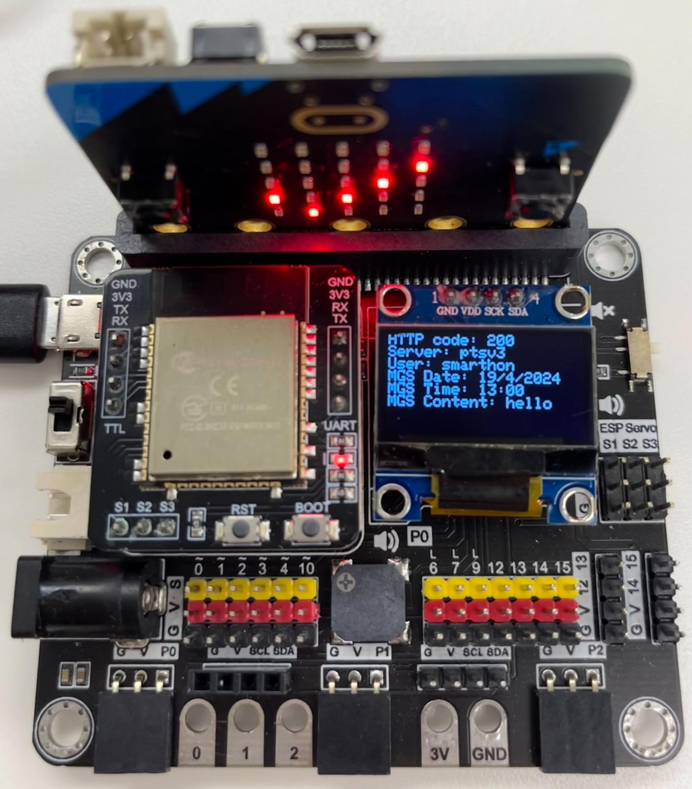

# Chapter 8: HTTP Function

HTTP stands for Hypertext Transfer Protocol. It's the foundation of data communication for the World Wide Web. HTTP functions as a request-response protocol in the client-server computing model. It's used for transferring hypermedia documents, such as HTML pages, images, and other resources, between a web browser (client) and a web server. HTTP works by a client sending a request to a server, and then the server responding with the requested resource along with an HTTP status code that indicates the success or failure of the request. In this chapter, you will learn how to send a HTTP request and receive the response with Iot:bit. 

## Scenario Example

Goal: 

This example is to obtain string content from the server via HTTP.

Description: 

In this example, there are 2 parts involved.
* In part 1, we need to create a HTTP server that carries strings.
* In part 2, we program the micro:bit to send a HTTP request and receive the response from the server.

## Part 1: Create HTTP API Server

Goal: 

We use a free server service to set up a server containing string content for testing.

Step 1 

Go to [https://ptsv3.com](https://ptsv3.com). Enter a unique ID to find an unclaimed toilet (access path), such as “smarthon”.

Step 2 

Modify the configuration so that the server returns a response in JSON format. After modification, click “Update Toilet Config”

<H5>Example JSON:</H5>

{"server":"ptsv3","user":"smarthon","msg":{"date":"19/4/2024","time":"13:00","content":"hello"}}

## Part 2: Coding

Goal: 

Send an HTTP request to the server and extract the content

Step 1: Connect WiFi 

* Before we get the content, we need to connect to the network. We already
know how to connect to the WiFi in the first chapter.

Step 2: Copy URL 

* Copy the Post URL by right clicking -> copy link

Step 3: Setup a function to send HTTP request 

* Snap a `on button A pressed` to editor
* Go to IoT:bit -> IoT Services and snap `Send HTTP Request`
* Paste URL into the block
* We use GET in this example, so leave the Body empty

Step 4: Create a response handler 

* Go to IoT:bit -> IoT Services and snap `On HTTP received` to editor
* Display `HTTP_Status_Code` on OLED

**Remark:** `HTTP_Status_Code` returns the code representing the sending result, such as 200(OK), 404(Not found), 502 (Bad Gateway), more information at [https://developer.mozilla.org/en-US/docs/Web/HTTP/Status](https://developer.mozilla.org/en-US/docs/Web/HTTP/Status)

Step 5: Setup a JSON extractor function 

* Go to IoT:bit -> IoT Services and snap `Get value of Key`
* Fill in the Key name according to the JSON
* Draw the `Data` to `JSON String`

* When need to access the Multi-level JSON, nest the blocks until you access the target level

Full Solution 

MakeCode: [https://makecode.microbit.org/_2MTJ2PMyM3mu](https://makecode.microbit.org/_2MTJ2PMyM3mu) 

You could also download the program from the following website: 
<iframe src="https://makecode.microbit.org/#pub:_2MTJ2PMyM3mu" width="100%" height="500" frameborder="0"></iframe>

## Result

After connecting to Wifi, press button A, and the OLED displays the content in the URL.

