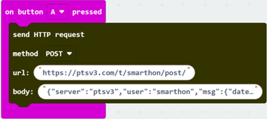

# Chapter 8: HTTP Function

HTTP stands for Hypertext Transfer Protocol. It's the foundation of data communication for the World Wide Web. HTTP functions as a request-response protocol in the client-server computing model. It's used for transferring hypermedia documents, such as HTML pages, images, and other resources, between a web browser (client) and a web server. HTTP works by a client sending a request to a server, and then the server responding with the requested resource along with an HTTP status code that indicates the success or failure of the request. In this chapter, you will learn how to send a HTTP request and receive the response with Iot:bit. 

 

| Method | With Body | Without Body |
| -- | -- | -- |
| Get | #Body will not be sent out and will be ignored finally | work properly |
| POST | work properly | *Empty string “” body will be sent out instead |

<b># The HTTP specification said that using HTTP GET to include the body is not a good idea.</b> 
<b>* This will only be supported after firmware version 4.2 </b> 

## Scenario Example

Goal: 

This example is to obtain string content from the server via HTTP. 

Description: 

In this example, there are 2 parts involved. 

- In part 1, we need to create a HTTP server that carries strings. 
- In part 2, we program the micro:bit to send a HTTP request and receive the response from the server. 

 

## Part 1: Create HTTP API Server

Goal: 

We use a free server service to set up a server containing string content for testing. 

Step 1 

Go to [https://ptsv3.com](https://ptsv3.com). Enter a unique ID to find an unclaimed toilet (access path), such as “smarthon”.  

 

Step 2 

Modify the configuration so that the server returns a response in JSON format. After modification, click “Update Toilet Config”  

 

Example JSON: 
{"server":"ptsv3","user":"smarthon","msg":{"date":"19/4/2024","time":"13:00","content":"hello"}} 

 

## Part 2: Coding

Goal: 

Send an HTTP request to the server and extract the content 

Step 1: Connect WiFi 

- Before we get the content, we need to connect to the network. We already know how to connect to the WiFi in the first chapter. 
 

Step 2: Copy URL 

- Copy the Post URL by right clicking -> copy link
 

Step 3: Using POST method to update the Data 

- Snap a `on button A pressed` to editor 
- Go to IoT:bit -> IoT Services and snap `Send HTTP Request` 
- Paste URL into the block 
- We use POST in this example 

**Put your data into the body**
- Example JSON: 
- {"server":"ptsv3","user":"smarthon","msg":{"date":"21/07/2025","time":"12:00","content":"hello"}} 
- The time and the day have been changed. 
 

Step 4: Using GET method to get the data 

- Snap a `on button B pressed` to editor 
- Go to IoT:bit -> IoT Services and snap `Send HTTP Request` 
- Paste URL into the block 
- We use GET in this example, so leave the Body empty 
 

Step 5: Create a response handler 

Go to IoT:bit -> IoT Services and snap `On HTTP received` to editor
Display `HTTP_Status_Code` on OLED 
 

Step 6: Setup a JSON extractor function 

- Go to IoT:bit -> IoT Services and snap `Get value of Key` 
- Fill in the Key name according to the JSON  
- Draw the `Data` to `JSON String` 
 

- When need to access the Multi-level JSON, nest the blocks until you access the target level 

 

- Remark: The `HTTP_Status_Code` returns a code representing the sending result, such as 200(OK), 404(Not found), 502 (Bad Gateway), more information at [https://developer.mozilla.org/en-US/docs/Web/HTTP/Status](https://developer.mozilla.org/en-US/docs/Web/HTTP/Status) 

## Full Solution

MakeCode: [https://makecode.microbit.org/S67494-15951-48626-85113](https://makecode.microbit.org/S67494-15951-48626-85113) 
You could also download the program from the following website: 
<iframe src="https://makecode.microbit.org/S67494-15951-48626-85113" width="100%" height="500" frameborder="0"></iframe>

## Result

After connecting to Wifi, press button A, it will POST the body information into the webserver, and change the body part. If the server body part has any changes, press the button B, it will GET the body information into the microbit. 
 
 
 