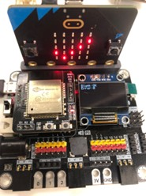
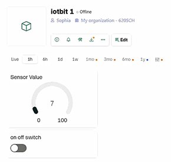
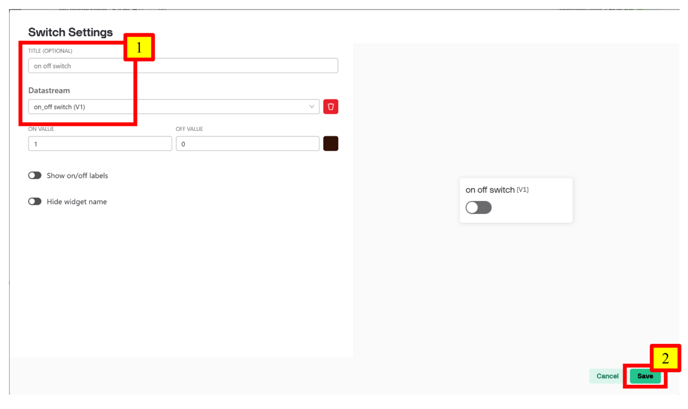

# Chapter 9: Upload Data and Get Controlled by Blynk

Blynk is a powerful IoT (Internet of Things) platform that allows users to build and control connected devices with ease. It provides a user-friendly mobile and web dashboard that lets developers and hobbyists remotely monitor and manage microcontrollers, sensors, and actuators. 

 

## Session 1: Upload Data to Blynk

Goal:

Upload sensor values to Blynk and display them using Gauges on the Blynk platform. 

 

Description:

In this example, there are 2 parts involved. 
In Part 1, we will create a device on Blynk and obtain its token. 
In Part 2, we will program the micro:bit to send sensor values to Blynk. 

### Part 1: Blynk Configuration

Goal:

Create a device on Blynk and obtain its token. 

Step 1: Create an Account

1. Go to https://blynk.io/ 
2. Register an account and log in to the platform according to the website's instructions. 

Step 2: Create a Template

1. Go to Developer Zone > My Templates, and click “+ New Template”. 
2. Input name, hardware and connection type accordingly. Click “Done” when finished. 
- Name: iotbit 
- Hardware: Other 
- Connection type: WiFi 

  

Step 3: Configure the Datastream - Add V0

1. Go to Datastreams, click “+ New Datastream” and select “Virtual Pin”. 
  

2. Change the configuration of the Pin accordingly. Click “Create” when finished. 
- Name: Sensor Value 
- Max: 100 
 

Step 4: Configure the Web Dashboard

1. Go to Web Dashboard. 
2. Drag a Gauge to the Dashboard area. 
3. Hover over the Gauge, click the button shown below to change its settings 
  

4. Choose Sensor Value (V0) as the Datastream. Click “Save” when finished. 
 

Step 5: Disable Notification Upon Interaction

Since the device will always be offline, a notification will be triggered with every interaction. By disabling this notification, we can prevent alerts about the offline status when interacting with the device. 
1. Go to Connection Lifecycle. 
2. Scroll down to Offline and click Settings. 
3. Disable “Display notification upon user interaction”. 
  

4. Click “Save” to save the entire template. 
  

Step 6: Create a Device With the Template

1. Go to Devices. Click “+ New Device”. 
  

2. Click “From template” and select the template we just created. 
3. Rename the device as “iotbit 1” at Device Name. Click “Create” when finished. 
  

4. Go to the Devices page and copy the token as shown below. Keep the copied token in a safe place for future use. 
 

Step 7 (Optional): Configure the Mobile Dashboard

1. Open the Blynk App and log in to your account. 
2. After logging in, you will find the device you just created on the page. 
3. Switch to Developer Mode by clicking the button at the top right-hand side. 
4. Click on the template you just created. 
5. Click “+” and choose “Gauge”. A Gauge will be shown on the dashboard automatically. 
6. Click the newly created Gauge and choose Sensor Value (v0) as its datastream. 
  

### Part 2: Programming (MakeCode)
Goal:

Program the micro:bit to send sensor values to Blynk. 

Step 1: Connect to WiFi

1. Initialize IoT:bit to connect to a designated WiFi network and display the connection status when successful. You may refer to the first chapter for instructions on how to connect to WiFi. 
2. Snap “initialize OLED with width 128 height 64” to “on start”. 
 

Step 2: Send Data to Blynk

For demonstration, a random number is sent to Blynk every 1 second. 
1. In “forever”, use if-statement to check WiFi connection status. 
2. Snap the “Send Blynk token.....” block inside the if-statement. 
3. Copy the token from Blynk and fill it into “Send Blynk token”. 
4. Snap “pick random 0 to 10” to V0 value inside “Send Blynk token”. Change the range to “0 to 100”. 
5. Snap a pause to the loop. Set the pause to be 1000 ms (1 second). 
 

Step 3: Show Blynk Upload Status

1. Get the “On Blynk Uploaded” handler from IoT:bit > IoT Services. 
2. Use OLED to display the upload status and error code. 
 

Full Solution

MakeCode: [https://makecode.microbit.org/_2v1FqMJebYJU](https://makecode.microbit.org/_2v1FqMJebYJU) 
<iframe src="https://makecode.microbit.org/_2v1FqMJebYJU" width="100%" height="500" frameborder="0"></iframe>

### Result

If the upload is successful, it will show OK as the status with error code 0. 
On Blynk, you will see the value of the Gauge keep changing randomly, which is controlled by the data sent from your Micro:bit. 
  
**<u>Web Dashboard:</u>** 
  

**<u>Mobile Dashboard:</u>** 
  

If the upload fails, it will show FAIL as the status with the respective error code which represents the reason of failure. 
- Error code 400: The user inputted the wrong token. 
- Error code -28674: There is no internet connection. 

## Session 2: Get Controlled by Blynk

Goal:

Create a switch on Blynk to control the output of the micro:bit.
 

 

Description:

In this example, there are 2 parts involved.  
In Part 1, we will create a switch on Blynk and configure it to send data to the micro:bit.  
In Part 2, we will program the micro:bit to respond to input from Blynk.  

### Part 1: Blynk Configuration 

Goal:

Create a switch on Blynk and configure it to send data to the micro:bit. 

Step 1: Use Existing Template

We will continue to use the template created in section 9.1.1. Go to Developer Zone > My Templates. Choose the template we just created.  
  

Otherwise, create a new template following the first half chapter of step 1 and 2. 

Step 2: Update the Datastream - Add V1

1. Go to Datastreams and click “Edit”. 
2. Click “+ New Datastream” and select “Virtual Pin”. 
3. Change the name of the pin to “on_off switch”. Click “Create” when finished. 

 

Step 3: Add a Switch to the Web Dashboard

1. Go to Web Dashboard, drag a Switch to the Dashboard area. 
2. Hover over the Switch and go into its settings. 
  

3. Choose on_off switch (V1) as the Datastream. Click “Save” when finished. 
  

4. Click “Save And Apply” to save the entire template. 
  

Step 4 (Optional): Configure the Mobile Dashboard

1. Open the Blynk App. 
2. Switch to Developer Mode by clicking the button at the top right-hand side. 
3. Click on the template you just updated. 
4. Click “+” and choose “Switch”. A Switch will be shown on the dashboard automatically. 
5. Click the newly created Switch and choose on_off switch (v1) as its datastream. 

  

### Part 2: Programming (MakeCode)
Goal:

Program the micro:bit to respond to input from Blynk. 

Step 1: Connect to WiFi

1. Initialize IoT:bit to connect to a designated WiFi network. You may refer to the first chapter for instructions on how to connect to WiFi. 
2. Snap “initialize OLED with width 128 height 64” to “on start”.
 

Step 2: Read Data from Blynk

1. In “forever”, use if-statement to check WiFi connection status. 
2. Snap the “read Blynk token.....” block inside the if-statement. 
3. Copy the token from Blynk and fill it into “read Blynk token”. 
4. Choose V1 for “read Blynk token.....”. 
5. Snap a pause to the loop. Set the pause to be 1000 ms (1 second). 
 

Step 3: Display the Data Read

1. Get the “On Blynk Readed” handler from IoT:bit > IoT Services. 
2. Create a variable to store the value read from Blynk. 
3. Use OLED to display the read pin and its value. 
4. Show the respective icon according to the read data. 
 

Full Solution

MakeCode: [https://makecode.microbit.org/_CfDHut4T7Eif](https://makecode.microbit.org/_CfDHut4T7Eif) 
You could also download the program from the following website: 
<iframe src="https://makecode.microbit.org/_CfDHut4T7Eif" width="100%" height="500" frameborder="0"></iframe>

### Result

We can change the value of the read pin using the switch on Blynk to check if the micro:bit can correctly receive the data. 

1. When the Switch in on 
  

**<u>Web Dashboard:</u>** 
  
**<u>Mobile Dashboard:</u>** 
 

2. When the Switch is off 
  
**<u>Web Dashboard:</u>** 
  
**<u>Mobile Dashboard:</u>** 
 