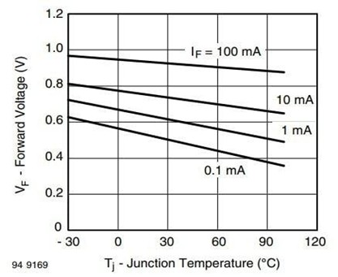

# Temp/Humidity/Pressure Sensor (BME280)

## Introduction

BME280 is a miniature sensor that uses different principles to simultaneously measure temperature, humidity and atmospheric pressure.

## The principle

**Temperature**

The BME280 utilizes the thermosensitive characteristics of a diode to measure temperature. When the temperature changes, the forward voltage of the diode changes accordingly. For example, the figure below shows data for a diode, demonstrating a clear linear relationship between forward voltage and temperature.

Generally, as the temperature increases, the forward voltage of the diode decreases, and vice versa. By measuring this voltage while keeping the forward current constant, changes in temperature can be inferred.

**Humidity**

The BME280 uses the humidity-sensitive characteristics of a capacitor to measure the humidity of the surrounding environment. This capacitor consists of a pair of electrodes separated by a dielectric material. When the humidity in the surrounding environment increases, the moisture content in the dielectric material also increases, leading to an increase in the capacitor's capacitance. Conversely, when humidity decreases, the capacitance decreases. However, temperature changes can also affect the capacitance of the capacitor, so temperature correction is necessary to ensure accuracy. The BME280 monitors ambient temperature and adjusts the output of the humidity sensor based on temperature changes to ensure accurate humidity measurements.

**Atmospheric Pressure**

The BME280 contains a resistor made of a pressure-sensitive material. When subjected to pressure, the resistance value of this material changes. As atmospheric pressure increases, the resistance value of the material increases, and vice versa. Therefore, by monitoring changes in the resistance value, the level of surrounding atmospheric pressure can be inferred.

## Specifications

* Supply voltage: 1.71V - 3.6V
* Scope of work:Temperature: -40…+85 °C 
&emsp;&emsp;&emsp;&emsp;&emsp;&emsp;&emsp;&emsp;&emsp;Relative humidity: 0…100% 
&emsp;&emsp;&emsp;&emsp;&emsp;&emsp;&emsp;&emsp;&emsp;Atmospheric pressure: 300…1100 hPa 
* Humidity sensing response time: 1 second

## Pinout Diagram

|Pin|Function|
|--|--|
|G|Ground|
|V|Voltage Supply|
|S|Signal Output(Analog)|

## Outlook and Dimension

 
Size:25mm*25mm

## Quick to Start/Sample

- Connect the BME280 to the development board (direct plugin or using wire) 

- Open Makecode and use [https://github.com/SMARTHON/pxt-advancedSensor](https://github.com/SMARTHON/pxt-advancedSensor) PXT 
(Not working properly yet copied from smart plant v1.3.5, and now is advancedSensor v1.7.1) 

- Display temperature, humidity and atmospheric pressure on OLED display 

## Results

The OLED display shows the current temperature, humidity and atmospheric pressure 

## FAQ

Q: Can I disable some sensors? 
A: Humidity sensor and pressure sensor can be enabled/deactivated independently

## Data sheet

[BME280](https://drive.google.com/file/d/1tbVVOJyCVNs4Pj8ldpxSaf4JreVwFJQ6/view?usp=sharing)
