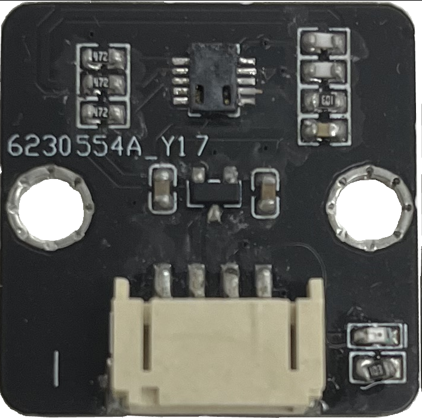
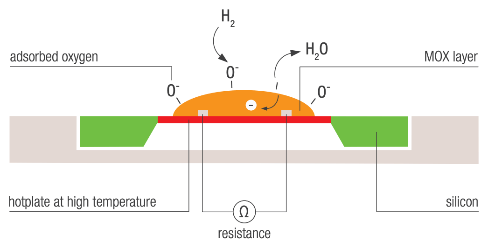
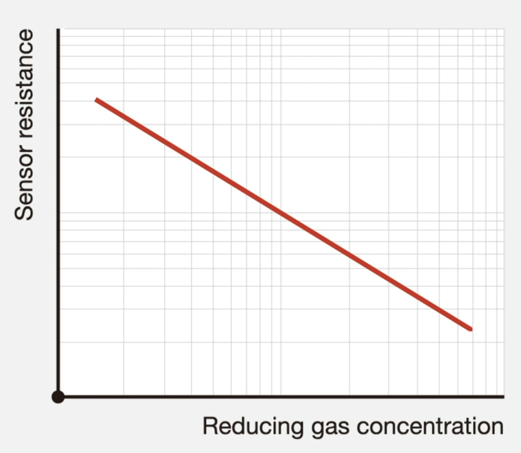
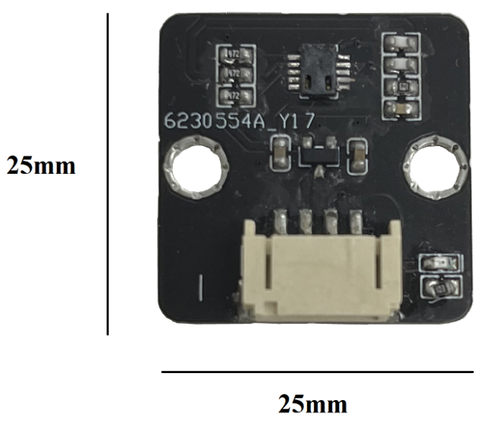
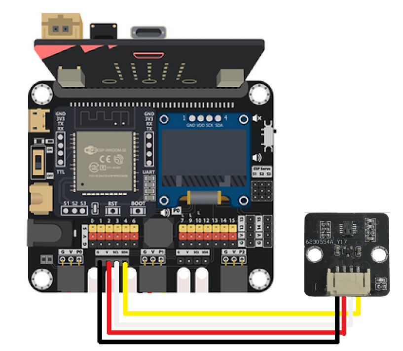
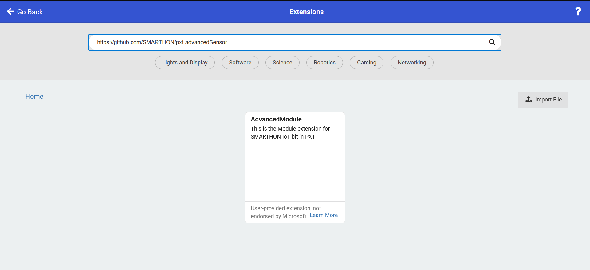
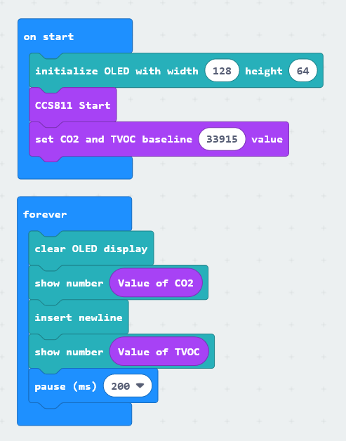
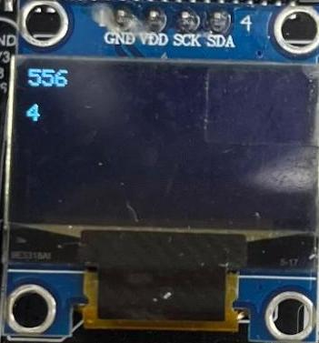

# CO2 sensor

## Introduction

CCS811 measures indoor eCO2 and TVOC density. eCO2 stands for equivalent CO2. It indicates the concentration of CO2 that will cause the same level of radiative forcing as the measured ambient air does. TVOC stands for total volatile organic compounds. It is a measurement of the gasses emitted from toxins and chemicals. 

## The principle

CCS811 is a Metal Oxide Sensor. It measures the resistance of a sensitive layer which is exposed to air. The sensitive layer is heated up. 

When it is in clean air, the sensitive layer absorbs oxygen in air. Oxygen attracts free electrons. As a result, there is less flow of electrons in the sensitive layer and the resistance will be high. 

When it is in polluted air, oxygen is reduced by the pollutants. Electrons are released and there is more flow of electrons in the sensitive layer. The oxidation will lower the resistance. 

## Indoor CO2 Levels

<H3>Pinout Table</H3>

<table class="tg" style="undefined;table-layout: fixed; width: 400px">
<colgroup>
<col style="width: 98.008404px">
<col style="width: 95.008404px">
</colgroup>
<thead>
  <tr>
    <th class="tg-ux7d">CO2 [ppm]</th>
    <th class="tg-ux7d">Air Quality</th>
  </tr>
</thead>
<tbody>
  <tr>
    <td class="tg-l89d">2100</td>
    <td class="tg-l89d" rowspan="6">BAD Heavily conraminated indoor air Ventilation required</td>
  </tr>
  <tr>
    <td class="tg-j1bp">2000</td>
  </tr>
  <tr>
    <td class="tg-l89d">1900</td>
  </tr>
  <tr>
    <td class="tg-j1bp">1800</td>
  </tr>
  <tr>
    <td class="tg-l89d">1700</td>
  </tr>
  <tr>
    <td class="tg-j1bp">1600</td>
  </tr>
  <tr>
    <td class="tg-l89d">1500</td>
    <td class="tg-l89d" rowspan="5">MEDIOCRE Contaminated indoor air Ventilation recommended</td>
  </tr>
  <tr>
    <td class="tg-j1bp">1400</td>
  </tr>
  <tr>
    <td class="tg-l89d">1300</td>
  </tr>
  <tr>
    <td class="tg-j1bp">1200</td>
  </tr>
  <tr>
    <td class="tg-l89d">P1100</td>
  </tr>
  <tr>
    <td class="tg-l89d">1000</td>
    <td class="tg-l89d" rowspan="2">FAIR</td>
  </tr>
  <tr>
    <td class="tg-j1bp">900</td>
  </tr>
  <tr>
    <td class="tg-l89d">800</td>
    <td class="tg-l89d" rowspan="2">GOOD</td>
  </tr>
  <tr>
    <td class="tg-j1bp">700</td>
  </tr>
  <tr>
    <td class="tg-l89d">600</td>
    <td class="tg-l89d" rowspan="3">EXCELLENT</td>
  </tr>
  <tr>
    <td class="tg-j1bp">500</td>
  </tr>
  <tr>
    <td class="tg-l89d">400</td>
  </tr>
  <tr>
  </tr>
</tbody>
</table>

The lower resistance is, the higher the reading would be.

photo ref:
[https://atmotube.com/atmotube-support/how-does-atmotube-voc-sensor-work](https://atmotube.com/atmotube-support/how-does-atmotube-voc-sensor-work)
[https://www.youtube.com/watch?v=hX5kLqPe8nc](https://www.youtube.com/watch?v=hX5kLqPe8nc)

ref:
[https://docs.smartcitizen.me/Components/sensors/air/CCS811/#working-principle](https://docs.smartcitizen.me/Components/sensors/air/CCS811/#working-principle)
[https://www.youtube.com/watch?v=hX5kLqPe8nc](https://www.youtube.com/watch?v=hX5kLqPe8nc)

## Specification

* Supply Voltage: 1.8 ~ 3.6V
* Supply Current: 30mA
* Power Consumption: 60mW
* Operating Temperature Range: -5 ~ 50℃
* Operating Humidity Range: 10 ~ 95%
* eCO2 output range: 400 ~ 8192ppm
* TVOC output range:  0 ~ 1187ppb

## Pinout Diagram

|Pin|Function|
|--|--|
|G|Ground|
|V|Voltage Supply|
|SDA|Data|
|SDL|Clock|

## Outlook and Dimension

Size: 25mm X 25mm

## Quick to Start/Sample

* Connect the CO2  sensor to development board (using wire) 

 

* Open Makecode, using the [https://github.com/SMARTHON/pxt-advancedSensor] PXT 

 

* Show the CO2 and TVOC on the OLED 

 

## Result

The CO2 and TVOC showing on the OLED screen 

## FAQ

Q: Why it is not recommended to be used in outdoor environment?  
A: Under outdoor environment, traffic and high levels of sun radiation produces ozone. It increases the sensor's resistance so the sensor will have incorrect reading. Additionally, temperature and relative humidity will affect the sensor resistance. When temperature and relative humidity changes abruptly, baseline resistance is no longer applicable so the sensor will have incorrect reading. 

Q: Why the CO2 reading start at 400ppm?  
A: 400ppm is the current background CO2 of fresh air.

## Datasheet

[CCS811-datasheet](https://cdn.sparkfun.com/assets/learn_tutorials/1/4/3/CCS811_Datasheet-DS000459.pdf)
