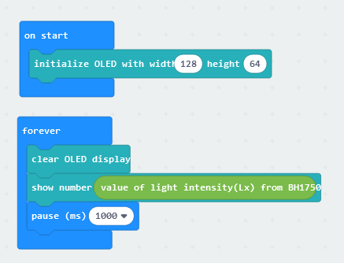

# Digital Light Sensor (BH1750)

## Introduction

Digital Light Sensor (BH1750) uses a photodiode to measure ambient light. The photodiode consumes light energy to produce an electric current. The electricity produced by photodiodes is proportional to the intensity of light. The illuminance values are in LUX. 

## The principle

A photodiode is a PN-junction diode. There is a region called depletion region at the interface between P-type and N-type. 

Light carries energy in the form of small energy packets called Photons. When the depletion region is illuminated by photons of energy enough to break covalent interatomic bonds, it creates a pair – an electron(black spots in figure), and a hole(white spots in figure). Electrons continue flowing down the wire to the voltage source, and to the P-type. The holes cannot move in wires, so they recombine with incoming electrons at the P-type. The photocurrent generated will be converted into voltage, then from analog values into digital values, finally output illuminance in LUX. 

## Specification

* Name: BH1750FVI-TR
* Peak Wavelength: 560 nm
* Operating Temperature: - 40℃ ~ 80℃
* Operating Supply Voltage: 3V (3-3.6V)
* Supply Current: 120μA (max: 190μA) when Ev = 100 lx
* Powerdown Current: 0.01μA (max:1.0μA) when no input Light
* Power Dissipation: 260 mW
* Output: Digital 16bit

## Pinout Diagram

|Pin|Function|
|--|--|
|G|Ground|
|V|Voltage Supply|
|SDA|Data|
|SDL|Clock|

## Outlook and Dimension

Size: 25mm X 25mm

## Quick to Start/Sample

* Connect the digital light sensor to development board (using wire) 

 

* Open Makecode, using the [https://github.com/SMARTHON/pxt-smartplant](https://github.com/SMARTHON/pxt-smartplant) PXT 

 

* Show the light intensity on the OLED 

 

## Result

The light intensity showing on the OLED screen 

## FAQ

Q: What is the difference between digital light sensor(BH1750) and light dependent resistor(LDR)?  
A: BH1750 has high accuracy and precision; LDR has less precision.  
The output unit of BH1750 is lux(lx). LDR output in the form of change of resistance value(ohms).  
LDR is cheaper than BH1750.

Q: What is the output range of a digital light sensor(BH1750)?  
A: The output range is 1 - 65535 lx.

## Datasheet

[BH1750FVI-datasheet](https://www.mouser.com/datasheet/2/348/Rohm_11162017_ROHMS34826-1-1279292.pdf)
