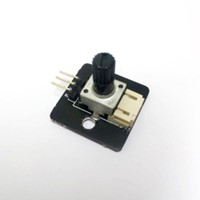
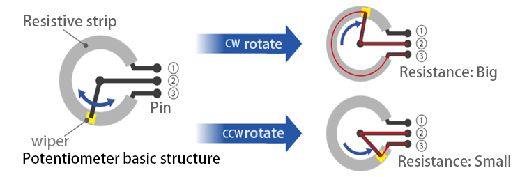
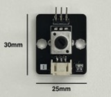
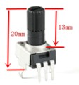
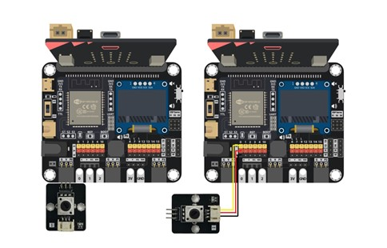
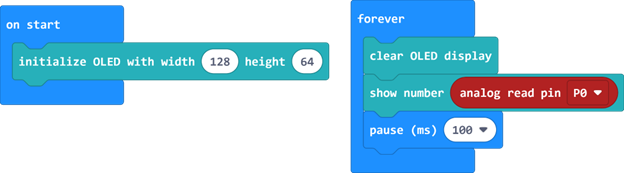
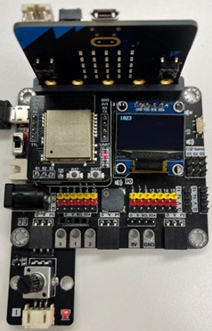
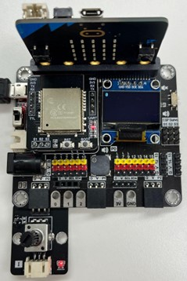

Dimmer
=========

## Introduction

This potentiometer is analog and has a rotation angle of 300 degrees. By turning its knob, you can change its resistance, thereby adjusting the output voltage. This can cause changes in other components, such as controlling the brightness of an LED light or the volume of a speaker. 

## Principle

The resistance value of an object depends on various factors, one of which is directly proportional to its length. For example, when the length of an object made of the same material is doubled while keeping the cross-sectional area constant, its resistance value will also double. 

A potentiometer is a resistive element bent into a circular shape with a constant cross-sectional area. One end is connected to the output voltage ③, and the other end is grounded ①. There is a sliding terminal connected to the input voltage ② in the middle. Turning the knob allows the sliding terminal to move along the resistive element, changing the contact position between the two. When the sliding terminal is moved closer to ③, the length of the resistive element in the circuit decreases, thereby reducing the resistance value, which ultimately increases the output voltage. Conversely, when the sliding terminal is moved closer to ①, the resistance value increases, causing the output voltage to decrease.

## Specifications
- Model: RV09
- Resistance: 10K
- Operating Voltage: 3.3 - 5V
- Power Supply Voltage: 5V
- Interface: Analog
- Output Value Range: 0 - 1023
- Pin Port Type: PH2.0-3p

## Pin

| Pin | Function |
| -- | -- |
| G | Ground |
| V | Voltage Supply |
| S | Signal output (Analog) |

## Outlook and Dimension
 
Size：25mm * 30mm 

 
Height：20mm 
Knob height：13mm 

## Quick to Start/Sample

- Connect the potentiometer to the development board (either by directly inserting it or using connecting wires). 

- Open Makecode 

- Activate the OLED screen and display the potentiometer's analog values.
 
- The range of values is between 0 and 1023. When the value is 0, the output voltage is at its minimum, and when the value is 1023, the output voltage is at its maximum.

## Result

Turning the knob clockwise will increase the value on the screen, up to a maximum of 1023. 
  
Turning the knob counterclockwise will decrease the value on the screen, down to a minimum of 0. 
 

## FAQ
Q: Why does the voltage still drop even when I adjust the potentiometer to the minimum resistance (i.e., output voltage < input voltage)? 
A: Even when the resistive element in the potentiometer is adjusted to the shortest length, the potentiometer itself still introduces resistance, causing a voltage drop. 

Q: Why can't I adjust the voltage by turning the knob, or why does the voltage fluctuate even without turning the knob? 
A: The potentiometer might be broken. Potentiometers have a mechanical lifespan, and frequent turning of the knob can cause it to wear out faster, even with proper use. 

Q: What are some common faults with potentiometers? 
A: Frequent turning of the knob can lead to damage or looseness of the knob, or wear of the resistive element inside the potentiometer, causing poor contact between the sliding terminal and the resistive element. Other common faults include internal pin disconnections and severe burning of the resistive element due to overcurrent, resulting in an open circuit. 

## Datasheet
[RV09 datasheet](https://handsontec.com/dataspecs/passive/RV09%20Pot-meter.pdf)