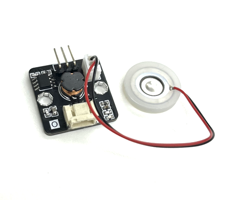
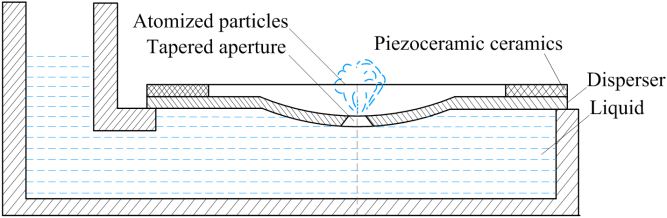
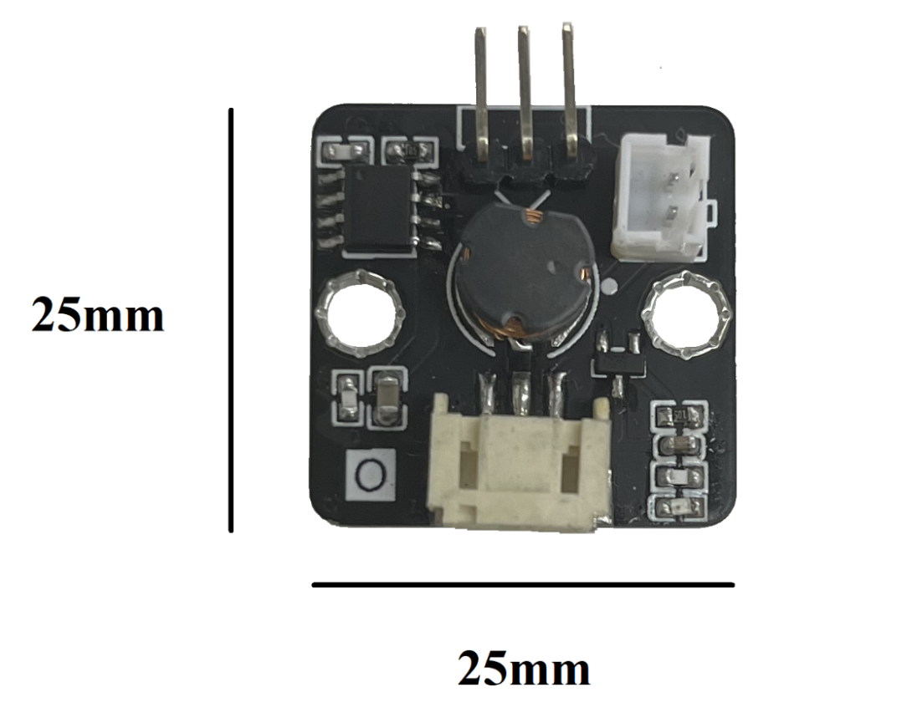
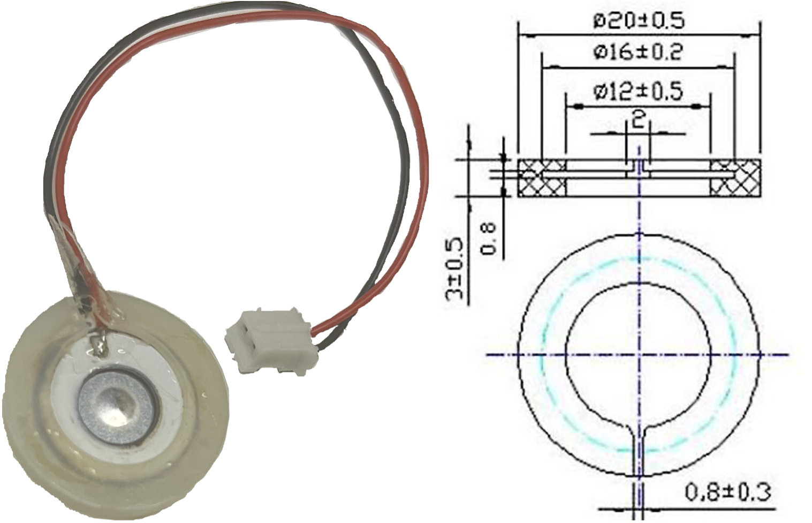
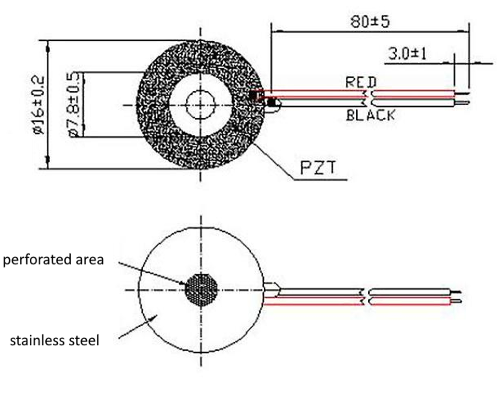
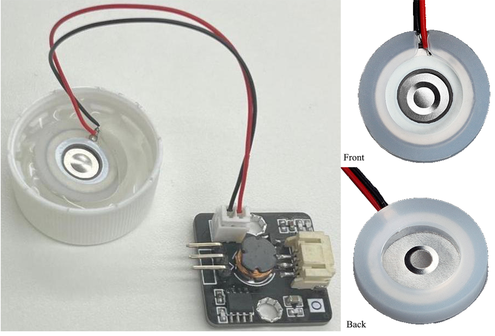
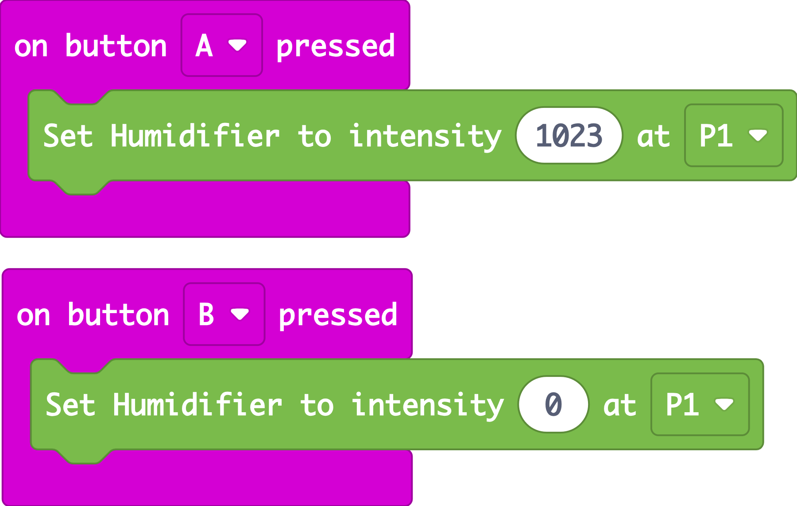
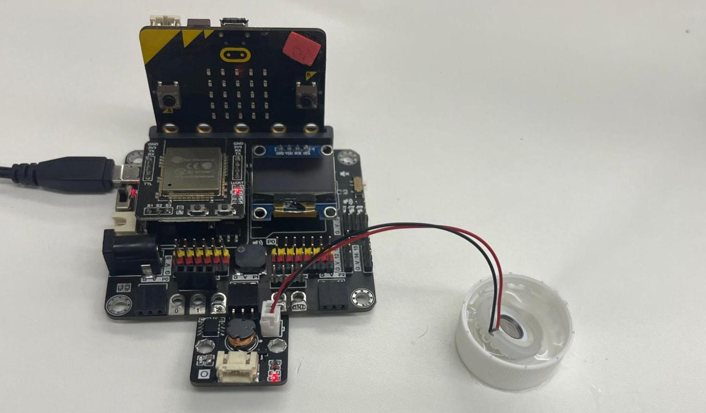
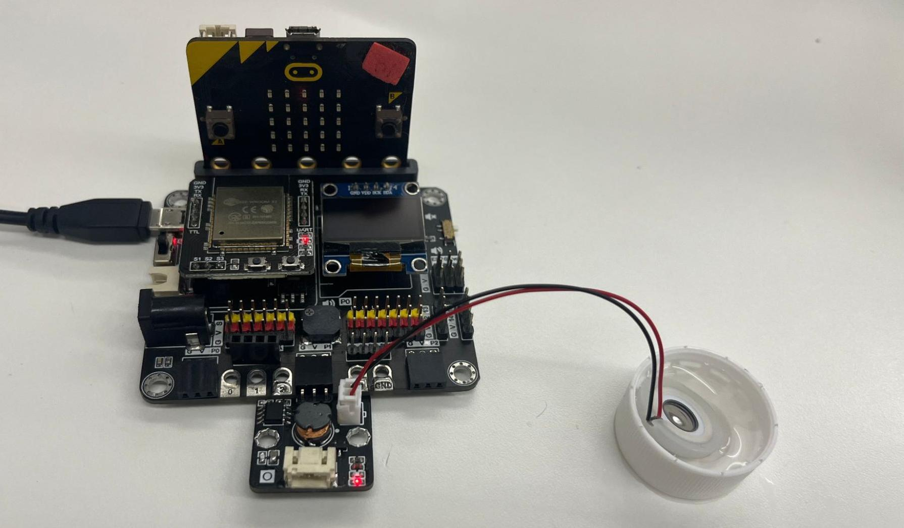

# Fog Module

## Introduction

It consists of a piezoelectric ceramic ring and metal disc. It converts electrical energy into mechanical energy. When it is placed on the surface of water, It vibrates against the water and creates fog. 

## The principle

 

The ceramic ring can convert electrical energy into high-frequency mechanical vibrations. The ceramic ring forces the disc into vibration. As the disc vibrates at high frequency, it experiences small and periodic mechanical deformations. This periodic movement releases energy into the water in contact, which breaks the surface tension of the water and produces droplets. This process is atomization. The meshed disc absorbs water on one side and sprays it through the micropores. The bubble size is decided by the pore size. 

## Specification

* Pin port type: PH2.0
* Resonant frequency: 108-110kHz
* Pore size: 4-5μm
* Number of pores: 1100
* Material of the disc: piezoelectric ceramic, 304 stainless steel
* Weight: 1.92g

## Pinout Diagram

|Pin|Function|
|--|--|
|G|Ground|
|V|Voltage Supply|
|S|Output|

## Outlook and Dimension

Size: 25mm X 25mm

Diameter of silicone ring: 20mm  
Thickness of apron: 3.5mm

Diameter of metal plate: 16mm  
Length of wire: 10cm

## Quick to Start/Sample

* Connect the fog module to development board (direct plugin or using wire) 

 

* Place the disc on the surface of water. The side with piezoelectric ceramic should face upwards.
 

* Open Makecode, using the [https://github.com/SMARTHON/pxt-smartplant](https://github.com/SMARTHON/pxt-smartplant) PXT 

 

* Show the light intensity on the OLED 

 

## Result

Press A button the turn on the fog module

Press B button the turn off the fog module

## FAQ

Why is there no fog dispersed?
1. Check whether the disc is reversed. The side with piezoelectric ceramic should face upwards to disperse fog.
2. Check whether there is water on the side with piezoelectric ceramic. When there is water above the disc, the fog will be blocked by water.
