# Infrared (IR) sensor
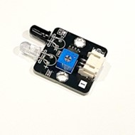

## Introdution 
The infrared sensor detects objects by emitting and receiving infrared light.

## The Principle
An infrared sensor consists of an infrared LED and an infrared photodiode. The infrared LED continuously transmits infrared light that is invisible to the human eye. The photodiode is highly sensitive to infrared light and changes its resistance and output voltage proportionally to the intensity of the received light. 

When the transmitted infrared light encounters an object, part of it is reflected back to the receiver. The intensity of the reflected light detected by the receiver depends on the object's distance and surface properties. By setting a threshold, the sensor can determine whether an object is approaching.
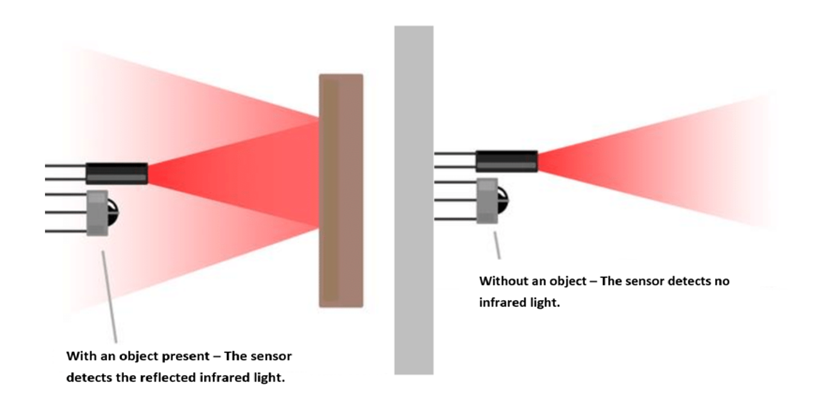 

The surface properties of an object, such as color, texture, size, and shape, affect the distance at which the receiver can detect the reflected light. For example, lighter colors can be detected from a greater distance compared to darker colors, and smooth surfaces reflect light more effectively than rough surfaces.
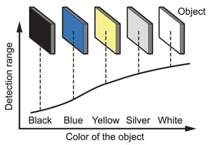 

## Specification
Returned value (Digital): 0 when an object is detected; 1 when no object is detected. 
* **Minimum Trigger Distance:**
    - Cardboard: 4.5 cm
    - Brown Plastic: 4 cm
    - White Paper: 5 cm

* **Maximum Trigger Distance:**
    - Cardboard: 13 cm
    - Brown Plastic: 10 cm
    - White Paper: 53 cm

**Transmitter (Maximum Parameters at 25°C)**
Power Consumption: 100mW 
Pulse Peak Current: 60mA 
Forward DC Current: 30mA 
Reverse Voltage: 6V 
Operating Temperature: −55°C to +100°C 
Storage Temperature: −55°C to +100°C 

**Receiver (Maximum Parameters at 25°C)**
Power Consumption: 75mW 
Reverse Voltage: 30V 
Operating Temperature: −25°C to +85°C 
Storage Temperature: −40°C to +85°C 

## Pinout Diagram

|Pin|Function|
|--|--|
|G|Ground|
|V|Volatge Supply|
|S|Digital Output|
 

## Outlook and Dimension
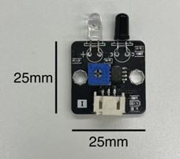 
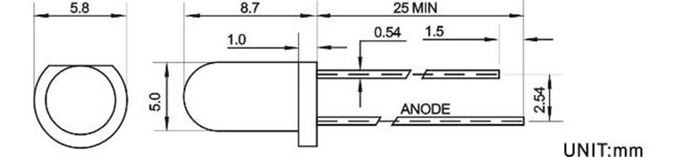 

Transmitter and receiver size: 5.8mm diameter * 8.7mm Length  

## Quick to Start/Sample

- Connect the IR sensor to develop board ( Using Wires ) 
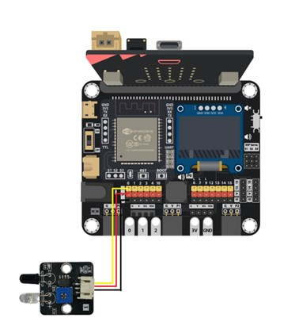 

### Method 1: 

- Using an analog read pin to read is to detect the object.
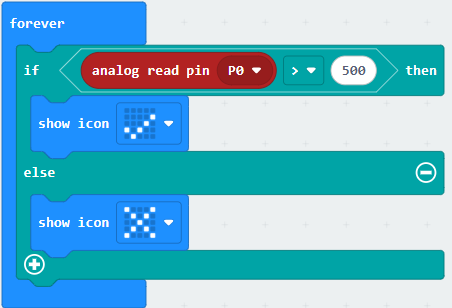 

### Method 2: 

- Open the Makecode, using [https://github.com/SMARTHON/pxt-smartcity-extension](https://github.com/SMARTHON/pxt-smartcity-extension) extension. 
 

- Using the PXT library to read the detection result and changing the LED status based on the result. 
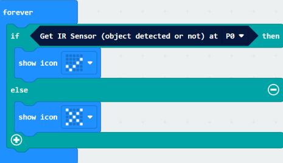

- By adjusting the brightness knob, you can control the sensitivity (trigger distance) of the infrared sensor. 
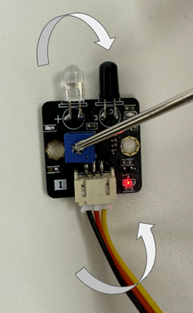
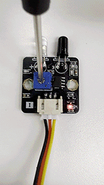  

Turning it clockwise increases sensitivity (it will trigger at a shorter distance). 
Turning it counterclockwise decreases sensitivity (it will trigger only at a longer distance). 

## Result
No detected the object in front of the IR sensor  
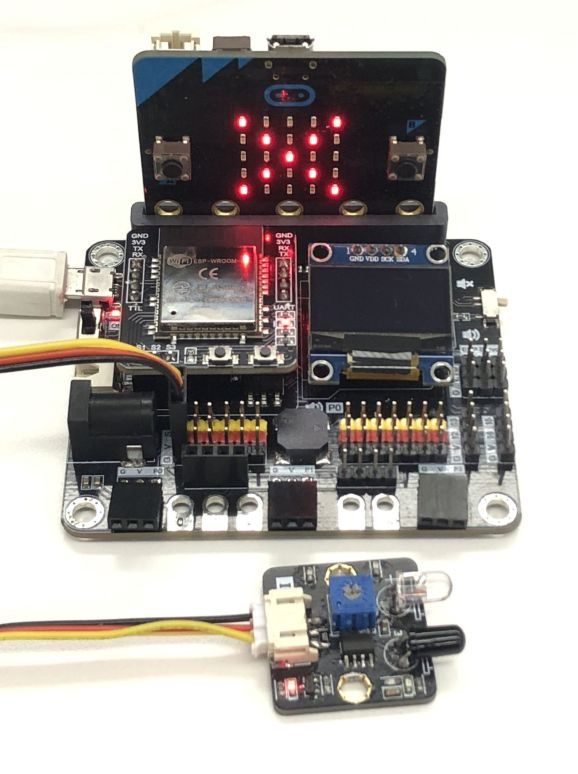 
Detected the object in front of the IR sensor  
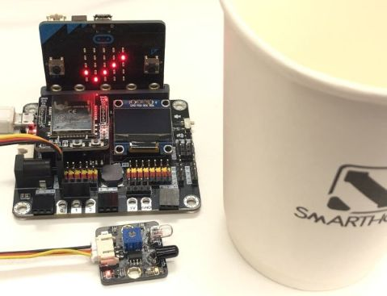 

## FAQ
Q: Why haven't I changed the knob,  but some objects will be detected from far away, while others need to be very close? 
A: Factors such as color and texture affect an object's reflectivity. Different surfaces reflect infrared light at different intensities, leading to variations in detection distance. For optimal detection, use light-colored, smooth, and flat objects. Black objects may not be detected due to their low reflectivity. 

Q: Can the sensor only detect objects in front of it? 
A: Yes. The sensor emits and receives infrared light in a single direction, so it can only detect objects in front of it. 

Q: Why does the sensor trigger even when nothing is in front of it? 
A: Although the sensor is designed to detect objects in front, if placed too close to a highly reflective surface, infrared light may still bounce back into the receiver. To prevent false triggering, ensure the sensor maintains some distance from surrounding objects (e.g., avoid placing it directly on a white tabletop). 

## Datasheet
[F5 -  IR Sender datasheet](https://drive.google.com/file/d/1e6kCD4rntxAgVOZDAH09JUDa0r5rWxA4/view?[IR]usp=drive_link) 
[F5 -  IR Receiver datasheet](https://drive.google.com/file/d/18Xr2wTFJAWoSvsJ9L3UWM6JFokjQ4nuu/view?usp=drive_link)
