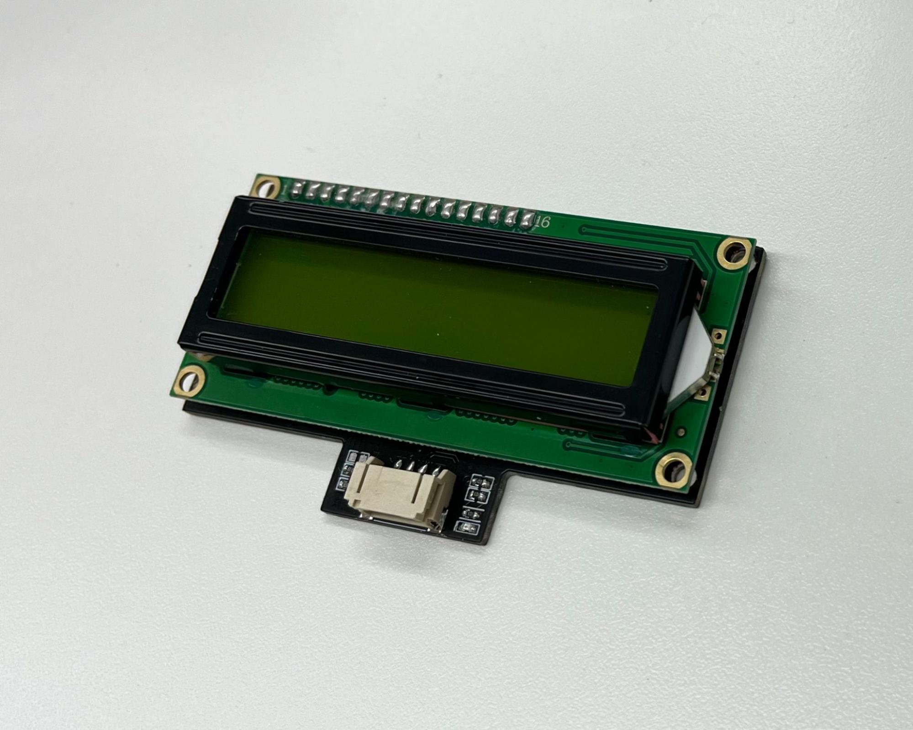
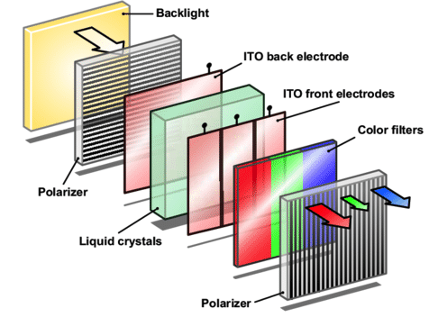
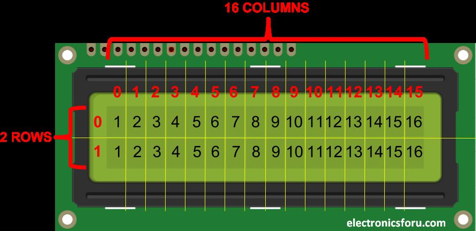
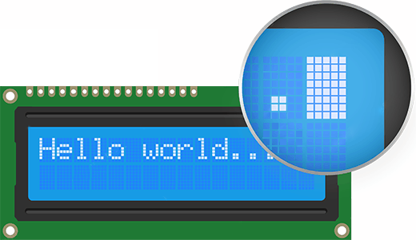
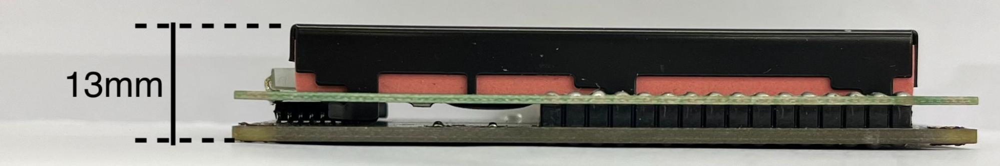
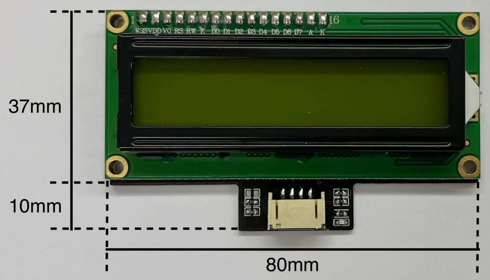
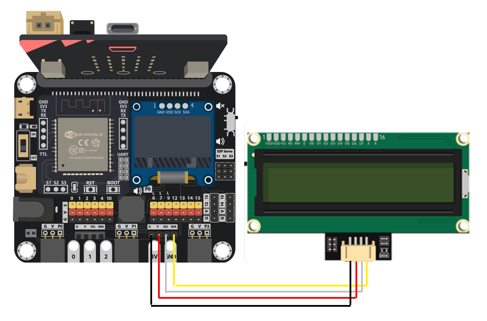
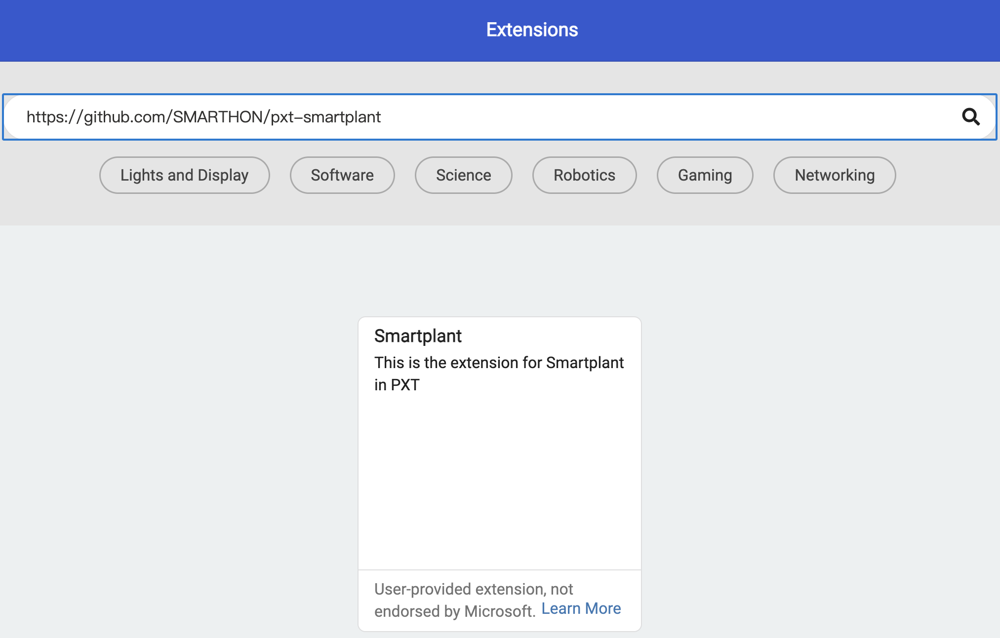
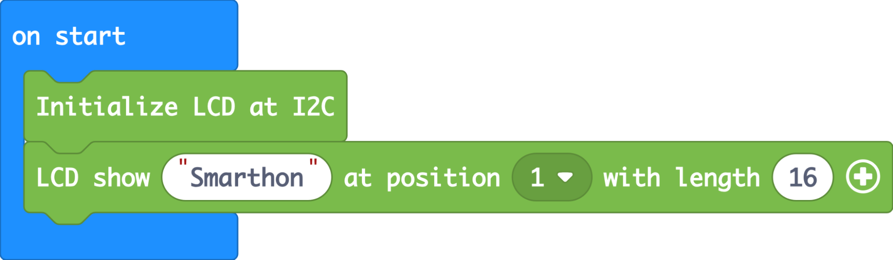

# LCD1602

## Introduction

LCD1602 is a 16x2 Liquid Crystal Display (LCD) that uses the properties of liquid crystals combined with polarizers to manipulate light, producing images. 16x2 means there are 2 lines on the screen and each line can display 16 characters. 

## The principle

An LCD consists of a layer of liquid crystal material sandwiched between two electrode glass plates. The liquid crystal molecules can be aligned in different ways by applying an electric current. Two polarizers are placed on the outer sides of the glass plates which ensure that light passes through the LCD in a specific orientation. Light is provided by a backlight source on the back. Optional color filters can create different colors for each pixel. 

 

When no voltage is applied to the liquid crystal layer, polarized light is twisted 90-degrees by the liquid crystal molecules and passes through the second polarizer. When an electric field is applied, the orientation of the liquid crystal molecules changes. The polarized light is no longer twisted and is therefore blocked by the second polarizer, thereby creating dark areas (pixels) on the screen. 

 

## Specification

* Display Type: Alphanumeric character display
* Backlight: LED backlight
* Voltage Supply: 5V DC
* Operating Temperature: -20°C to +70°C
* Interface: I2C
* Viewing Display area: 64.5 x 14.5
* Number of character: 16 characters x 2 lines
 

* Character Format: 5x8 pixels
 

## Pinout Diagram

|Pin|Function|
|--|--|
|G|Ground|
|V|Voltage Supply|
|SDA|Data|
|SCL|Clock|

## Outlook and Dimension

Size: 80mm X 47mm X 13mm

## Quick to Start/Sample

* Connect the LCD1602 to the I2C port of the development board using wire 

 

* Open Makecode, using the [https://github.com/SMARTHON/pxt-smartplant](https://github.com/SMARTHON/pxt-smartplant) PXT 

 

* Initialize the LCD and show a string on the LCD1602 

 

## Result

The LCD1602 displays a string 

 

## FAQ

Q. What kind of information can be displayed on a 16x2 LCD?  
A. It can display a wide range of information, including text, numbers, symbols, and basic graphics. It’s often used to display status information, menu options, sensor readings, and more. 

Q. Are there any limitations to using a 16×2 LCD?  
A. While 16×2 LCD are versatile, they have limitations such as limited screen size and resolution, and they might not be suitable for displaying complex graphics or large amounts of information. 

Q. Can I change the font size on the LCD?  
A. No, the font size on a standard 16×2 LCD display is fixed. Each character occupies a single cell, and the font cannot be changed. <P

## Datasheet

[LCD1602-datasheet](https://hades.mech.northwestern.edu/images/f/f7/LCD16x2_HJ1602A.pdf)
