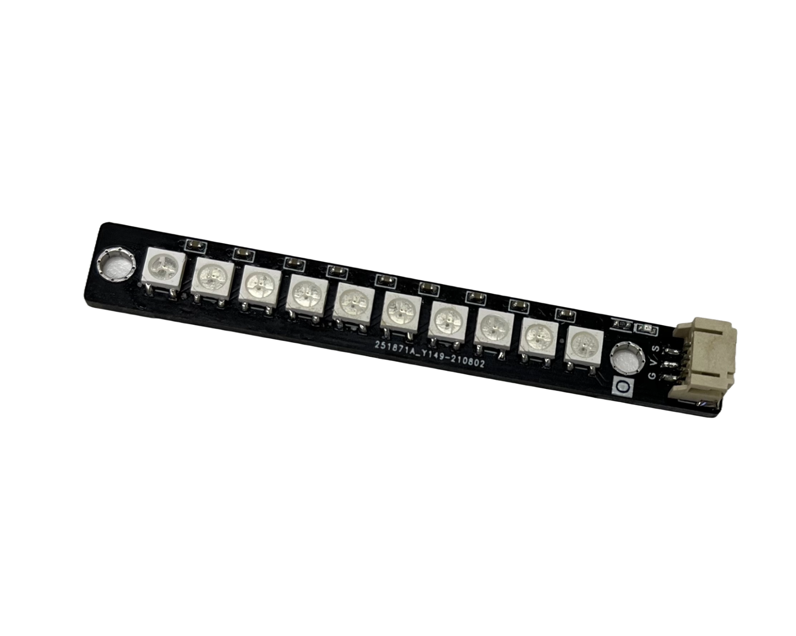
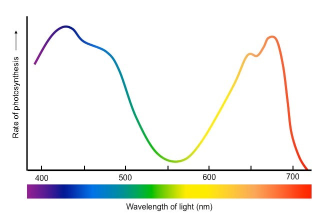
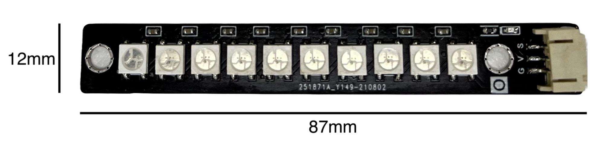
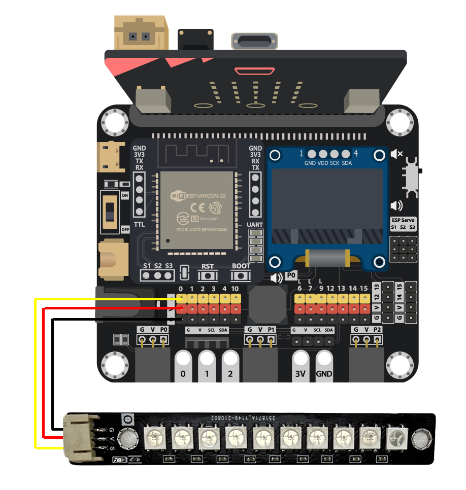
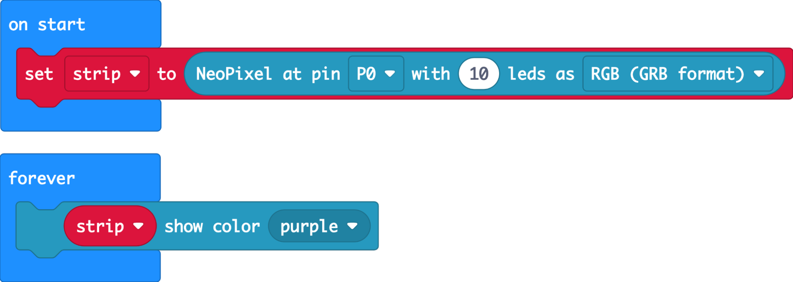
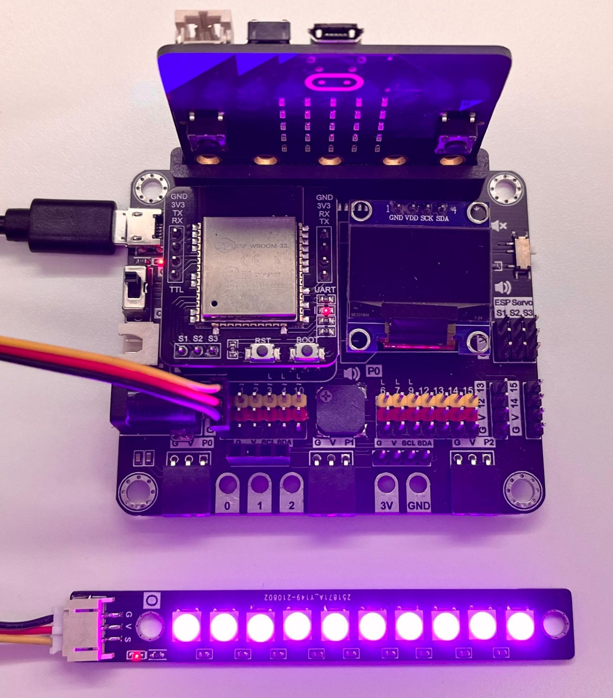

# LED Grow Light (WS2812*10)

## Introduction

LED Grow Light can emit light in different colors (wavelengths) that plants need for photosynthesis, providing indoor plants with supplementary light. 

## The principle

LED Grow Light Consist of 10 WS2812 LED modules. WS2812 is an LED that can be programmed to produce various colors. Each WS2812 LED contains three separate LEDs: one red, one green, and one blue. A controller chip is embedded in the module to control the intensity of each of the three RGB LEDs individually. 

For its detailed working principle on WS2812, please refer to [Multi-color LED (WS2812)](WS2812B.md). 

Color Spectrum

Plants use chlorophyll to absorb light and convert it into chemical energy through a process called photosynthesis. Photosynthesis mainly occurs in the red and blue regions of the light spectrum. Plants use blue light (400-490 nm) primarily during the vegetative growth phase and red light (580-700) during the flowering and fruiting phase. 

By programming WS2812, we can increase the intensity of the red and blue LEDs while keeping the green LED off, providing the wavelengths most beneficial to plant growth and health. Mixing red and blue light generates purple light. 

 

## Specification

* LED model: WS2812 * 10
* Power supply voltage: 6 ~ 7V
* Storage temperature: -55 ~ +150℃

|Emitting Color|Wavelength(nm)|
|--|--|
|Red|620 - 630|
|Green|515 - 530|
|Blue|465 - 475|

## Pinout Diagram

|Pin|Function|
|--|--|
|G|Ground|
|V|Voltage Supply|
|S|Signal Input (Digital/Analog)|

## Outlook and Dimension

Size: 12mm X 87mm

## Quick to Start/Sample

* Connect the LED Grow Light to the development board using wire 

 

* Open Makecode, using the [https://github.com/SMARTHON/pxt-smartplant](https://github.com/SMARTHON/pxt-smartplant) PXT 

 

* Initialize 10 LEDs and set the LEDs to show purple 

 

## Result

The LED Grow Light produces purple light 

 

## FAQ

Q: Can I use the LED Grow Light to produce light other than purple for my plant?  
A: Yes, you can choose other colors in the PXT to provide your plant the appropriate wavelengths based on their needs. 

Q: Why do we need to provide different colors of light to plants?  
A: Plants primarily require specific wavelengths during different phases. Providing more of the appropriate wavelengths can help their growth and health. 

Q: How far away from plants should the LEDs be placed?  
A: Usually a few inches away from plants is enough. LEDs are highly efficient and generate very little heat when operating, so you do not need to worry about the LEDs damaging your plants even if they are very close to the plants. 

Q: Is using this LED Grow Light already enough for plant growth?  
A: Ws2812 LED cannot provide all the wavelengths that a plant needs for growth, and the intensity of 10 LEDs is not high. Therefore, it is recommended to place the plant in a sunny location(e.g. near a window). The LED Grow Light can be used to provide supplemental lighting when there is less sunlight or at night. 

Q: What are the differences between traditional grow lights and LED grow lights?  
A: Traditional grow lights are variations of incandescent or fluorescent bulbs. They usually provide full-spectrum light, taking care of different aspects of plant growth. Besides, their light output is typically much higher than LEDs, which means you may need many LEDs to replace one traditional grow light, resulting in higher costs. However, traditional grow lights generate more heat than LEDs when operating, which can pose a risk to the plant. LEDs are also energy-efficient and have a longer lifespan. 

## Datasheet

[WS2812 datasheet](https://cdn-shop.adafruit.com/datasheets/WS2812.pdf)
