# PH Sensor (E-201-C)

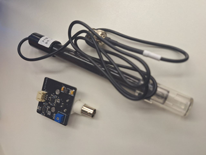

## Introduction

PH sensor is a commonly used sensor to detect the PH value of a solution. It can be used in aquariums, hydroponics, laboratories etc. It consists of a PH probe and a Signal Condition Board.

## The principle

The PH probe can be used to measure the acidic intensity of liquid solution, as it turns a voltage proportional to the PH value of the solution, which means the PH value can be determined by the number of output voltages. 

A PH meter uses a PH probe to measure the acidity or alkalinity (hydrogen-ion activity) of a solution, expressed as pH. The pH value of a solution is related to the hydrogen ion ratio inside the pH probe and the solution being tested.

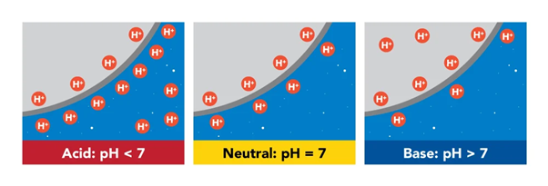 
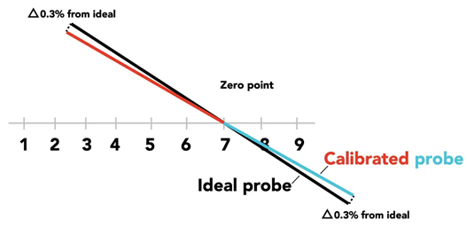

Depend on the model of different PH sensor, the output voltage value and curves have difference, but all follow the principle: 
When the value of output voltage increases, the PH value will decrease. 
When the value of output voltage decreases, the PH value will increase. 

### <u>Important Notice:</u>

Because the measuring electrode is usually glass and quite fragile, there are some cleaning guideline you need to follow in order to protect the PH electrode: 
1. Do not “wipe” or rub the electrode.
2. Swirl the electrode gently in the cleaning solution.
3. Gently rinse with deionized or distilled water.
4. Store in a storage solution.
5. When possible, use a specialized electrode.

For a cleaning solution, please use the appropriate solution depending on your particular process and the residues you are trying to remove. There are a wide range of pre-mixed cleaning solutions available online or you can make your own. Make sure you take care when handling any cleaning solution, as some can be hazardous so make sure you follow all safety instructions and wear appropriate protective equipment.

## The Ph scale for common items

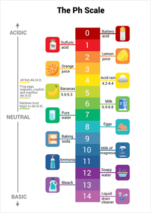 

## Specification
- Supply Voltage: 5V
- Interface: Analog
- Working Current: 5-10mA
- Working Temperature: -10-50 °C
- Working Humidity: 95%RH (nominal humidity 65%RH)
- Detection Range of Temperature: 5-60 °C
- Internal Resistance: <250 MΩ (When 25°C)
- Response Time:: ≤ 5S
- Stability Time: ≤ 60S
- Power Consumption: ≤ 0.5W

The relationship between ph value and voltage: 
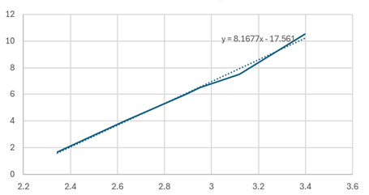

| Voltage | PH value |
| -- | -- |
| 2.272487971 | 1 |
| 2.394921459 | 2 |
| 2.517354947 | 3 |
| 2.639788435 | 4 |
| 2.762221923 | 5 |
| 2.884655411 | 6 |
| 3.007088899 | 7 |
| 3.129522387 | 8 |
| 3.251955875 | 9 |
| 3.374389363| 10 |
| 3.496822851| 11 |
| 3.619256339| 12 |
| 3.741689827| 13 |

## Pinout Diagram

| Pin | Function|
|--|--|
| G | Ground|
| V | Voltage Supply|
| S | PH Value Output|

## Outlook and Dimension

**Signal Conditioning Board** 
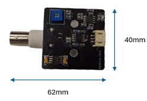 
Size: 62mm * 40mm * 14mm 

**PH Probe** 
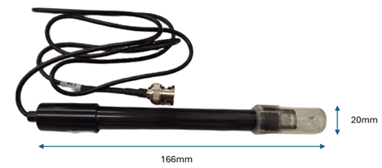 

Size: 166mm * 20mm * 20mm (with 80cm cable) 

## Quick to Start/Sample

**<u> Best Practice </u>**
- Connect the signal condition board to the development board. (direct plugin or using wire) 
- Connect the PH Probe to the signal condition board. 

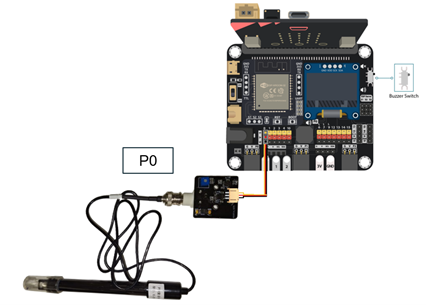 
- Add the smart city extension first
- Open MakeCode, using the [https://github.com/SMARTHON/pxt-smartscience](https://github.com/SMARTHON/pxt-smartscience) PXT 

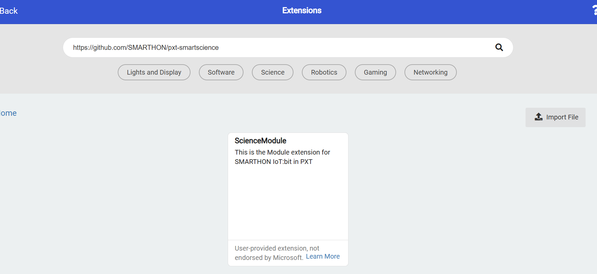 

- Inside on start, initialize the OLED.
- Inside forever, show the reading of PH value output, and also the voltage if you want. 

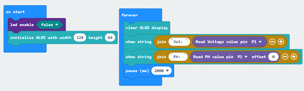

### <u>Calibration:</u>

If the value of ph value is strongly violate its expected result, there are three measures you can do : 
- You can clean the probe first by using the cleaning solution. (Soaking it into KCl solution for about 8-12 hours can help the probe calibration) 
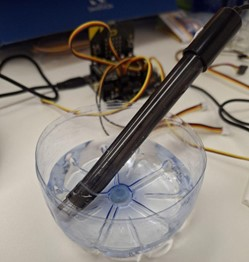

- You can adjust the screw on the signal board and check the newest data.(For slightly adjustment) 
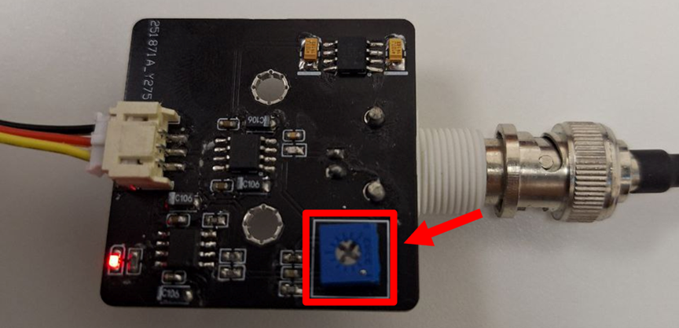

- If you have done the first two methods and the data is still not correct, you can simply add some offset to the pH value to make it back to a normal value range, setting offset is normal as different conditions can affect the result strongly such as the temperature or concentration of the liquid. We suggest setting the offset to -1.9 but adjustment may be needed as mentioned above. 

## Result

 The PH value of the solution is showing on the OLED screen. If you move the probe from one solution to another, it may need some time to adjust its ph value. 
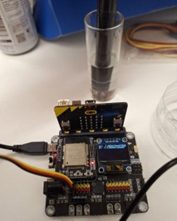

## FAQ

Q: What is the value shown if the probe is placed in the air? 
A: The PH value of air should be around 5.7.

Q: What is the value shown if the probe is placed in tap water? 
A: The PH value of air should be around 7.5.

Q: Why is there a slight difference in Ph value when I transfer the sensor from one solution to the other? 
A: The sensor may still contain some solution from the previous container, make sure you wash with tap water to reduce the amount of different solutions on the sensor.

## Datasheet
[E-201-C Data sheet](https://www.e-gizmo.net/oc/kits%20documents/PH%20Sensor%20E-201-C/PH%20Sensor%20E-201-C.pdf)