Single-color LED (Red/Yellow/Green/UV)
=================
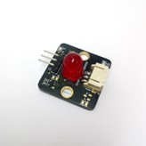
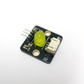
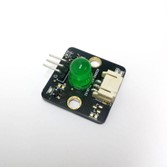
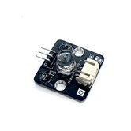

## Introduction

Single-color LEDs are semiconductor light sources that emit light within a specific wavelength range, producing a distinct color output. Utilizing various semiconductor materials, these LEDs serve a spectrum of applications, from indicators and displays to scientific uses and beyond. 

## The principle
LED operates leveraging the phenomenon of electroluminescence within semiconductor materials. When a voltage is applied across the leads of a LED, electrons and electron holes recombine within the semiconductor material, releasing energy in the form of photons.  

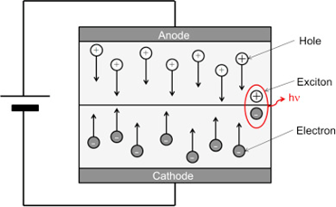 

The energy of these photons determines the wavelength of light emitted, which is specific to the semiconductor material used in the LED. By controlling the semiconductor material's composition and structure, we can produce LEDs that emit light in specific colors, such as red, yellow, green, or ultraviolet. 

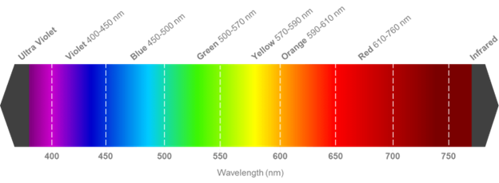 

The voltage needed to enable an LED is called forward voltage, which has to be applied across the LED from anode to cathode. LEDs of different colors have different forward voltage requirements. 

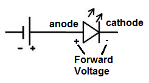 

Generally, colors in lower energy like red have the lower forward voltage, and colors in higher energy like blue have the higher, but eventually, it is determined by the design and the semiconductor material.  

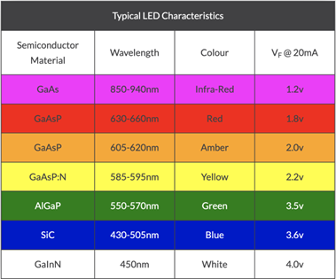 

<H4>Red LED</H4>

Red LED emits light primarily in the red part of the visible spectrum, typically around 610-760 nm. Its forward voltage is relatively low, around 1.6 to 2.0. 

<H4>Yellow LED</H4>

Yellow LED emits light in the yellow part of the visible spectrum, typically around 570-590 nm. It can be produced by combining red and green light through a phosphor coating. Its forward voltage is 2.1 to 2.2. 

<H4>Green LED</H4>

Green LED emits light in the green part of the visible spectrum, typically around 500-570 nm. Its forward voltage varies in a wide range, from 1.9 to 4.0. 

<H4>Ultraviolet LED</H4>

Ultraviolet LED emits light in the ultraviolet region of the electromagnetic spectrum, typically with wavelengths shorter than 400 nm, which is generally invisible to the human eye. It has higher forward voltage ranging from 3.1 to 4.0. 

## Specification

- Operate voltage: 3 - 5V
- Power consumption: 0.06W
- Efficiency: 90 lm/W
- Size: 8mm

## Pinout Diagram

| Pin | Function |
| -- | -- |
| G | Ground |
| V | Voltage Supply |
| S | Signal Input(Digital/Analog) |

## Outlook and Dimension

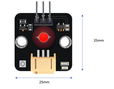 
Size: 25mm X 25mm 

## Quick to Start/Sample

- Connect the sensor to the development board (direct plugin or using wire)

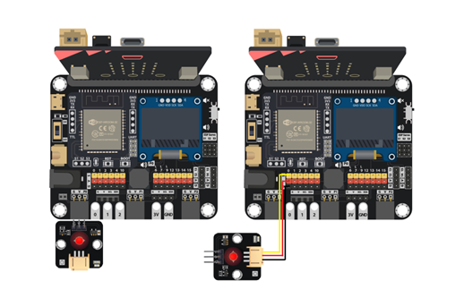 

- Open Makecode

- Set different buttons to turn on/off the LED through [digital write pin P0 to 1/0], where 1 means on.

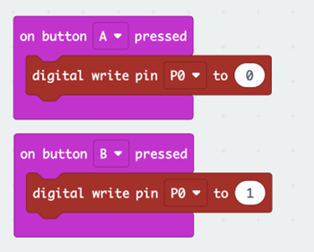 

## Result
Press A button the turn off the LED (set to digital 0) 
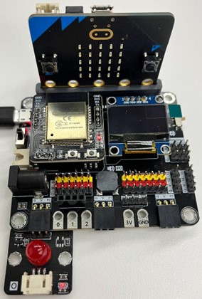 

Press B button the turn on the LED (set to digital 1) 
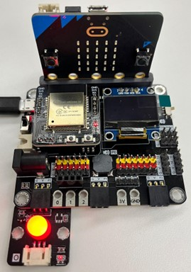 

