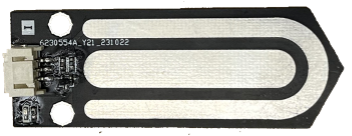
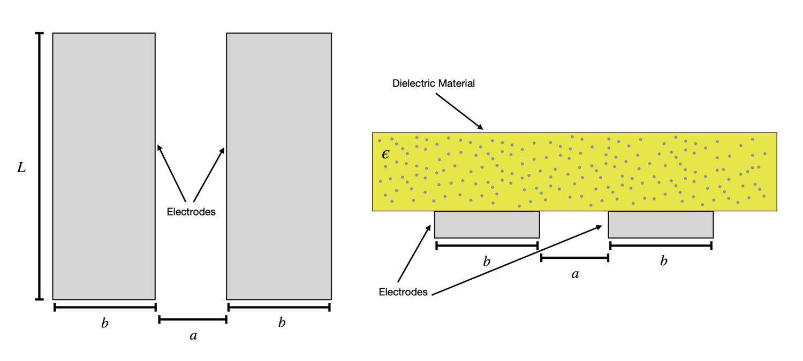
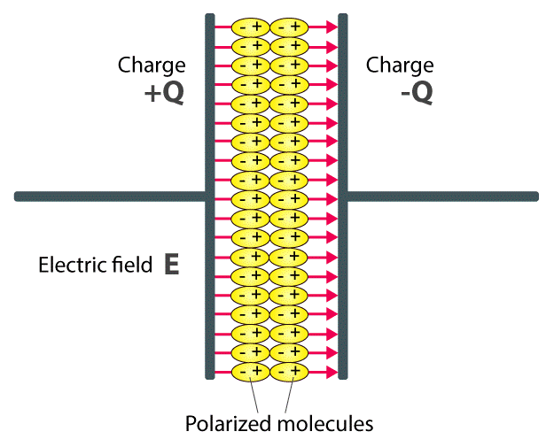
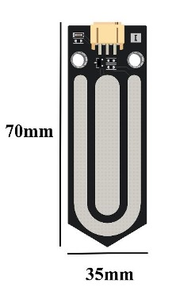
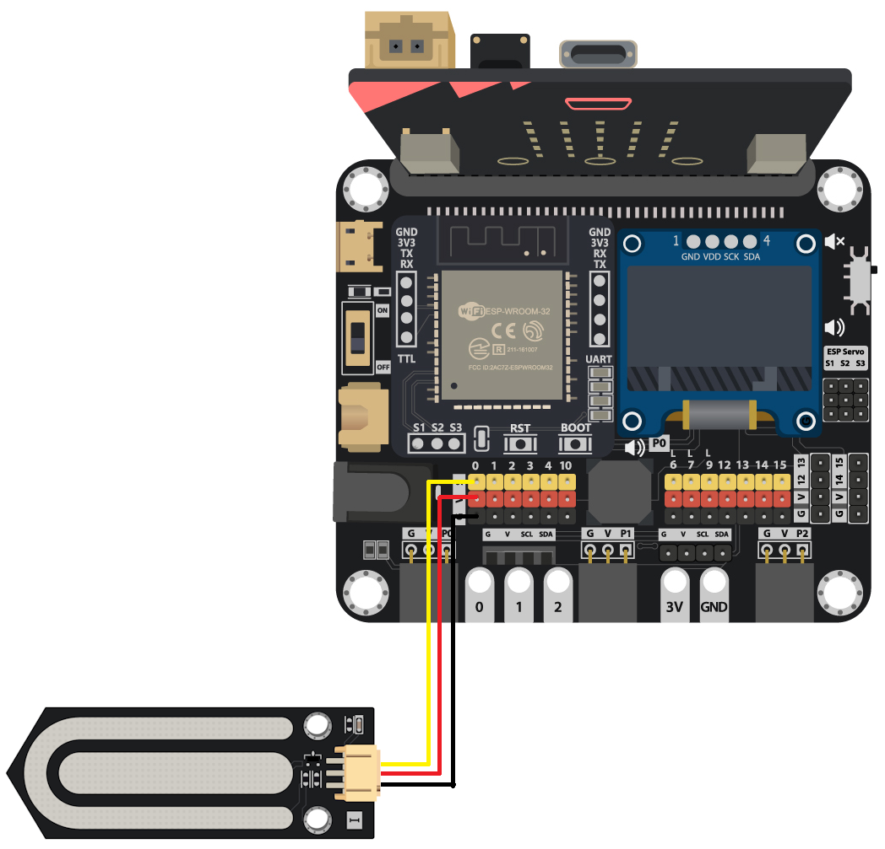
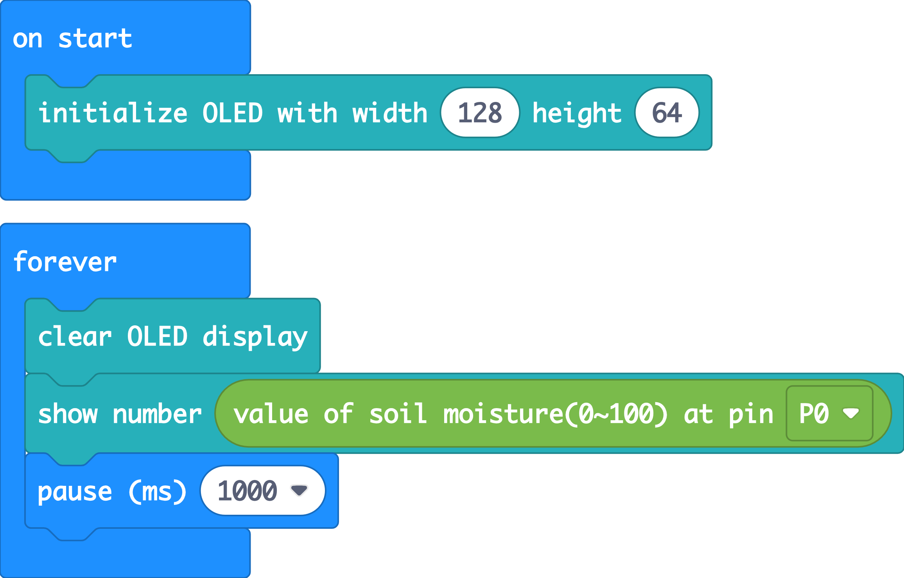
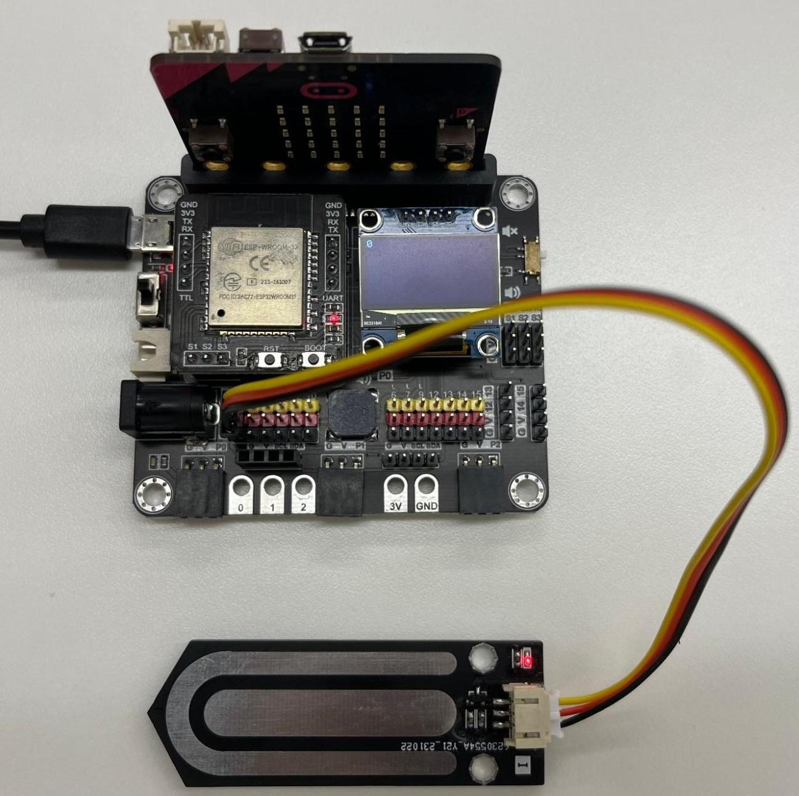
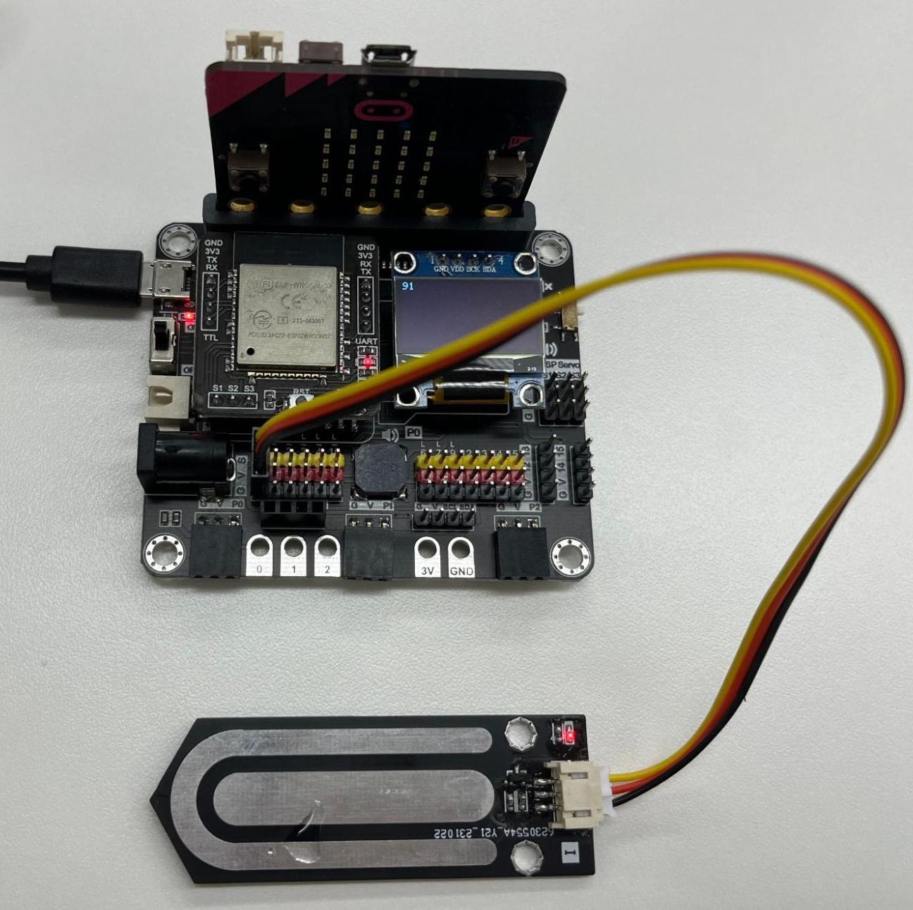

# Soil Moisture Sensor

## Introduction

Soil moisture sensor uses capacitive sensing to detect the moisture level of the soil. Whenever there is water across two areas of the capacitor, the sensor can detect moisture level. The moisture reading is from 0 to 100%.

## The principle

Soil moisture sensor has an exposed capacitor on it. Capacitor consists of a positive plate and a negative plate. When we insert the sensor into the soil, the soil becomes the dielectric medium. 

Capacitor can store electrical energy in an electric field by accumulating electric charges on two plates. The ability of the capacitor to store charges is known as capacitance. 

As water with higher permittivity than air, it polarizes more than air in an electric field. When the soil is wet, the capacitance rises. 

By measuring the changes in capacitance, the soil moisture level can be obtained.

## Specification

* Supply voltage: 5V
* Interface: Analog
* Raw value return: 0-1023
* Makecode Extension return: 0-100%

## Pinout Diagram

|Pin|Function|
|--|--|
|G|Ground|
|V|Voltage Supply|
|S|Output|

## Outlook and Dimension

Size: 35mm X 70mm

## Quick to Start/Sample

* Connect the soil moisture sensor to development board (using wire)

* Open Makecode, using the [https://github.com/SMARTHON/pxt-smartplant](https://github.com/SMARTHON/pxt-smartplant) PXT 

* Initial the OLED screen and show the reading of the soil moisture level

* The value will be in range of 0 to 100

## Result

When the sensor detect no water

When the sensor become wet

## FAQ

Q: Why does the sensor still have low reading after I watered the plant?  
A: Sensor in contact with the soil can take more accurate soil moisture reading. Please check if the exposed capacitor is covered by soil. 

Q: Can I use the sensor to detect moisture levels of other mediums?  
A: The sensor is designed to detect moisture level in soil only. It is not applicable in other cases. 

