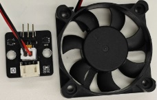
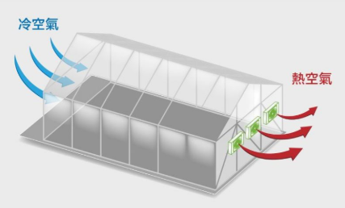
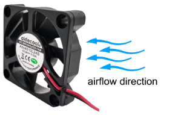
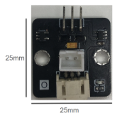
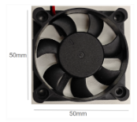
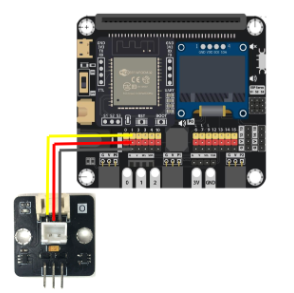
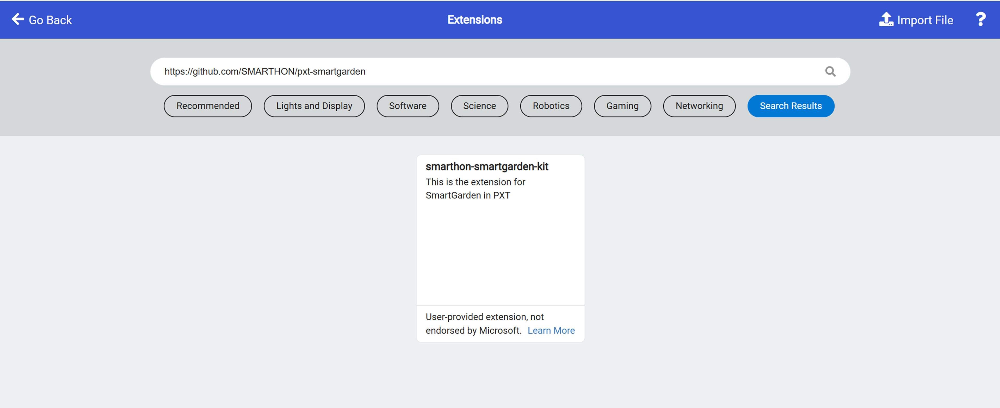
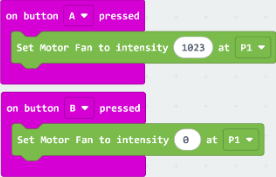
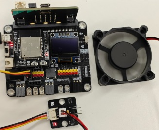
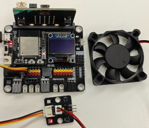

# Ventilation Fan

## **Introduction**

The ventilation fan is an actuator designed to regulate air circulation and humidity levels within a greenhouse environment. By connecting it to a micro:bit development board, you can control the fan's operation to exhaust excess hot air or moisture, promoting optimal growing conditions for plants. When power is supplied, the fan blades rotate to generate airflow, helping to prevent overheating and maintain fresh air intake.

## **The Principle**

The ventilation fan operates on the basic principles of electromagnetism and mechanical rotation, similar to a DC motor. It utilizes electromagnetic induction to convert electrical energy into rotational motion. When current flows through the fan's motor coils in the presence of a magnetic field, it produces a torque that spins the rotor, driving the fan blades to move air.

## **Specifications**

- Supply Voltage: 5V DC

- Current: 0.19A

- Interface: digital 

- Speed: 5000 RPM at 5V

- life cycle: 30000h

- Rotate direction: clockwise

**How to tell which direction ventilation fan will blow:** 

- Check the Fan Blades’ Shape and Angle  
The most straightforward way to determine airflow direction is by examining the fan blades. Manufacturers design blades to curve in a specific direction to push air efficiently, and this curve holds the key.

- Exhaust direction: Look at the blades from the front (the side with the sticker or logo). If the blades curve downward (toward the edges of the fan) as they spin clockwise, the fan will push air away from you (exhaust).

- Intake direction: If the blades curve upward (toward the center) as they spin clockwise, the fan will pull air toward you (intake).

## **Pins**

| Pin | Function |
| :---- | :---- |
| G	 | Ground |
| V	 | Voltage |
| S	 | Signal Input (Analog) |

## **Appearance and size**

Size: 25mm \* 25mm

Size: 50mm \* 50mm

## **Quick to Start/Sample**

-  Connect the module to development board (direct plugin or using wire)

-  Open Makecode, using the [https://github.com/SMARTHON/pxt-smartgarden](https://github.com/SMARTHON/pxt-smartgarden) PXT

-  Set different buttons to turn on/off the ventilation fan through \[digital write pin P1 to 1/0\], where Press A button  means on.

## **Result**

Press A button the turn on the ventilation fan (set to digital 1023\)

Press B button the turn off the ventilation fan (set to digital 0)

## **FAQ**

---

Q : What is the difference between a ventilation fan and a motor fan?

A : A ventilation fan is designed to exchange indoor air with fresh outdoor air. It turns clockwise. A motor fan typically refers to the internal electric motor that drives the blades,it turns clockwise and anti counter clock wise.