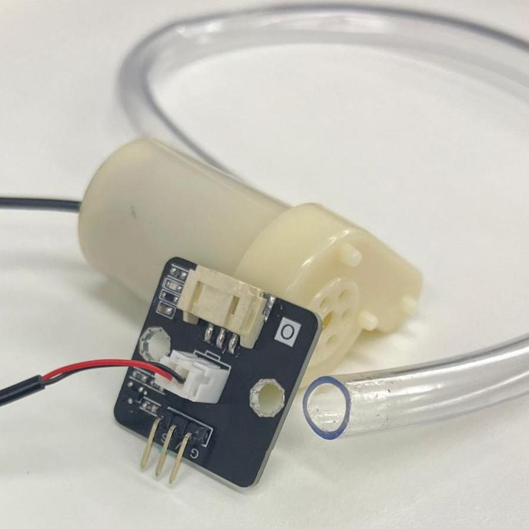
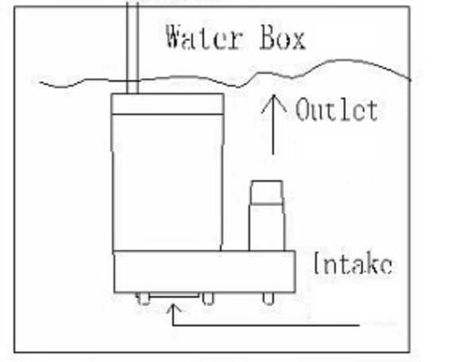
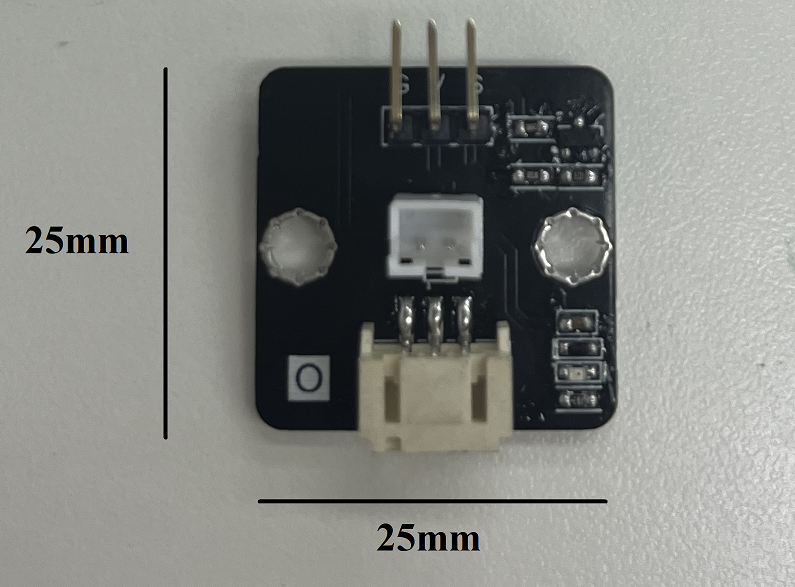
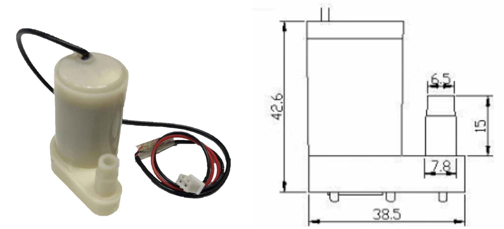
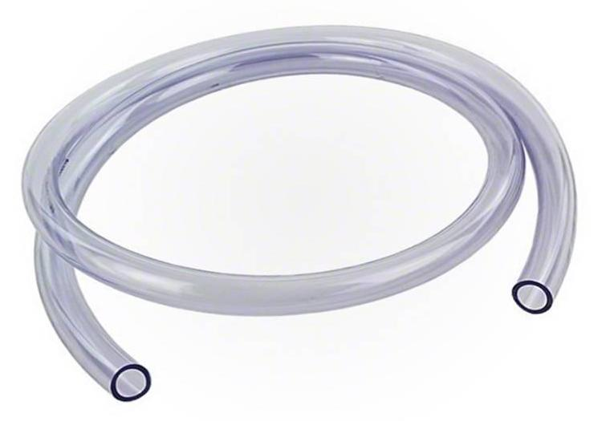
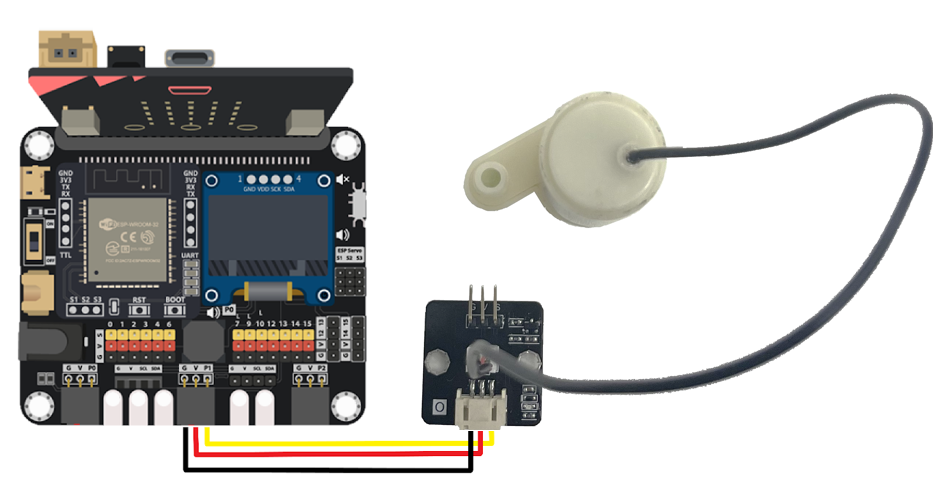
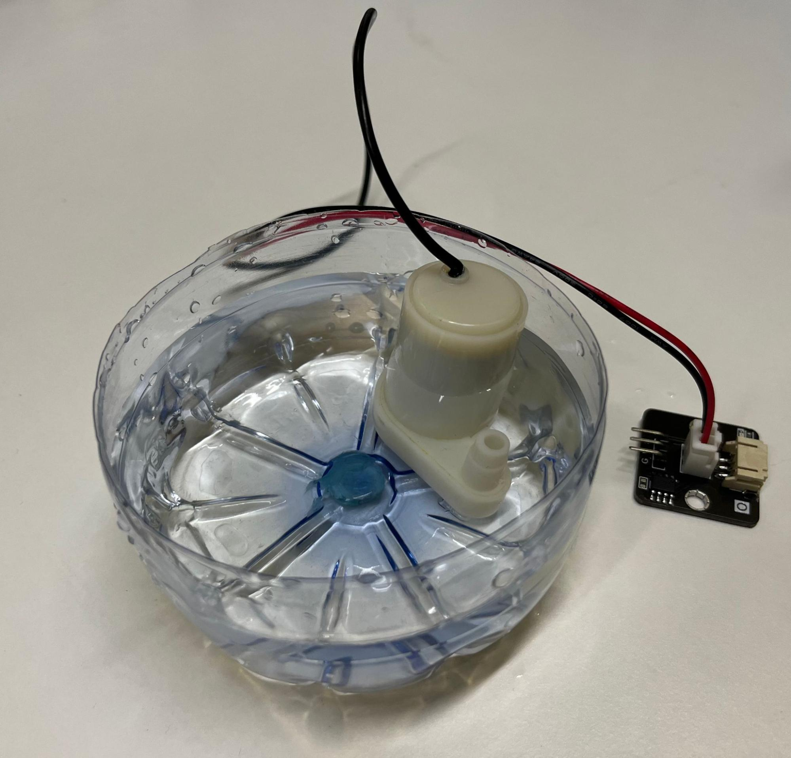
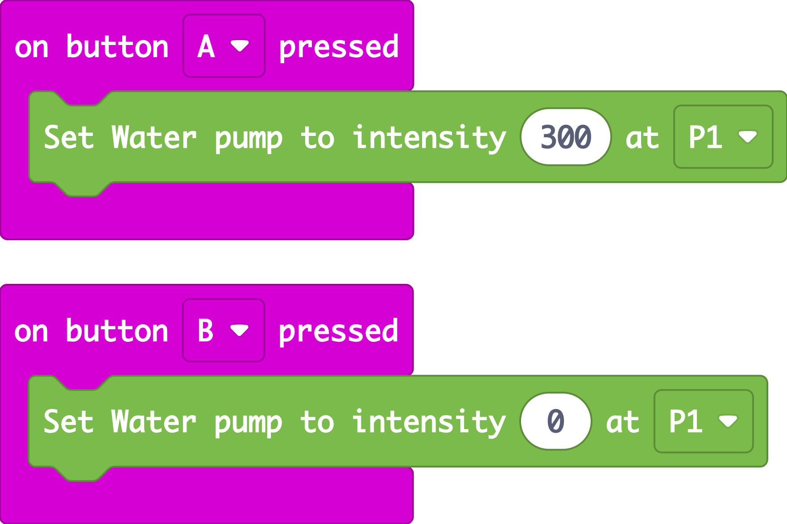
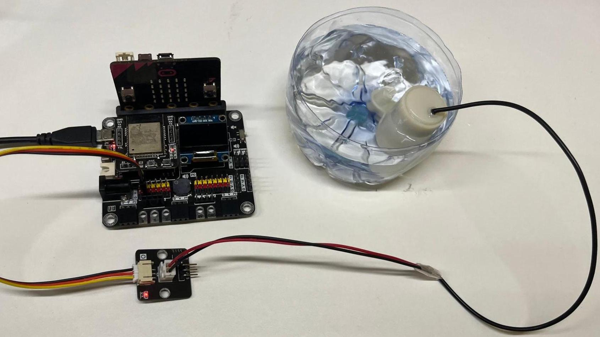
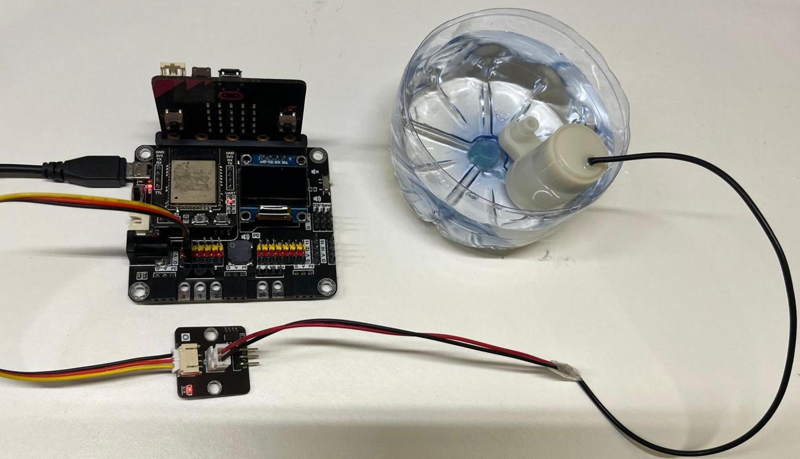

# Water Pump (Vertical)

## Introduction

This mini vertical centrifugal pump converts rotary energy into kinetic energy. Water flows through the bottom inlet and discharges through the outlet.

## The principle

The pump pulls water in through the bottom intake and pushes it out through the outlet. 
Inside the pump, the impeller is connected to the motor via a shaft. As the shaft spins, the impeller rotates. The water rotates and moves outwards off the impeller. As the water hits the casing of the pump, its kinetic energy converts to potential energy. The water is pushed out of the outlet. The flow of water creates a lower pressure region at the center of the impeller, which pulls water in through the suction inlet.

## Specification

* Model: JT-DC-3L
* Operating Voltage: 2.5 - 6V
* Supply Voltage: 5V
* Interface: analog
* Current : 200ma
* Power: 1W
* Maximum water head: 61cm
* Maximum flow rate: 106L/h
* Starting voltage: 1V
* Waterproofing grade: IP68
* Pin port type: XH2.54

## Pinout Diagram

|Pin|Function|
|--|--|
|G|Ground|
|V|Voltage Supply|
|S|Output|

## Outlook and Dimension

Size: 25mm X 25mm 

Height 42.6mm, Width: 38.5mm 

Length: 35cm, Inner diameter: 6mm

## Quick to Start/Sample

* Connect the water pump to development board (direct plugin or using wire)

* Place the water pump under water vertically.

* Open Makecode, using the [https://github.com/SMARTHON/pxt-smartplant](https://github.com/SMARTHON/pxt-smartplant) PXT 

* Set different buttons to on/off the water pump

## Result

Press A button the turn on the water pump

Press B button the turn off the water pump

## FAQ

Q: What is the type of this water pump?  
A: This type is vertical but not horizontal. 

Q: Why does the water pump not work?  
A: Maybe there is debris stuck in the pump. As the motor torque is limited, it cannot rotate if the debris gets stuck in gear. Please try to use a toothpick to spin the impeller through the bottom inlet to remove it. 

Q: What is the lifespan of the pump?  
A: The operational lifespan of this water pump ranges from 1 to 100 hours. Once the carbon brush within the motor becomes worn, the pump ceases to function. Users have to replace the pump with a new one. This water pump is cost effective and affordable. 

Q: Why does the water pump become dark inside it?  
A: It is a normal phenomenon. When the water pump is put inside the water for a long time, there might be some bacteria deteriorating the material inside or outside of the water pump. 

## Reason the water pump does not work

1. There is debris inside the pump.
2. The carbon brush of the pump wears out, you need to replace it with the new one.

## Datasheet

[DC-Motor-3V](https://m.eleparts.co.kr/data/goods_attach/202207/good-pdf-11902681-1.pdf)
