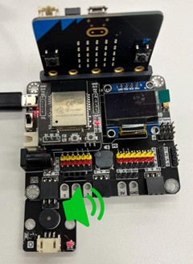

# Mono-Tone Buzzer/Musical Buzzer

(Active/Passive Buzzer) 
 

## Introduction
The two buzzers use the reverse piezoelectric effect to make a piezoelectric plate vibrate and generate sound. The mono-tone buzzer can be used straightforwardly via DC voltage while the musical buzzer cannot.

## The principle
The piezoelectric effect refers to the process of producing an electric current when piezoelectric materials are deformed by external force. Conversely, an electric current going through piezoelectric materials causes the materials deformed, which is called reverse piezoelectric effect. 

A buzzer consists of a piezoelectric ceramic disc and a metal plate. When an alternating current is applied to the piezoelectric disc, it alternately stretches and shrinks due to the reverse piezoelectric effect. The disc repeatedly bend in both directions like a vibration, generating sound waves.

### <u>**Musical buzzer**</u>
Musical buzzer is a passive buzzer that has no internal oscillator circuit. This means that it cannot be used directly via DC voltage, as the DC supply will only make the piezoelectric ceramic disc bend once. Instead, it requires an external oscillating signal (typically from a microcontroller or other signal source) to produce sound. By controlling the input signal, the tone or pitch of the produced sound can be customized.

### <u>**Mono-tone buzzer**</u>
Mono-tone buzzer is an active buzzer that has a built-in oscillator converting constant direct current into alternating current. This allows the buzzer to continue sounding with only a DC voltage supply. when a DC voltage is applied to it. However, it also limits the produced sound to a particular frequency (pitch).

## Specification

### <u>**Musical buzzer**</u>
- Rated Voltage: 5V
- Resonant Frequency: 2730Hz
- Min Sound Output: 85 dB
- Operating Temperature: -20~+70
- Storage Temperature: -30~+80

### <u>**Mono-tone buzzer**</u>
- Rated Voltage: 5V
- Rated Frequency: 3000Hz
- Min Sound Output: 85 dB
- Operating Temperature: -40~+85

## Pinout Diagram

| Pin | Function |
| -- | -- |
| G | Ground |
| V | Voltage Supply |
| S | Signal Input (Digital/Analog) |

## Outlook and Dimension

### <u>**Musical buzzer**</u>

 
Size: 25mm * 25mm

 
Diameter: 9mm 
Height: 4.2mm 

### <u>**Mono-tone buzzer**</u>
 
Size: 25mm * 25mm

 
Diameter: 9mm 
Height: 5.5mm

## Quick to Start/Sample

### <u>**Musical buzzer**</u>
- Connect the Musical Buzzer to the development board (direct plugin or using wire) 
- Open Makecode 
- Set different buttons to turn play / stop playing melody. 

 

### <u>**Mono-tone**</u>
- Connect the Mono-tone Buzzer to the development board (direct plugin or using wire) 
- Open Makecode 
- Set different buttons to turn on/off the Mono-tone Buzzer 

 

## Result

### <u>**Musical buzzer**</u>
- Press A button to turn off the Musical Buzzer (stop play melody) 
  

- Press B button to turn on the Musical Buzzer (play a melody) 
  

### <u>**Mono-tone buzzer**</u>
- Press A button the turn off the Mono-tone Buzzer (set to digital 0) 
  

- Press B button the turn on the Mono-tone  Buzzer (set to digital 1) 
  
