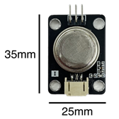
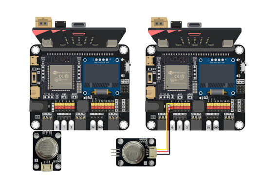
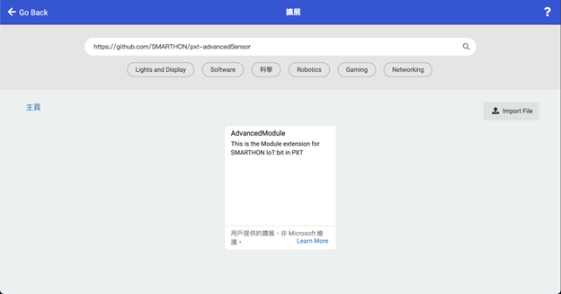
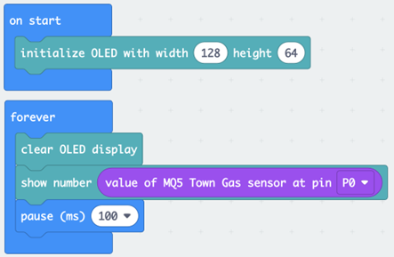
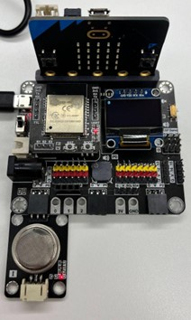
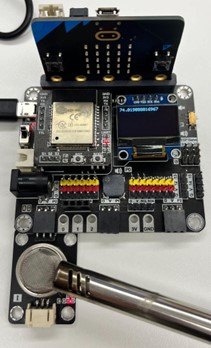

Town gas sensor
==========
  

## Introduction

Town gas sensor can detect town gas in the air through measuring the conductivity of surrounding air.  

## The principle

Town gas sensor has a gas-sensing filament made of tin dioxide (SnO2), which has a low conductivity in clean air. When there is flammable gas surrounding the sensor, the conductivity of the filament rises along with the flammable gas concentration increases.  

 

In clean air, oxygen (O2) is adsorbed on the SnO2 surface. With its high electron affinity, the adsorbed O2 attracts free electrons inside the SnO2, forming a potential barrier at the grain boundaries. This potential barrier prevents electron flow, causing high resistance in the sensor. 

When the sensor is exposed to flammable gas, an oxidation reaction occurs between such gas and the adsorbed O2 on the SnO2 surface. As a result, the density of adsorbed O2 on the SnO2 surface decreases, as does the height of the potential barrier. Electrons can easily flow through the reduced height barrier, thereby increasing the sensor’s conductivity and output voltage. 

Therefore, measuring the output voltage of the filament provides an indication of the concentration of any flammable gas in the environment. The sensor can detect a variety of flammable gasses and has high sensitivity to butane, propane and methane, of which methane is one of the main components of town gas. 

## Specification

- Model: MQ-5
- Circuit voltage: 5V
- Heating consumption: ≤ 800mw
- Oxygen concentration: 21% (standard condition) Oxygen concentration can affect sensitivity
- Using Temperature: -10℃ ~ 50℃
- Storage Temperature: -20℃ ~ 70℃
- Sensing Resistance: 10KΩ ~ 60KΩ (5000 ppm methane )
- Standard detecting condition: Temp: 20℃±2℃ Vc: 5V±0.1 
&emsp;&emsp;&emsp;&emsp;&emsp;&emsp;&emsp;&emsp;&emsp;&emsp;&emsp;&emsp;&emsp;&emsp;&emsp;&emsp;&emsp;&nbsp; Humidity: 65%±5% Vh: 5V±0.1
- Detecting concentration scope: 200-10000 ppm (LPG,LNG, Natural gas, iso-butane, propane, Town gas)  

##  Pinout Diagram

|Pin|Function|
|---|---|
|G|Ground|
|V|Voltage Supply|
|S|Signal Input (Analog)|

##  Outlook and Dimension

 
Size: 25mm X 35mm  

 
Diameter: 9.5mm ~ 19mm  

##  Quick to Start/Sample

- Connect the Town gas sensor to the development board (direct plugin or using wire)
  

- Open Makecode, using the https://github.com/SMARTHON/pxt-advancedSensor PXT
  

- Initialize the OLED and show the Town Gas value on the OLED screen
  

## Result

When the air is clean 
 

When there is town gas in the air 
 

## FAQ

Q: Why is the sensor reading not 0 when there is no town gas surrounding? 
A: The sensor can detect not only town gas but also other flammable gas, so other flammable gas may be present in the air.  

## Datasheet

[MQ-5 Datasheet](https://files.seeedstudio.com/wiki/Grove-Gas_Sensor-MQ5/res/MQ-5.pdf)
