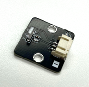

Laser Emitter / Laser Receiver
=============

 

## Introduction

A laser sensor detects whether an object is present in the path of the laser beam by emitting and detecting laser light. 

## The principle

A laser sensor consists of two modules: an emitter that uses a diode to emit laser light, and a receiver that uses a photoresistor to detect the laser.  

The basic structure of a laser diode is similar to that of a regular diode, both composed of a P-N junction formed from semiconductor materials. When an external electric field is applied to the laser diode, electrons transition from the higher energy level of the n-region to the lower energy level of the p-region, releasing energy-carrying photons in the process. Unlike a regular diode, the laser diode has two parallel optical reflective surfaces that form an optical resonant cavity. This cavity allows the generated light to bounce back and forth between the reflective surfaces, stimulating the emission of more photons. Through repeated propagation, reflection, and amplification, the photons ultimately form a highly focused, monochromatic, and coherent laser beam.  

  

A photoresistor is a semiconductor component whose resistance varies with the intensity of light. When light shines on the photoresistor, the energy of the photons excites electrons within the semiconductor, causing its resistance to decrease significantly. By measuring changes in resistance, it is possible to determine whether a light signal has been received. Photoresistors can be designed to be sensitive to specific wavelengths of light, allowing them to focus on detecting laser light while being less affected by ambient light.  

The emitter and receiver work together to detect whether an object is present in the path of the laser beam. The receiver is positioned along the expected path of the laser, while the emitter generates a straight laser beam when powered on, aiming directly at the receiver. If there is an obstacle in the laser’s path, the beam is blocked and cannot reach the receiver directly. This causes a change in the resistance of the photoresistor, which is then detected by the receiver. 

## Specification

- Model: KY-008 
- Output Power: 150 mW 
- Wavelength: 650 nm (Red) 
- Supply Voltage: 3V DC 
- Operating Voltage: 5V 
- Operating Current: <25 mA 
- Operating Temperature: -36°C to 65°C 
- Storage Temperature: -36°C to 65°C 

## Pinout Diagram

| Pin | Function |
| -- | -- |
| G | Ground |
| V | Voltage Supply |
| S | Signal output (Digital/Analog) |

## Outlook and Dimension

**Transmitter** 
 
Size：25mm * 25mm  

**Receiver** 
 
Size：25mm * 25mm  

## Quick to Start/Sample

- Connect the Transmitter and Receiver to different ports on the development board (Using Wires) 
  

### Method 1:

- First setting using digital write to make when press the button A to turn on the Laser Transmitter 
  

- Then setting using digital write to make when press the button B to turn off the Laser Transmitter 
  

- using an analog read pin to check the receiver has received the Laser. 
  

### All sulution:
  

### Method 2:
- Open the Makecode, using [ https://github.com/SMARTHON/pxt-smartcity-extension]( https://github.com/SMARTHON/pxt-smartcity-extension) extension. 
 

- First Using PXT library to setting press the button A to turn on the Laser Transmitter 
 

- Then setting press the button B to turn off the Laser Transmitter 
 

- Use the PXT library to detect whether the laser is received, and change the LED based on the result. 
 

- Set the B button to turn on the emitter and the A button to turn off the emitter. 
 

## Result

- When there is no object between the emitter and the receiver 
  

- When there is an object between the emitter and the receiver 
  

## FAQ

Q: Is this laser dangerous? 
A: The intensity of this laser is not high and won't burn the skin, but prolonged exposure to the skin should still be avoided. All lasers have the potential to damage the retina of the eyes, so care should be taken to avoid direct or reflected exposure to the eyes. 

Q: How far can this laser reach? 
A: Theoretically, the transmission distance of the laser is infinite, but in practice, it is affected by dust, smoke, or ambient light. This laser is generally visible indoors. Under direct sunlight, it can reach 1 to 5 meters, while outdoors at night, it can reach at least 500 meters. 

Q: How long can this laser emitter be used? 
A: Unless damaged by external forces, its lifespan is approximately 3,000 hours. 

Q: How is this laser emitter different from a laser pointer used in stationery? 
A: Both work on the same principle. Some specifications, such as the laser power and color, may differ, but this laser uses commonly available specifications in the market. 

Q: Besides detecting obstacles, what other uses does the laser have? 
A: The laser has a wide range of uses, including making laser pointers, laser toys, leveling instruments, and even for wireless communication.  

## Datasheet:

[Laser head datasheet](https://www.mantech.co.za/datasheets/products/913731-R0.pdf?srsltid=AfmBOooM9ynqWndLudFVc4ohLMMIUySVwqKIulJM3SQeRKIOSq-xy2zy) 
[Laser receiver module](https://www.codrey.com/electronic-circuits/the-mysterious-laser-receiver-sensor-module/) 