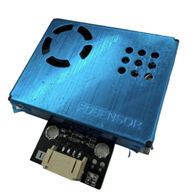
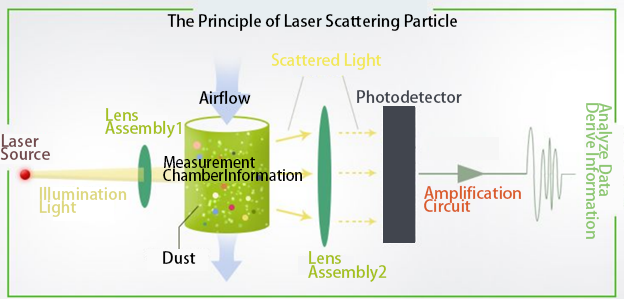
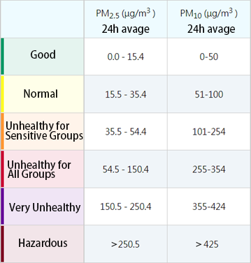
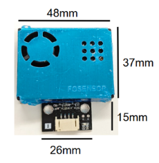
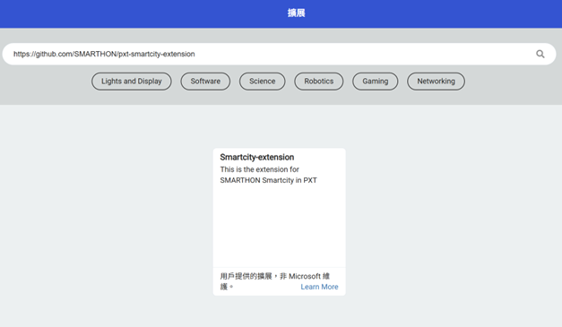
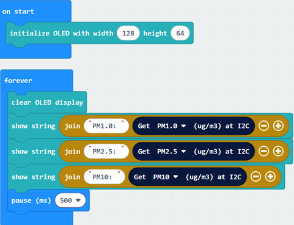
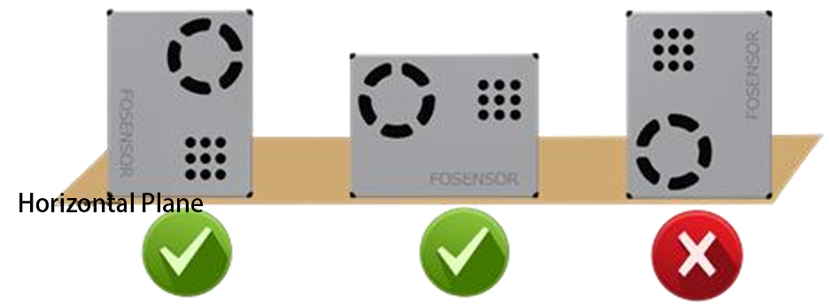

# Laser dust sensor

 

## Introduction

The laser dust sensor is an instrument that uses laser and light scattering principles to measure the concentration of dust in the air. 

## The principle

The laser dust sensor uses a fan to generate a stable airflow to collect air. When air containing dust particles enters the sensor's measurement chamber, the laser illuminates these particles. The particles scatter the laser light in various directions, with the intensity of the scattered light related to the size, number, and refractive index of the particles. A photodetector receives the scattered light and generates an electrical signal, the strength of which is proportional to the intensity of the scattered light. After amplification and filtering, the electrical signal is sent to a microprocessor for calculation. The microprocessor calculates the concentration of particles of different sizes in the air based on light scattering theory and Mie scattering theory. 

 

## Indoor suspended particle concentration index

 

 

## Specifications

- Detection type: PM1.0, PM2.5, PM10 concentration (μg/m3)
- Detection range: 0~500 μg/m3
- Minimum resolution: 1 μg/m3
- Data accuracy: 0~100 μg/m3：±10 μg/m3 
&emsp;&emsp;&emsp;&emsp;&emsp;&emsp;&emsp;&emsp; : 101~1000 μg/m3：±10% reading
- operating Voltage: DC 5V
- Operating Current: ≤100mA
- Detection Frequency: Update data once per second
- Service Life: >40000 hours (continuous operation)

## Pins

|Pins|Function|
|--|--|
|G|Ground|
|V|Voltage|
|SDA|data|
|SCL|clock|

## Appearance and size

 
Sensor Size: 48mm X 37mm 
Total Size: 48mm X 52mm

## Quick Guide

- Connect the laser dust sensor to the development board (direct plugin or using wire) 

 

- Open Makecode, using the [https://github.com/SMARTHON/pxt-smartcity-extension](https://github.com/SMARTHON/pxt-smartcity-extension) PXT  

 

- Initialize the OLED and show the concentration of different dust value on the OLED screen 

 

## Results

 

## Usage Guidelines

- After turning on the power, the fan of the sensor will rotate. You can observe whether the fan rotates from the air inlet and outlet to determine whether the sensor is working. 
- The sensor requires a warm-up period after starting, during which the measurement results may be inaccurate. Please wait approximately one minute for the values to stabilize before reading the results. 
- If a value is displayed as -1, it means that the sensor did not successfully send back data. Please check the line connection and the rotation of the fan. 
- Do not touch the sensor without powering off. 

## Notes

This sensor is suitable for detecting dust particles in general indoor environments. The following points should be noted in actual use: 

### Environmental restrictions

- Avoid oily fume environments (such as kitchens): Grease particles in oil fumes can easily adhere to the sensor's internal components, affecting its normal operation.
- Avoid environments with high dust concentration (such as construction sites): High dust concentrations can overload the sensor, compromising measurement accuracy.
- Avoid high humidity environments (such as bathrooms): High humidity can cause moisture damage to the sensor's internal components.
- Avoid high temperature environment: High temperatures can accelerate the aging of the sensor's internal components, shortening its lifespan.
- If you want to use it in the above environment, Implement appropriate protective measures, such as adding filters or waterproof protection.

### Installation Notes

- Keep away from dust sources: Install the sensor in a location with smooth air circulation and no obvious dust sources. If installed near a dust source, maintain a sufficient distance to avoid affecting measurement results. 
- Keep off the ground: It is recommended to place the sensor at least 20 cm above the ground, as the ground often has larger dust particles or fibrous materials that may entangle the sensor's fan. 
- Smooth airflow: Ensure the sensor’s air inlet and outlet have unobstructed airflow and are not directly impacted by strong air currents. For example, do not install the sensor directly in front of or behind a fan. During installation, ensure the air inlet and outlet are not covered to allow external airflow to enter the sensor. The following are recommended installation methods: 
 

## FAQ

Q: Does this laser dust sensor need to be calibrated before use? 
A: This sensor does not require calibration and does not have a calibration mode. 

Q: Is it normal for the reading to always show 0? 
A: It is normal for the display to be 0 in ventilated and fresh air conditions. 

Q: Why does the reading keep changing? 
A: Readings fluctuate due to changes in environmental factors such as airflow, direction, and humidity. Indoor pollution sources can also cause continuous changes in dust concentration in the area. 

## Data Sheet

[laser dust sensor](http://www.ds-parts.co.kr/upload/goods/h1571117458_FS00202_1.pdf)