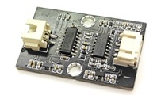

# Water quality ( TDS Sensor )

## Introduction

The TDS (Total Dissolved Solids) sensor measures the concentration of dissolved solids in water, providing an indicator of water quality the unit is ppm (mg/L). It is widely used by hobbyists, engineers, and researchers to assess the purity of water for various applications. *** But it does not show how dirty the water is. ***

 

## The principle

The TDS sensor operates by measuring the electrical conductivity of water, which correlates with the concentration of dissolved ions. Higher conductivity indicates a higher TDS level, reflecting increased dissolved solids such as salts, minerals, and metals. 

 

## Specification

- Input Voltage: DC 3.3 ~ 5.5V
- Output Voltage: 0 ~ 2.3V
- Working Current: 3 ~ 6mA
- TDS Measurement Range: 0 ~ 1000ppm
- TDS Measurement Accuracy: ± 10% F.S. (25 ℃)
- Module Interface: XH2.54-3P
- Electrode Interface: XH2.54-2P

## Pinout Diagram

| Pin | Function |
| -- | -- |
| G | Ground |
| V | Vlotage Supply |
| S | Signal (Analog) |

## Outlook and Dimension

 
Size: 40mm X 25mm 

 
Long: 600mm 

## Quick to Start/Sample

- Connect the module to development board (direct plugin or using wire)
 

- Open Makecode, using the [https://github.com/SMARTHON/pxt-smartcity-extension](https://github.com/SMARTHON/pxt-smartcity-extension) PXT

- Initialize the OLED and show the concentration of different dust value on the OLED screen
 

## Result
 

## FAQ

**Q: Why are my readings unstable or does the value look unnormal?** 
A: Ensure the probe is clean and submerged properly; temperature changes can also affect accuracy.

## Datasheet
[TDS sensor](https://www.bestmodulescorp.com/tc/amfile/file/download/file/1732/product/1134/?srsltid=AfmBOorN766C6i9UkKeyPAsylm0YU3SbT_JzhDmmNrRAFrksDbRt0jWI)