# Scenario 01: Smart Greenhouse Monitoring and Control

## Introduction

In addition to environmental control, the user needs to know the plant's current height to better understand its condition. This scenario extends the greenhouse scenario 1 with visual intelligence, enabling not only environmental control but also plant growth monitoring. 

## Assembly Steps

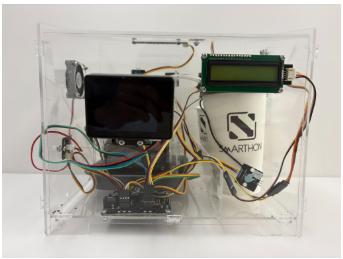

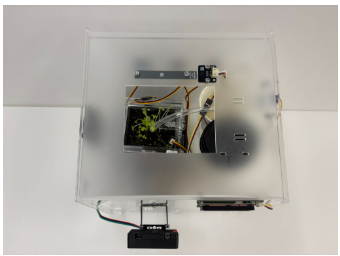

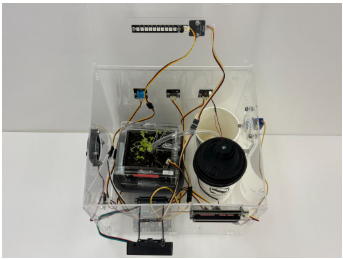

## Huskylens 1

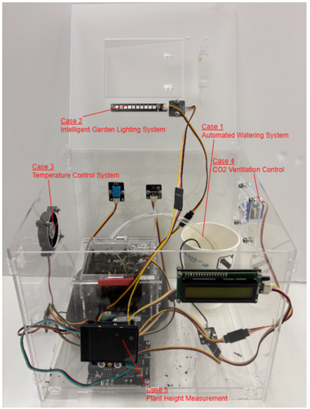

- Automated Watering System (Smart garden Case 02)
- Intelligent Garden Lighting System (Smart garden Case 03)
- Temperature Control System (Greenhouse add-on Case 1)
- CO2 Ventilation Control (Greenhouse add-on Case 3)
- Plant Height Measurement (Camera add-on case 1)

In addition to automatically regulating soil moisture, lighting, humidity, temperature, and air quality, the system uses HuskyLens 1 to measure plant height in real time. This allows users to monitor growth progress and evaluate plant health more accurately. By integrating environmental control with visual data, the system provides a more comprehensive and intelligent greenhouse solution.

Part 1: Part List  

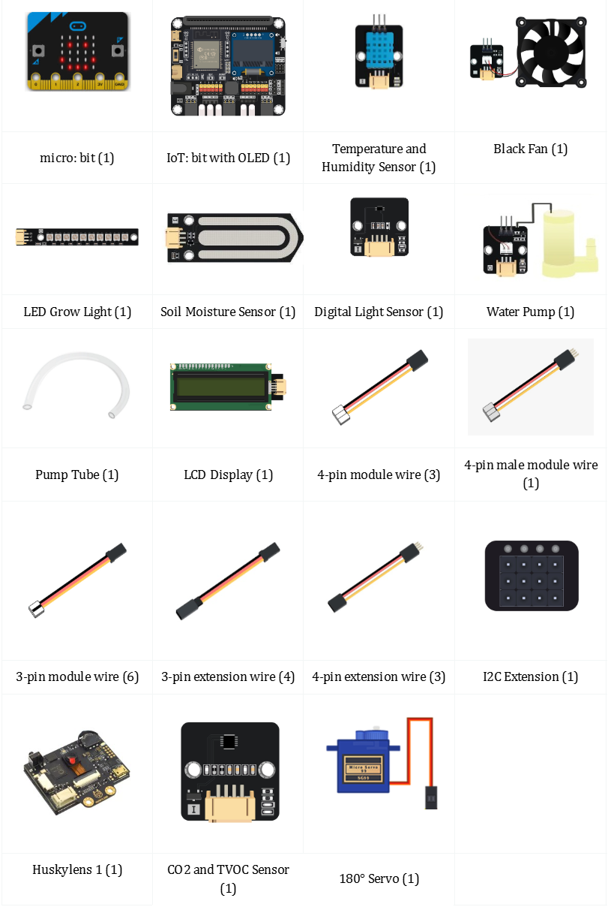

Part 2: Hardware Connection  

Step 1. Connect the Temperature and Humidity Sensor to P0
Step 2. Connect Black Fan to P1
Step 3. Connect the LED Grow Light to P2
Step 4. Connect 180° Servos to P3
Step 5. Connect the Soil Moisture Sensor to P4
Step 6. Connect the Water Pump to P7
Step 7. Connect the LCD Display to the I2C
Step 8. Connect the Digital Light Sensor to the I2C
Step 9. Connect the CO2 and TVOC Sensor to the I2C
Step 10.Connect the Huskylens 1 to I2C

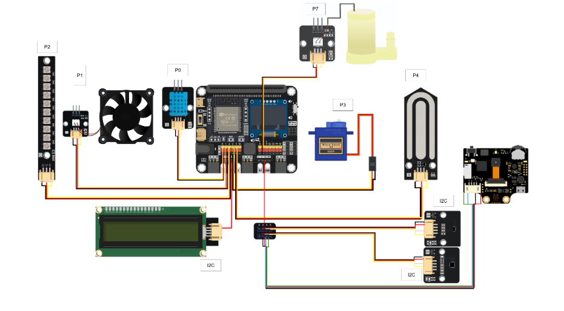

Part 3: Programming (MakeCode) 

MakeCode: [https://makecode.microbit.org/S45666-89556-72172-51709](https://makecode.microbit.org/S45666-89556-72172-51709)   
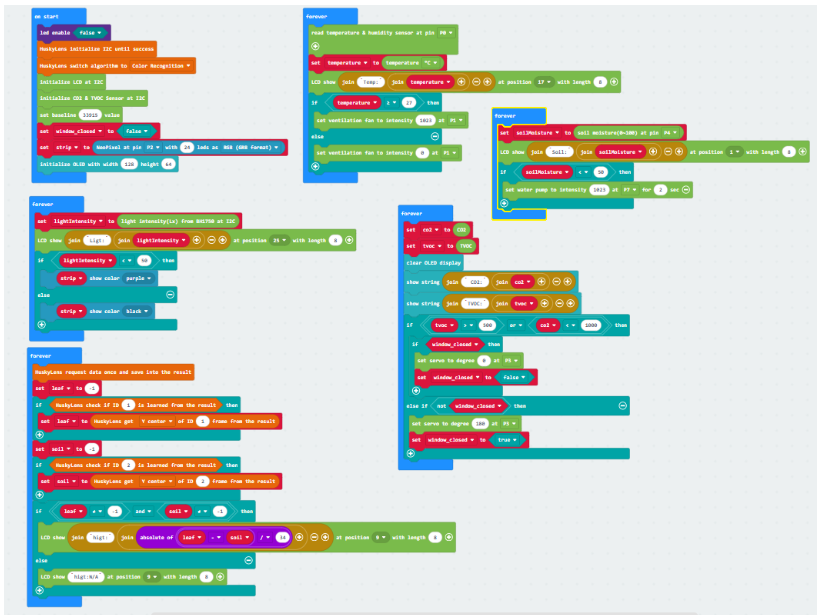

Part 4: Result 

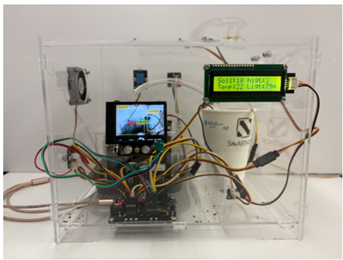

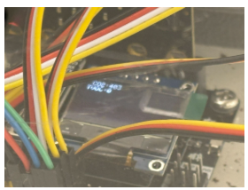

## Huskylens 2

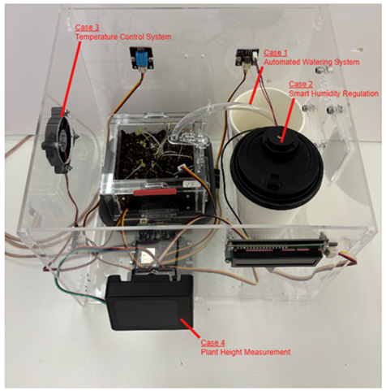

This Scenario integrates the following functions:
- Automated Watering System (Smart garden Case 02)
- Smart Humidity Regulation (Smart Garden Case 04)
- Temperature Control System (Greenhouse add-on Case 1)
- Plant Height Measurement (Camera add-on case 1)

In addition to automatically regulating soil moisture and temperature, the system uses HuskyLens 2 to measure plant height in real time. This allows users to monitor growth progress and evaluate plant health more accurately. By integrating environmental control with visual data, the system provides a more comprehensive and intelligent greenhouse solution. 

Part 1: Part List  

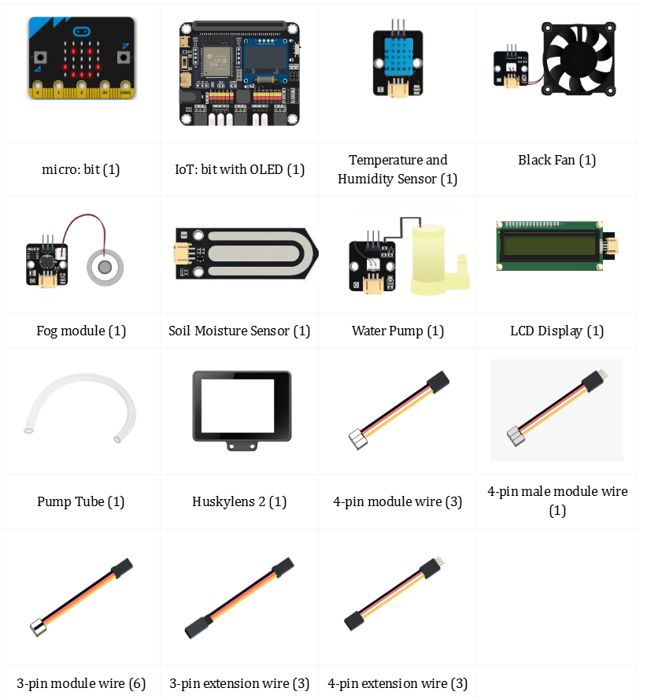

Part 2: Hardware Connection  

Step 1. Connect the Temperature and Humidity Sensor to P0
Step 2. Connect the Soil Moisture Sensor to P1
Step 3. Connect the Fog Module to P2
Step 4. Connect Black Fan to P3
Step 5. Connect the Water Pump to P4
Step 6. Connect the LCD Display to I2C
Step 7. Connect the Huskylens 2 to I2C

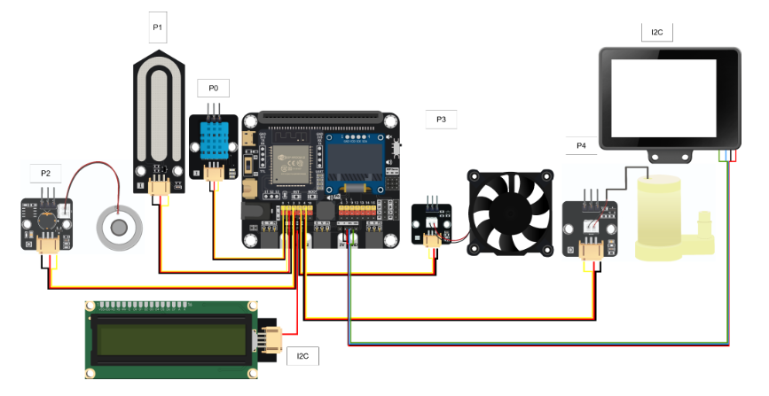

Part 3: Programming (MakeCode) 

MakeCode: [https://makecode.microbit.org/S78912-74972-61271-67973](https://makecode.microbit.org/S78912-74972-61271-67973)   
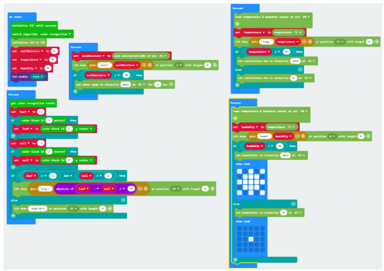

Part 4: Result 

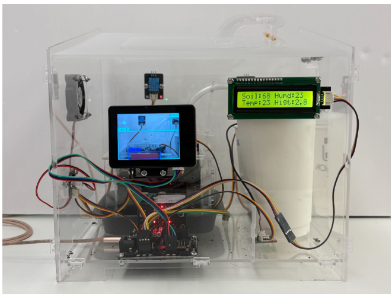

## Sentry 2

##  KOI

