# How to Build a Greenhouse model

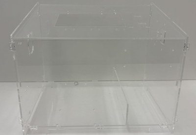

Step 1 

Assemble the A4 and A8 together. 

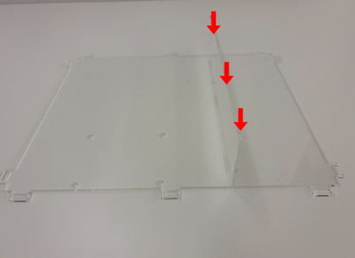

Step 2 

Assemble A2 into it 

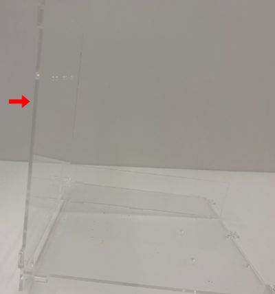

Step 3 

Fix it with D. 

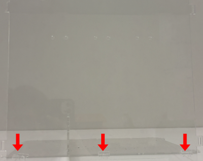

Step 4 

Assemble A5 into it. 

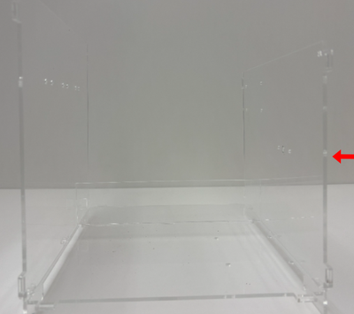

Step 5 

Fix them with D. 

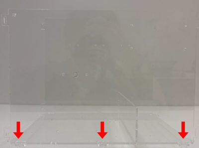

Step 6 

Assemble the A1 into it. 

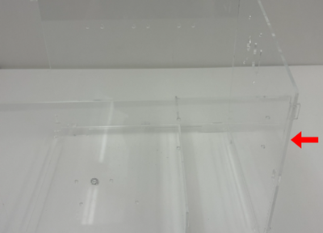

Step 7 

Fix it with D. 

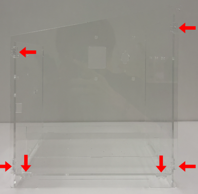

Step 8 

Assemble the A3 on the opposite side of Step 3 

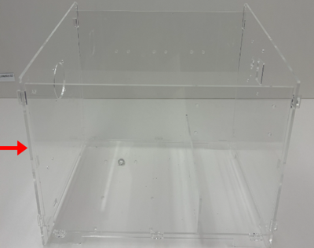

Step 8 

Fix it with D. 

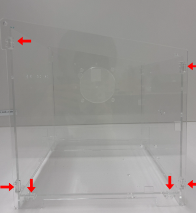

Step 9 

Install the A6 on the top of the greenhouse model. Complete! 

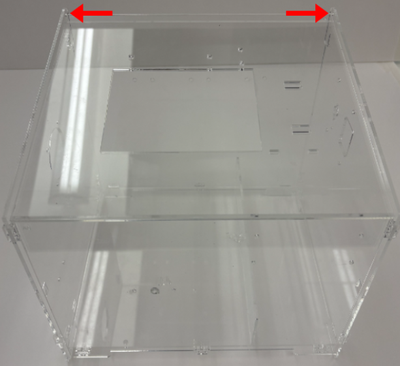

