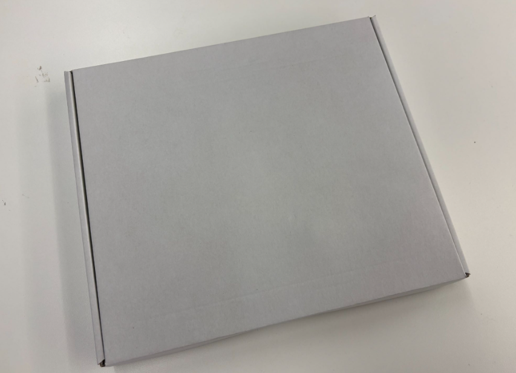

# Introduction

## Introduction
Smarthon Greenhouse add-on Kit is designed to introduce the concept of Internet of Things (IoT) through greenhouse automation and environmental monitoring. With basic knowledge of programming and electronics, users can create their own smart greenhouse system and explore how technology can improve plant growth conditions.
Based on the Smarthon IoT board, the kit supports a variety of sensors and actuators, allowing users to design different greenhouse features. For example, users can use a temperature sensor to control a fan for cooling, use a light sensor to decide whether to open the upper window to let in sunlight, or use a CO₂ sensor to manage ventilation. Through these practical cases, users can understand how sensor data is collected, processed, and applied to real-life scenarios, while developing skills in IoT system design, coding, and problem-solving.

 

## Component List

| No | Component | Quantity | Remark |
| :---- | :---- | :---- | :---- |
| 1 | CO2 Sensor | 1 |  |
| 2 | Fan Module | 1 |  |
| 3 | 180° Servo  | 1 |  |
| 4 | I2C Extension | 1 |  |
| 5 | Module Wire | 2 | 3Pin\*1, 4Pin\*1 |
| 6 | Extension Wire | 2 | 4Pin\*2 |
| 7 | M2\*10mm Screws | 6 |  |
| 8 | M3\*16mm Screws | 6 |  |
| 9 | M2 Nut | 6 |  |
| 10 | M3 Nut | 6 |  |
| 11 | M4\*10mm Window Lock Screws | 6 |  |
| 12 | M4 Nut | 6 |  |
| 13 | M1.2\*5mm Window Gear Screws | 4 |  |
| 14 | Rod | 1 |  |
| 15 | Axis | 3 |  |
| 16 | Acrylic Model | 1 |  |