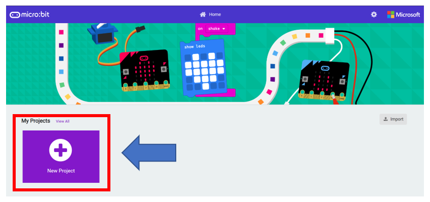
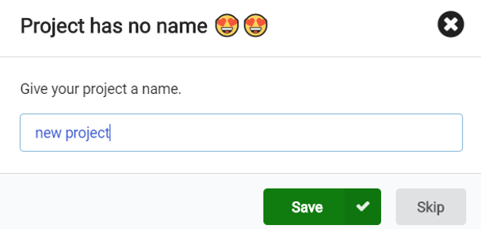
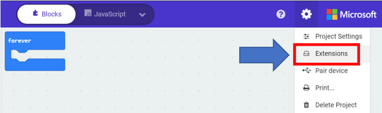
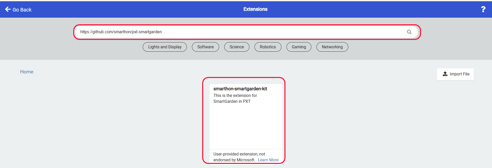
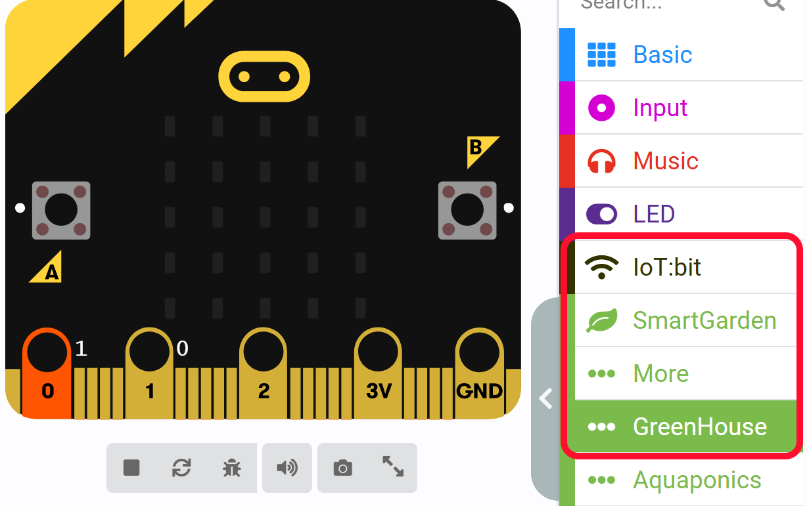

# Getting started: Add the extension

Step 1 

Go to [MakeCode](https://makecode.microbit.org), create a new project 

Step 2 

Give the project a name 

Step 3 

Click "" and choose "Extensions" in the pull-down menu 

 

Step 4 

Search "[https://github.com/SMARTHON/pxt-smartgarden](https://github.com/SMARTHON/pxt-smartgarden)" and click “smartgarden”

Step 5 

Extension `GreenHouse` package has been added successfully. 

