# Case 1: Temperature Control System

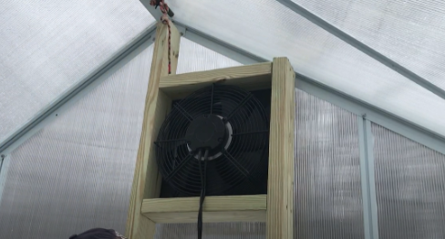

## Goal

Create a temperature control system that automatically controls the fan based on the detected indoor temperature of the greenhouse.

## Background

What is a Temperature Control System?

Temperature control is a core part of the greenhouse environment. In regions with extreme weather, temperatures can reach levels that are unfavorable for plant growth. By maintaining the temperature within a specific range using the Temperature Control system, plants can grow in optimal conditions, resulting in faster harvests and improved yield quality.

Temperature Control System Operation

The temperature and humidity sensor will continuously monitor the indoor temperature of the greenhouse. When the temperature rises above the set threshold, the motor fan will automatically turn on and remain active until the temperature falls below the threshold again.

Real-Life Application

In real life, greenhouses use a combination of passive and active designs to regulate temperature within optimal ranges for plant growth.

Passively, greenhouses rely on materials and structural designs that can store and release heat appropriately. Their enclosed structure helps trap heat from sunlight, and the use of polycarbonate or glass coverings further enhances this heat retention. With multi-layer glazing, the air gaps between the polycarbonate or glass layers provide insulation and reduce heat loss.

Actively, greenhouses are equipped with cooling and heating systems that operate automatically when needed. Opening vents can effectively lower the indoor temperature, while wet cellulose pads cool incoming air through evaporation. Air heaters and hot water boilers with pipe networks are commonly used to provide heating during winter.

In our greenhouse model, a black fan circulates air to lower indoor temperature, simulating Horizontal Air Flow (HAF) systems commonly used in real-life greenhouses. 

## Part List

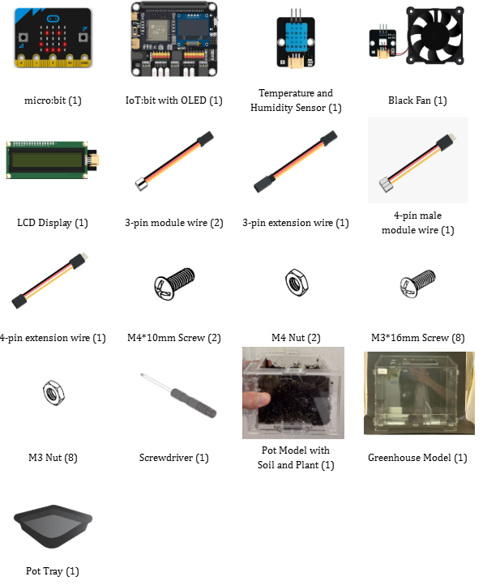

## Assembly Steps
Step 1 

To start with, build the plant pot model with soil and seedlings. 

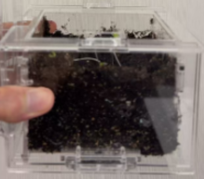

Step 2 

Build the greenhouse model. 

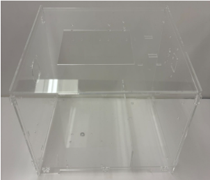

Step 3 

Install the Temperature and Humidity Sensor on the wall of the greenhouse model. 

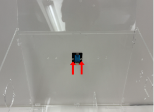

Step 4 

Install the Black Fan on the wall of the greenhouse model. 

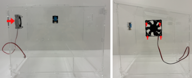

Step 5 

Install the LCD Display on the wall of the greenhouse model. 

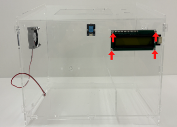

Step 6 

Put the pot tray into the greenhouse model, then put the pot model onto the tray. Completed\! 

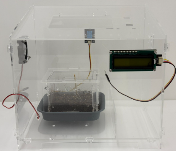

## Hardware Connection

1. Connect the Temperature and Humidity Sensor to P0.  
2. Connect Black Fan to P1.  
3. Connect the LCD Display to the I2C.

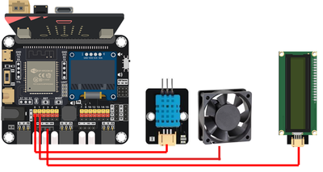

## Programming (MakeCode)

MakeCode: [https://makecode.microbit.org/\_TYdbUThpvV1m](https://makecode.microbit.org/_TYdbUThpvV1m)   
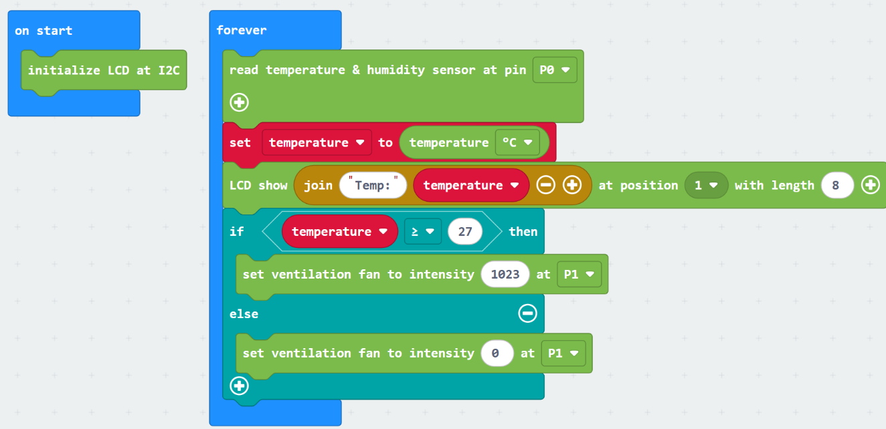

## Result

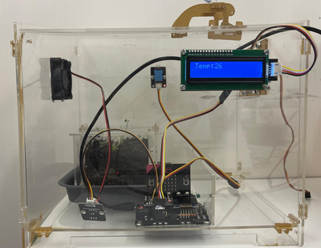