# Case 2: Smart Shade Automation

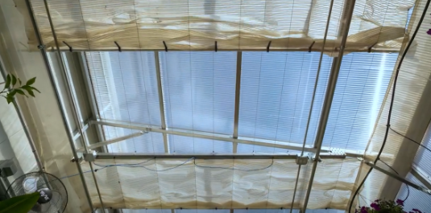

## Goal

Create a smart shade system that automatically operates based on detected sunlight intensity.

## Background

What is Smart Shade Automation?

A Smart Shade Automation system helps maintain optimal light and temperature conditions during sunny days while retaining heat at night. By regulating sunlight exposure and temperature, the system creates a more stable environment for plants, which supports healthier growth and higher yields. This precise control ensures plants thrive in consistent and favorable conditions, boosting overall productivity and sustainability.

Smart Shade Automation System Operation

The digital light sensor continuously monitors the sunlight intensity. When the detected light intensity (in lux) exceeds the threshold, the 180° Servo will close the shade. Otherwise, the shade will remain open.  
Real-Life Application

Real-life greenhouses typically use polycarbonate or glass coverings for high light transmission. Retractable shade screens made of thermal or net fabrics are also installed to prevent leaf burn during intense sunlight.

Some greenhouses are installed with semi-transparent solar panels on roofs to generate solar power while providing shade.

In our greenhouse model, the shade is simulated by a roof vent. The vent provides shade during excessive sunlight.

## Part List

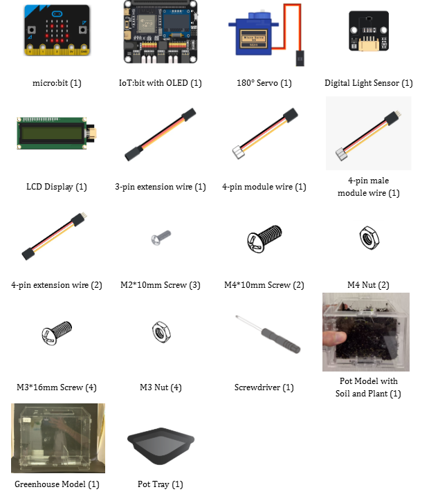

## Assembly Steps
Step 1 

To start with, build the plant pot model with soil and seedling. 

Step 2 

Build the greenhouse model. 

Step 3 

Install the Digital Light Sensor on the rooftop of the greenhouse model. 

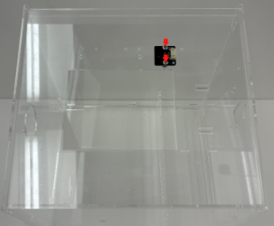

Step 4 

Install the LCD Display on the wall of the greenhouse model. 

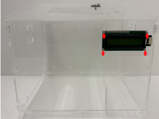

Step 5 

Install the upper window in the cover of the greenhouse model. 

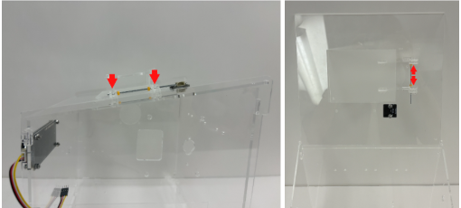

Step 6 

Install the 180° Servo and C1 with the upper window on the rooftop window of the greenhouse model. 

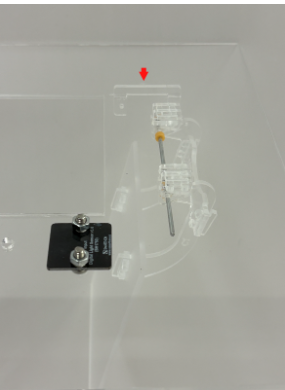
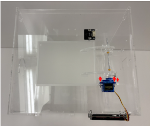

Step 7 

Put the pot tray into the greenhouse model, then put the pot model onto the tray. Completed! 

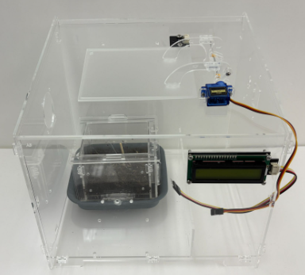

## Hardware Connection

1. Connect the 180° Servo to P0.  
2. Connect the LCD Display to the I2C.  
3. Connect the Digital Light Sensor to the I2C.

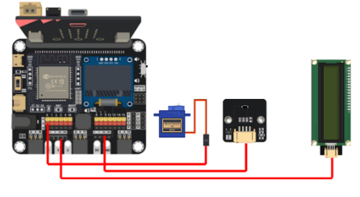

## Programming (MakeCode)

MakeCode: [https://makecode.microbit.org/\_1u9EYcP4yhv6](https://makecode.microbit.org/_1u9EYcP4yhv6)   
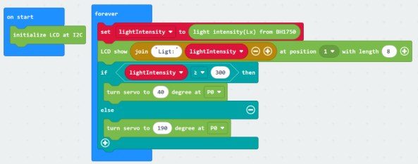

## Result

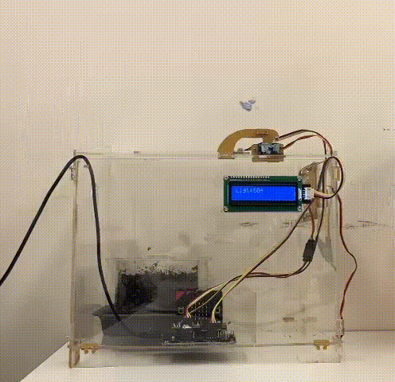

