# Case 3: CO2 Ventilation Control

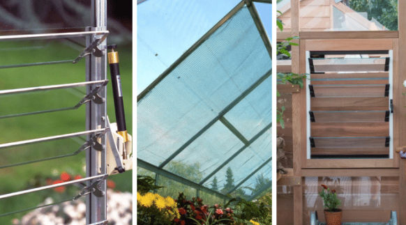

## Goal

Create an air quality ventilation control system that automatically operates the greenhouse window based on the detected air quality and carbon dioxide levels.

## Background

What are Total Volatile Organic Compounds (TVOC)?

TVOC refers to the combined concentration of various volatile organic compounds present in the air. VOCs are organic chemicals that easily evaporate at room temperature and are commonly emitted from building materials, cleaning products, paints and other household items. TVOC is used as an overall indicator of indoor air quality because it represents the total amount of these airborne pollutants, providing a general measure of air contamination levels.

What is Air Quality Ventilation Control?

Ventilation is essential in greenhouses for regulating temperature, humidity and carbon dioxide levels. Carbon dioxide is vital for photosynthesis and plant growth, and a deficiency can hinder or even stop plant development. The Ventilation Control System ensures a continuous supply of fresh carbon dioxide by exchanging the air inside the greenhouse, which supports healthy plant activity. 

Air Quality Ventilation Control System Operation

The CO2 and TVOC sensor continuously monitors the levels of carbon dioxide and TVOC. When the TVOC concentration exceeds a predefined threshold or the CO2 level falls below a specified value, the 180° Servo will open the window. Otherwise, the window will remain closed.

Real-Life Application

In real-life greenhouses, sophisticated air quality ventilation control systems are used to precisely balance CO₂ enrichment and pollutant management.

Environmental CO2 levels are only around 400 ppm. To boost photosynthesis rates, greenhouses use CO₂ generators or compressed CO₂ systems to actively supplement CO2 to 800-1200 ppm during daytime.

On the other hand, automated vents and fans are used to regulate TVOC and other pollutants. They open when VOCs exceed safe thresholds, and close otherwise to maintain beneficial CO₂ levels.

In our greenhouse model, an automated window is used to regulate pollutant levels while gaining CO₂ supply from outdoor air.

## Part List

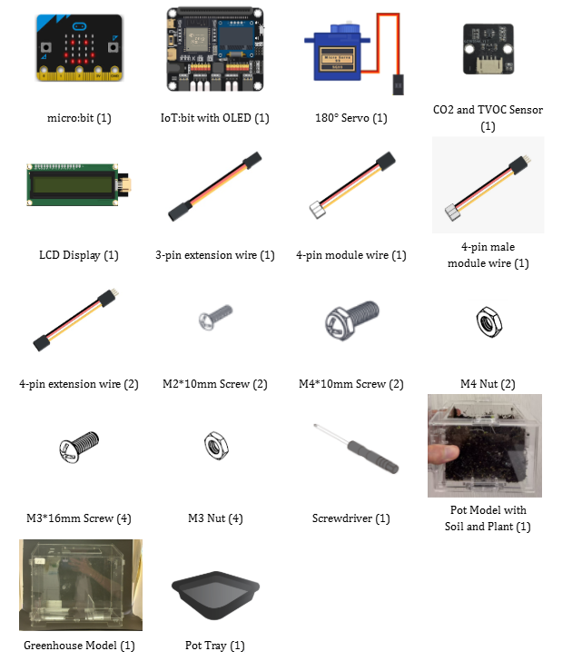

## Assembly Steps
Step 1 

To start with, build the plant pot model with soil and seedlings. 

Step 2 

Build the greenhouse model. The 180° Servo should be installed onto the model during the build. 

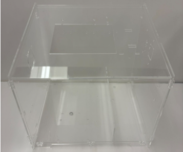

Step 3 

Install the CO2 and TVOC Sensor on the wall of the greenhouse model. 

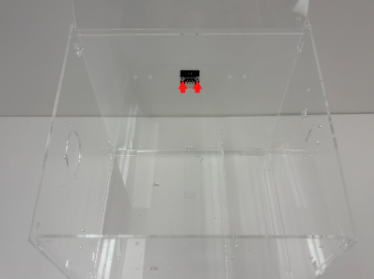

Step 4 

Install the LCD Display on the wall of the greenhouse model. 

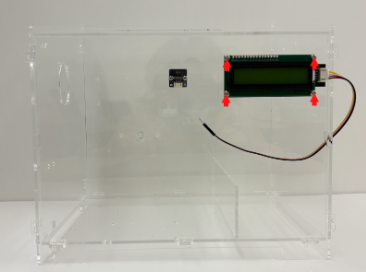

Step 5 

Install the upper window on the cover of the greenhouse model. 

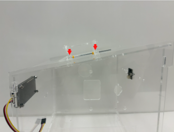
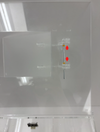

Step 6 

Install B2 inside the model on the RHS wall of the greenhouse model. 

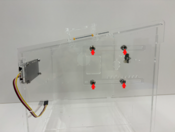

Step 7 

Assemble B1 with the 180° Servo and install it with B2 on the LHS wall of the greenhouse model. 

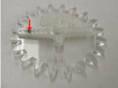
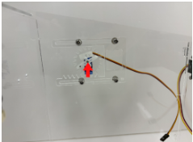

Step 8 

Put the pot tray into the greenhouse model, then put the pot model onto the tray. Completed! 

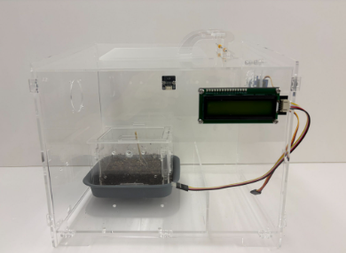

## Hardware Connection

1. Connect 180° Servo to P0.  
2. Connect LCD Display to I2C.  
3. Connect CO2 and TVOC sensor to I2C.

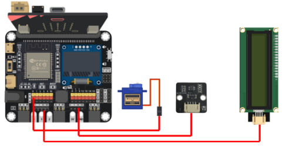

## Programming (MakeCode)

MakeCode: [https://makecode.microbit.org/\_dcMdr0P8EVxi](https://makecode.microbit.org/_dcMdr0P8EVxi)   
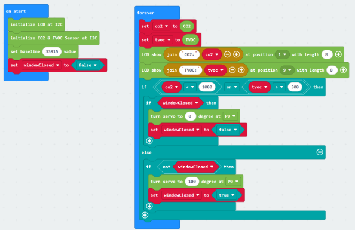

## Result

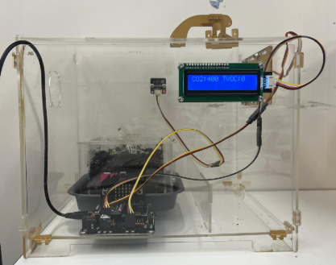

