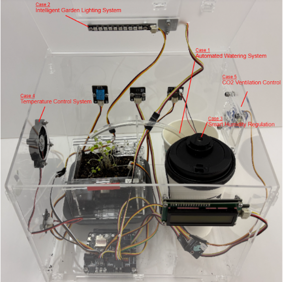
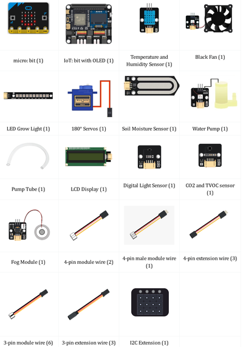
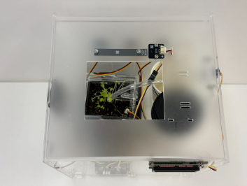
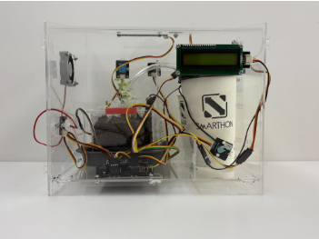
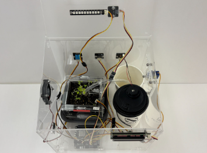
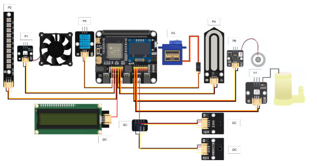
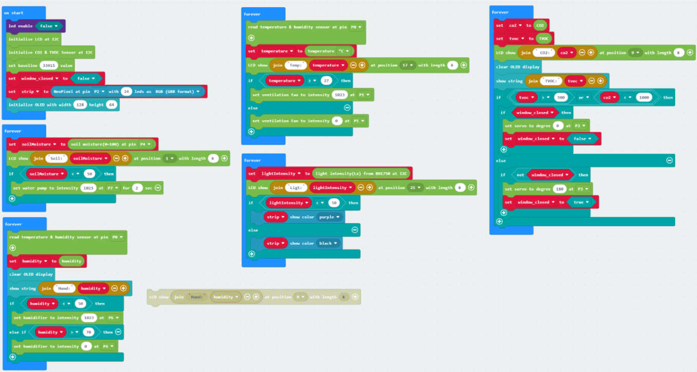

# Scenario 01: Greenhouse Climate Control System

## Introduction

A greenhouse requires precise environmental control to support stable and efficient plant growth. This system integrates multiple sensors and actuators to automatically regulate temperature, humidity, lighting, and air quality, creating an optimal growing environment.

This Scenario integrates the following functions:
* Automated Watering System (Smart Garden Case 02)
* Intelligent Garden Lighting System (Smart Garden Case 03)
* Smart Humidity Regulation (Smart Garden Case 04)
* Temperature Control System (Greenhouse add-on Case 1)
* CO2 Ventilation Control (Greenhouse add-on Case 3)

## Part List

## IoT Technology Applied

## Assembly Steps

## Hardware Connection

1. Connect the Temperature and Humidity Sensor to P0.
2. Connect Black Fan to P1.
3. Connect the LED Grow Light to P2.
4. Connect 180° Servos to P3.
5. Connect the Soil Moisture Sensor to P4.
6. Connect the Fog Module to P6.
7. Connect the Water Pump to P7.
8. Connect the LCD Display to the I2C.
9. Connect the Digital Light Sensor to the I2C.
10. Connect the CO2 and TVOC Sensor to the I2C.

## Programming (MakeCode)

MakeCode: [https://makecode.microbit.org/_ekxJ7uUcmCwi](https://makecode.microbit.org/_ekxJ7uUcmCwi)   

## Result