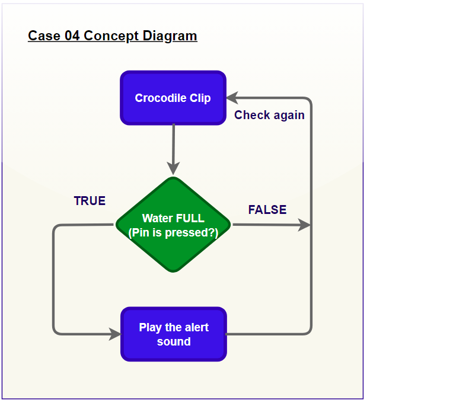
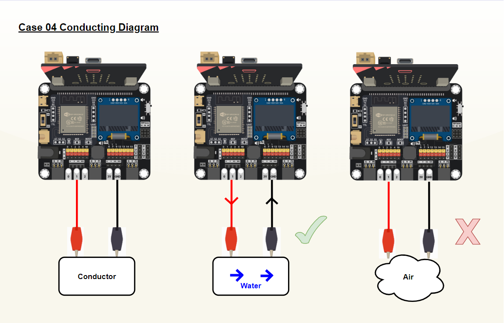
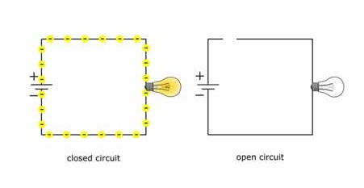
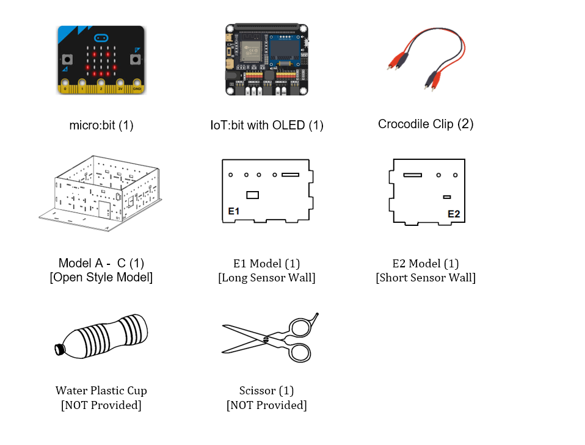
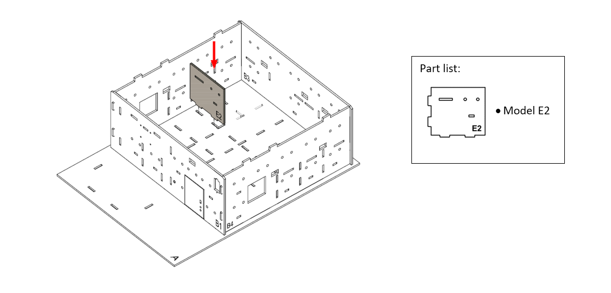
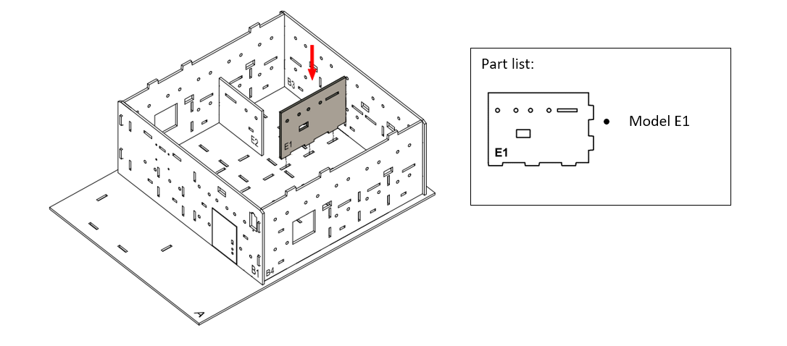
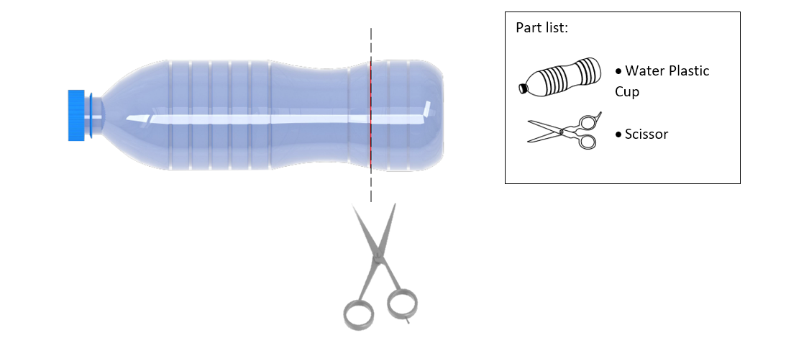
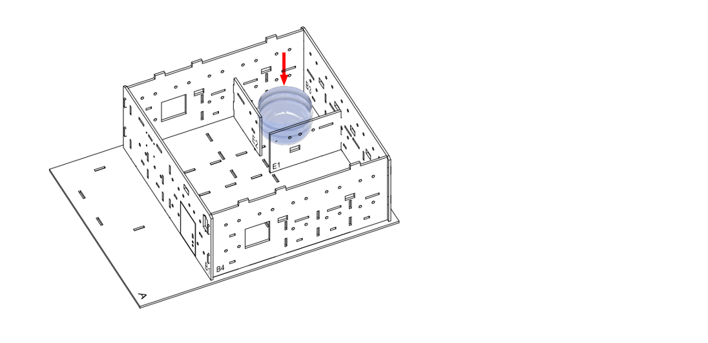
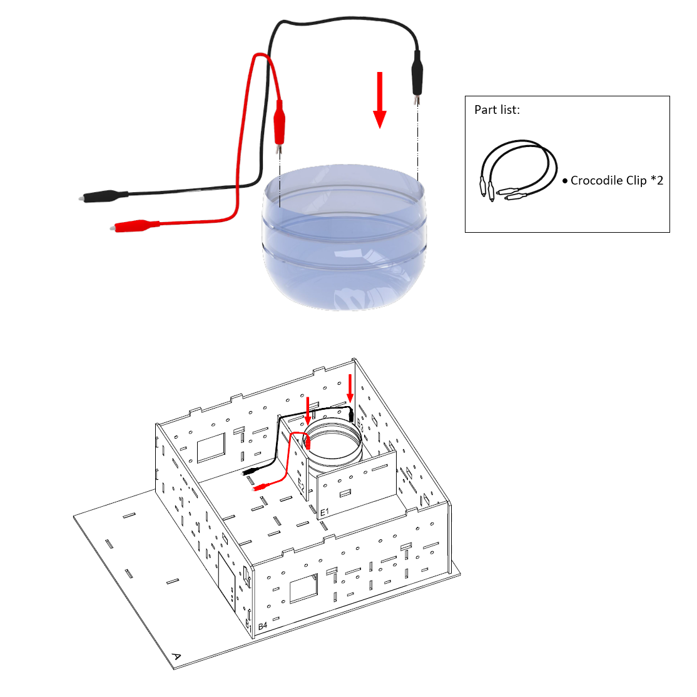
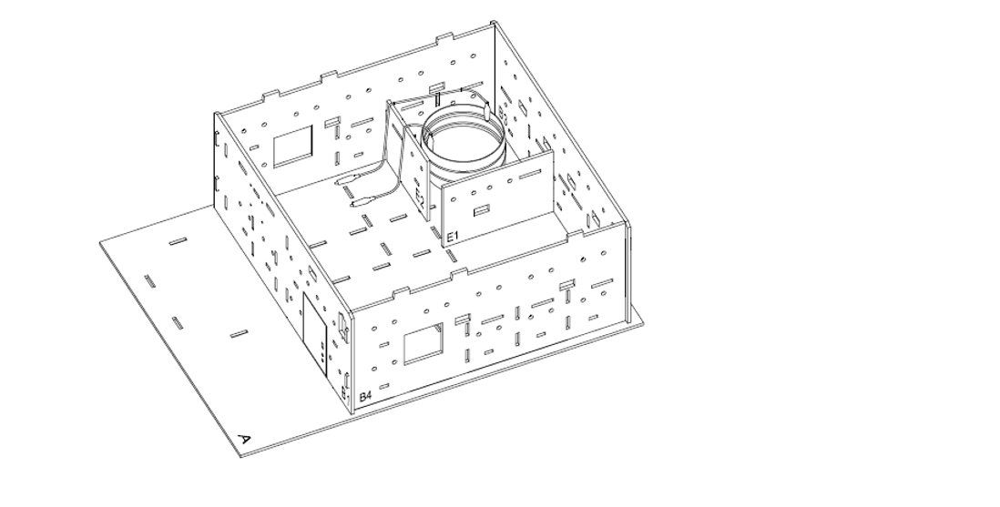

# Case 04: Toilet Water Leakage Detection System

Level: 

## Goal

Make a toilet water leakage detection system by checking the conductivity of device connected. 

## Background

What is a Toilet Water Leakage Detection System?

Toilet water leakage detection system is a system that can trigger alert upon unwanted water leakage situations. 

Toilet Water Leakage Detection System Principle

One crocodile clip installed to “P1” while another one crocodile clip installed to “GND”. If the water is full, water will become a conductor to connect “P1” and “GND” (Pin 1 is pressed). It will alert the sound. Otherwise, no sound emitted.

Conductor Water vs Air

The system consists of two crocodile clips each with one side connected to the board (P1 and GND), with two clips physically disconnected. We can imagine there is a conductor in between the 2 crocodile clips.

When nothing is happening, air is an excellent insulator, the conductor would be air, the circuit between P1 and GND will become an open circuit. No Current can be passed through. 

When water is raised up, water is a good conductor, the water will connect the P1 and GND between two clips, thus becoming a closed circuit, electricity will flow from P1 to GND. 

Know more: What is an Electrical circuit?

Electrical Circuit is one of basic concepts in electronic engineering. When something can let electric current pass through, it builds up a circuit.

Generally, a circuit will have two states. If the circuit is complete, able to let the current pass, it is called a closed circuit. If the circuit has a breakpoint, and cannot let the current pass through, it becomes an open circuit.

However, how to let the current pass through? It is related to the material of the circuit. In daily life, metal wire usually has a high conductivity, so it can be used to build the circuit. In addition, some ionic material such as tap water also takes the same property, able to become a conductor to build a circuit. But air has very bad conductivity, so it is hard to let current pass through. 

## Part List

## Assembly step

Step 1

In this case, we selected “Open Style Model” as home base to start with.
 

Step 2

Insert E2 cardboard on A cardboard, align with holes at A, B2
 

Step 3

Insert E1 cardboard on A cardboard, align with holes at A,B3
 

Step 4

Find a plastic water bottle and cut it to become a water tank, cut the bottle at red line
 

Step 5

Place the water tank in the toilet
 

Step 6

Place two clips to position that want to detect water flowing
 

Step 7

Completed
 

## Hardware connect

1. Connect the two crocodile clip cables to P1 and GND
2. Pull down the buzzer switch to connect the buzzer

## Programming (MakeCode)

Step 1

Step 1. Check the Pin state
* In `Forever`, put a `if` statement
* Put `pin P1 is pressed = true` as condition

Step 2. Alert warning

* If in `if` segment, that's means the water was connected two clips
* Use `play tone High A for 2 beat` to play warning sound

Full Solution 

MakeCode: [https://makecode.microbit.org/_bPw0ViLrR6Jm](https://makecode.microbit.org/_Uh3ggjiKRT3X) 

You could also download the program from the following website: 
<iframe src="https://makecode.microbit.org/#pub:_Uh3ggjiKRT3X" width="100%" height="500" frameborder="0"></iframe>

## Results

When the water level rises to the crocodile clip’s position, the warning sound is triggered to warn the user. 

## Think

Q1. Apart from the warning by buzzer, any other method can be used to notify the house owner? i.e. showing red LED 

