# Case 08: Automatic Sunlight Detecting Curtain
Level: 

## Goal

Make a smart curtain that operates automatically by detecting the sunlight around the house to save energy. 

## Background

What is Automatic Sunlight Detecting Curtain 

Automatic Sunlight Detecting Curtain is a curtain that scrolls up or down automatically according to the detection of sunlight. 

Automatic Sunlight Detecting Curtain Principle

The light sensor is installed outside of the house. When it detects strong light (Light > 70), it indicates that there is sunlight that can reach the house. The curtain in this case should scroll down to prevent heat energy transfer into the house. It can reduce energy loss and can save the energy of air conditioner.
 

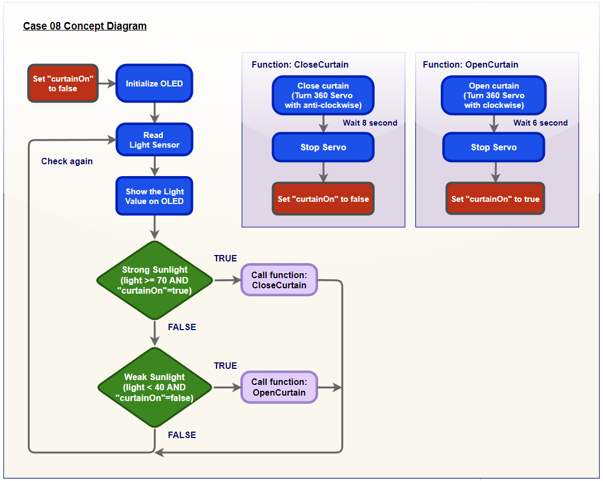

## Key knowledge

In programming part, there is a "flag" concept to be used in this case. It can check whether the curtain is pulled down or not and prevent from keeping pull down the curtain.

## Part List

 
## Assembly step

Step 1

Build the base model of big style model 

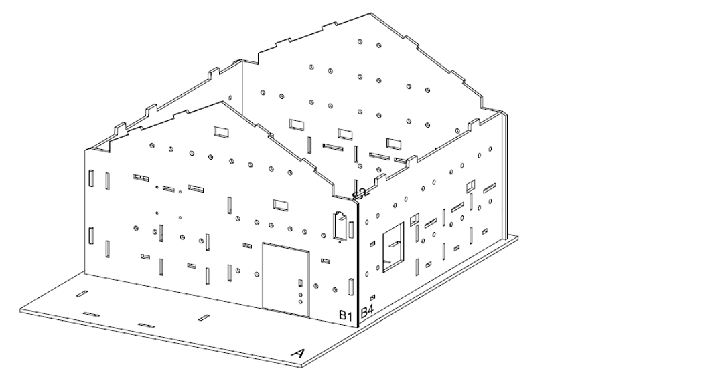

Step 2

Attach the curtain rod to 360 servo.You can use the screwdriver to assist 

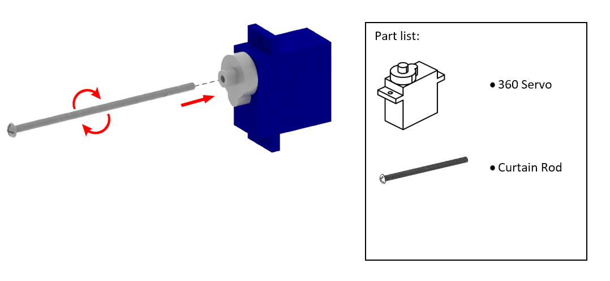

Step 3

Cut the Curtain paper to 8cm\*8cm 

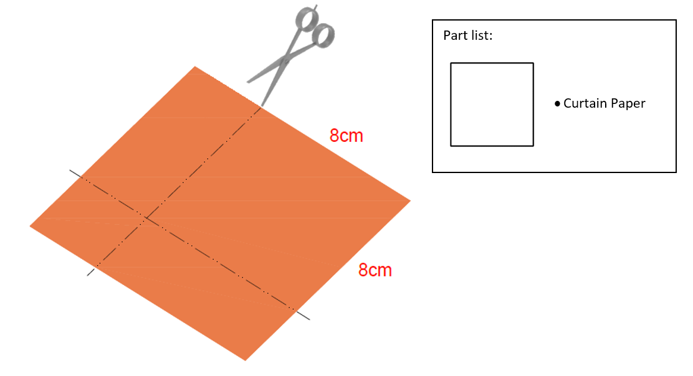

Step 4

Add the glue to stick the curtain rod with the curtain paper 

Step 5

Make the Blu Tack to long shape by hand 

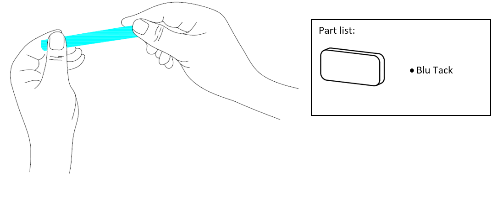

Step 6

Stick the long Blu Tack to the bottom of paper curtain 

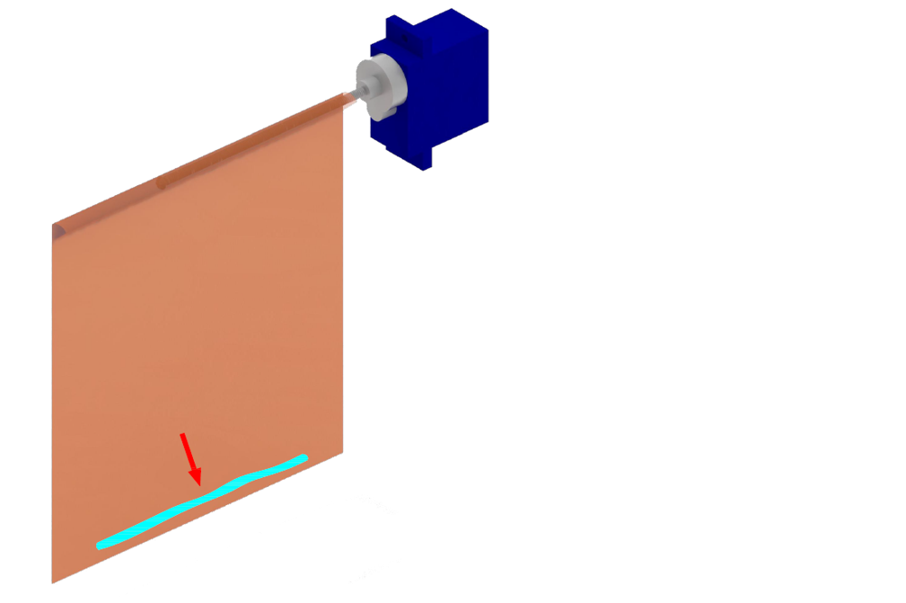

Step 7

Use M2 screw to install the servo to the placeholder on cardboard B1 and check the place of curtain 

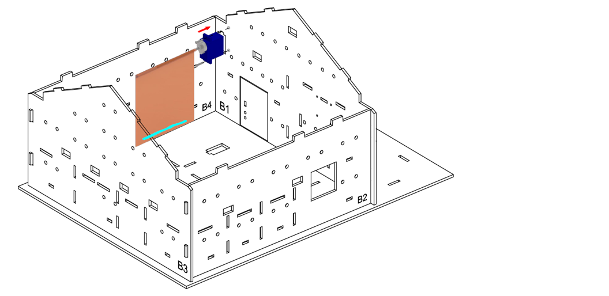

Step 8

Close the house by C1 cardboard and C2 cardboard 

Step 9

Install the light sensor on the C1 cardboard 

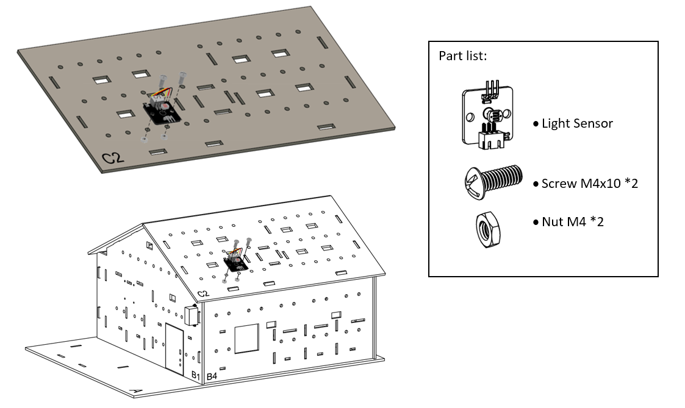

Step 10

Completed 

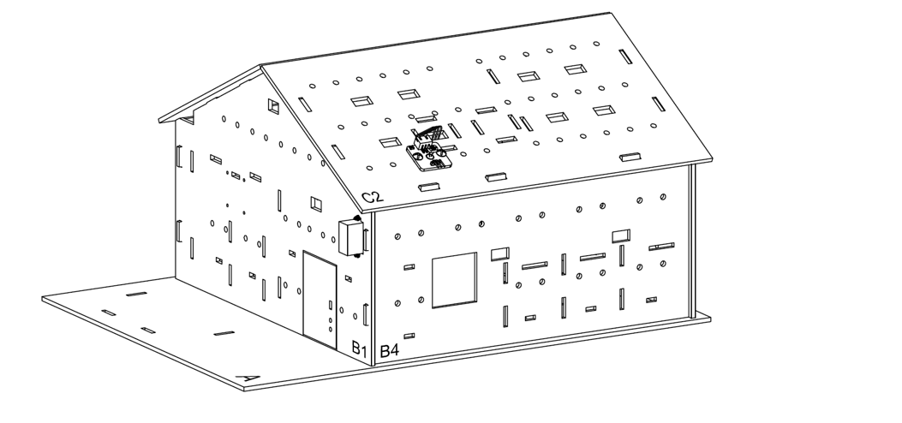

	
## Hardware connect

1. Connect the light sensor to P1
2. Connect the 360 degree servo to P2

## Programming (MakeCode)

Step 1. Initialize OLED and create the variable

* On start, initialize the OLED display by `initialize OLED with width 128 height 64` 
* Create the `curtainOn` variable and set it to `false`

Step 2. Create curtain control function "openCurtain"

* Create function `openCurtain` 
* Inside the function, control the speed and direction of the 360 degree servo at connected pins, such as `Turn 360 Servo with clockwise direction speed level 3 at P2`
* Add pause to wait it rotate for few second (depend on your model setup)
* Stop the 360 servo with same method, such as `Turn 360 Servo with clockwise direction speed level 0 at P2`
* set the `curtainOn` variable to `true`

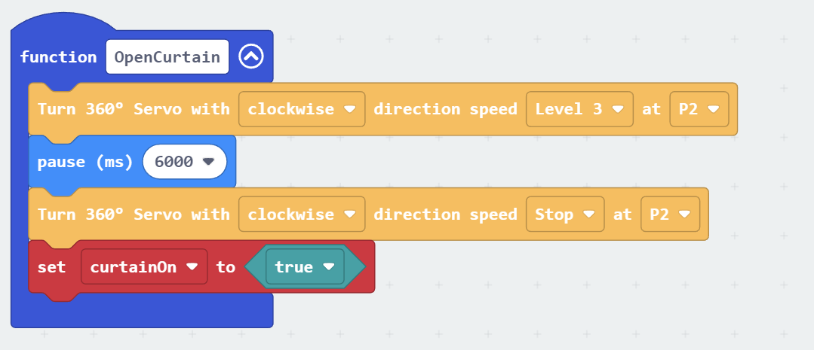

Step 3. Create curtain control function "closeCurtain"

* Create function `closeCurtain` 
* Inside the function, following the previous function, but in reversed direction and state
* control the speed and direction of the 360 degree servo at connected pins, such as `Turn 360 Servo with anti-clockwise direction speed level 3 at P2`
* Add pause to wait it rotate for few second (depend on your model setup)
* Stop the 360 servo with same method, such as `Turn 360 Servo with anti-clockwise direction speed level 0 at P2`
* set the `curtainOn` variable to `false`

Step 4. Get the light intensity value

* In `Forever`, reading the value by `set light to Get light value (percentage) at Pin P1`
* Clear the OLED display before each update by `clear OLED display`
* Show the number of value on display by `show number light`

Step 5. Examine the light intensity value and reaction

* Snap a nested `if statement` to `Forever`
* Set `light2 >= 70 ` and `curtainOn =  true` as first condition
* In the `if` segment, that's means the sunlight is strong, need to close the curtain, `call closeCurtain`
* In the second condition, use `light2 < 40` and `curtainOn = false` 
* In the second `if` segment, that's means the sunlight is weak, need to open the curtain, `call openCurtain`

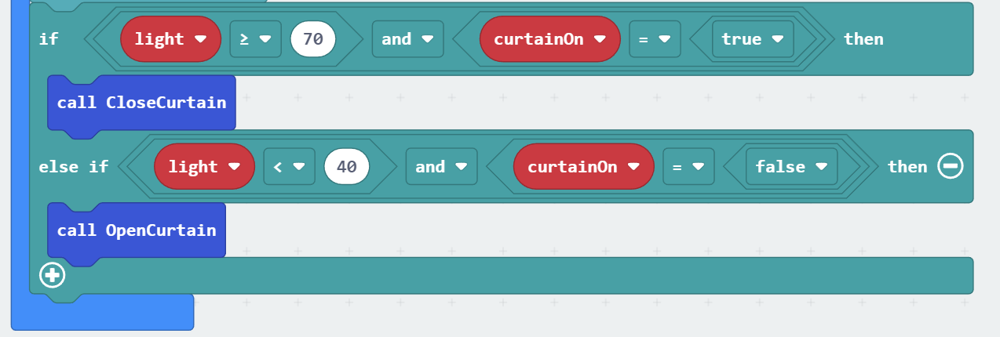

Full Solution 

MakeCode: [https://makecode.microbit.org/_6sm7bVe3AP2T](https://makecode.microbit.org/_ieEiYx8qffxJ) 

You could also download the program from the following website: 
<iframe src="https://makecode.microbit.org/#pub:_6sm7bVe3AP2T" width="100%" height="500" frameborder="0"></iframe>

## Result

When the light sensor detects the light value outside the house is strong, the servo will rotate to scroll down the curtain. When the light is not strong, the servo will rotate in anti direction to scroll up the curtain

## Think

Q1. Apart from the sunlight value, any other condition can be used to determine the curtain state?  

