# Adv IoT Case 13: Smart Fan Voice Control

Level: 

## Goal

Make a remotely controlled fan by using a voice assistant.

## Background

What is Smart Fan Voice Control? 

It is a fan that is connected to the internet and can be woken up by voice command using a voice assistant. The user can define different voice commands to control fan in different speeds or modes. In this case, the user can turn on and off from the voice command. 

Smart Fan Voice Control Principle
 

In the program, the micro:bit connects to WIFI and gets the device ID. By setting the received command (turn_on_fan and turn_off_fan), the motor will be turned on and off. 
In the Smarthon IoT:bit extension on IFTTT platform, commands can be pre-set such that when a specific phrase is said to the corresponding voice assistant it will send the commands through the internet to the fan and trigger on or off actions.
 

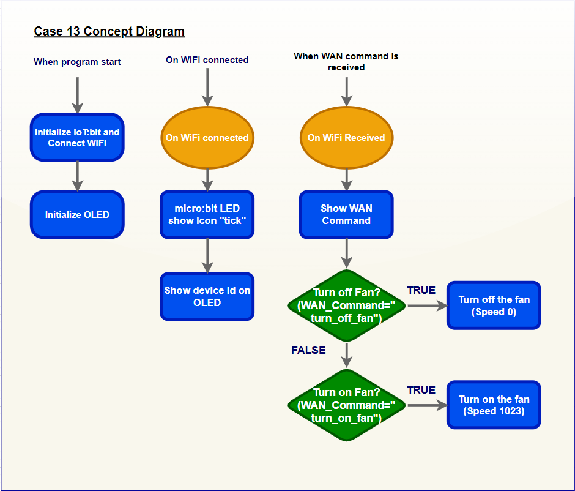

Know more: What is a Voice Assistant?

An intelligent virtual assistant (IVA) or intelligent personal assistant (IPA) is a software agent that can perform tasks or services for an individual based on commands or questions. The term "chatbot" is sometimes used to refer to virtual assistants generally or specifically accessed by online chat. Common giant examples are Amazon Alexa, Google Home and Apple Siri.

It is capable of voice interaction, music playback, making to-do lists, setting alarms, streaming podcasts, playing audiobooks, and providing weather, traffic, sports, and other real-time information, such as news. They can also control several smart devices using itself as a home automation system.

Nowadays, to make a home smarter, <u>Amazon Echo Dot</u> or <u>Google Home</u> or <u>Apple home pod</u> is a central control device which contains a voice assistant inside at home so that the user can use the voice command to control different electronics easily.

## Part List

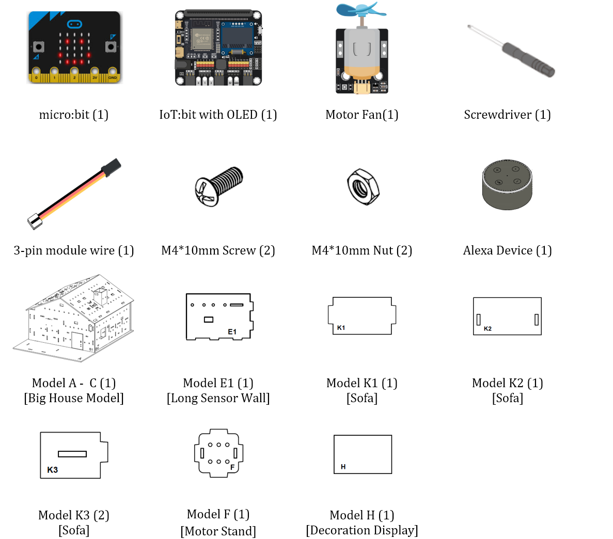

 
## Assembly step

Step 1 

In this case, build the “Big Style Model” as a home base.
 

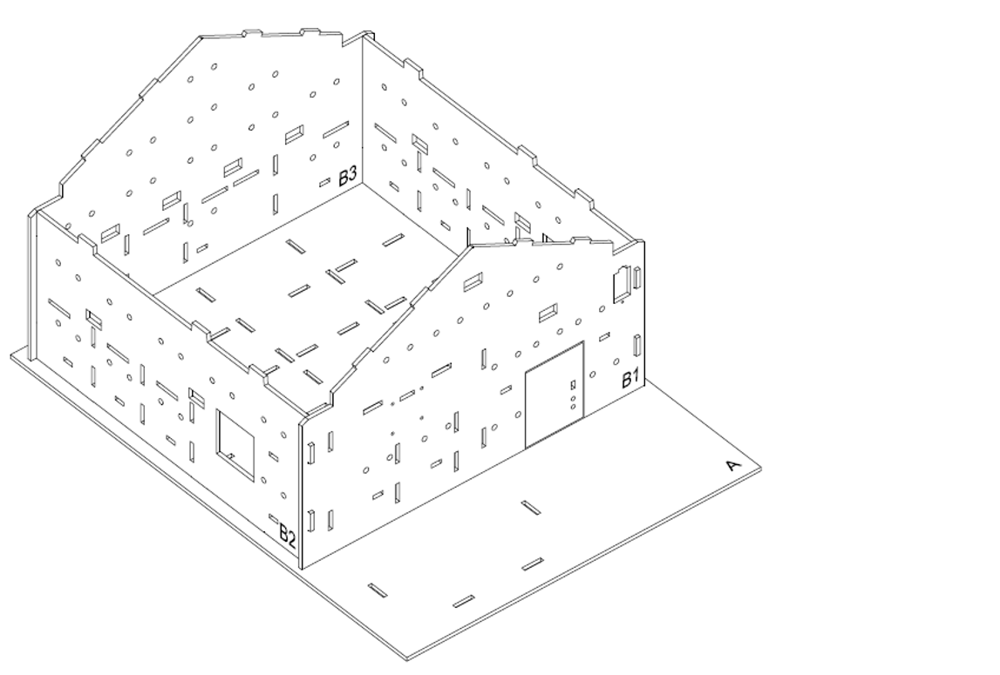

Step 2 

Insert the model E1 on model A, align with the holes on model A and B3.
 

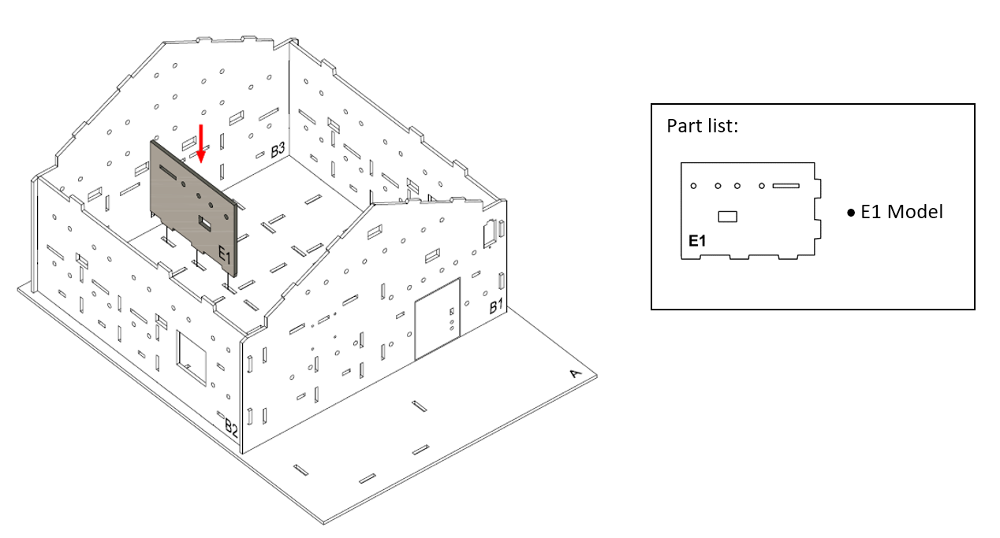

Step 3 

Attach the motor fan into the model F using M4 \* 10mm screws and nuts. And the connecting wire could be bended to the hole next to it.
 

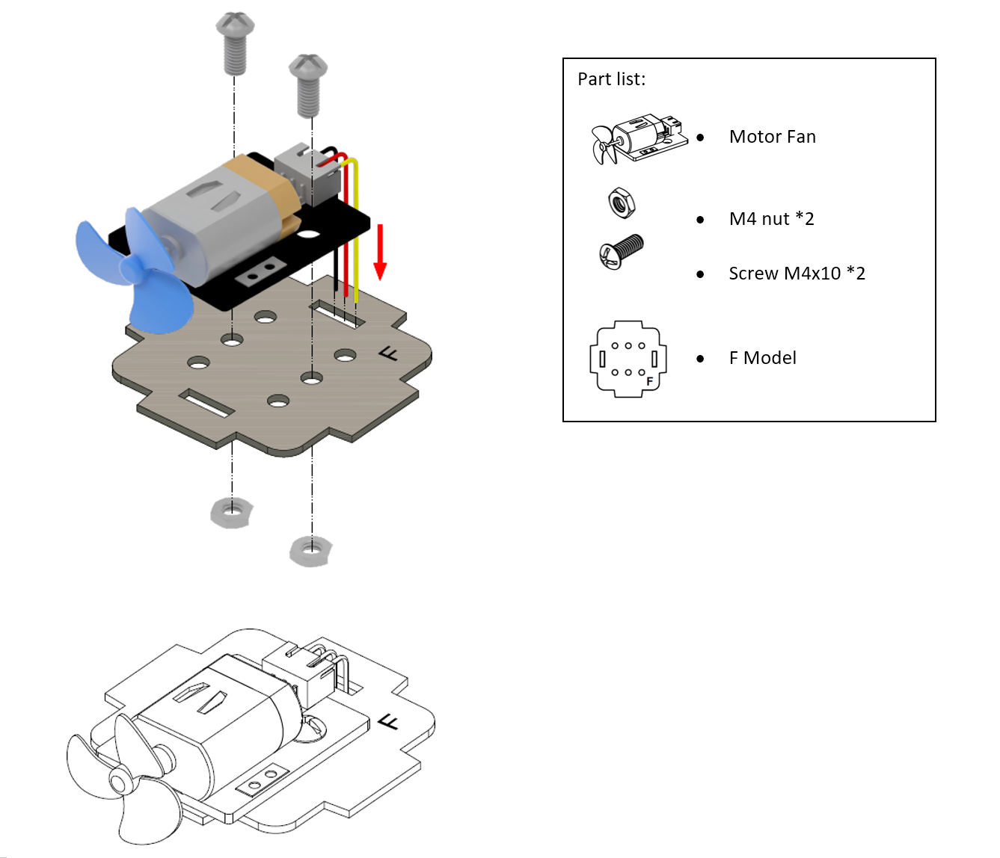

Step 4 

To build a fan stand, put model F into the model B3 and B4.
 

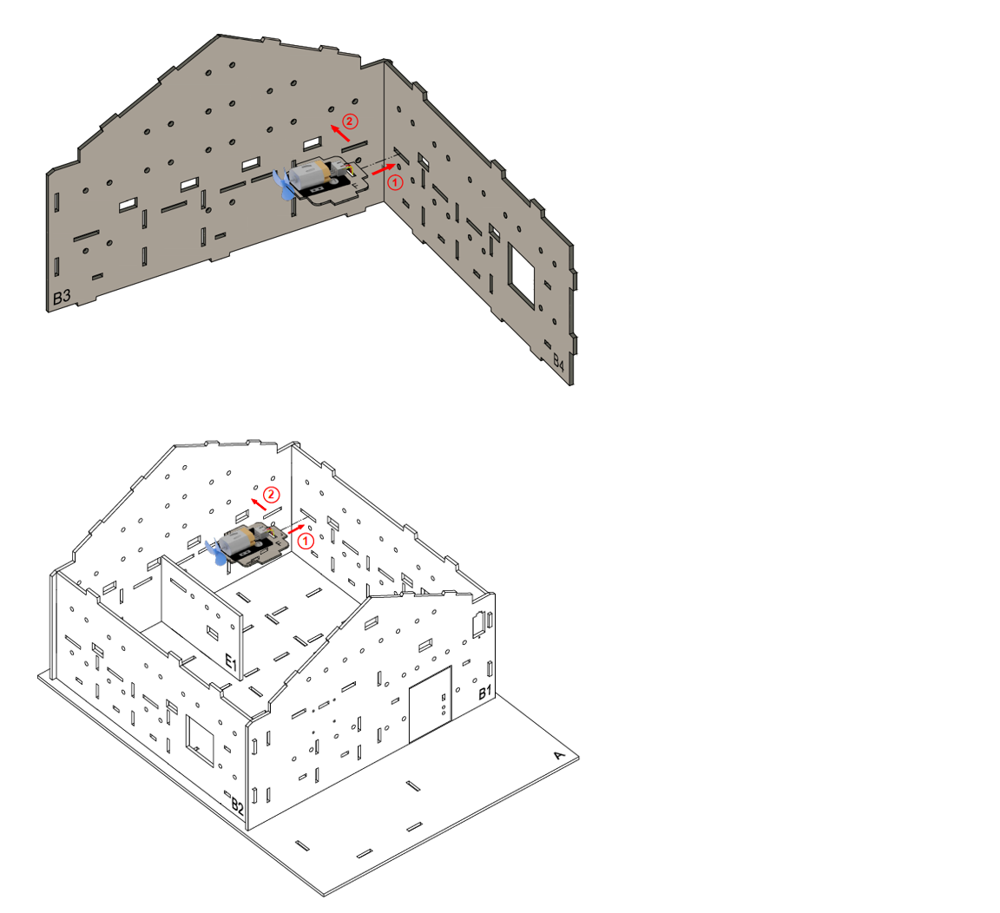

Step 5 

To build a sofa model. Put the model K3 to the two sides of model K1.
 

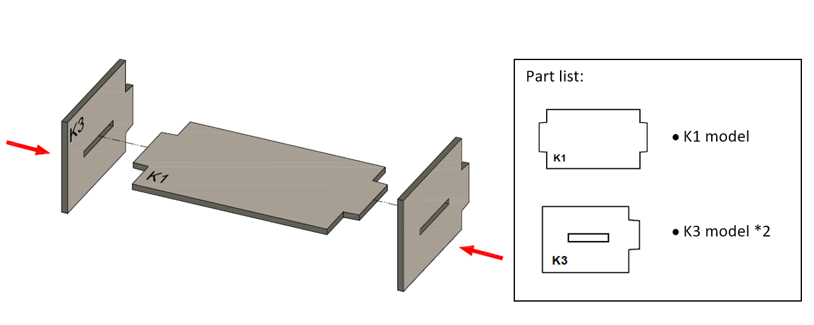

Step 6 

Put model K2 all together to the cardboard parts (K1-K3).
 

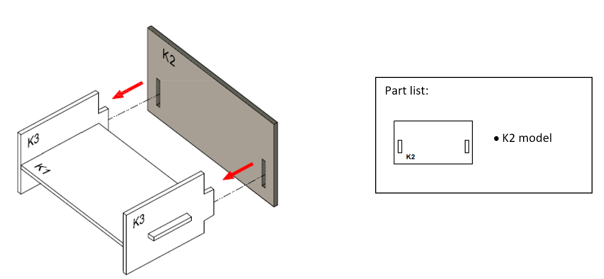

Step 7 

The sofa completed~
 

Step 8 

Place the sofa next to the fan.
 

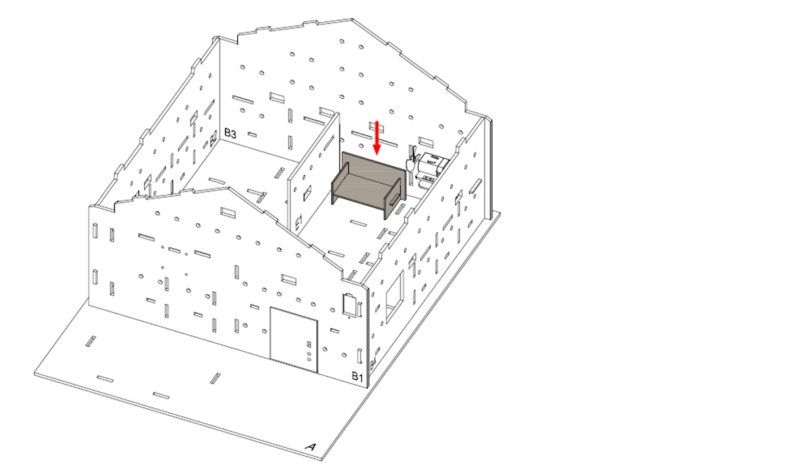

Step 9 

Place the decoration board (Model H) on model B3.
 

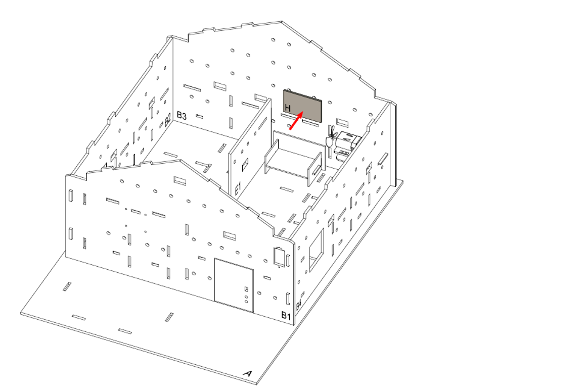

Step 10 

Completed!
 

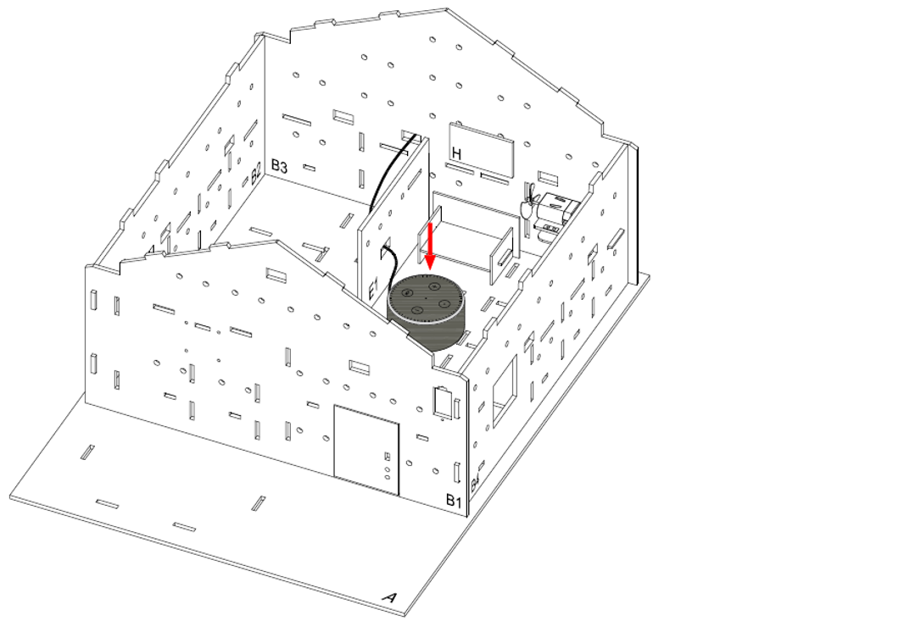

<H3><u>Optional:</u></H3>
Step 1 

Place the Amazon Alexa/Google Nest Mini/Apple Homepod mini at the living room. In this case, we put Amazon Alexa here.
 

Step 2 

Assembly Completed!
 

## Hardware connect

1. Connect the motor module to P1

## Programming (MakeCode)

Step 1. Initialize OLED, IoT:bit and connect to WiFi 

* Snap `Initialize OLED with width:128, height: 64` to `on start`
* Snap `Initialize IoT:bit TX P16 RX P8` from `IoT:bit` to `on start`
* Snap `Set Wi-Fi to ssid pwd` from `IoT:bit`
* Enter your Wi-Fi name and password. Here we set `smarthon` as `SSID` and `12345678` as `password`

Step 2. Show icon “tick” and Device ID after WiFi connection 

* Snap `show icon` from `basic` to `On WiFi connected` and select icon `tick`
* Draw the `Device ID` variable from `On WiFi connected` to the `show string` block placeholder

Step 3. Receive Command 

* Inside the `On WiFi Received`, show the command on OLED display
* Clear the display before each update by `Clear OLED display`
* Show the `WAN_Command` with text explanation by `show string join Command: WAN_Command`

Step 4. Action with command 

* put a nested `if-else` statement with different conditions
* Set the first condition as `WAN_Command = turn_off_fan`
* In the `if` segment, turn off the fan by `set Motor fan with speed 0 at P1`
* In the second `if` condition, use `WAN_Command = turn_on_fan`
* In the second `if` segment, turn on the fan by `set Motor fan with speed 1023 at P1`

Full Solution 

MakeCode: [https://makecode.microbit.org/S40911-39605-55147-37667](https://makecode.microbit.org/S40911-39605-55147-37667) 

You could also download the program from the following website: 
<iframe src="https://makecode.microbit.org/S40911-39605-55147-37667" width="100%" height="500" frameborder="0"></iframe>

## IoT (Alexa, Cloud Control, IFTTT)

### Part 1. Setup Amazon Alexa
1. Get the amazon alexa apps. 

2. Create Amazon Account (if not have amazon account) and login.  

3. Optional:

Setup the alexa device and connect to the amazon account.  

### Part 2. Setup IFTTT

1. Install IFTTT from Google Play Store.  

2. Open and login to IFTTT.  
3. Press create to create the applet. 
4. At the IF, search “alexa “ and choose “Amazon Alexa” and choose “Say a specific phrase.”  

5. It will detect the login account from Amazon Alexa app. Then, type the phrase here. For this example, we type “turn on the fan”. 

6. Click Add and type “smarthon iot” and choose Smarthon IoT as “then” service. 

7. In the service, choose “Control Command” and then fill in the Device ID, the command name that can read from the Micro:bit, and click “continue”, DONE! 

### Result

1. Open the Amazon Alexa App, switch to the alexa account which connected to IFTTT.  
2. Talk to alexa with “Trigger turn on the fan” by pressing the button in the right bottom corner. 

3. In the first time, it will ask you whether to turn on. Press turn on and say the phase. The phase should be trigger the IFTTT and send the command to Iot:bit. 

4. When say “Alexa trigger turn on the fan”, the fan will be turn on; When say “ Alexa trigger turn off the fan”, the fan will be turn off. 

5. Optional:

You can connect the real device Amazon echo dot to the app so that you can do the voice control with a real voice controller. 

## IoT (Google Assistant)

### Part 1. Setup Google Home and Google Assistant App

1. Install Google Home and Google Assistant app. 

2. Login with your google account. 
3. Open the google home app, switch to your google account. 
4. Press the settings button, choose “Works with Google”.  

5. Search and select IFTTT, provide authorize of Google to access the IFTTT service. 

6. After linked, the IFTTT will show on the list. 

### Part 2. Setup IFTTT

1. Install IFTTT from Google Play Store.

2. Open and login to IFTTT.
3. Press create to create the applet.
4. At the IF, search “google assistant “ and choose “Google assistant V2”.

5. In “Activate scene” input the phase for trigger the command. In this case, we input “fan on”.

6. At the THEN, search “iot” and choose “Smarthon IoT (micro:bit)”.

7. Press the “Control Command”, input the device ID of Iot:bit and the command “turn_on_fan”.

8. Then click continue and finish button to save the applet.

### Result

1. Open the <u>Google Home App</u> or <u>Google Assistant App</u>. Make sure the login google account is connected to IFTTT in the previous setup on Google Home App.
2. Say “Hey google, activate (your phase)” or press the button and say “activate (your phase)”.

3. The phase should be trigger the IFTTT and send the command to Iot:bit.

4. The fan will be turned on.

5. (Optional): 

You can connect the real device <u>Google Nest Mini or Google Home</u> to the app so that you can do the voice control with a real voice controller.

## IoT (Apple's Siri)

### Part 1. Setup IFTTT
1. Install “IFTTT” App from Apple store. 

2. Open the APP, login into IFTTT. 
3. Tap “Create” to create an applet.
4. Click If This “Add” button. Select the “iOS Shortcuts” and click “Shortcut automation started”.

5. Click Then That “Add” button, search “Smarthon IoT” and select the “Smarthon IoT (mirco:bit)”.

6. Choose the “Control Command”, and fill in the Device ID, and the command name that can read from the Micro:bit, and click “Continue”, then save the applet.

### Part 2. Setup IOS ShortCut on Iphone
1. Open the Shortcuts app and tap the plus button ( + ) in the top right corner.

2. Tap Add Action > Apps > IFTTT.

3. Select Trigger Applet, Tap the blue arrow ( > ) next to 'Select an Applet', then tap Choose.

4. Select the Applet you'd like this Shortcut to run (please note that only Applets that use the iOS Shortcuts - Shortcut automation started trigger will appear in this list).

5. Name your Shortcut by tapping Trigger Applet at the top of the screen. This will be the custom phrase you will use to trigger your Applet.

6. Save the shortcut.

### Results
1. Click the shortcut or Hold the button on iphone. Say “turn on the fan” or “Siri turn on the fan”.

2. The applet will be triggered.

3. (Optional) 

You can connect the real device <u>Apple Homepod</u> to the <u>Apple Home App</u> so that you can do the voice control with a real voice controller.

## Think

1. Apart from "Say a specific phrase” Alexa IFTTT trigger, any other Alexa trigger can use in case?  
