# Scenario Example 1 : Housing Safety and Security

Level: 
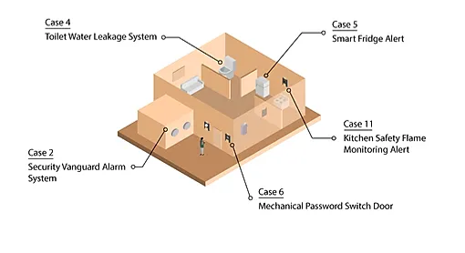

## Introduction:

**Safety and Security** is an important part of the smart home concept. With help from each sensor installed at home, it can reduce the chance of getting property damage, and even save a life.  

This Scenario is the integration of these five functions:

* Security Vanguard Alarm System (Case 2)  
* Toilet Water Leakage Detection System (Case 4)  
* Smart Fridge Alert (Case 5)  
* Mechanical Password Switch Door (Case 6)  
* Kitchen Safety Flame Monitoring Alert (Case 11)

## Part List:

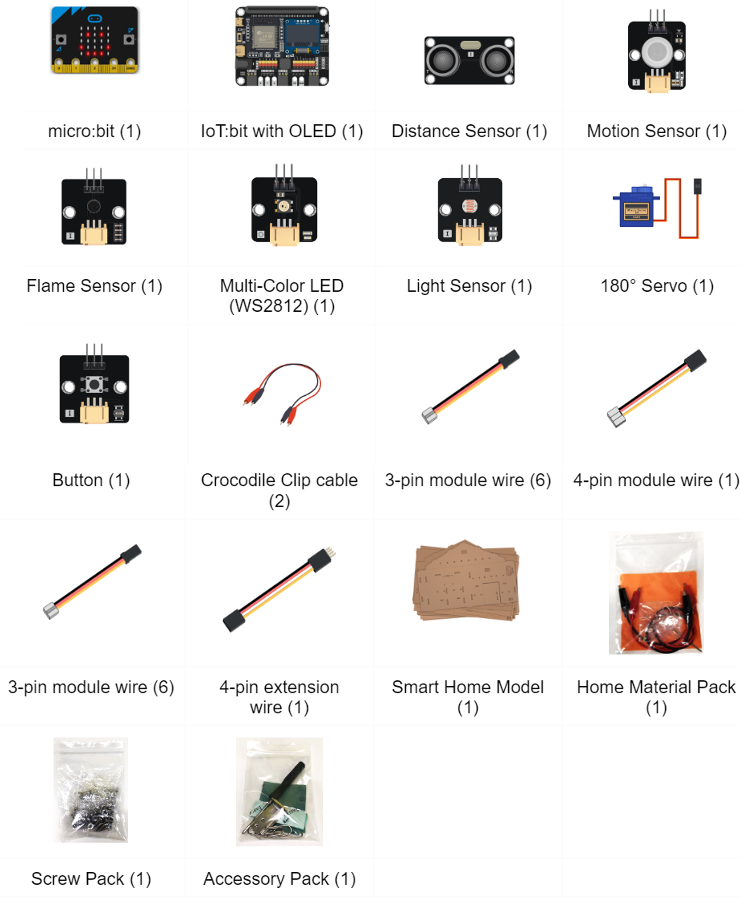

## IOT Technology Applied:

* IFTTT

## Assembly Step:

Refer case 2, 4, 5, 6, 11

## Hardware connect:

* Connect the Motion sensor to P2.  
* Connect Distance Sensor to P14,P15.  
* Pull down the buzzer switch to connect the buzzer. 
* Connect the two crocodile clip cables to P1 and GND.
* Connect the Light sensor to Pin P3.
* Connect the flame sensor to P10.  
* Connect the Multi-Color LED to P7.  

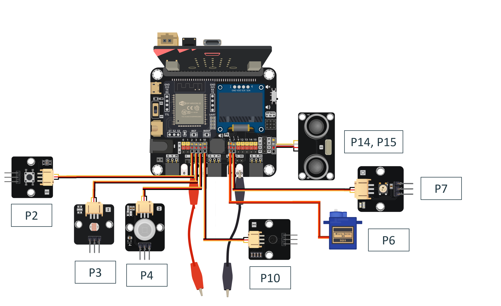

## Programming (MakeCode):

**Scenario 1 Full Solution**

MakeCode:
[https://makecode.microbit.org/S61198-44804-77333-00780](https://makecode.microbit.org/S61198-44804-77333-00780)
 

You could also download the program from the following website: 
<iframe src="https://makecode.microbit.org/#pub:S61198-44804-77333-00780" width="100%" height="500" frameborder="0"></iframe>

## Step By Step Tutorial

### Part 1: Setting up the Security Vanguard Alarm System (Case 2 Revised)

1.1 Hardware Connect

* Connect the Motion sensor to P2.  
* Connect Distance Sensor to P14,P15.  
* Pull down the buzzer switch to connect the buzzer.  
    
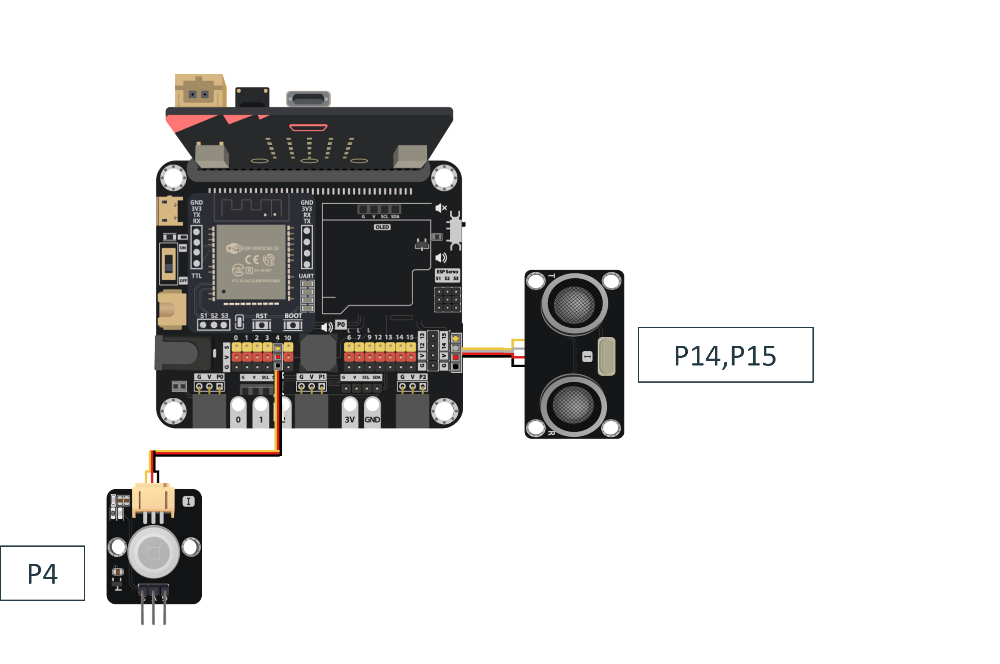

 1.2 Programming (MakeCode)

**Step 1. Disable the LED and initialize OLED** 

* Snap led enable false inside on start.  
* Snap initialize OLED with width 128 and height 64.

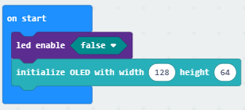

**Step 2\. Set up the function warning**

* Add a new function name warning.  
* Snap play tone Middle C for ½ beat until done.  
* Snap play tone High D for ½ beat until done.  
    
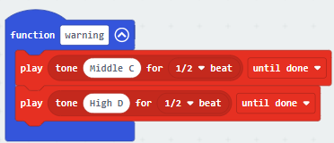

**Step 3\. Setup the function door\_detect**

* Add a new function name door\_detect.  
* Snap if loop into the function.  
* Snap if Get distance unit cm trig P14 echo P15 \<10 or Get motion (triggered or not) at Pin P4 \= true into the if loop.  
* Then, snap show string “Theft: Yes” inside the if loop.  
* Snap call function warning inside the if loop.
* Connect the button module to P2.  
* Connect the 180 degree servo to P6. 

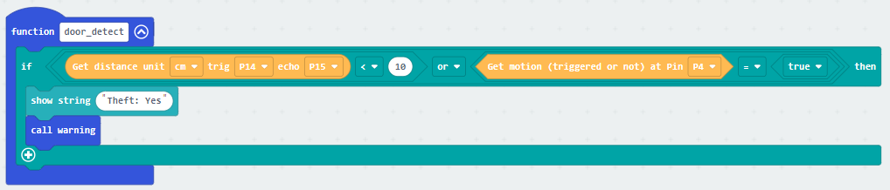

**Step 4\. Call door\_detect function**

* In block forever, snap clear OLED display.  
* Snap call door\_detect.  
* Snap pause for 1 second.  
     
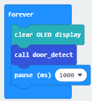

Part 1 Solution:

MakeCode: [https://makecode.microbit.org/S66473-37165-59133-38155](https://makecode.microbit.org/S66473-37165-59133-38155) 

You could also download the program from the following website: 
<iframe src="https://makecode.microbit.org/#pub:S66473-37165-59133-38155" width="100%" height="500" frameborder="0"></iframe>

Part 1 Result

When someone gets close to the door, either the distance sensor or motion sensor will detect it and warn alert to house owner.  
    

### Part 2: Setting up the Toilet Water Leakage Detection System (Case 4 revised)

2.1 Hardware Connect

* Connect the two crocodile clip cables to P1 and GND.  
    
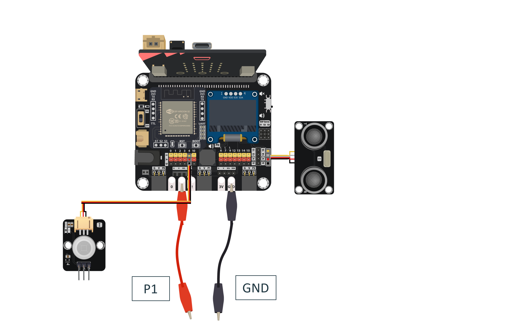

2.2 Programming (MakeCode)

**Step 1\. Setup function flooding**

* Add a new function name flooding.  
* Snap show string join flood: pin P1 is pressed.  
* Snap pin P1 is pressed \= true as condition.  
* If in if segment, that's means the water was connected two clips.  
* Call warning function.

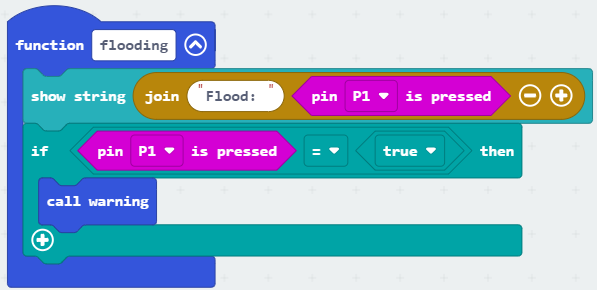

**Step 2\. Call function flooding**

* In forever, snap call function flooding.  
    
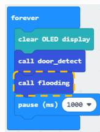

Part 2 Full Solution:

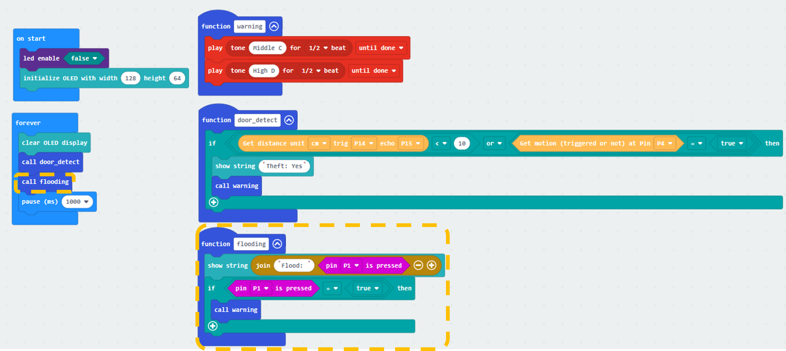

MakeCode: [https://makecode.microbit.org/S17909-52571-32388-28882](https://makecode.microbit.org/S17909-52571-32388-28882) 

You could also download the program from the following website: 
<iframe src="https://makecode.microbit.org/#pub:S17909-52571-32388-28882" width="100%" height="500" frameborder="0"></iframe>

Part 2 Result

When the water level rises to the crocodile clip’s position, the warning sound is triggered to warn the user.

### Part 3: Setting up the Smart Fridge Alert (Case 5 revised)

3.1 Hardware Connect

* Connect the Light sensor to Pin P3.

3.2 Programming (MakeCode)

**Step 1\. Initialize counter variable**

* Create a “fridge” variable and set to 0\.  
    
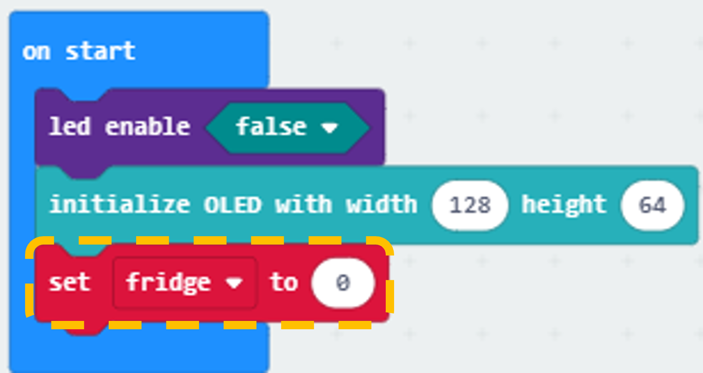

**Step 2\. Setup function fridge\_detect**

* Add a new function name fridge\_detect.  
* Snap show string join fridge light: Get light value (percentage) at Pin P3.  
* Snap if Get light value (percentage) at Pin P3 \>= 30\.  
* Add the counter with 1 by change counter by 1 to sum up the time of door opened.  
* Snap show string join Count: fridge.  
* Put the second if statement with counter \>= 60 condition to examine when should issue warning sound, snap show string fridge: open and call warning into the loop.  
* Back to the first if-else level, in the else segment, that's means light intensity is weak, door was closed, so reset the counter to 0 by set counter to 0\.  
    
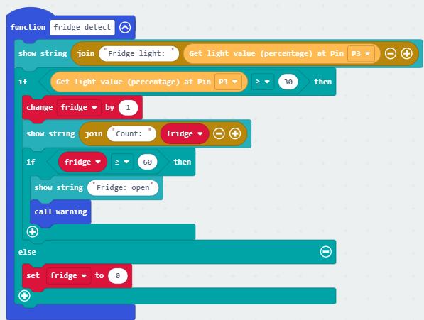

**Step 3\. Call fridge\_detect function**

* In block forever. Snap call fridge\_detect.  
     
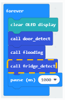

Part 3 Full Solution:

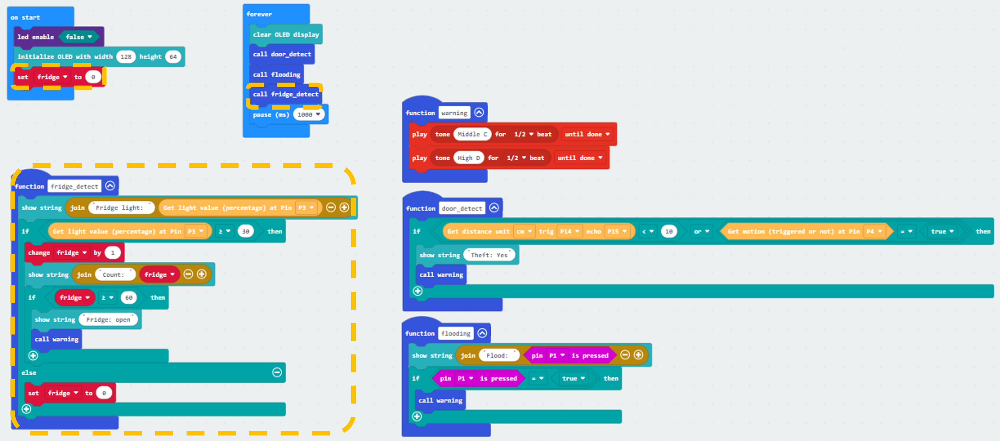

MakeCode: [https://makecode.microbit.org/S75244-62730-44298-33665](https://makecode.microbit.org/S75244-62730-44298-33665) 

You could also download the program from the following website: 
<iframe src="https://makecode.microbit.org/#pub:S75244-62730-44298-33665" width="100%" height="500" frameborder="0"></iframe>

Part 3 Result

When the door is opened for more than 1 minute, the buzzer will play some sound to warn the user.

### Part 4: Setting up the Mechanical Password Switch Door (Case 6 revised)

4.1 Hardware Connect

* Connect the button module to P2.  
* Connect the 180 degree servo to P6.  
    

4.2 Programming (MakeCode)

**Step 1\. Create variables**

* In on start, create a variable called btnA, btnB, unlock.  
* Set btnA ,btnB to 0 and set unlock to false.  
    
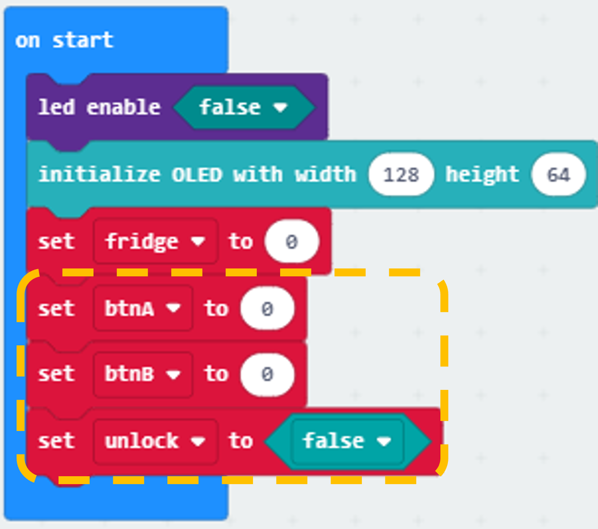

**Step 2\. Monitoring the button pressing state and take action**

* Snap the When Button at P2 pressed block to editor.  
* Put a if statement in the When Button at P2 pressed block.  
* Set the condition to unlock \= true.  
* When unlock \= true, that's means it is unlock successfully, the servo should open the door by Turn 180 servo to 180 degree at P6, after that, wait for 5 second by pause (ms) 5000, then close and lock the door again by Turn 180 servo to 70 degree at P6 and set variable unlock to false.  
    
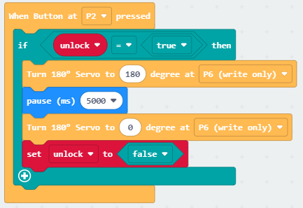

**Step 3\. Set the password input method**

* Snap on button A pressed to editor.  
* Use change btnA by 1 to increase the count variable by 1\.  
* Repeat the step with minor differences on target to let button B also can increase btnB.  
     
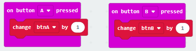

**Step 4\. password input method**

* Snap on button A+B pressed to editor.  
* Put an if-else statement inside.  
* Use btnA \= 2 and btnB \= 3 as conditions, you may also change it to your favourite password.  
* In the if segment, that means the input is correct, set unlock to true to allow open the door when press the extended button.  
* In the else segment, that means the input is not correct, set unlock to false to deny open the door when press the extended button.  
* Reset the two count variable btnA and btnB to 0 for next input.  
     
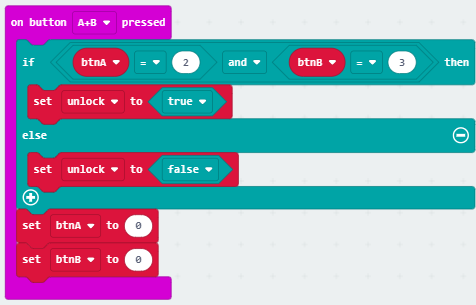

Part 4 Full Solution:

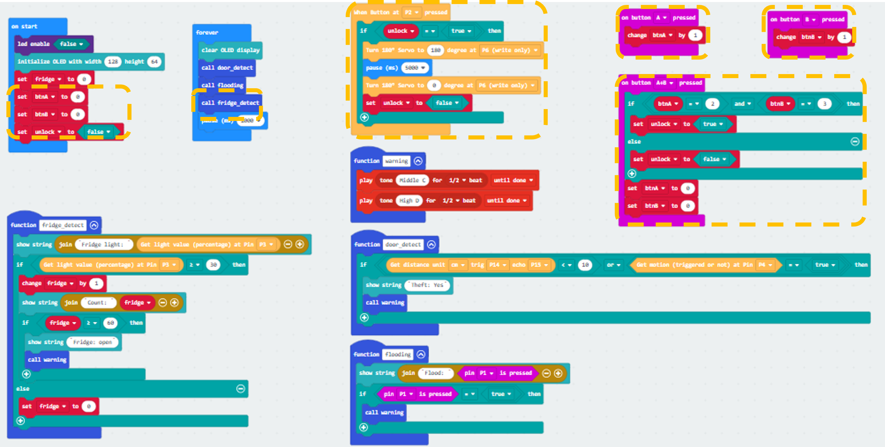

MakeCode: [https://makecode.microbit.org/S73904-64474-11158-74864](https://makecode.microbit.org/S73904-64474-11158-74864) 

You could also download the program from the following website: 
<iframe src="https://makecode.microbit.org/#pub:S73904-64474-11158-74864"width="100%" height="500" frameborder="0"></iframe>

Part 4 Result

After pressing the correct number of button A and B, press A+B to do the validation.  
If it is the correct password, press the extended button, the door will open. After 5 seconds, the door will close and lock again. If wrong, do not open the door.

### Part 5: Setting up the Kitchen Safety Flame Monitoring Alert (Case 11 Revised)

5.1 Hardware Connect

* Connect the flame sensor to P10.  
* Connect the Multi-Color LED to P7.  
    
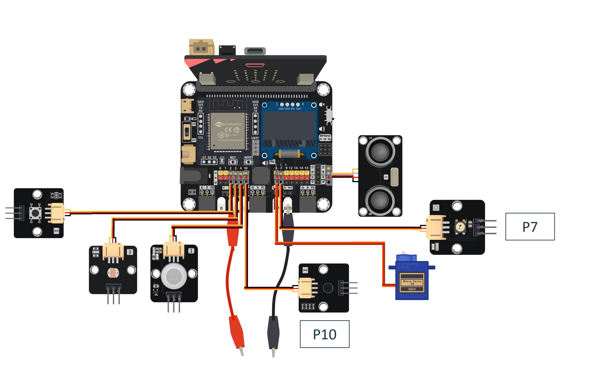

5.2 IOT Setup (IFTTT)

* Go to https://ifttt.com/ , create applet (if webhooks then Notification)

* Go to “My services” \> “Webhooks”, select “Documentation” . Copy your Webhooks Key as follows:
     

**Optional: Use email as notification method**

* In the THEN field, search for the “email” and use it to replace the “notifications” in the previous step. 
     

5.3 Programming (MakeCode)

**Step 1\. Connect to WiFi, create variable.**

* Snap Initialize IoT:bit TX P16 RX P8 from IoT:bit to on start.  
* Snap Set Wi-Fi to ssid pwd from IoT:bit.  
* Enter your Wi-Fi name and password.  
* Snap Set strip to NeoPixel at pin P7 with 1 leds as RGB(GRB format)  
    
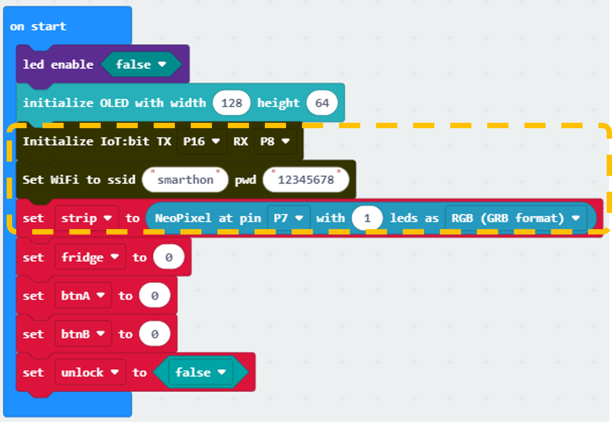

**Step 2\. Show device\_ID after WiFi connection**

* Snap show device\_ID from basic to On WiFi connected.  
    
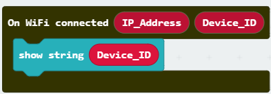

**Step 3\. Setup the function Flame\_detect**

* Add a new function name Flame\_detect.  
* Inside the function, put an if statement with condition Get flame detection at Pin P10 \= true to recognize the flame.  
* Inside the if loop, put an if statement with condition WiFi connected? to check the connection status.  
* Inside the if statement, Put a Send IFTTT key\* XXXXXXXXX event\_name\* XXXXX .... to send the event to IFTTT. Fill in the IFTTT key from your Webhooks and the Applet's event\_name (fire).  
* Outside the if wifi connected loop, snap show string Fire:detected,  
* Also, snap call warning into the first if loop .  
    
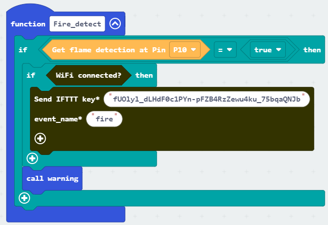

**Step 4\. Update the warning function**

* In the function warning, snap strip show color red and strip show color black into the function.  
     

**Step 5\. Check the Upload result**

* To check the upload state, use the On IFTTT Uploaded to get the sending result.  
* Inside the On IFTTT Uploaded, use OLED display to show the information.  
* Clear the OLED display before each update by clear OLED display.  
* Show upload state by show string join IFTTT: Status, the Status value is from the function's placeholder.  
    
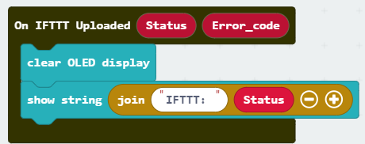

**Step 6\. Call Fire\_detect**

* In forever, call Fire\_detect.  
    
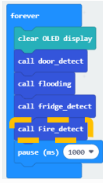

Part 5 Full Solution:

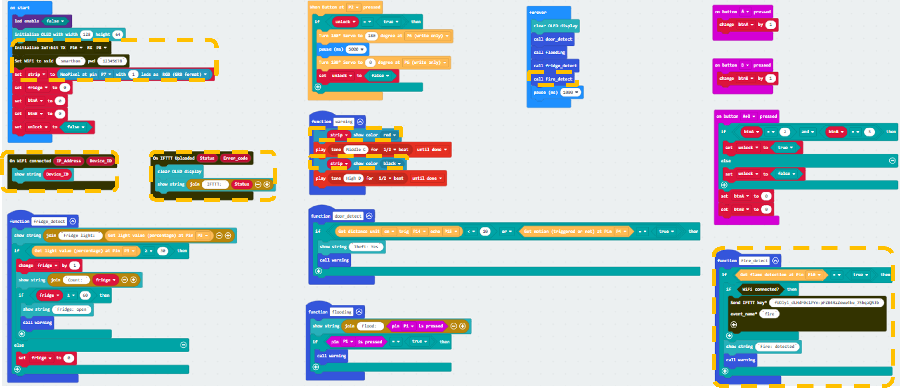

MakeCode: [https://makecode.microbit.org/S61198-44804-77333-00780](https://makecode.microbit.org/S61198-44804-77333-00780) 

You could also download the program from the following website: 
<iframe src="https://makecode.microbit.org/#pub:S61198-44804-77333-00780"width="100%" height="500" frameborder="0"></iframe>

Part 5 Result:

When the flame source is detected by the flame sensor, it will trigger to blink the LED, making alert sound, and send the warning notification to IFTTT.

