# Scenario Example 2 : Environmental Health Living

Level : 

## Introduction:

Sustainability is a common topic of smart home, **Environmental Health Living** is to keep Personal Wellness and reduce the waste of energy at the same time.  

This Scenario is the integration of these five functions:

* Smart Saving Light Bulb (Case 1\)  
* Environmental Motor Fan (Case 3\)  
* Automatic Sunlight Detecting Curtain (Case 8\)  
* Smart Digital Morning Clock (Case 9\)  
* Home Health Data Monitoring (Case 10\)

## Part List:

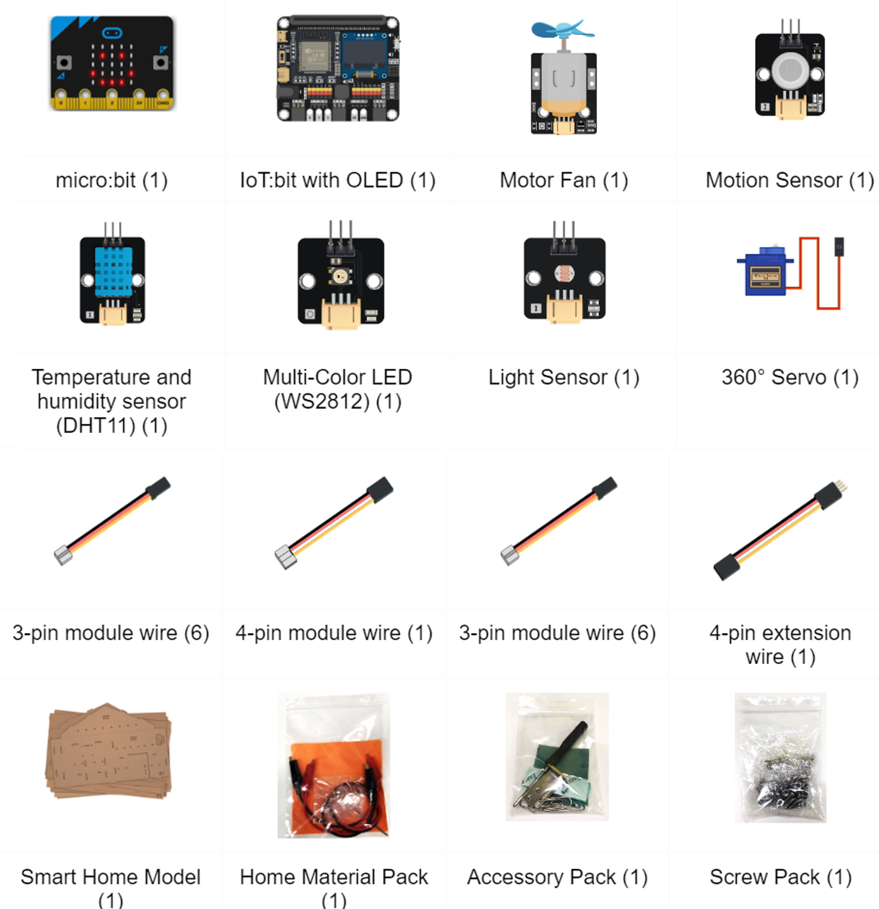

## IOT Technology Applied:

* ThingSpeak

## Assembly Step:

Refer case 1, 3, 8, 9, 10

## Hardware connect:

* Connect the motion sensor to P0.  
* Connect the Multi-color LED(WS2812) to P1.
* Connect the Temperature and Humidity sensor (DHT11) to P2.  
* Connect the Motor fan module to P7. 
* Connect the Light sensor to Pin P4.  
* Connect the 360ᵒ servo to Pin P10.
* Connect OLED to I2C port.  

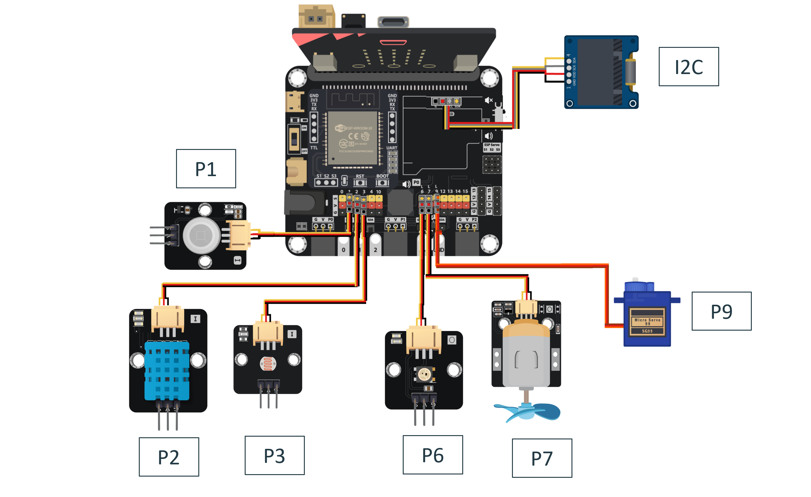

## Programming (MakeCode):

**Scenario 2 Full Solution**

MakeCode:[https://makecode.microbit.org/S26898-49182-74550-73390](https://makecode.microbit.org/S26898-49182-74550-73390)
 

You could also download the program from the following website: 
<iframe src="https://makecode.microbit.org/#pub:S26898-49182-74550-73390" width="100%" height="500" frameborder="0"></iframe>

## Step By Step Tutorial

### Part 1: Setting up the Smart Saving Light Bulb (Case 1 revised)

1.1 Hardware Connect

* Connect the motion sensor to P0.  
* Connect the Multi-color LED(WS2812) to P1.

 1.2 Programming (MakeCode)

**Step 1\. Disable the LED and initialize Multi-Color LED and OLED**

* Snap led enable false inside on start.  
* Pull the set strip to NeoPixel at pin P1 with 1 leds as RGB(GRB format) to on start.

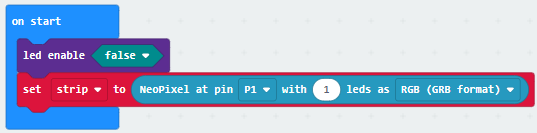

**Step 2\. Set up motion detect function**

* In forever, snap if Get motion (triggered or not) at Pin P0 \= true.  
* Snap strip show color white into the if segment.  
* Snap pause 10000ms.  
* In the else segment, snap strip show color black.  
    
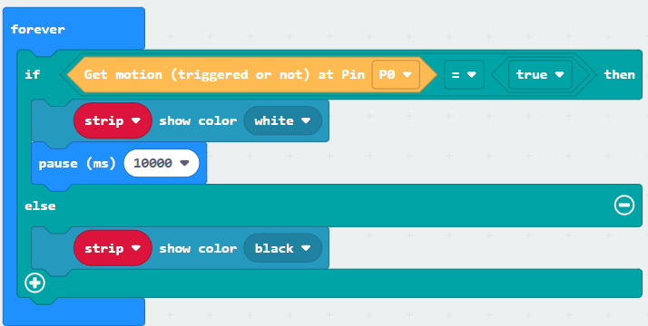

Part 1 Solution:

MakeCode: [https://makecode.microbit.org/S48839-44892-62163-65085](https://makecode.microbit.org/S48839-44892-62163-65085) 

You could also download the program from the following website: 
<iframe src="https://makecode.microbit.org/#pub:S48839-44892-62163-65085"width="100%" height="500" frameborder="0"></iframe>

Part 1 Result

When the people are moving in the room, the motion sensor will trigger and keep the LED turned on. When there is no one moving, the LED will turn off.  
    

### Part 2: Setting up the Environmental Motor Fan (Case 3 revised)

2.1 Hardware Connect

* Connect the Temperature and Humidity sensor (DHT11) to P2.  
* Connect the Motor fan module to P7.  
    
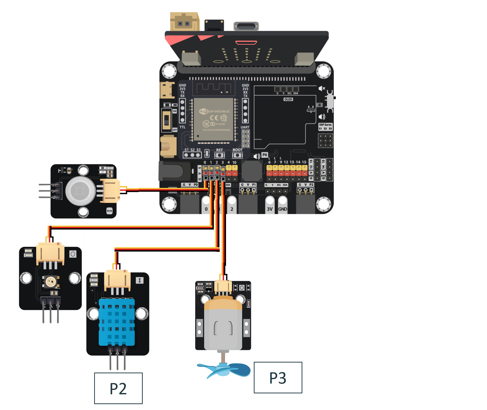

2.2 Programming (MakeCode)

**Step 1\. Set up the function motor\_control**

* Add a new function name motor\_control.  
* Inside the function, put an if-else statement.  
* Create a new variable temperature, then use the temperature \< 22 as the condition,  
* In the if segment, turn off the fan by Set Motor fan with speed 0 at P3.  
* In the else if statement, use the temperature \< 26 as the condition.  
* Inside the statement, snap Set Motor fan with speed 500 at P3.  
* In the then segment, turn on the fan with full speed by Set Motor fan with speed 1023 at P3.

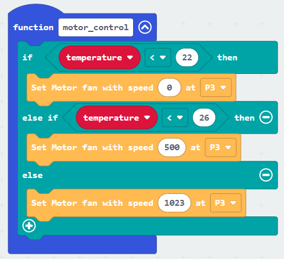

**Step 2\. Read temperature and call motor\_control function.**

* In block forever, snap Read Temperature & Humidity Sensor at pin P2.  
* Snap temperature to Get Temperature °C.  
* Snap call motor\_control.  
* Snap pause 1000 ms.  
    
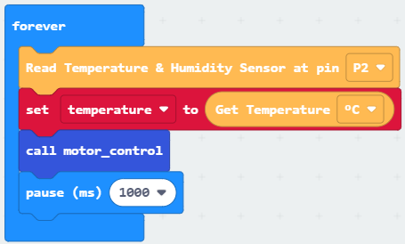

Part 2 Full Solution:

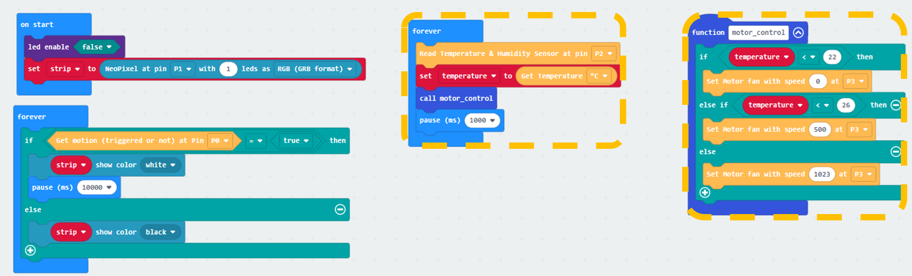

MakeCode: [https://makecode.microbit.org/S23759-68071-22991-34335](https://makecode.microbit.org/S23759-68071-22991-34335) 

You could also download the program from the following website: 
<iframe src=https://makecode.microbit.org/#pub:S23759-68071-22991-34335" width="100%" height="500" frameborder="0"></iframe>

Part 2 Result

When the room temperature changing, it will match either one of the condition, and the fans will turn on or off with different speed according to the room temperature.

### Part 3: Setting up the Automatic Sunlight Detecting Curtain (Case 8 revised)

3.1 Hardware Connect

* Connect the Light sensor to Pin P4.  
* Connect the 360ᵒ servo to Pin P10.

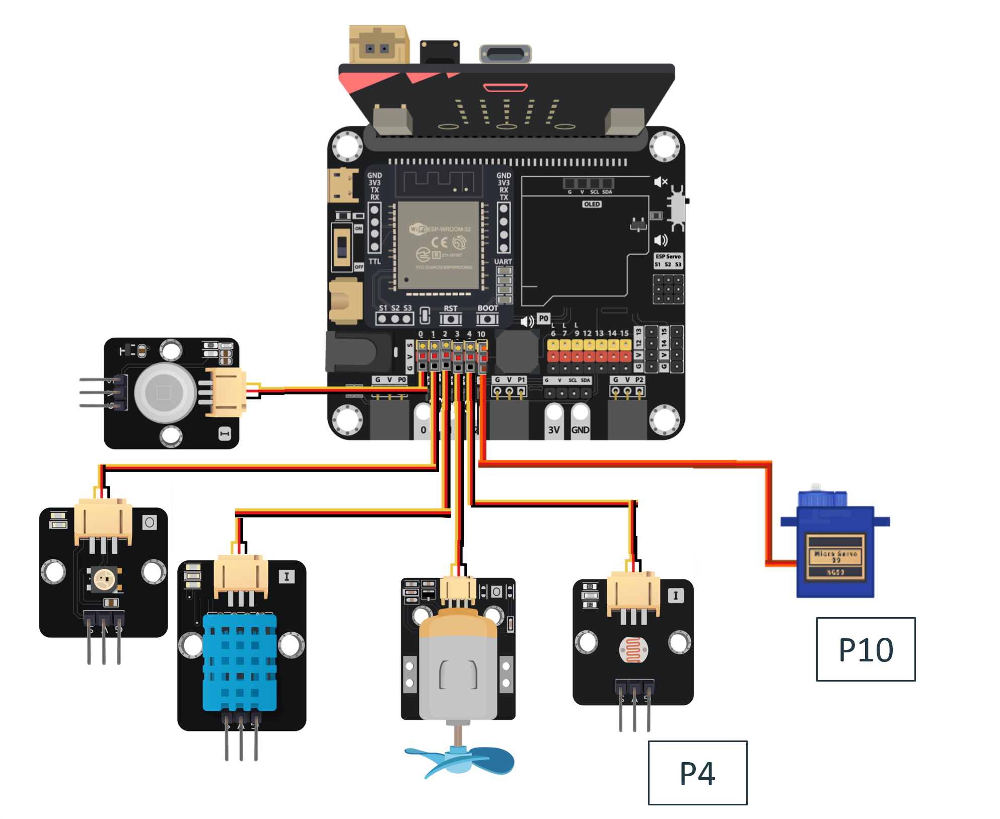

3.2 Programming (MakeCode)

**Step 1\. Set up function OpenCurtain**

* Add a new function name OpenCurtain.  
* Snap Turn 360ᵒ Servo with clockwise direction speed Level 3 at P10.  
* Snap pause 5000 ms.  
* Snap Turn 360ᵒ Servo with clockwise direction speed Stop at P10.  
* Create a new variable curtain and snap set curtain to true.  
    
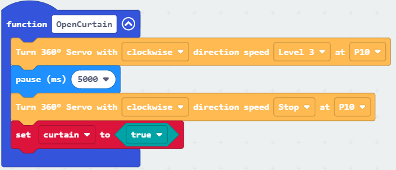

**Step 2\. Set up function CloseCurtain**

* Add a new function name CloseCurtain.  
* Snap Turn 360ᵒ Servo with anti-clockwise direction speed Level 3 at P10.  
* Snap pause 5000 ms.  
* Snap Turn 360ᵒ Servo with anti-clockwise direction speed Stop at P10.  
* Create a new variable curtain and snap set curtain to false.  
    
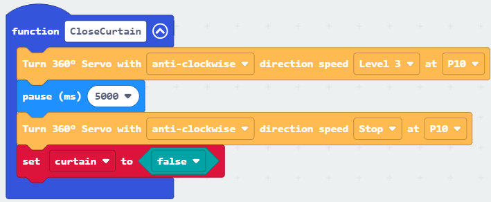

**Step 2\. Set conditions to call OpenCurtain and CloseCurtain**

* In forever , create a new variable light2 and snap set light2 to Get light value (percentage) at Pin P0.  
* Snap an if-else if loop, set light2\>= 70 and curtain \= true as the condition in the if part.  
* Snap call CloseCurtain.  
* In the else if loop, set light2\< 40 and curtain \= false as the condition.  
    
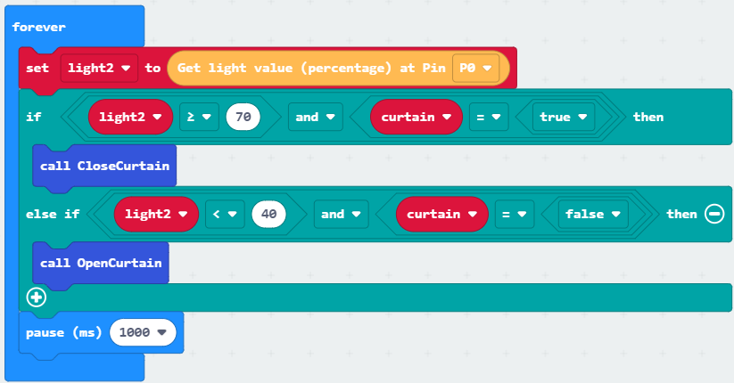

Part 3 Full Solution:

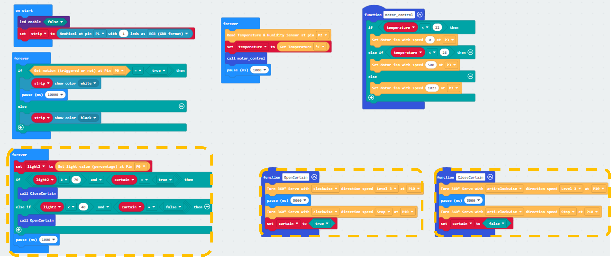

MakeCode: [https://makecode.microbit.org/S14254-22236-39270-09298](https://makecode.microbit.org/S14254-22236-39270-09298) 

You could also download the program from the following website: 
<iframe src="https://makecode.microbit.org/#pub:S14254-22236-39270-09298" width="100%" height="500" frameborder="0"></iframe>

Part 3 Result

When the light sensor detects the light value outside the house is strong, the servo will rotate to scroll down the curtain. When the light is not strong, the servo will rotate in anti direction to scroll up the curtain.

### Part 4: Setting up the Smart Digital Morning Clock (Case 9 revised)

4.1 Hardware Connect

* Connect OLED to I2C port.  
    
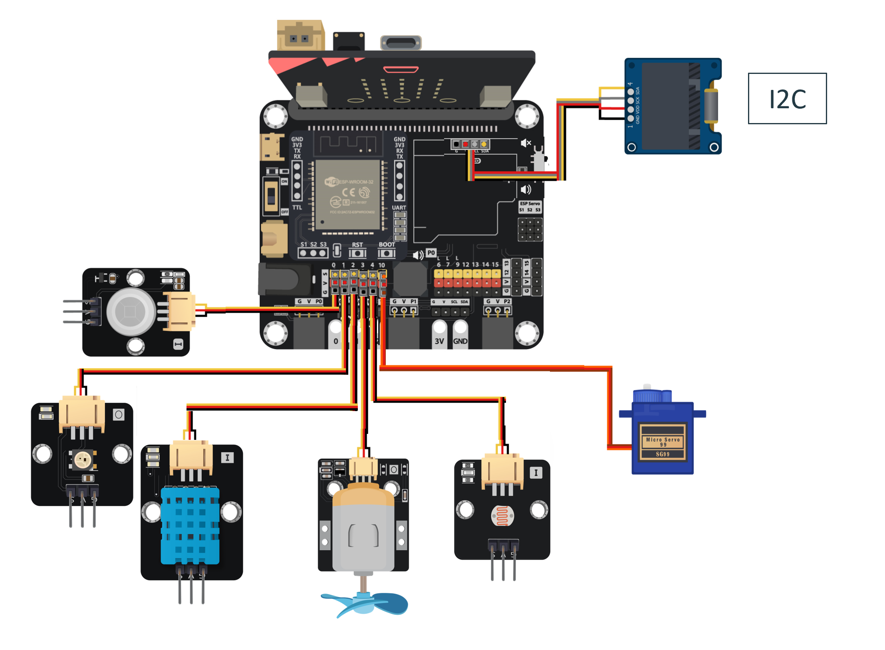

4.2 Programming (MakeCode)

**Step 1\. Initialize OLED and wifi**

* Snap Initialize OLED with width 128, height 64 to on start.  
* Snap Initialize IoT:bit TX P16 RX P8 to on start.  
* Snap Set Wi-Fi to ssid pwd to on start and enter the SSID and password.  
    
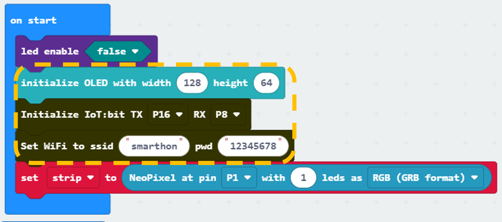

**Step 2\. Check Wi-Fi connection state**

* Snap the On WiFi connected block to editor.  
* Put a show string Device\_ID inside the block.  
    

**Step 3\. Get the NTP time**

* Put a if-else statement in Forever.  
* Use WiFi connected? as a condition.  
* In the if segment, put Get NTP Current Time at city HongKong(UTC+8) to get NTP time.  
* In the else segment, put show string “No internet time”.  
* Snap pause 1000 ms outside the loop.  
     
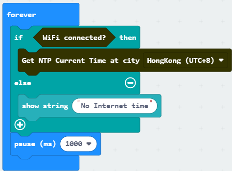

**Step 4\. Show the NTP time on display**

* Put On NTP received to editor.  
* When get the NTP time, the program in this block will running.  
* Snap clear OLED display.  
* Show the formatted date string with show string join Date: Year:Month:Day.  
* Show the formatted time string with show string join Time: Hour:Minute:Second.  
* Snap insert newline.  
* Snap show string join Light: light2.  
     
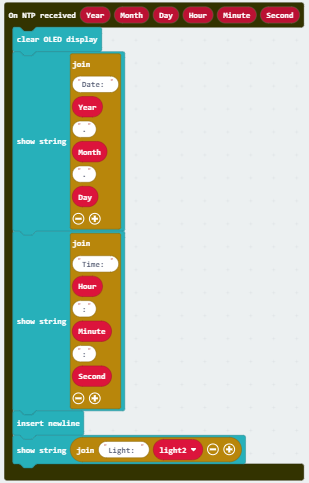

Part 4 Full Solution:

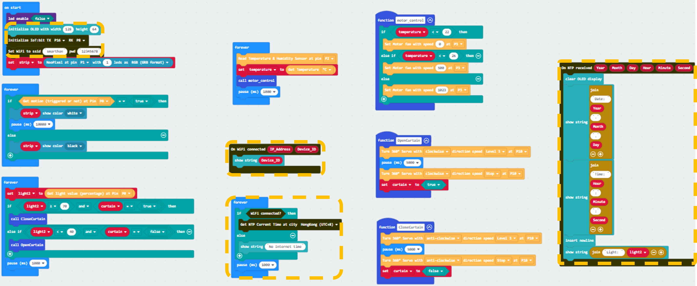

MakeCode: [https://makecode.microbit.org/S67733-51307-65245-52347](https://makecode.microbit.org/S67733-51307-65245-52347) 

You could also download the program from the following website: 
<iframe src="https://makecode.microbit.org/#pub:S67733-51307-65245-52347" width="100%" height="500" frameborder="0"></iframe>

Part 4 Result

After you connected to the Internet, the micro bit will open an start getting NTP time.

### Part 5: Setting up the Home Health Data Monitoring (Case 10 revised)

5.1 IOT Setup (IFTTT)

* Go the https://thingspeak.com/ create an account and create a channel.
   

* After created a new channel, get the write in API. 
     

5.2 Programming (MakeCode)

**Step 1\. Create variable.**

* Create a new variable “thingspeak\_counter” and snap set thingspeak\_counter to 0 to on start.  
    
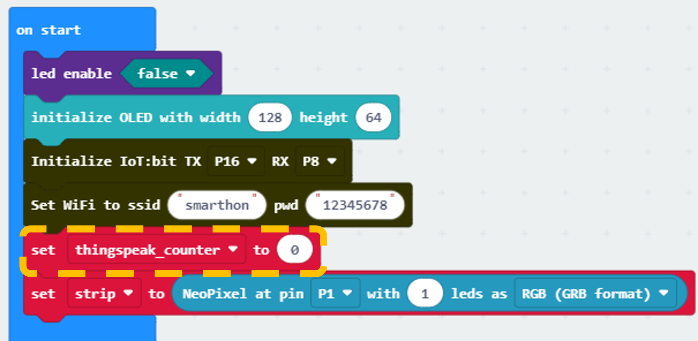

**Step 2\. Set up the function upload\_thingspeak**

* Add a new function name upload\_thingspeak.  
* Snap change thingspeak\_counter by 1\.  
* Snap an if thingspeak\_counter \>= 15 loop.  
* Snap an if WiFi connected? Loop.  
* Create new variables name humidity and iaq\_score.  
* Send the data to Thingspeak by Send Thingspeak key XXXX ,field1 value Get Temperature °C, field2 value Get Humidity, field3 value Get IAQ score ..., fill in the write API key from the Thingspeak channel and the values need to be upload.   
    
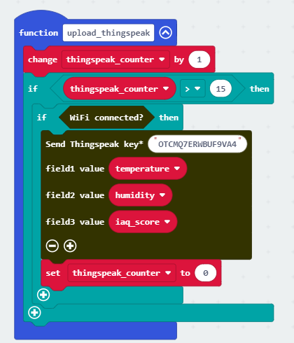

**Step 3\. Set up when ThingSpeak received condition**

* Inside the On ThingSpeak Uploaded block, snap clear OLED display.  
* Snap show string  join IFTTT: Status.  
* Snap show string join Error: Error\_code.  
    
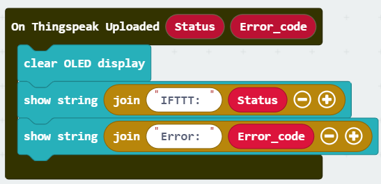

**Step 4\. Set up the function check\_condition**

* Add a new function name check condition.  
* Snap a five conditions if loop blocks into the function, set the condition in if iaq\_score \< 20/40/60/80/100, then snap show string Very uncomfortable/ Uncomfortable / Discomfortable/ Comfortable/ Very comfortable.  
    
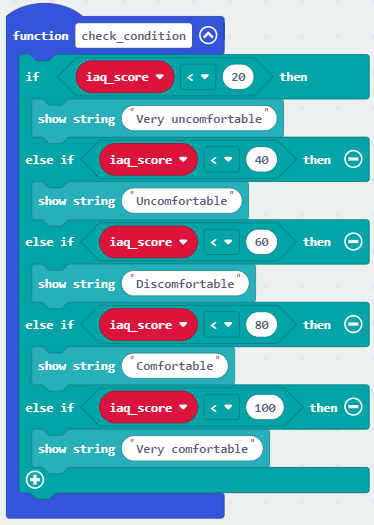

**Step 5\. Update NTP status**

* Inside On NTP received, snap call check\_condition.  
* Snap show string join Temperature: temperature.  
* Snap show string join Humidity: humidity.  
* Snap show string join IAQ: iaq\_score.  
    
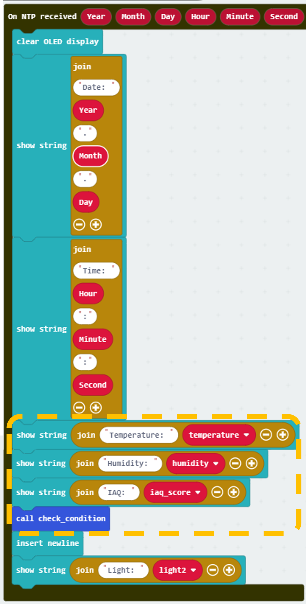

**Step 6\. Call upload\_thingspeak**

* In forever, snap set humidity to Get Humidity.  
* Snap iaq\_score to Get IAQ Score.  
* Snap call upload\_thingspeak.  
    
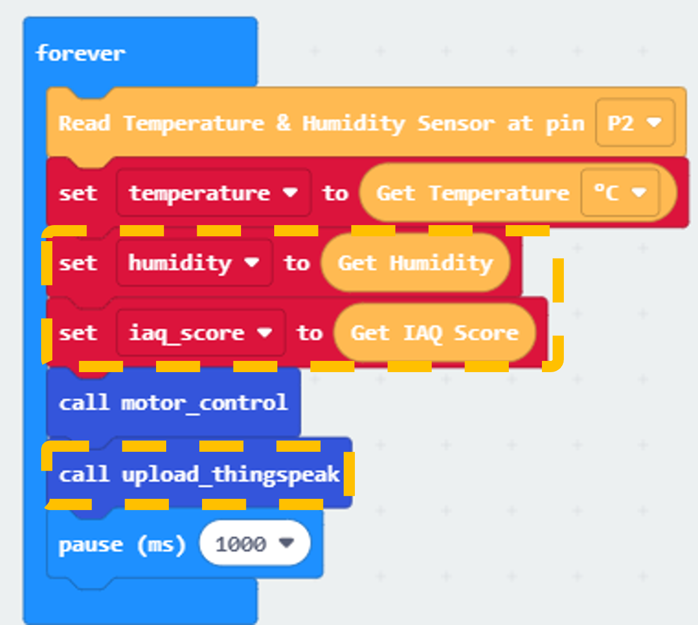

Part 5 Full Solution:

MakeCode: [https://makecode.microbit.org/S26898-49182-74550-73390](https://makecode.microbit.org/S26898-49182-74550-73390) 

You could also download the program from the following website: 
<iframe src="https://makecode.microbit.org/#pub:S26898-49182-74550-73390"width="100%" height="500" frameborder="0"></iframe>

Part 5 Result:

The OLED show the temperature, humidity, IAQ Score and the environment condition based on IAQ Score. After upload, show the uploading information.

