# Scenario Example 3 : Relaxing Home Automation

Level : 
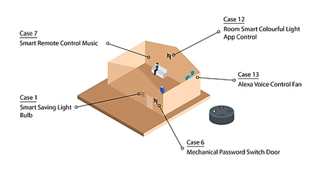

## Introduction:

**Relaxing Home Automation** can bring convenience to the user, it reduces the redundant task in our daily life.  

This Scenario is the integration of these five functions:

* Smart Saving Light Bulb (Case 1\)  
* Mechanical Password Switch Door (Case 6\)  
* Smart Remote Control Musical Light (Case 7\)  
* Room Smart Colourful Light App Control (Case 12\)  
* Smart Fan Voice Control (Case 13\)

## Part List:

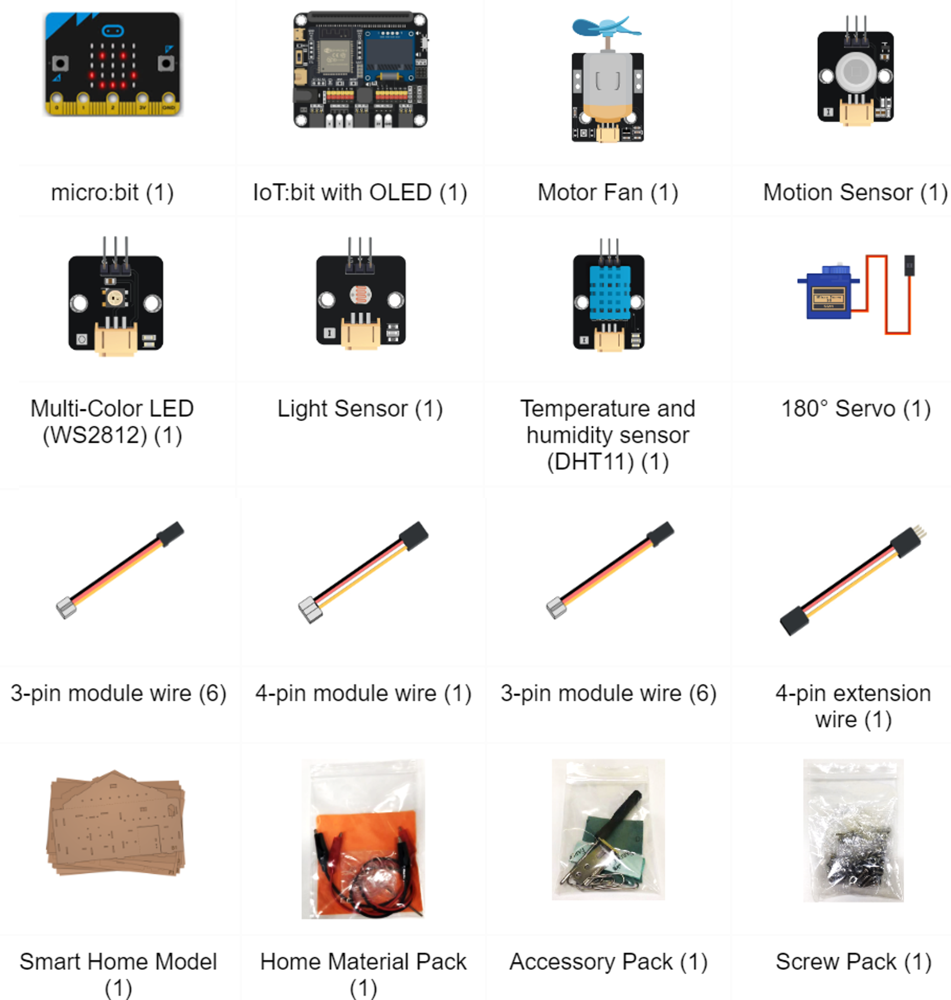

## IOT Technology Applied:

* App Inventor  
* Alexa  
* IFTTT  
* Google Assistant  
* Siri

## Assembly Step:

Refer case 1, 6, 7, 12, 13

## Hardware connect:

* Connect the motion sensor to P1.  
* Connect the Multi-color LED(WS2812) to P6.
* Connect the button module to P2.  
* Connect the 180 degree servo to P7.  
* Connect the OLED module to I2C.  
* Connect the motor fan to P9. 

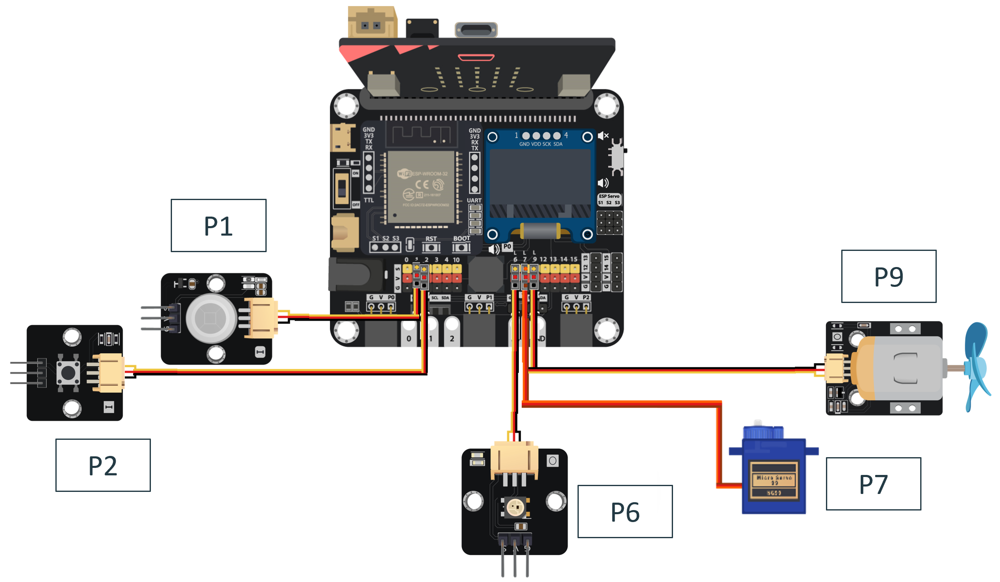

## Programming (MakeCode):

**Scenario 3 Full Solution:**

Radio Receiver [https://makecode.microbit.org/S35754-29871-95851-03618](https://makecode.microbit.org/S35754-29871-95851-03618)  
Radio Sender: [https://makecode.microbit.org/S36162-88364-04373-85647](https://makecode.microbit.org/S36162-88364-04373-85647)  

You could also download the program from the following website: 
<iframe src="https://makecode.microbit.org/#pub:S35754-29871-95851-03618"  width="100%" height="500" frameborder="0"></iframe>
 

<iframe src="https://makecode.microbit.org/#pub:S36162-88364-04373-85647"  width="100%" height="500" frameborder="0"></iframe>

## Step By Step Tutorial

### Part 1: Setting up the Smart Saving Light Bulb (Case 1 revised)

1.1 Hardware Connect

* Connect the motion sensor to P1.  
* Connect the Multi-color LED(WS2812) to P6.

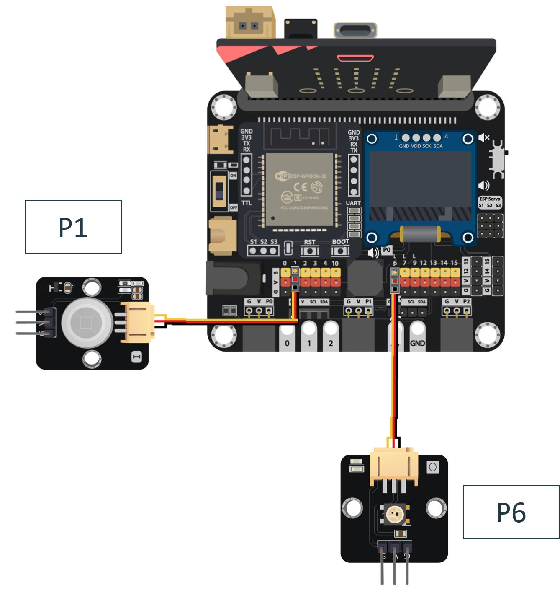

 1.2 Programming (MakeCode)

**Step 1\. Disable the LED and initialize Multi-Color LED and variables**

* Snap led enable false inside on start.  
* Pull the set strip to NeoPixel at pin P6 with 1 leds as RGB(GRB format) to on start.  
* Create a new variable counter and snap set counter to 0\.

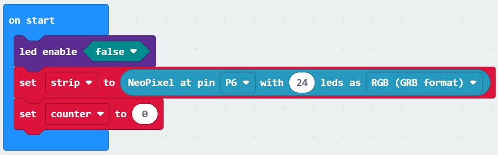

**Step 2\. Set up the function light\_function**

* Create a new function name light\_function.  
* In the function, snap strip show color white.

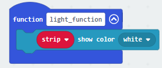

**Step 3\. Change the value of variables by motion sensor result**

* In forever, snap an if- else loop.  
* For the if condition, snap Get motion (triggered or not) at Pin P1,  
* Snap call light function.  
* In the else part, snap change counter by 1\.  
* Then, snap if counter \= 10 then,  
* Inside the if loop, snap strip show color black.  
* Snap set counter to 0\.  
* Outside the loops, snap pause for 1 second.  
    
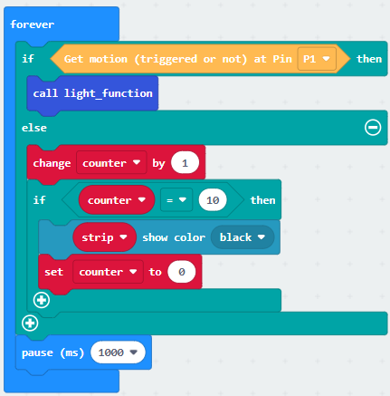

Part 1 Solution:

MakeCode: [https://makecode.microbit.org/S21260-81435-07944-46211](https://makecode.microbit.org/S21260-81435-07944-46211) 

You could also download the program from the following website: 
<iframe src="https://makecode.microbit.org/#pub:S21260-81435-07944-46211"width="100%" height="500" frameborder="0"></iframe>

Part 1 Result

When the people are moving in the room, the motion sensor will trigger and keep the LED turned on. When there is no one moving, the LED will turn off.  
    

### Part 2: Setting up the Mechanical Password Switch Door (Case 6 revised)

2.1 Hardware Connect

* Connect the button module to P2.  
* Connect the 180 degree servo to P7.  
    
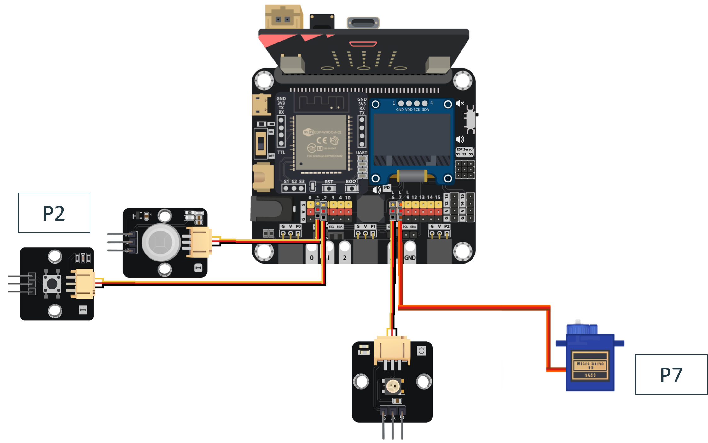

2.2 Programming (MakeCode)

**Step 1\. Create variables**

* In on start, create a variable called btnA, btnB, door\_unlock.  
* Set btnA ,btnB to 0 and set door\_unlock to true.  
    
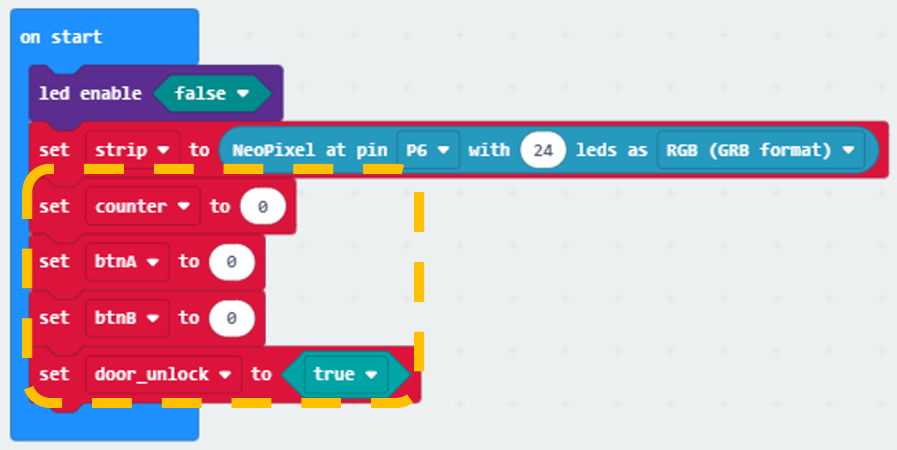

**Step 2\. Monitoring the button pressing state and take action**

* Snap the When Button at P2 pressed block to editor.  
* Put a if statement in the When Button at P2 pressed block.  
* Set the condition to door\_unlock \= true.  
* When door\_unlock \= true, that's means it is unlock successfully, the servo should open the door by Turn 180 servo to 180 degree at P7, after that, wait for 2 second by pause (ms) 5000, then close and lock the door again by Turn 180 servo to 65 degree at P6 and set variable door\_unlock to false.  
    
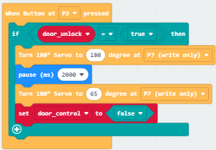

**Step 3\. Set the password input method**

* Snap on button A pressed to editor.  
* Use change btnA by 1 to increase the count variable by 1\.  
* Repeat the step with minor differences on target to let button B also can increase btnB.  
     
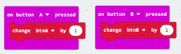

**Step 4\. password input method**

* Snap on button A+B pressed to editor.  
* Put an if-else statement inside.  
* Use btnA \= 2 and btnB \= 3 as conditions, you may also change it to your favourite password.  
* In the if segment, that means the input is correct, set unlock to true to allow open the door when press the extended button.  
* In the else segment, that means the input is not correct, set unlock to false to deny open the door when press the extended button.  
* Reset the two count variable btnA and btnB to 0 for next input.  
     

Part 2 Full Solution:

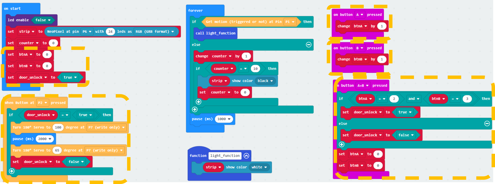

MakeCode: [https://makecode.microbit.org/S53219-01442-45704-57452](https://makecode.microbit.org/S53219-01442-45704-57452) 

You could also download the program from the following website: 
<iframe src="https://makecode.microbit.org/#pub:S53219-01442-45704-57452" width="100%" height="500" frameborder="0"></iframe>

Part 2 Result

After pressing the correct number of button A and B, press A+B to do the validation.  
If it is the correct password, press the extended button, the door will open. After 5 seconds, the door will close and lock again. If wrong, do not open the door.

### Part 3: Setting up the Smart Remote Control Musical Light (Case 7 revised)

3.1 Programming - Receiver Part (MakeCode)

**Step 1\. Connect to radio group and set variable**

* In on Start, put a radio set group 1 to join the radio group 1\.  
* Create a new variable music\_mode and set to 0\.  
    
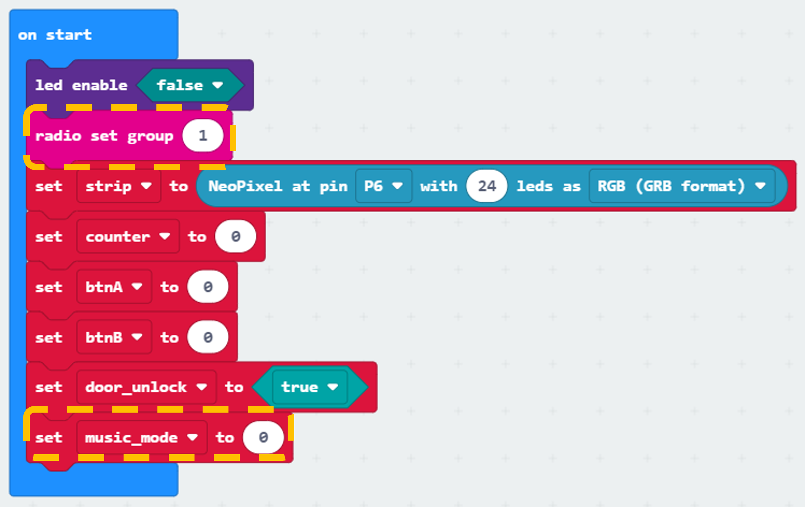

**Step 2\. Examine the radio message and take action**

* Snap on radio received receivedstring block to editor.  
* Put a nested if-else statement inside that block.  
* In the first condition, use receivedstring \= close to filter out the stop music message, change the mode flag variable to 0\.  
* In the second condition, use receivedstring \= funny to filter out the funny message, change the mode flag variable to 1\.  
* In the third condition, use receivedstring \= excited to filter out the excited message, change the mode flag variable to 2\.  
    
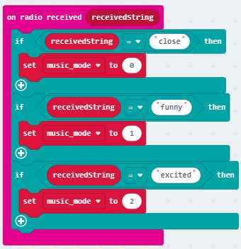

**Step 3\. Change melody type by the flag**

* Put a nested if-else statement inside the Forever.  
* Use music\_mode \= 0 as the first condition,  
* In the first if segment, that’s means stop\_music, stop the playing sound by stop all sound.  
* Use music\_mode \= 1 as the second condition,  
* In the second if segment, that means funny, play a funny melody at tempo 200 (bpm) until done.  
* Use music\_mode \= 2 as the third condition,  
* In the third if segement, that’s means excited, play an excited melody at tempo 200 (bpm) until done.  
     
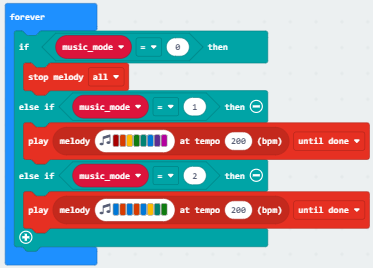

3.2 Programming \- Sender Part (MakeCode)

**Step 1\. Connect to radio group**

* Build the sender part in another hex file.  
* In on Start, put a radio set group 1 to join the radio group 1\.  
     
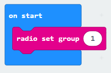

**Step 2\. Send message to group**

* Snap on button A pressed to editor.  
* In on button A pressed, put a radio send string funny to send funny message to group 1 micro:bits.  
* Repeat the steps with minor changes on the trigger button and string to create other message sender for excited and close.

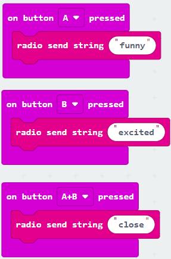

Part 3 Full Solution:

* Receiver Part (Main program):

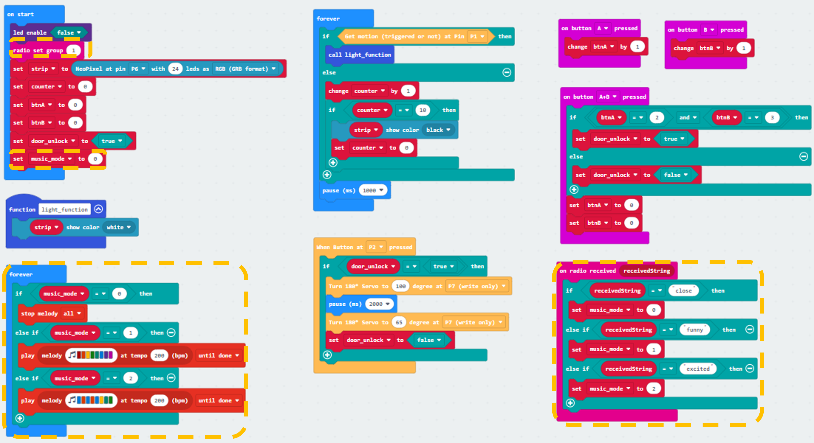

MakeCode: [https://makecode.microbit.org/S45028-55954-00007-43371](https://makecode.microbit.org/S45028-55954-00007-43371) 

You could also download the program from the following website: 
<iframe src="https://makecode.microbit.org/#pub:S45028-55954-00007-43371" width="100%" height="500" frameborder="0"></iframe>

* Sender Part (Will only included in this part and the full program part only):

MakeCode: [https://makecode.microbit.org/S36162-88364-04373-85647](https://makecode.microbit.org/S36162-88364-04373-85647) 

You could also download the program from the following website: 
<iframe src="https://makecode.microbit.org/#pub:S36162-88364-04373-85647" width="100%" height="500" frameborder="0"></iframe>

Part 3 Result

After loaded program to micro:bit,  
When the press the button A, micro:bit sends the funny message to group 1\.  

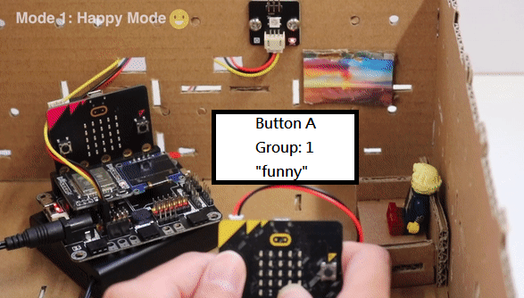

When the press the button B, micro:bit sends the excited message to group 1\.  

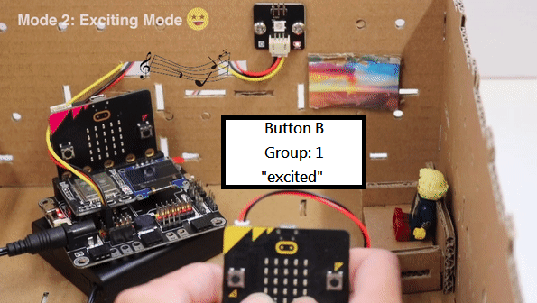

When the press the button A and B, micro:bit sends the close message to group 1\.

### Part 4: Setting up the Room Smart Colourful Light App Control (Case 12 revised)

4.1 Hardware Connect

* Connect the OLED module to I2C.  
    
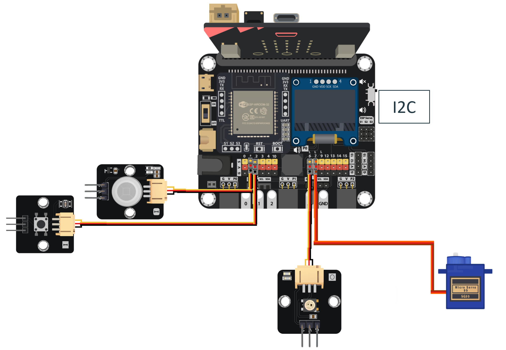

4.2 IOT Setup (App Inventor 2\)

**Step 1\. Create an APP project**

* Create a APP inventor account at [http://ai2.appinventor.mit.edu/](http://ai2.appinventor.mit.edu/) .  
* Create a new project.  
    

**Step 2\. Design the layout of APP**

* In the designer page, pull the layout element from the left side to the editor.  
* In this example case, using different buttons, textbox, label and layout control.  
* Place the element in your way.  
* For each element has their own property, you may change it in your mind, such as the background color, font size, width, height, align.  
* Remember to put the Web element to the editor, it will be used for sending commands.  
    

**Step 3\. Programming the elements in APP**

* Switch to Blocks page by click the button at top right corner.  

* According to the catalog of function needs, find it at the left side and put to editor.  
* Go to buttonX element, find the when buttonX.Click do function, put it to editor ( X represent the number of button).  
* Go to Web1 element, find the set Web1.URL to, put it inside to the when buttonX.Click do.  
* Go to Text catalog, find the join and " " element to start build the control API.  
* Control API is: https://control.smarthon.cc/publish?id=ID\&msg=MSG , while ID and MSG means IoT:bit ID and Command respectively.  
* Use join properly to concatenate the API from each parts.  
* After complete the API URL, use call Web1.Get from Web1 to send the API Command.  
    

4.3 Programming (MakeCode)

**Step 1\. Initialize WiFi, OLED and App\_control variable**

* Snap Initialize OLED with width:128, height: 64 to on start.  
* Snap Initialize IoT:bit TX P16 RX P8 from IoT:bit to on start.  
* Snap Set Wi-Fi to ssid pwd from IoT:bit.  
* Create a new variable name light_color and snap set light_color to White.
    
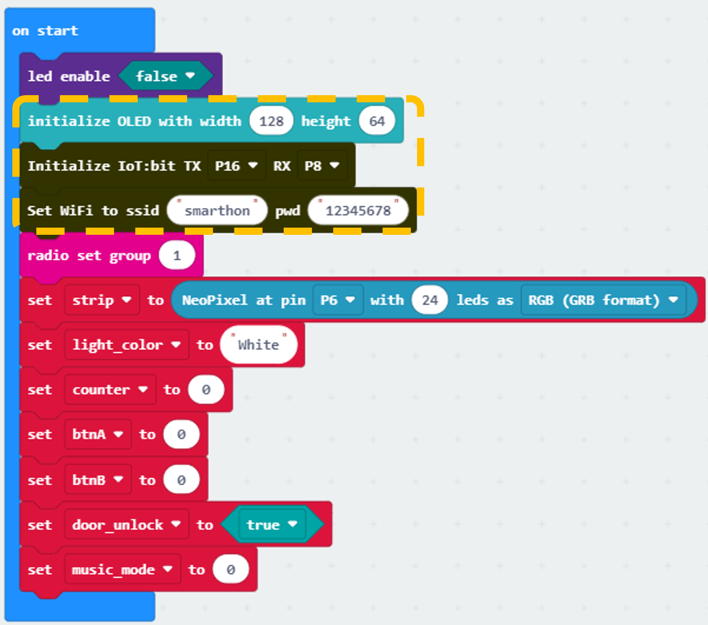

**Step 2\. Show Device ID after WiFi connection**

* Snap the On WiFi connected block to editor.  
* Put a show string Device\_ID inside the block.  
    
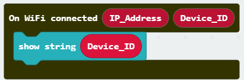

**Step 3\. Update light_function**

* In light_function, snap a 4 conditions if-else loop.  
* In each if part, snap light\_color \= Red/ Blue/ Green, then snap strip show color Red/ Blue/ Green/ White in the loop.

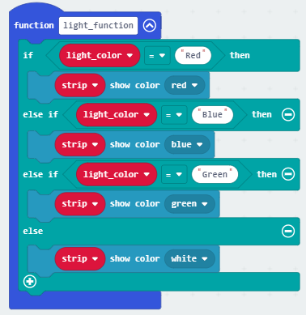

**Step 4\. Receive Command**

* Inside the On WiFi Received, put a nested if-else statement with different conditions.  
* Set the first condition as WAN\_Command \= White.  
* In the if segment, snap strip show color white and set light\_color to White.  
* In the next if condition, use WAN\_Command \= Red.  
* In the if segment, snap strip show color red and set light\_color to Red.  
* In the next if condition, use WAN\_Command \= Blue.  
* snap set strip show color blue and set light\_color to Blue.  
* In the next if condition, use WAN\_Command \= Green.  
* snap set strip show color green and set light\_color to Green.  
     

Part 4 Full Solution:

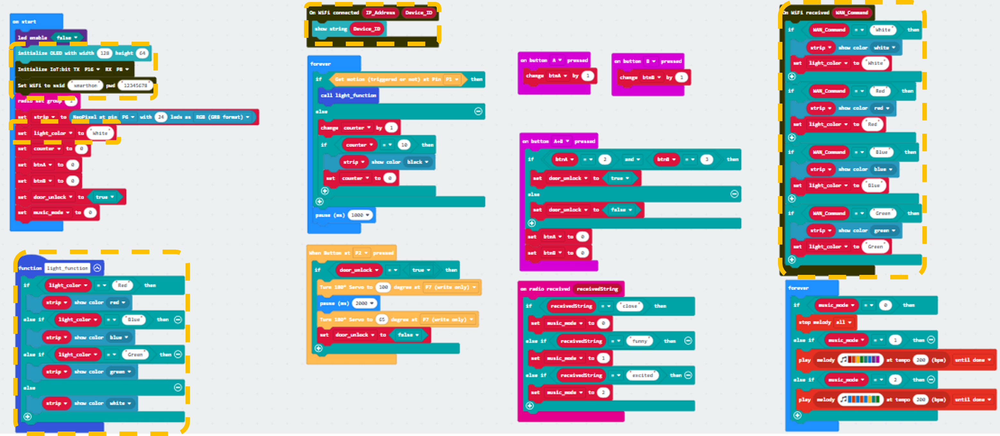

MakeCode: [https://makecode.microbit.org/S69316-14076-24397-45707](https://makecode.microbit.org/S69316-14076-24397-45707) 

You could also download the program from the following website: 
<iframe src="https://makecode.microbit.org/#pub:S69316-14076-24397-45707" width="100%" height="500" frameborder="0"></iframe>

Part 4 Result

After sending color messages from APPs, the color of light will change.

### Part 5: Setting up the Smart Fan Voice Control (Case 13 revised)

5.1 Hardware Connect

* Connect the motor fan to P9.  
    

5.2 IOT Setup (Alexa / Google Assistant / Siri, Cloud Control, IFTTT)

**There are three different methods you can use to set up the IOT part for this case:**

* **For Amazon Alexa, you can refer to this link: 
[IoT Alexa of case 13](https://smarthon-docs-en.readthedocs.io/en/latest/smartHomeIoT/case13.html\#iot-alexa-cloud-control-ifttt)**  
    
* **For Google Assistant, you can refer to this link: 
[IoT Google Assistant of case 13](https://smarthon-docs-en.readthedocs.io/en/latest/smartHomeIoT/case13.html\#iot-google-assistant)**  
    
* **For Siri, you can refer to this link: 
[IoT Siri of case 13](https://smarthon-docs-en.readthedocs.io/en/latest/smartHomeIoT/case13.html\#iot-apple-s-siri)**

5.3 Programming (MakeCode)

**Step 1\. Update receive WiFi command.**

* In the On WiFi received block, snap if WAN\_Command \= turn\_on\_fan,  
* Then snap set Motor fan with 1023 at P9.  
* Snap if WAN\_Command \= turn\_off\_fan,  
* Snap set Motor fan with 0 at P9.  
    

Part 5 Full Solution:

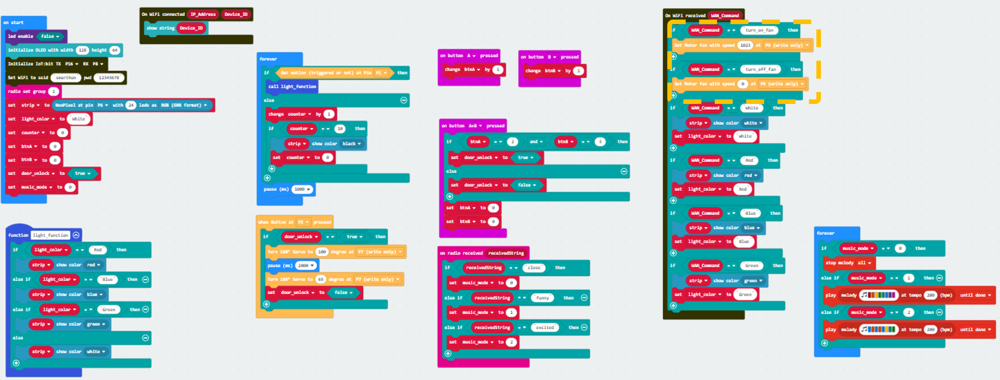

MakeCode: [https://makecode.microbit.org/S35754-29871-95851-03618](https://makecode.microbit.org/S35754-29871-95851-03618) 

You could also download the program from the following website: 
<iframe src="https://makecode.microbit.org/#pub:S35754-29871-95851-03618" width="100%" height="500" frameborder="0"></iframe>

Part 5 Result:

You can use voice to control the fan to turn on or off with Alexa/ Google Assistant/ Siri.

