# Scenario Example 1 : Modern Residential House

Level: 
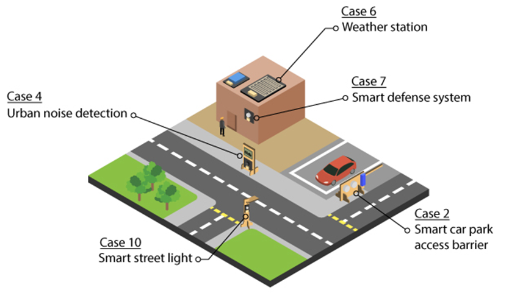

## Introduction

**Modern Residential House** focus on achieving a high living standard for the citizens. It includes an automation system for parking and a high security defense system. Noise and weather information are collected to evaluate the environmental comfortability of a city.

This Scenario is the integration of these five functions:

* Smart car park (Case 2)
* Urban noise detection (Case 4)
* Weather station (Case 6)
* Smart defense system (Case 7)
* Smart street light (Case 10)

## Part List

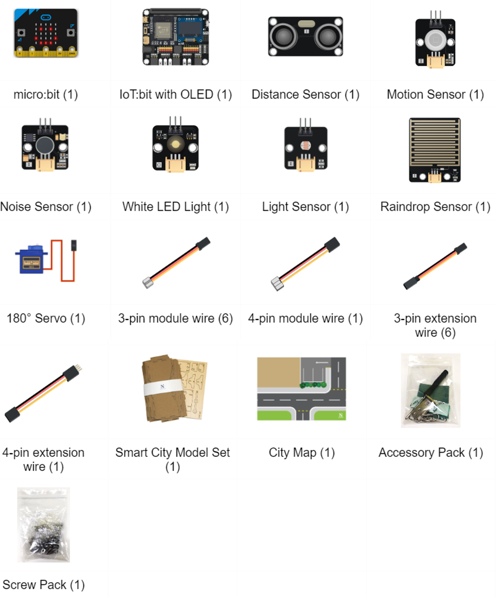

## IOT Technology Applied

* ThingSpeak
* IFTTT

## Assembly Step

Refer case 2, 4, 6, 7, 10

## Hardware connect

* Connect the Distance Sensor to P14 (trig)/ P15 (echo) port of IoT:bit.
* Connect Light Sensor to P4 port of IoT:bit.
* Connect 180° Servo to P6 port of IoT:bit.
* Connect Noise Sensor to P10 port of IoT:bit.
* Extend the connection of OLED to I2C connection port of IoT:bit.
* Connect the Raindrop Sensor to P3 port of IoT:bit.
* Connect the Motion Sensor to P1 port of IoT:bit.
* Connect the White LED on P7 port of IoT:bit.

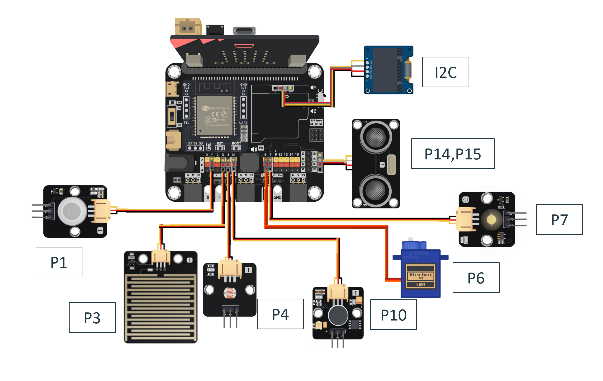

## Programming (MakeCode)

**Scenario 1 Full Solution**

MakeCode: [https://makecode.microbit.org/S19945-42349-53404-83463](https://makecode.microbit.org/S19945-42349-53404-83463)
 

You could also download the program from the following website: 
<iframe src="https://makecode.microbit.org/S19945-42349-53404-83463" width="100%" height="500" frameborder="0"></iframe>

## Step By Step Tutorial

### Part 1: Setting up the Smart car park (Case 2 Revised)

1.1 Hardware Connect

* Connect the Distance Sensor to P14 (trig)/ P15 (echo) port of IoT:bit.
* Connect Light Sensor to P4 port of IoT:bit.
* Connect 180° Servo to P6 port of IoT:bit.

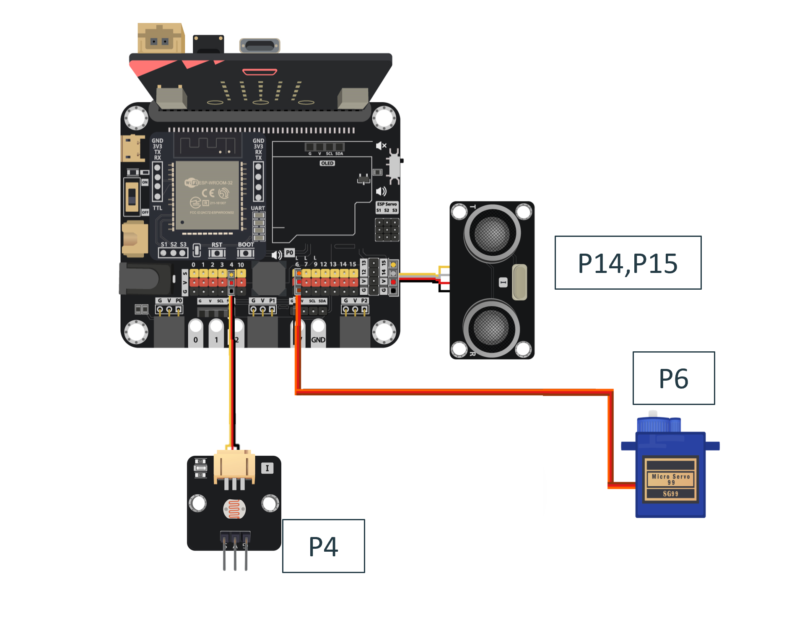

 1.2 Programming (MakeCode)

**Step 1. Set variables and servo at start position**

* Inside on start, snap set variable distance to 0 and set light to 0 from variables.
* Snap Turn Servo to 0 degree at P6 (write only).
* Snap led enable false.

**Step 2. Get distance and light value**

* Drag get distance to get distance unit cm trig P14 echo P15, store the value to variable distance.
* Get light value (percentage) at Pin P4, store the value to variable light.

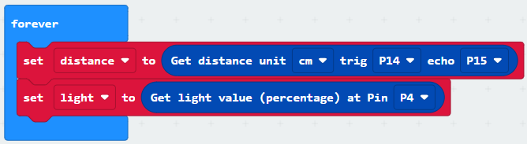

**Step 3. Open/close gate with light value**

* Snap if statement into forever, set if variable distance ≤ 5.
* Snap another if statement set variable light value &gt;20.

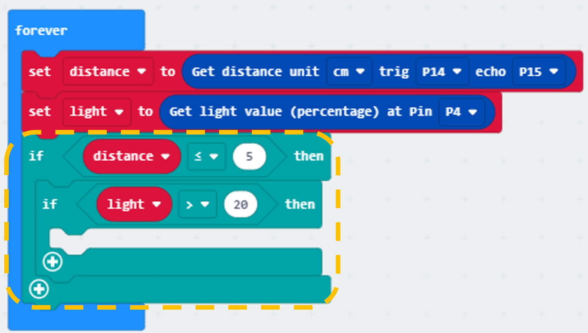

**Step 4. Set servo position**

* Snap Turn Servo to 90 degree at P6 (write only) as the gate is opened.
* Snap pause to the loop to wait 5 seconds.
* Snap Turn Servo to 0 degree at P6 (write only) as the gate is closed.

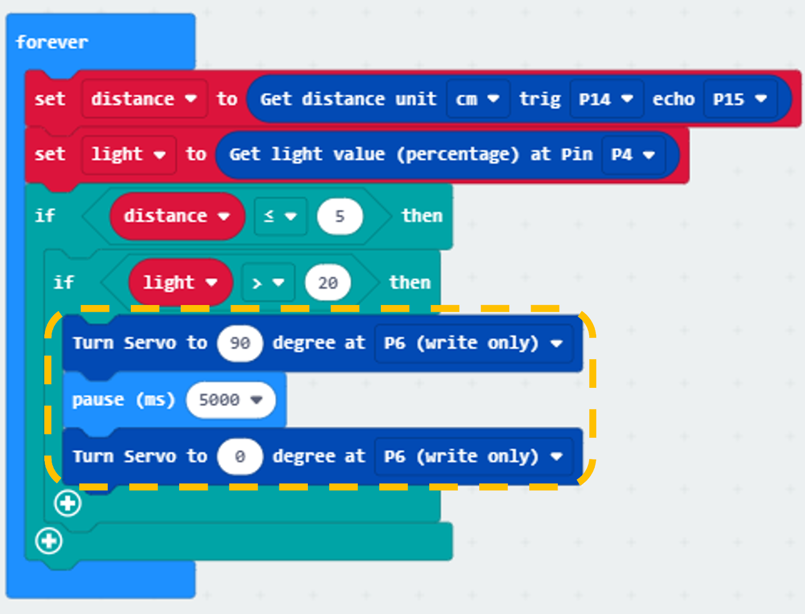

Part 1 Solution:

MakeCode: [https://makecode.microbit.org/S24820-05059-97092-01663](https://makecode.microbit.org/S24820-05059-97092-01663) 

You could also download the program from the following website: 
<iframe src="https://makecode.microbit.org/S24820-05059-97092-01663"width="100%" height="500" frameborder="0"></iframe>

Part 1 Result

The light sensor is used to check the vacancies in the car park while the distance sensor is used to detect if there are any cars coming near the car park gate.

The car park gate is controlled by 180ᵒ servo. When there are vacancies in the car park and there are cars near the car park gate, the car park is available. The gate will be opened for 5 seconds and then closed to let the car enter the car park.

### Part 2: Setting up the Urban noise detection (Case 4 Revised)

2.1 Hardware Connect

* Connect Noise Sensor to P10 port of IoT:bit.
* Extend the connection of OLED to I2C connection port of IoT:bit.

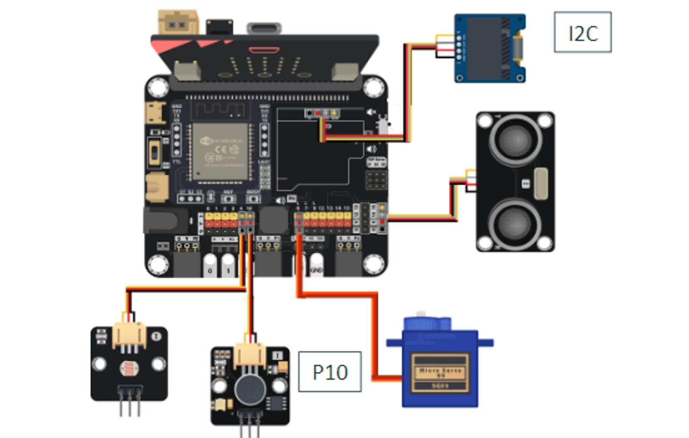

2.2 Programming (MakeCode)

**Step 1. Initialize OLED screen and variable**

* Drag Initialize OLED with width:128, height: 64 to on start.

**Step 2. Initialize noise variable**

* In block forever. Set Noise to round get noise level (dB) at pin P10.

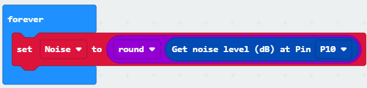

**Step 3. Show the noise value on OLED screen**

* Snap clear OLED display from OLED to avoid overlap.
* Snap show string to the loop and show value of the variable Noise.
* Pause for 0.5 seconds.

Part 2 Full Solution:

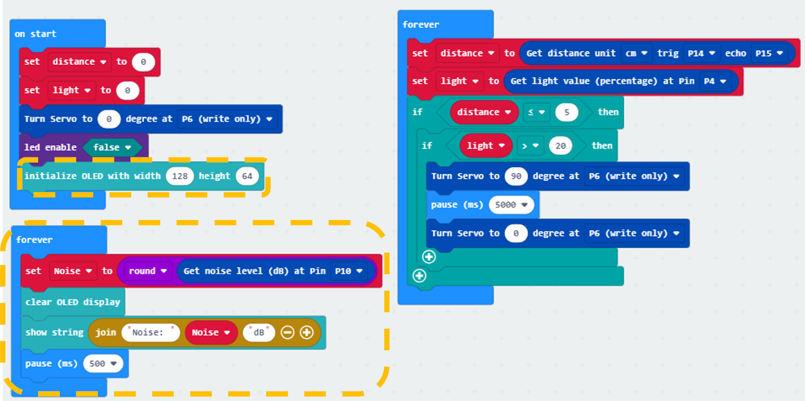

MakeCode: [https://makecode.microbit.org/S44314-69730-93926-05553](https://makecode.microbit.org/#pub:S44314-69730-93926-05553) 

You could also download the program from the following website: 

<iframe src="https://makecode.microbit.org/#pub:S44314-69730-93926-05553"width="100%" height="500" frameborder="0"></iframe>

Part 2 Result

After initializing WiFi extension board and OLED, micro:bit will show a bar graph for the sound intensity in a city.

### Part 3: Setting up the Weather station (Case 6 Revised)

3.1 Hardware Connect

* Connect the Raindrop Sensor to P3 port of IoT:bit.

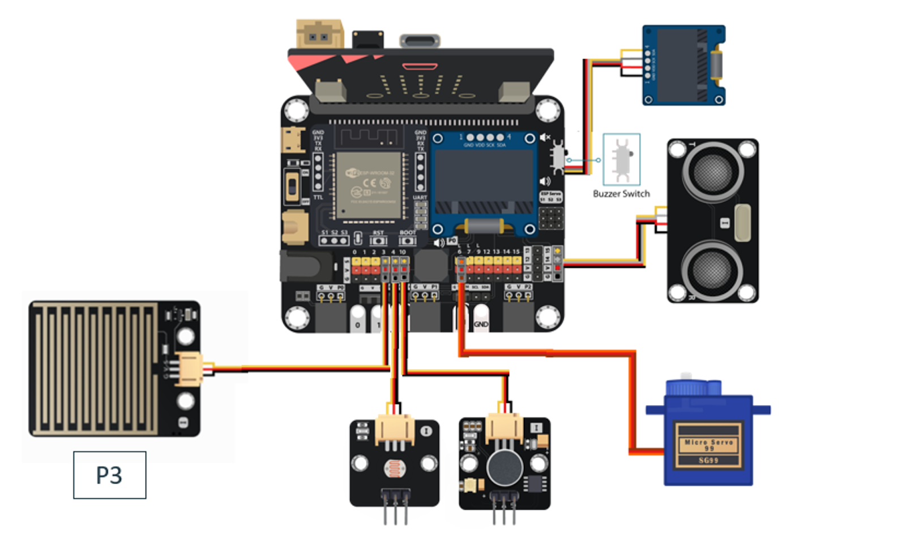

3.2 IOT Setup (ThingSpeak)

**Step 1**

* Go to [https://thingspeak.com](https://thingspeak.com), create an account and login.

**Step 2**

* Choose Channels -&gt; My Channels -&gt; New Channel

**Step 3**

* Input Channel name, Field1 and Field2 , then click “Save Channel”.
    * Channel name: Smart Weather Station
    * Field 1: temperature
    * Field 2: humidity
    * Field 3: raindrop

**Step 4**

* Select your channel &gt; “API Keys” ，copy the API key as follows:

3.3 Programming (MakeCode)

**Step 1. Connect to WiFi**

* Snap Set Wi-Fi to ssid pwd from IoT:bit to on start.
* Enter your Wi-Fi name and password. Here we set smarthon as SSID and 12345678 as password.

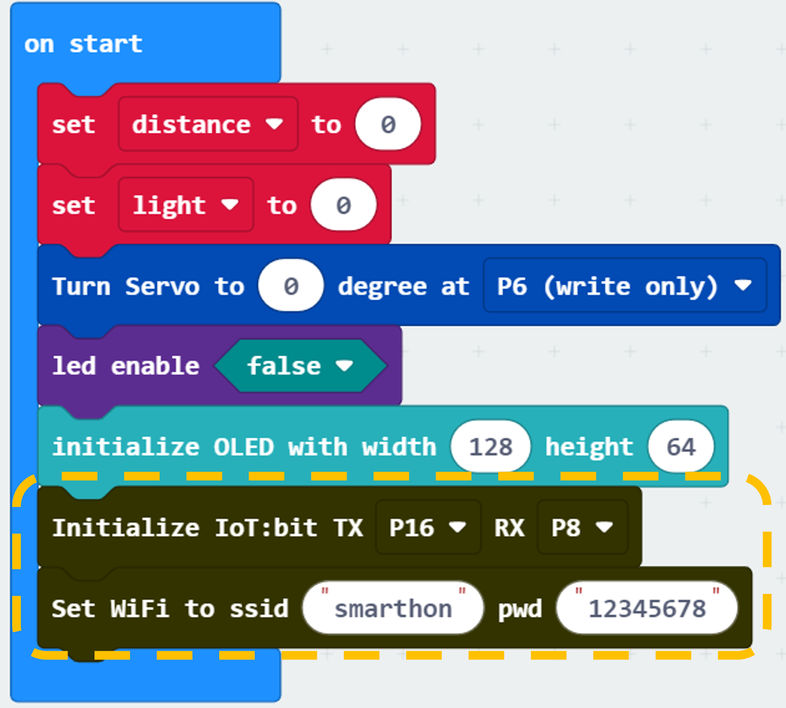

**Step 2. Show Device\_ID after WiFi connection**

* Snap show string from OLED to On WiFi connected and drag “Device\_ID” into the box.

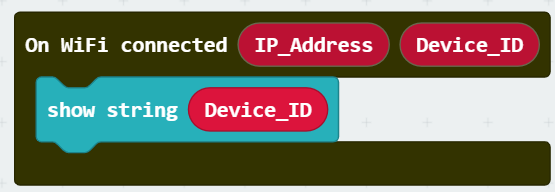

**Step 3. Get raindrop value**

* Create a new variable “raindrop”.
* Set raindrop to get raindrop value (percentage) at Pin P3.

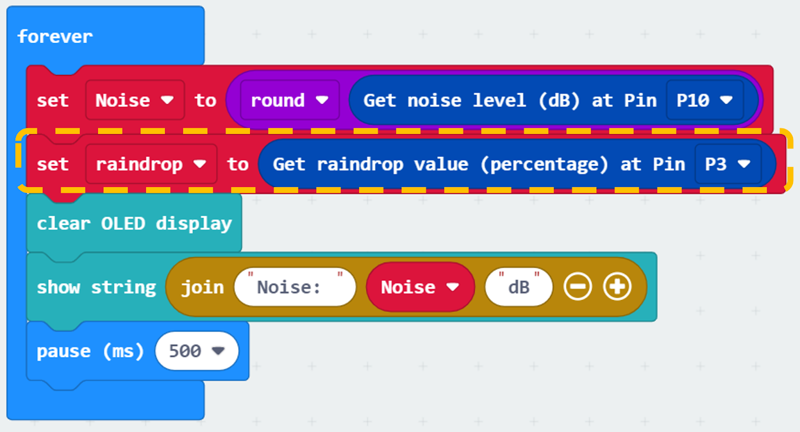

**Step 4. Show temperatures and raindrop values on OLED**

* Snap show string and show value of variables Temperature and Raindrop.
* The value of Temperature can be found in the Input section.

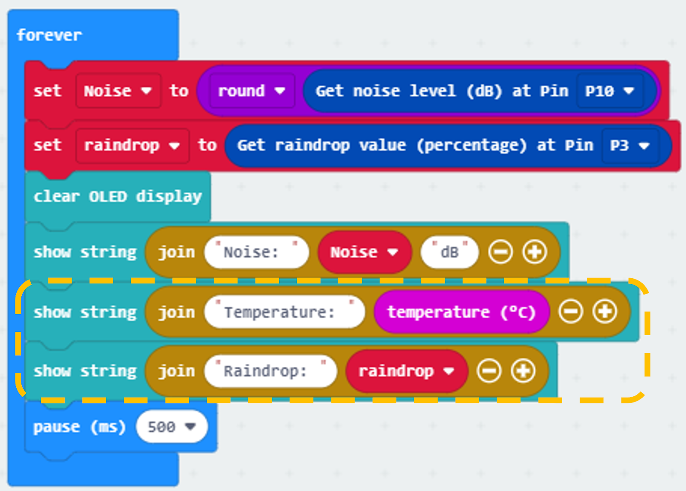

**Step 5. Upload data to ThingSpeak**

* Snap Send Thingspeak key into forever.
* Fill in the API Key which you copied in the IOT part.
* For field 1, use temperature as value.
* Add field 2 , use raindrop as value.

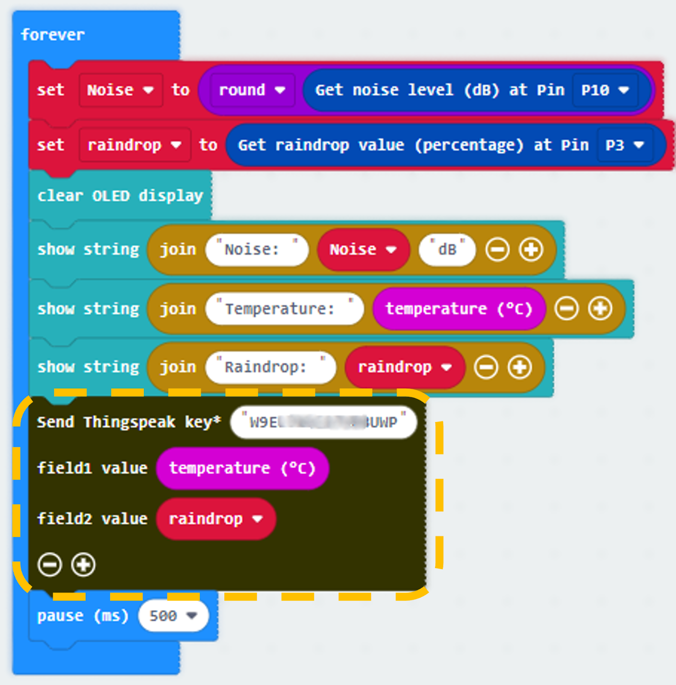

**Step 6. Change to 15 seconds (15000ms)**

* Change pause from 500 ms to 15000 ms.

**Step 7. Add If WiFi Connected**

* Snap “If WiFi connected” into the program.

**Step 8. Show ThingSpeak upload Status**

* Snap show string inside On Thingspeak Uploaded
* Draw the variable Status and Error\_code to block show string

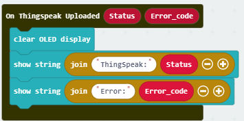

Part 3 Full Solution:

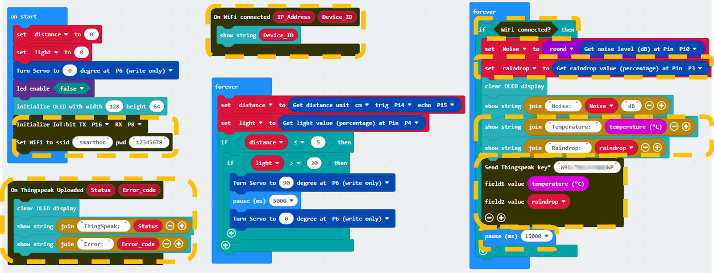

MakeCode: [https://makecode.microbit.org/S56225-17199-07352-27271](https://makecode.microbit.org/S56225-17199-07352-27271) 

You could also download the program from the following website: 

<iframe src="https://makecode.microbit.org/S56225-17199-07352-27271" width="100%" height="500" frameborder="0"></iframe>

Part 3 Result

When micro:bit is connected to WiFi, it will check weather information (temperature and raindrop value from the raindrop sensor). Then, those data will be sent to ThingSpeak and pause for 15 seconds for another update.

### Part 4: Setting up the Smart defense system (Case 7 Revised)

4.1 Hardware Connect

* Connect the Motion Sensor to P1 port of IoT:bit.

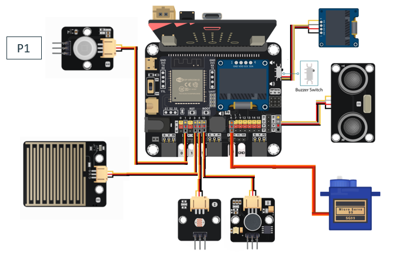

4.2 IOT Setup (IFTTT)

**Step 1**

* Go to [https://ifttt.com](https://ifttt.com), create an account, login and create applet (if webhooks then Email)

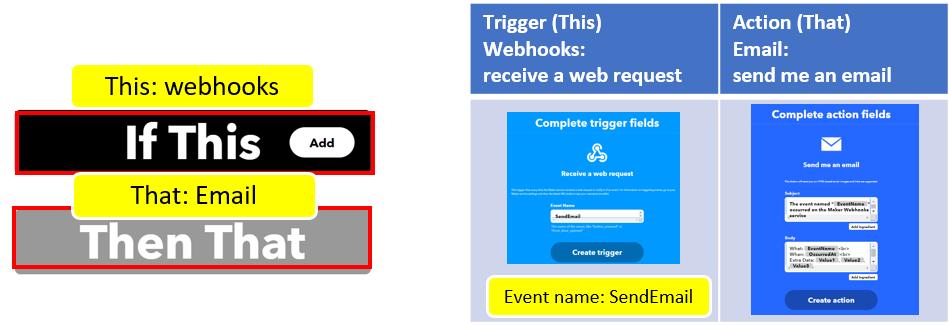

**Step 2**

* Go to “My services” &gt; “Webhooks”, select “Documentation” . Copy your Webhooks Key as follows:

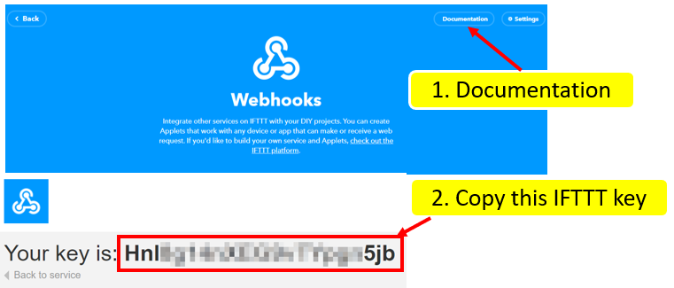

4.3 Programming (MakeCode)

**Step 1.Check motion sensor value**

* Snap if statement to block forever
* If WiFi is connected,
* If it gets motion (triggered or not) at Pin P1 = true then, that’s say someone is near the door.

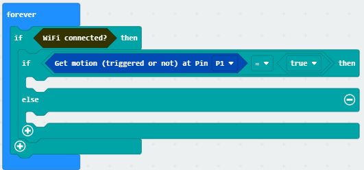

**Step 2. Send data to IFTTT**

* Snap Send IFTTT key… from IoT:bit &gt; IoT Services, input your IFTTT key and input event name SendEmail
* Snap Pause after if statement to the loop for 5 second delay for checking

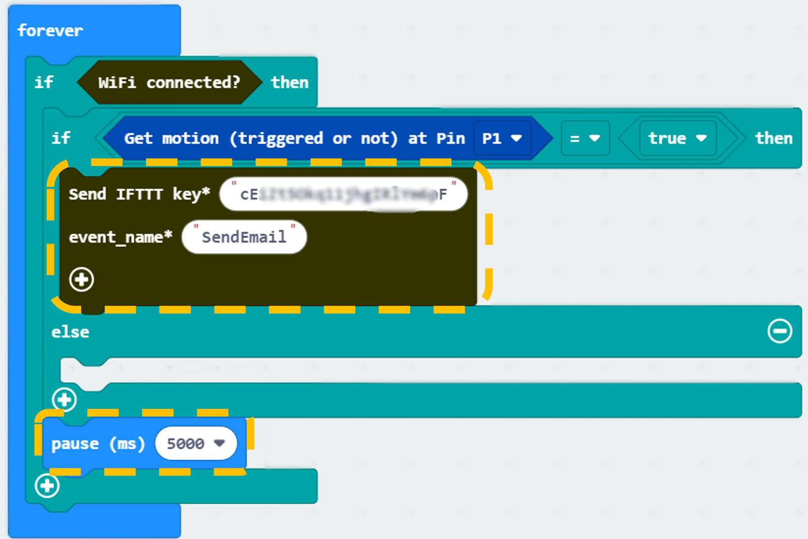

Part 4 Full Solution:

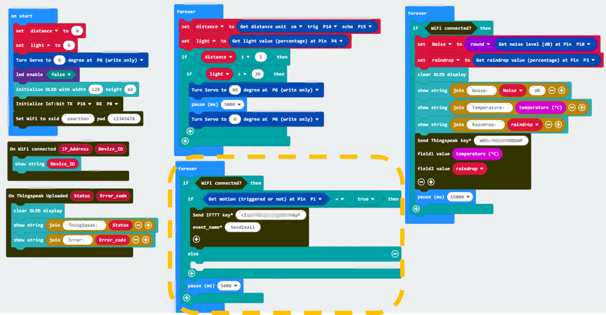

MakeCode: [https://makecode.microbit.org/S05163-15392-66954-27282](https://makecode.microbit.org/S05163-15392-66954-27282) 

You could also download the program from the following website: 

<iframe src="https://makecode.microbit.org/S05163-15392-66954-27282" width="100%" height="500" frameborder="0"></iframe>

Part 4 Result

When WiFi is connected, if there is any suspicious movement near the door, an email will be sent to the house owner.

### Part 5: Setting up the Smart street light (Case 10 Revised)

5.1 Hardware Connect

* Connect the White LED on P7 port of IoT:bit.

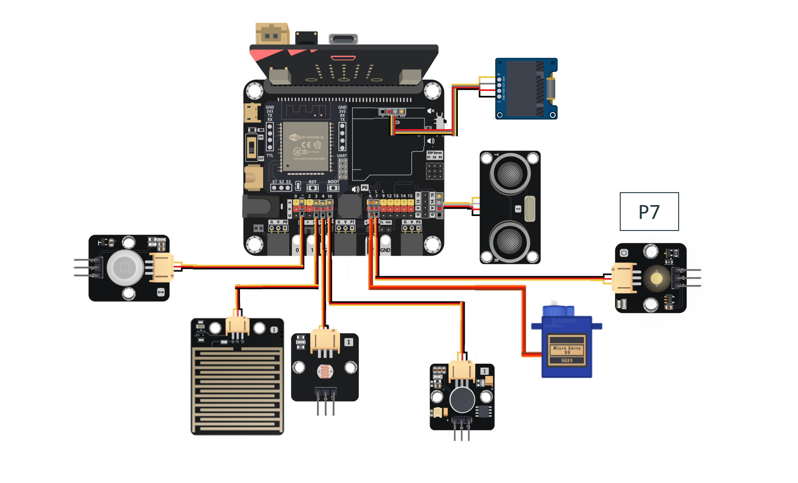

5.2 IOT Setup (IFTTT)

* **Create applet in IFTTT**

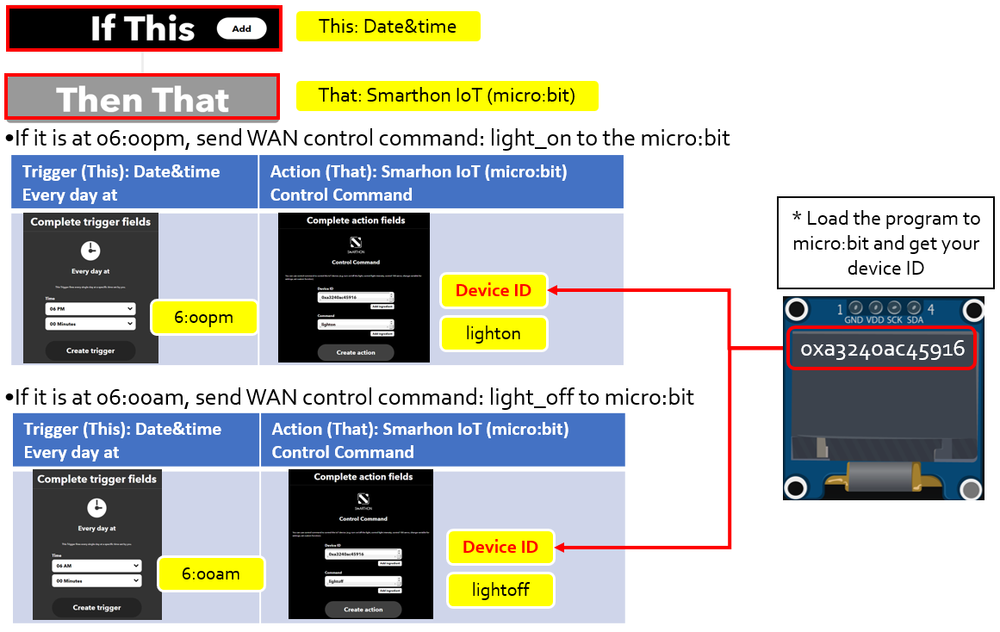

5.3 Programming (MakeCode)

**Step 1. Receive WAN command**

* Go to OLED, snap the clear OLED display to On WiFi received to avoid overlap.
* Snap the show string to On WiFi received.
* Draw the WAN\_Command variable to show string placeholder.

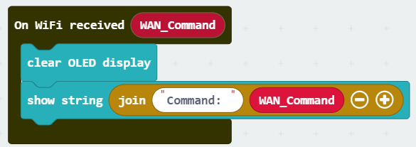

**Step 2. Turn on/off LED by WAN command**

* Snap if-condition.
* Set variable WAN\_Command = lighton into if-condition.
* turn White LED … from SmartCity &gt; Output, turn white LED with intensity: 1023 at P7.
* Set variable WAN\_Command = lightoff into else-if-condition.
* Snap turn White LED … from SmartCity &gt; Output, turn white LED with intensity: 0 at P7.

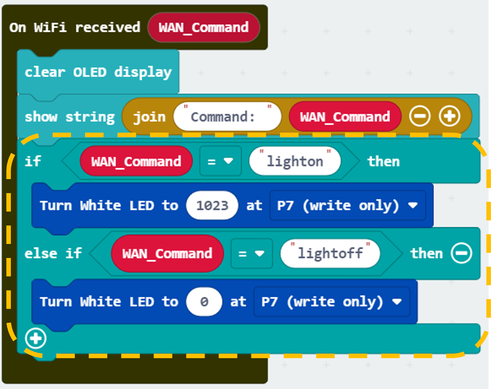

**Step 3. Adding a show Device ID function**

* From Input, add an on button A+B pressed.
* Snap show string Device ID.

Part 5 Full Solution:

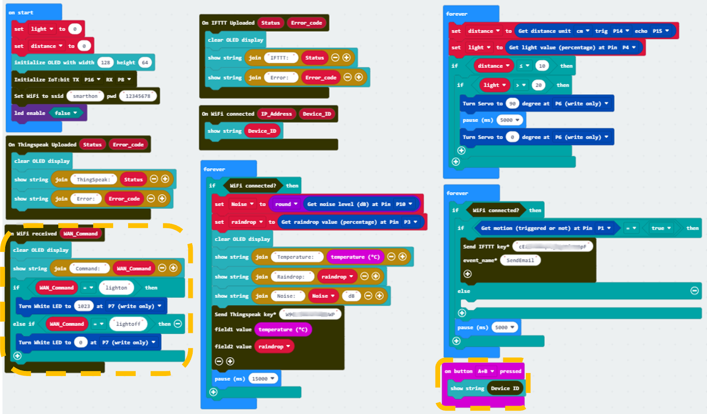

MakeCode: [https://makecode.microbit.org/S19945-42349-53404-83463](https://makecode.microbit.org/S19945-42349-53404-83463) 

You could also download the program from the following website: 
<iframe src="https://makecode.microbit.org/S19945-42349-53404-83463" width="100%" height="500" frameborder="0"></iframe>

Part 5 Result

The micro:bit is controlled by IFTTT (trigger by date&time). The LED light will be turned on at 6pm and turned off at 6am every day.

