# Scenario Example 2 : Green Engineering

Level: 
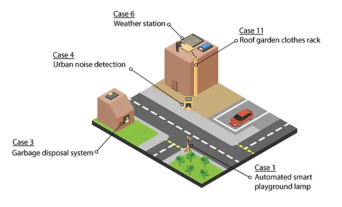

## Introduction

**Green Engineering** is a city development, which focus on high sustainability It includes increasing green areas, energy efficiency, reducing wastes, monitoring climate information and pollution states (eg. Noise).

This Scenario is the integration of these five functions:

* Automated smart playground lamp (Case 1)
* Garbage disposal system (Case 3)
* Urban noise detection (Case 4)
* Weather station (Case 6)
* Roof garden clothes rack (Case 11)

## Part List

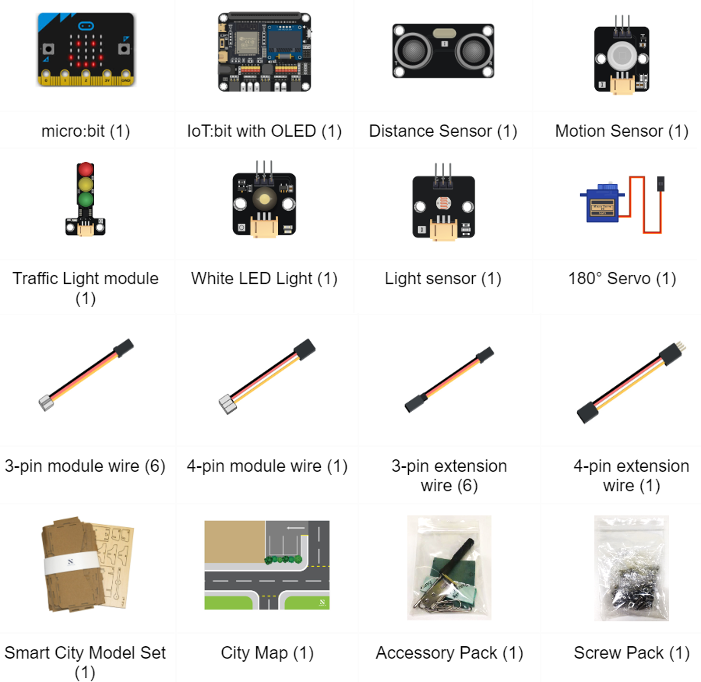

## IOT Technology Applied

* ThingSpeak
* IFTTT

## Assembly Step

Refer case 1, 3, 4, 6, 11

## Hardware connect

* Connect Motion sensor to the P10 port of Smarthon IoT:bit.
* Connect LED light to the P3 port of Smarthon IoT:bit.
* Connect the Distance Sensor to P14 (trig)/ P15 (echo) port of IoT:bit.
* Connect Multi-color LED to P4 port of IoT:bit.
* Connect Noise Sensor to P1 port of IoT:bit.
* Extend the connection of OLED to I2C connection port of IoT:bit.
* Connect the White LED on P7 port of IoT:bit.

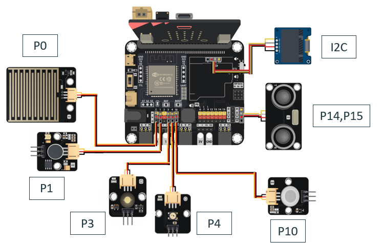

## Programming (MakeCode):

**Scenario 2 Full Solution**

MakeCode: [https://makecode.microbit.org/S93647-52922-40672-26216](https://makecode.microbit.org/S93647-52922-40672-26216) 

You could also download the program from the following website: 
<iframe src="https://makecode.microbit.org/#pub:S93647-52922-40672-26216" width="100%" height="500" frameborder="0"></iframe>

## Step By Step Tutorial

### Part 1: Setting up the Automated smart playground lamp (Case 1 Revised)

1.1 Hardware Connect

* Connect Motion sensor to the P10 port of Smarthon IoT:bit.
* Connect LED light to the P3 port of Smarthon IoT:bit.

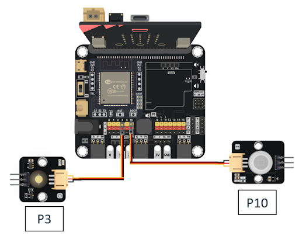

 1.2 Programming (MakeCode)

**Step 1. Disable micro:bit LED**

* Snap led enable false to on start.
* Note that P3 is used as LED in default setting, LED need to be disable.

**Step 2. Turn on LED by motion sensor**

* Drag forever from Basic
* Snap if statement into forever
* Set get motion (triggered or not) at P10 = true, into if statement that says motion is triggered, someone passes by.
* Then, turn white LED to 1023 at P3 as turning on white LED and pause 10 seconds.
* Else, turn white LED at P3 to 0 as turning off.
* Connect the Raindrop Sensor to P0 port of IoT:bit.

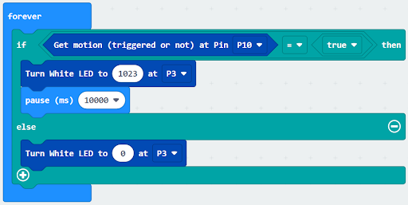

Part 1 Solution:

MakeCode: [https://makecode.microbit.org/_Cawi47eApLi1](https://makecode.microbit.org/_Cawi47eApLi1) 

You could also download the program from the following website: 
<iframe src="https://makecode.microbit.org/#pub:_Cawi47eApLi1"width="100%" height="500" frameborder="0"></iframe>

Part 1 Result

Motion sensor is used to detect if there are people moving in the playground. If there are, the LED light will be turned on; otherwise, it will be turned off.

### Part 2: Setting up the Garbage disposal system (Case 3 Revised)

2.1 Hardware Connect

* Connect the Distance Sensor to P14 (trig)/ P15 (echo) port of IoT:bit.
* Connect Multi-color LED to P4 port of IoT:bit.

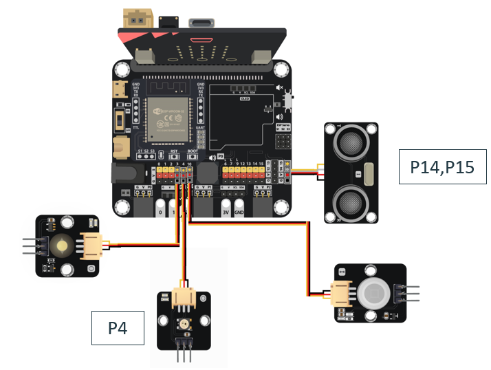

2.2 Programming (MakeCode)

**Step 1. Set variable and initialize multi-colour LED**

* Inside on start, snap set strip to NeoPixel at pin...  from Neopixel. Set pin P4 with 1 led of the block.
* Snap strip set brightness from Neopixel > more and set brightness 50.
* Snap pause to wait 5 seconds.

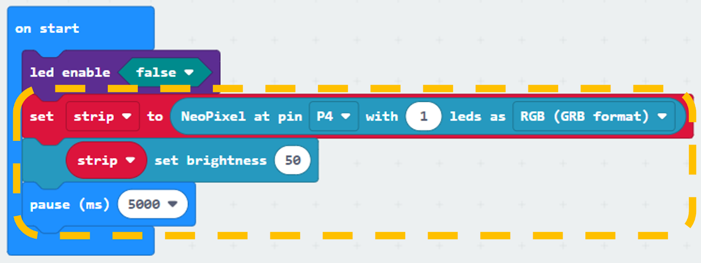

**Step 2. Get distance value**

* Inside block forever. Set distance to get distance unit cm trig P14 echo P15, that’s say get the distance value by connecting the distance sensor to P14 and P15.
* Snap if statement into forever, set distance ≤ 4 into if statement.
* Snap Pause to the loop to wait 1 second for next checking.

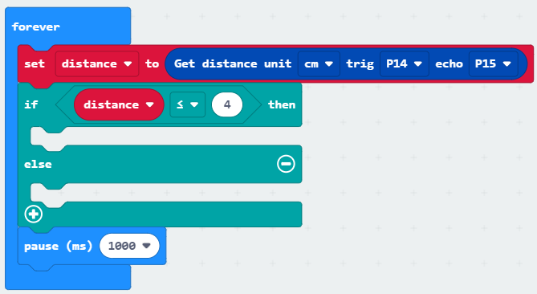

**Step 3. Show indicating colours with distance value**

* If distance ≤ 4, then strip show colour red, else strip show colour green.

Part 2 Full Solution:

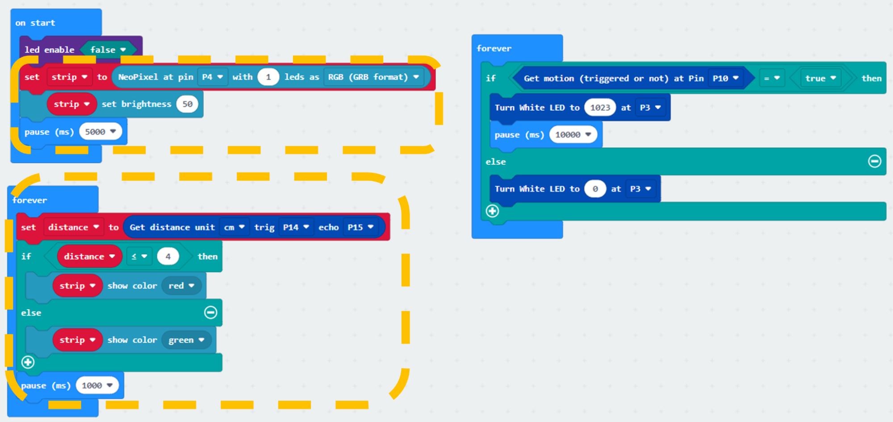

MakeCode: [https://makecode.microbit.org/_a6mTWu1HkDWA](https://makecode.microbit.org/_a6mTWu1HkDWA) 

You could also download the program from the following website: 

<iframe src="https://makecode.microbit.org/#pub:_a6mTWu1HkDWA"width="100%" height="500" frameborder="0"></iframe>

Part 2 Result

The distance sensor can return the distance value between the top of the garbage bin and the level of garbage inside the garbage bin. The LED light is used to indicate if the bin is full or not. If it is empty or there are some garbage, the LED turns green, if it is full, the LED turns red.

### Part 3: Setting up the Urban noise detection (Case 4 Revised)

3.1 Hardware Connect

* Connect Noise Sensor to P1 port of IoT:bit.
* Extend the connection of OLED to I2C connection port of IoT:bit.

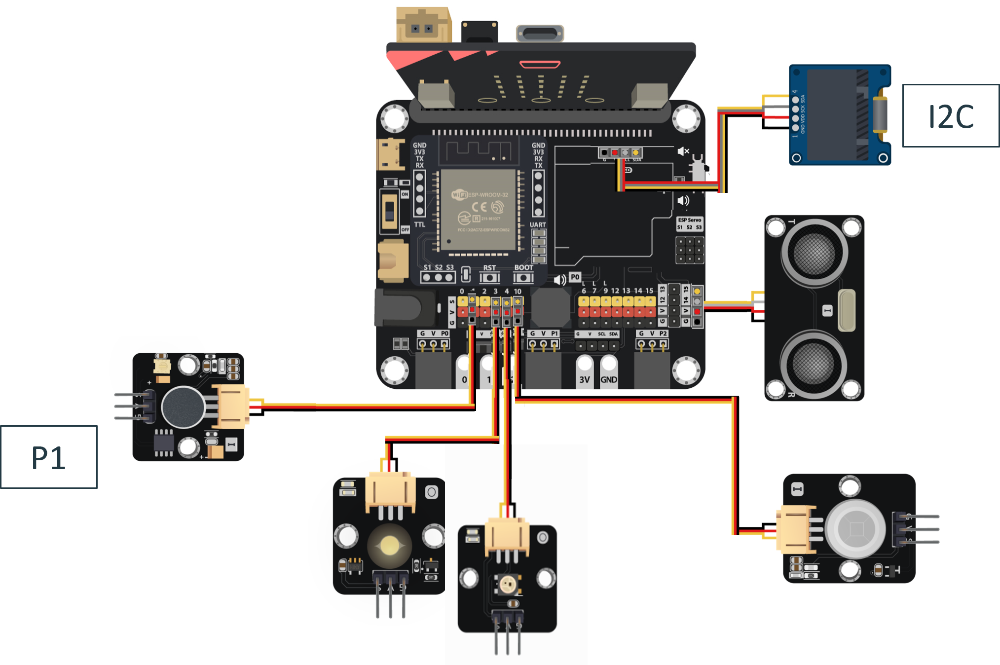

3.2 Programming (MakeCode)

**Step 1. Initialize OLED screen and variable**

* Drag Initialize OLED with width:128, height: 64 to on start.

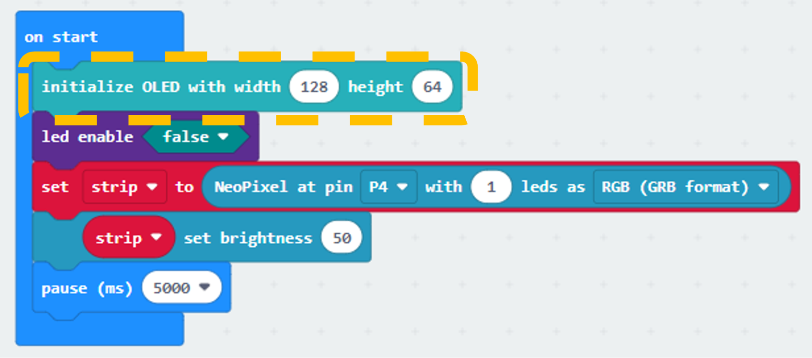

**Step 2. Initialize noise variable**

* In block forever. Set Noise to round get noise level (dB) at pin P1.

**Step 3. Show the noise value on OLED screen**

* Snap clear OLED display from OLED to avoid overlap.
* Snap show string to the loop and show value of the variable Noise.
* Pause for 0.5 seconds.

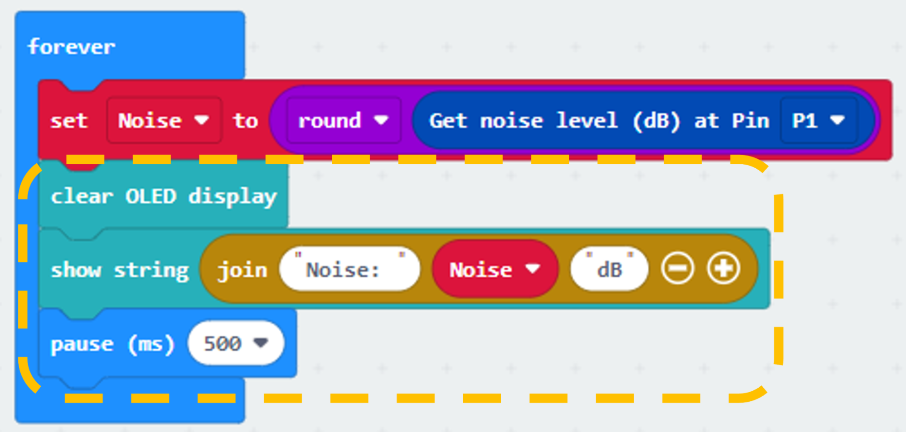

Part 3 Full Solution:

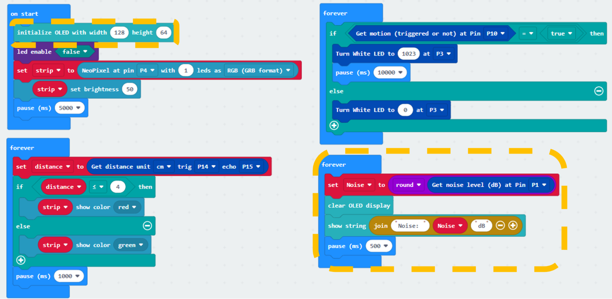

MakeCode: [https://makecode.microbit.org/_WFHf4874wdgC](https://makecode.microbit.org/_WFHf4874wdgC) 

You could also download the program from the following website: 

<iframe src="https://makecode.microbit.org/#pub:_WFHf4874wdgC" width="100%" height="500" frameborder="0"></iframe>

Part 3 Result

After initializing WiFi extension board and OLED, micro:bit will show a bar graph for the sound intensity in a city.

### Part 4: Setting up the Weather station (Case 6 Revised)

4.1 Hardware Connect

* Connect the Raindrop Sensor to P0 port of IoT:bit.

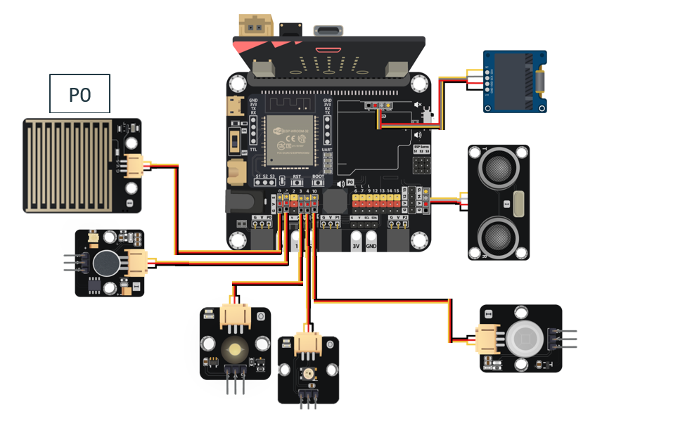

4.2 IOT Setup (ThingSpeak)

**Step 1**

* Go to [https://thingspeak.com](https://thingspeak.com), create an account and login.

**Step 2**

* Choose Channels -> My Channels -> New Channel

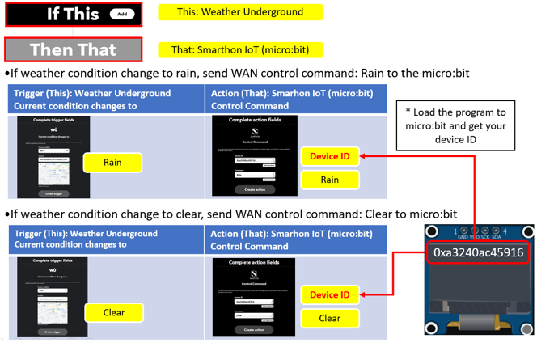

**Step 3**

* Input Channel name, Field1 and Field2 , then click “Save Channel”.
	* Channel name: Smart Weather Station
	* Field 1: temperature
	* Field 2: humidity
	* Field 3: raindrop

**Step 4**

* Select your channel > “API Keys”, copy the API key as follows:

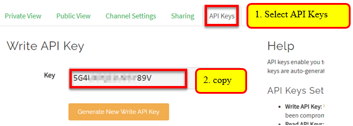

4.3 Programming (MakeCode)

**Step 1.Connect to WiFi**

* Snap Set Wi-Fi to ssid pwd from IoT:bit to on start.
* Enter your Wi-Fi name and password. Here we set smarthon as SSID and 12345678 as password.

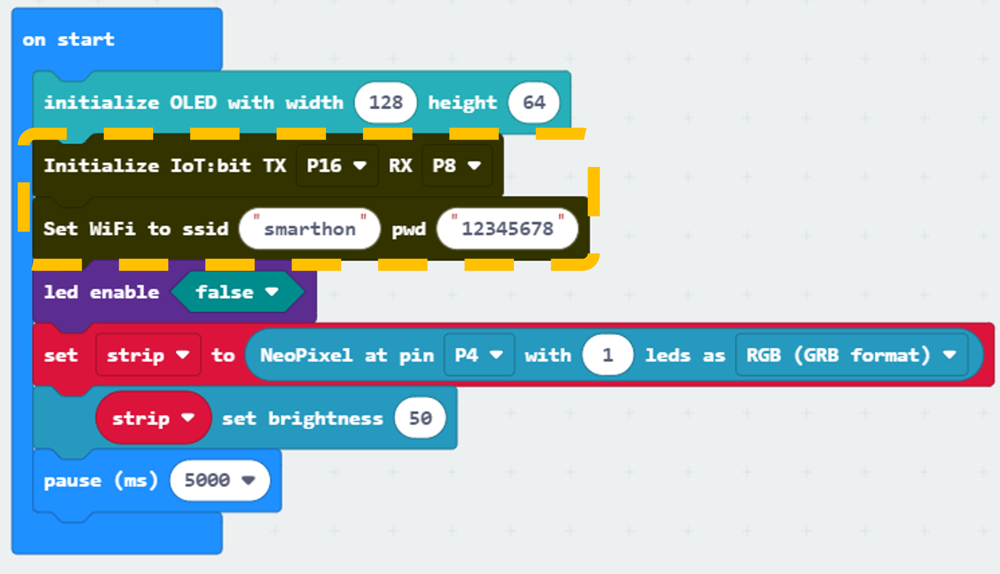

**Step 2. Show Device_ID after WiFi connection**

* Snap show string join from OLED to On WiFi connected, type “ID: ” into the front box and drag “Device_ID” into the next box.

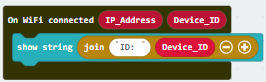

Part 4 Full Solution:

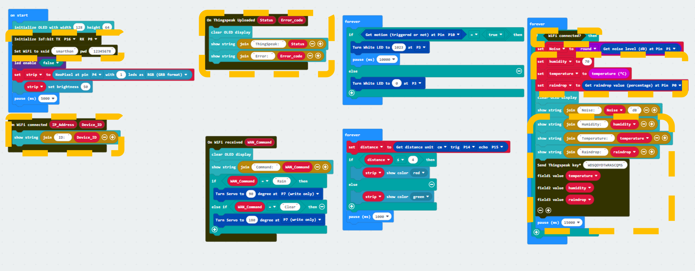

MakeCode: [https://makecode.microbit.org/S99169-95843-58913-87446](https://makecode.microbit.org/S99169-95843-58913-87446) 

You could also download the program from the following website: 

<iframe src="https://makecode.microbit.org/#pub:S99169-95843-58913-87446" width="100%" height="500" frameborder="0"></iframe>

Part 4 Result

When micro:bit is connected to WiFi, it will check weather information (temperature and raindrop value from the raindrop sensor). Then, those data will be sent to ThingSpeak and pause for 15 seconds for another update.

### Part 5: Setting up the Roof garden clothes rack (Case 11 Revised)

5.1 Hardware Connect

* Connect the White LED on P7 port of IoT:bit.

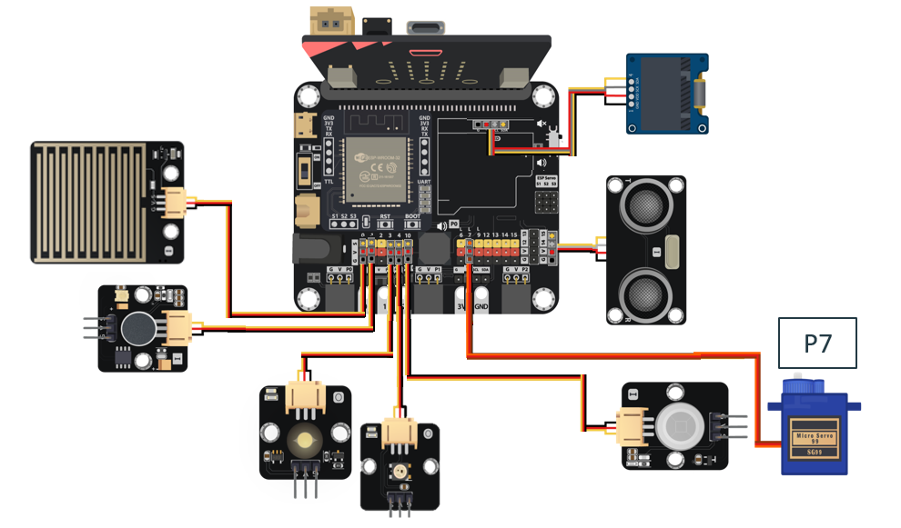

5.2 IOT Setup (IFTTT)

**For the setting of IFTTT, please refer to “Chapter 4: Cloud Control micro:bit by IFTTT”**

**Step 1. Create applet in IFTTT**

5.3 Programming (MakeCode)

**Step 1. Receive WAN command**

* Go to OLED, snap the clear OLED display to On WiFi received to avoid overlap.
* Snap the show string to On WiFi received.
* Draw the WAN\_Command variable to show string placeholder.

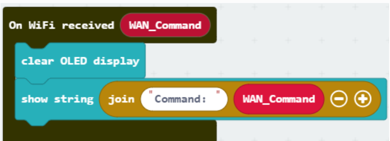

**Step 2. Control rack open/close by WAN command**

* Snap if-condition.
* Set variable WAN_Command = Rain into if-condition.
* Snap Turn Servo to … degree from SmartCity > Output.
* Set Servo degree to 90 at P7 (control the servo to open the rack).
* Set variable WAN_Command = Clear into else-if-condition.
* Snap Turn Servo to … degree from SmartCity > Output.
* Set Servo degree to 180 at P7 (control the servo to close the rack).

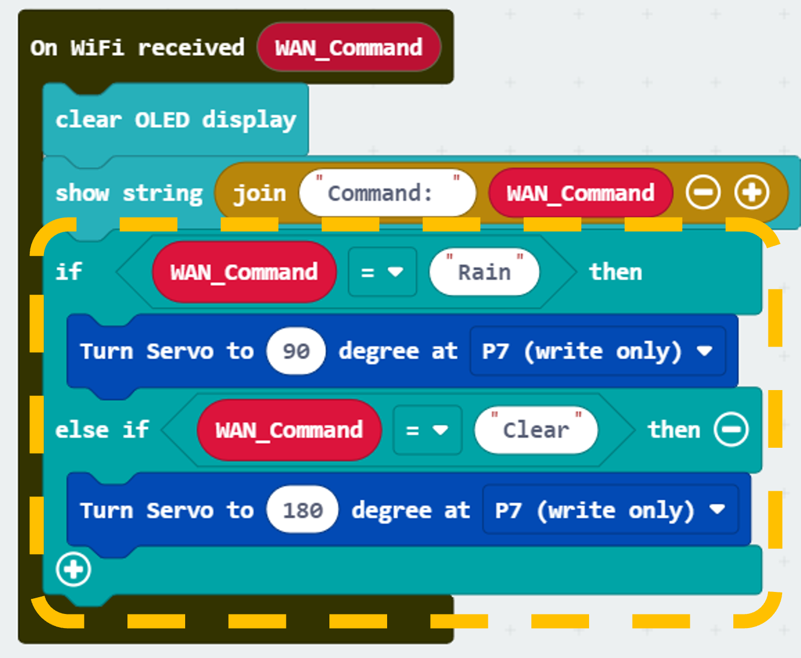

**Step 3. Adding a show Device ID function**

* From Input, add an on button A+B pressed.
* Snap show string Device ID.

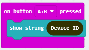

**Step 4. Press A to open clothes rack**

* Snap on button … pressed from Input, set button A.
* Snap Turn Servo to… from SmartCity > Output.
* Set servo to 90 degree at P7 (open clothes rack).

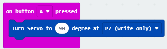

**Step 5. Press B to close clothes rack**

* Snap on button … pressed from Input, set button B.
* Snap Turn Servo to… from SmartCity > Output.
* Set servo to 180 degree at P7 (close clothes rack).

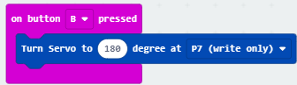

Part 5 Full Solution:

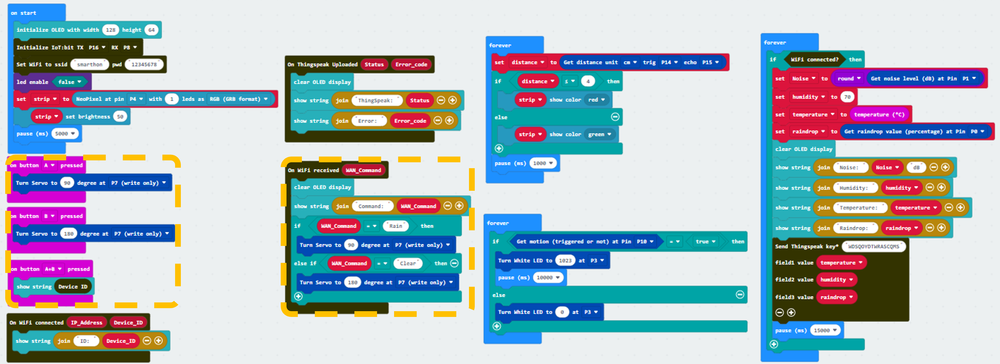

MakeCode: [https://makecode.microbit.org/S93647-52922-40672-26216](https://makecode.microbit.org/S93647-52922-40672-26216) 

You could also download the program from the following website: 
<iframe src="https://makecode.microbit.org/#pub:S93647-52922-40672-26216" width="100%" height="500" frameborder="0"></iframe>

Part 5 Result

The micro:bit is controlled by IFTTT (trigger by weather open data). When the weather condition change to “Rain”, the cloth rack will be opened. When the weather condition change to “Clear”, the cloth rack will be closed.

