# Scenario Example 3 : Transport safety and security

Level: 
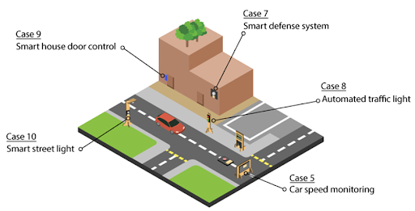

## Introduction

**Transport safety and security** is the primary concern of a city. Car speed and traffic conditions are being monitored in the public transportation system. Only the responsible person of the corporation can enter the building, alerts will be sent on the network if there are suspicious people nearby.
This Scenario is the integration of these five functions:

* Car speed monitoring (Case 5)
* Automated Traffic Light (Case 8)
* Smart Street Light (Case 10)
* Smart defense system (Case 7)
* Smart House door control (Case 9)

## Part List

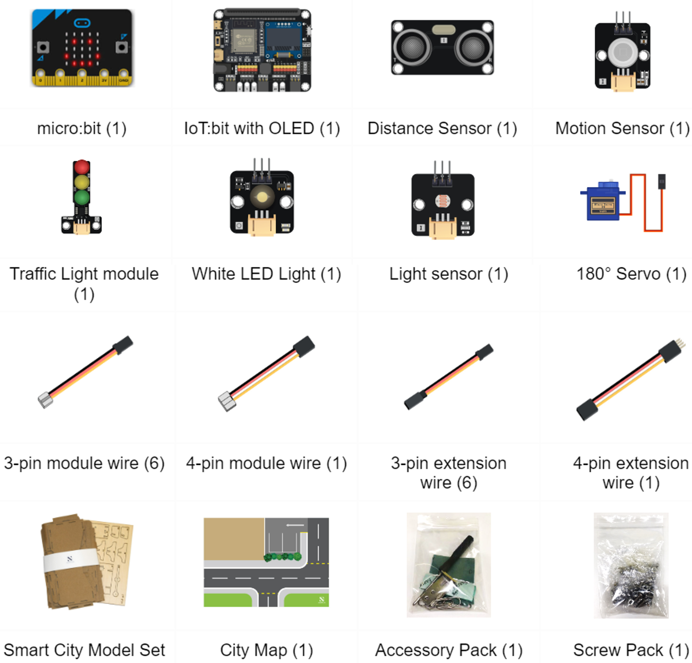

## IOT Technology Applied

* App Inventor 2
* IFTTT
* WiFi channel

## Assembly Step

Refer case 5,7,8,9,10

## Hardware connect

* Connect the Distance Sensor to P14 (trig)/ P15 (echo) port of IoT:bit.
* Extend the connection of OLED to the I2C connection port of IoT:bit.
* Connect the Light Sensor to P0 port of IoT:bit.
* Connect the Traffic LED Module to P12 port of IoT:bit.
* Connect the white LED Light to P13 port of IoT:bit.
* Connect the Motion Sensor to P1 port of IoT:bit.
* Connect the 180ᵒ Servo to P2 port of IoT:bit.

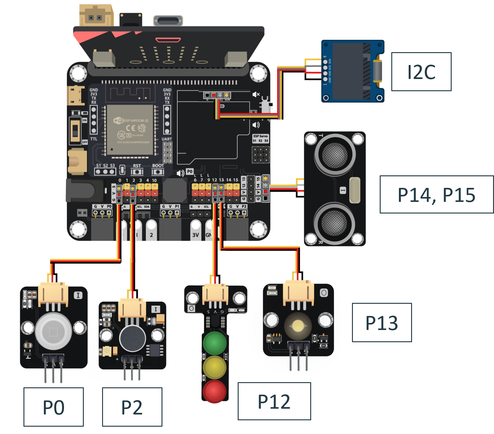

## Programming (MakeCode):

**Scenario 3 Full Solution**

MakeCode: [https://makecode.microbit.org/S83728-02634-27399-17895](https://makecode.microbit.org/S83728-02634-27399-17895) 

You could also download the program from the following website: 
<iframe src="https://makecode.microbit.org/#pub:S83728-02634-27399-17895" width="100%" height="500" frameborder="0"></iframe>

## Step By Step Tutorial

### Part 1: Setting up the Car speed monitoring (Case 5 Revised)

1.1 Hardware Connect

* Connect the Distance Sensor to P14 (trig)/ P15 (echo) port of IoT:bit.
* Extend the connection of OLED to the I2C connection port of IoT:bit.

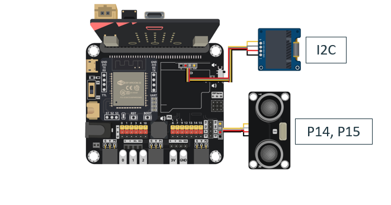

 1.2 Programming (MakeCode)

**Step 1. Initialize OLED screen**

* Drag Initialize OLED with width:128, height: 64 to on start.
* Set distance1, distance2 and speed to 0 from variables.

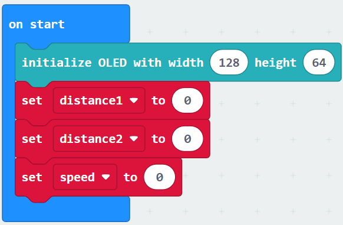

**Step 2. Set up function (calculate_Speed)**

* Set up a new function calculate_Speed from Advanced > Functions.
* Set distance1 to get distance unit cm trig P14 echo P15 (distance from the car to the distance sensor before 1 second) Drag Pause to wait 1000ms and set distance2 to get distance unit cm trig P14 echo P15 (distance from the car to the distance sensor after 1 second).
* By the equation of speed = distance / time. We get the speed of the moving car to (distance1-distance2)/1 (unit: cm/s).

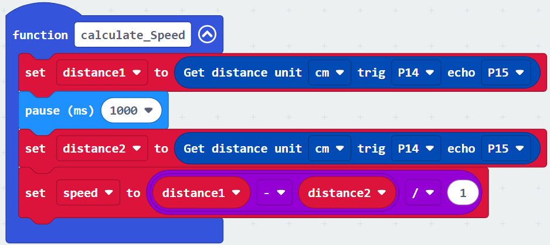

**Step 3. Calculate car speed**

* In block forever, call function calculate_Speed from Advanced > Functions to get the speed of the moving car.
* Snap If statement into the loop.
* Plot bar graph of … from Led and draw variable speed into the plotted value. Set value up to 20.
* In if speed ≥0, snap clear OLED display from OLED to avoid overlap.
* Snap show string and show value of variables distance1, distance2 and speed.

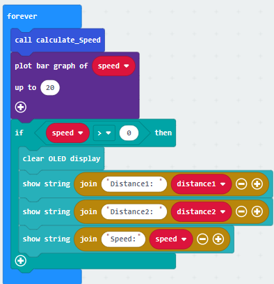

Part 1 Solution:

MakeCode: [https://makecode.microbit.org/S93284-55697-22581-30236](https://makecode.microbit.org/S93284-55697-22581-30236) 

You could also download the program from the following website: 
<iframe src="https://makecode.microbit.org/#pub:S93284-55697-22581-30236"width="100%" height="500" frameborder="0"></iframe>

Part 1 Result

It will keep checking the distance of cars from distance sensor by distance sensor in every 1s. The speed of the cars will be shown on OLED. A bar chart of speed will be shown on micro:bit LED also.

### Part 2: Setting up the Automated Traffic Light (Case 8 Revised)

2.1 Hardware Connect

* Connect the Light Sensor to P0 port of IoT:bit.
* Connect the Traffic LED Module to P12 port of IoT:bit.

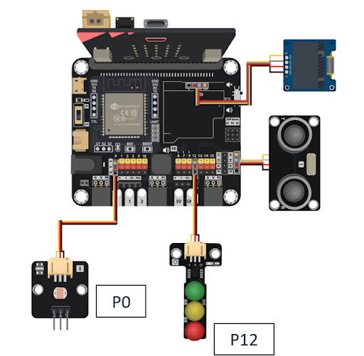

2.2 Programming (MakeCode)

**Step 1. Connect to WiFi**

* Snap Initialize IoT:bit TX P16 RX P8 from IoT:bit to on start.
* Snap Set Wi-Fi to ssid pwd from IoT:bit.
* Enter your Wi-Fi name and password.
* Set variable oldmsg to “” from variables.

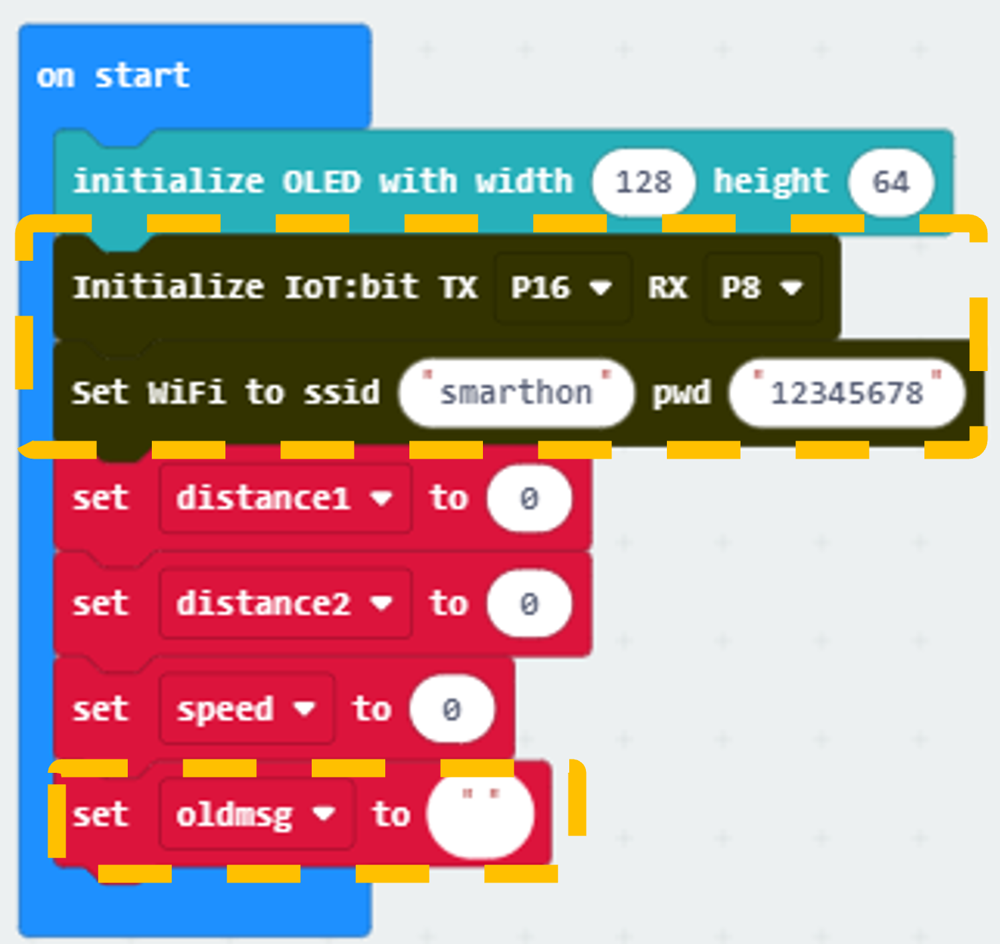

**Step 2. Show icon “tick” and join channel after WiFi connection**

* Snap show icon from basic to On WiFi connected and select icon tick.
* Snap show string Device_ID.
* Snap WiFi Receiver join channel from IoT:bit > channel.
* Set channel to tsuenwan.

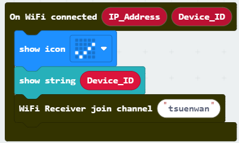

**Step 3. Check traffic status**

* Snap if statement to block forever
* If WiFi is connected,
* Create a new variable light2 and set light2 to light value from light sensor at P0.
* Snap clear OLED display from OLED to avoid overlap.
* Snap show string and show value of variables light2.
* Pause 6000 (ms) to another checking.

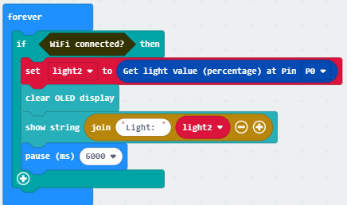

**Step 4. Send notification when someone pass by**

* Snap if statement
* Set light2 < 10 in to if-condition (traffic jam is detected)
* Snap WiFi Sender send channel… message… from IoT:bit > channel
* Set channel to tsuenwan, message trafficjam
* Set else-condition (traffic jam is not detected)
* Snap WiFi Sender send channel… message… from IoT:bit > channel
* Set channel to tsuenwan, message nojam

**Step 5. Receive WiFi message**

* Snap On WiFi Receiver received.
* Go to OLED, snap the clear OLED display to On WiFi received to avoid overlap.
* Snap the show string.
* Draw variable receivedMessage to show string placeholder.

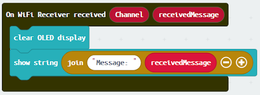

**Step 6. Set up a new function (TurnRed)**

* Control traffic light at P12 green on from SmartCity > Output.
* Pause for 2000ms from basic.
* Control traffic light at P12 yellow on, pause for 2000ms.
* Control traffic light at P12 red on and pause for 2000ms.

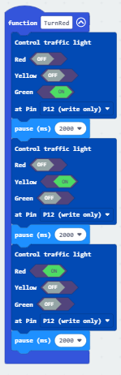

**Step 7. Set up a new function (TurnGreen)**

* Control traffic light at P1 red on from SmartCity > Output.
* Pause for 2000ms from basic.
* Control traffic light at P1 red and yellow on, pause for 2000ms.
* Control traffic light at P1 green on and pause for 2000ms.

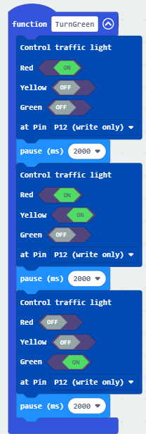

**Step 8. Set traffic light default status**

* Insert function TurnGreen to on start.

**Step 9. Change traffic light status**

* Snap if-statement, set received Message ≠ oldmsg to if-condition.
* Set oldmsg = receivedMessage (renew the latest traffic status).
* Snap another if-statement.
* Set receivedMessage = trafficjam to if-condition.
* Call function TurnRed.
* Set receivedMessage = nojam to else-if-condition.
* Call function TurnGreen.

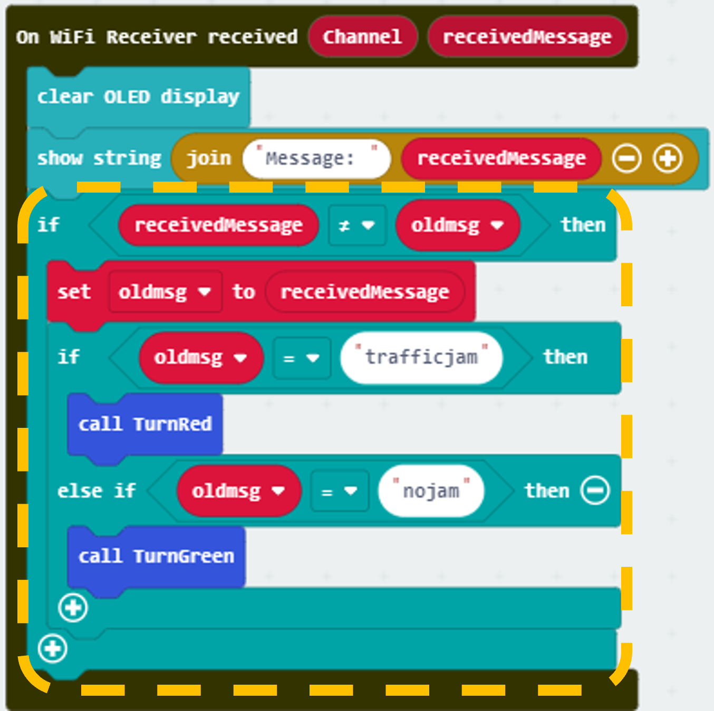

Part 2 Full Solution:

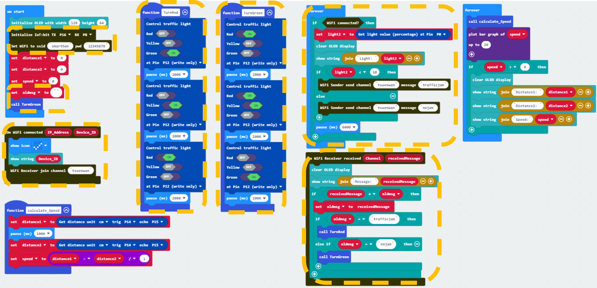

MakeCode: [https://makecode.microbit.org/S40130-05094-04914-35523](https://makecode.microbit.org/S40130-05094-04914-35523) 

You could also download the program from the following website: 

<iframe src="https://makecode.microbit.org/#pub:S40130-05094-04914-35523"width="100%" height="500" frameborder="0"></iframe>

Part 2 Result

Light sensor is used to detect if there are traffic jam. Once the light intensity is not low, it indicates that there is a traffic jam on the road. Wi-Fi message “nojam” will be sent to another micro:bit (receiver).

Once the light intensity is too low, it indicates that there is a traffic jam on the road. Wi-Fi message “trafficjam” will be sent to another micro:bit (receiver).

### Part 3: Setting up the Smart Street Light (Case 10 Revised)

3.1 Hardware Connect

* Connect the white LED Light to P13 port of IoT:bit.

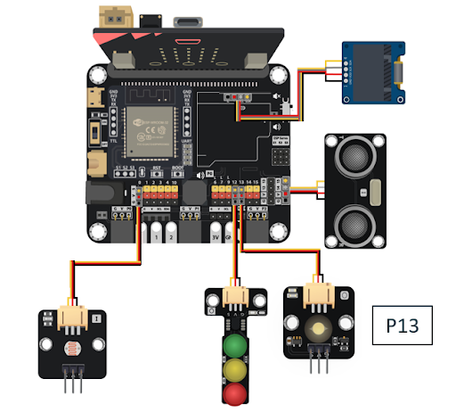

3.2 IOT Setup (IFTTT)

**For the setting of IFTTT, please refer to “Chapter 4: Cloud Control micro:bit by IFTTT”**

**Step 1. Create applet in IFTTT**

3.3 Programming (MakeCode)

**Step 1. Receive WAN command**

* Go to OLED.
* Snap the clear OLED display to On WiFi received to avoid overlap.
* Snap the show string to On WiFi received.
* Draw the WAN_Command variable to show string placeholder.

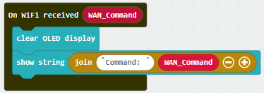

**Step 2. Turn on/off LED by WAN command**

* Snap if-condition.
* Set variable WAN_Command = lighton into if-condition.
* turn White LED … from SmartCity > Output, turn white LED with intensity: 1023 at P13.
* Set variable WAN_Command = lightoff into else-if-condition.
* Snap turn White LED … from SmartCity > Output, turn white LED with intensity: 0 at P13.

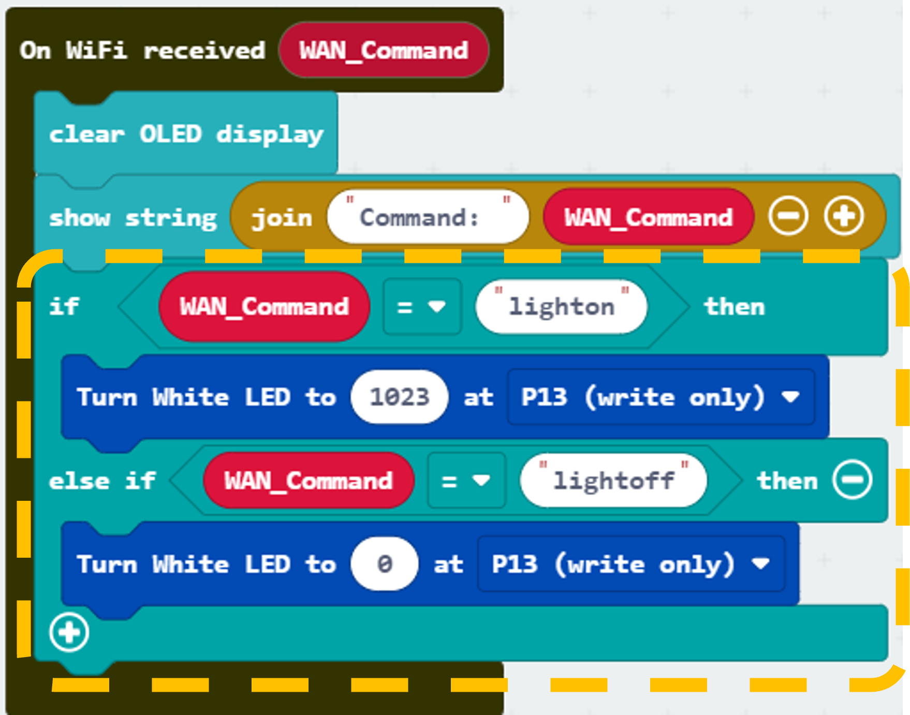

Part 3 Full Solution:

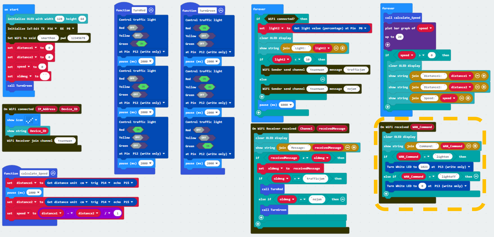

MakeCode: [https://makecode.microbit.org/S60159-60734-94514-19552](https://makecode.microbit.org/S60159-60734-94514-19552) 

You could also download the program from the following website: 

<iframe src="https://makecode.microbit.org/#pub:S60159-60734-94514-19552" width="100%" height="500" frameborder="0"></iframe>

Part 3 Result

The micro:bit is controlled by IFTTT (trigger by date&time). The LED light will be turned on at 6pm and turned off at 6am every day.

### Part 4: Setting up the Smart defense system (Case 7 Revised)

4.1 Hardware Connect

* Connect the Motion Sensor to P1 port of IoT:bit.

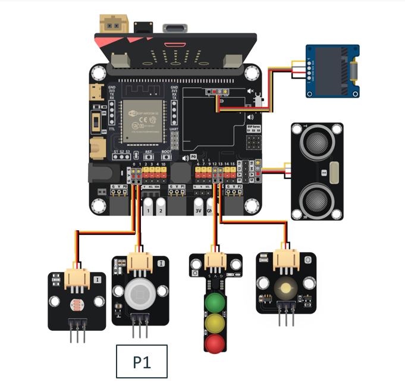

4.2 IOT Setup (IFTTT)

**For the setting of IFTTT, please refer to “Chapter 4: Cloud Control micro:bit by IFTTT”**

**Step 1**

* Go to https://ifttt.com , create applet (if webhooks then Email).

**Step 2**

* Go to “My services” > “Webhooks”, select “Documentation” . Copy your Webhooks Key as follows:

4.3 Programming (MakeCode)

**Step 1. Show Device ID**

* Get on button A+B pressed in Input.
* Snap show string and snap Device ID.

**Step 2. Show IFTTT Uploaded Status**

* Get On IFTTT uploaded from IoT:Bit > IoT:Service.
* Snap the clear OLED display to On WiFi received to avoid overlap.
* Snap show string inside On IFTTT Uploaded
* Draw the variable Status and Error_code to block show string

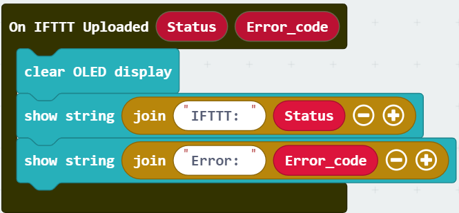

**Step 3. Check motion sensor value**

* Snap if statement to block forever.
* If WiFi is connected,
* If get motion (triggered or not) at Pin P1 = true then, that’s say someone is near the door.

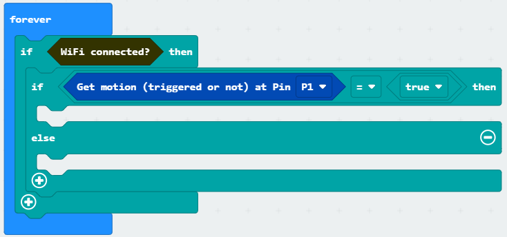

**Step 4. Send notification when someone pass by**

* Snap if statement to block forever.
* If WiFi is connected,
* Snap Send IFTTT key… from IoT:bit > IoT Services, input your IFTTT key and input event name email2.
* Snap show icon from basic and select a monster icon.
* Snap Pause after if statement to the loop for 5 seconds delay for checking.

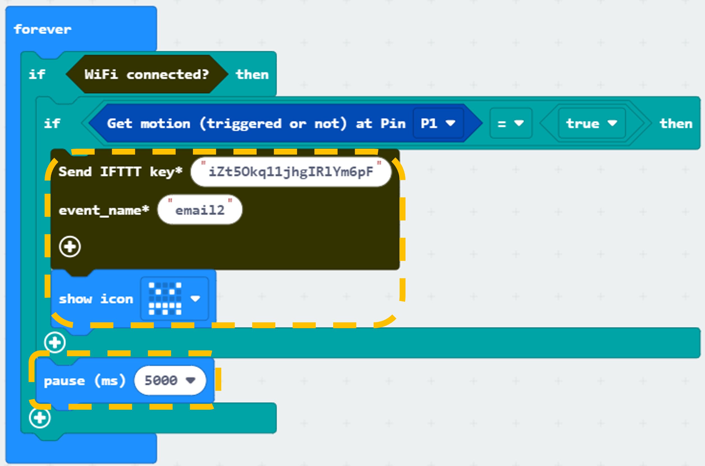

Part 4 Full Solution:

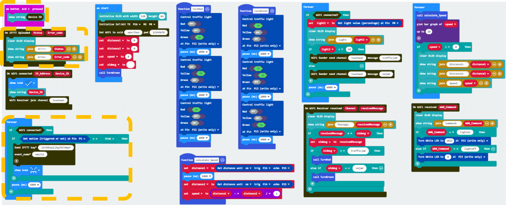

MakeCode: [https://makecode.microbit.org/S64338-20403-57038-16388](https://makecode.microbit.org/S64338-20403-57038-16388) 

You could also download the program from the following website: 

<iframe src="https://makecode.microbit.org/#pub:S64338-20403-57038-16388" width="100%" height="500" frameborder="0"></iframe>

Part 4 Result

When WiFi is connected, if there are any suspicious movement near the door, the buzzer will emit sound and an email will be sent to the house owner. Also, a monster icon will be shown on the micro:bit.

### Part 5: Setting up the Smart House door control (Case 9 Revised)

5.1 Hardware Connect

* Connect the 180ᵒ Servo to P2 port of IoT:bit.

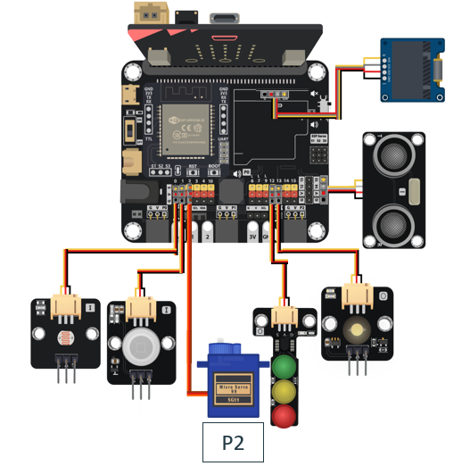

5.2 IOT Setup (App Inventor)

**For more details, please refer to “Chapter 3: Direct control micro:bit by App Inventor 2”**

**Step 1. Create the page with the components**

* On Designer:
* Drag the components from the left menu – we will need buttons to open or close the door and a textbox for input the Device ID number.
* Also, add the invisible component “Web” under connectivity, we will need it for WAN connection

**Step 2. Make the programming part**

* On Blocks:
* The WAN control command URL is:http://control.smarthon.cc/publish?id=DeviceID&msg=ControlCommand
* When Button1 is clicked, it will direct to the URL with given device ID and command “opendoor”.

* When Button2 is clicked, it will direct to the URL with given device ID and command “closedoor”.

* Download the App in your phone to by .apk or scan QR code.

5.3 Programming (MakeCode)

**Step 1. Set servo initial position**

* Snap Turn Servo to … degree from SmartCity > Output
* Turn servo to 180 degree at pin P2 (the servo will control the door to be closed initially)

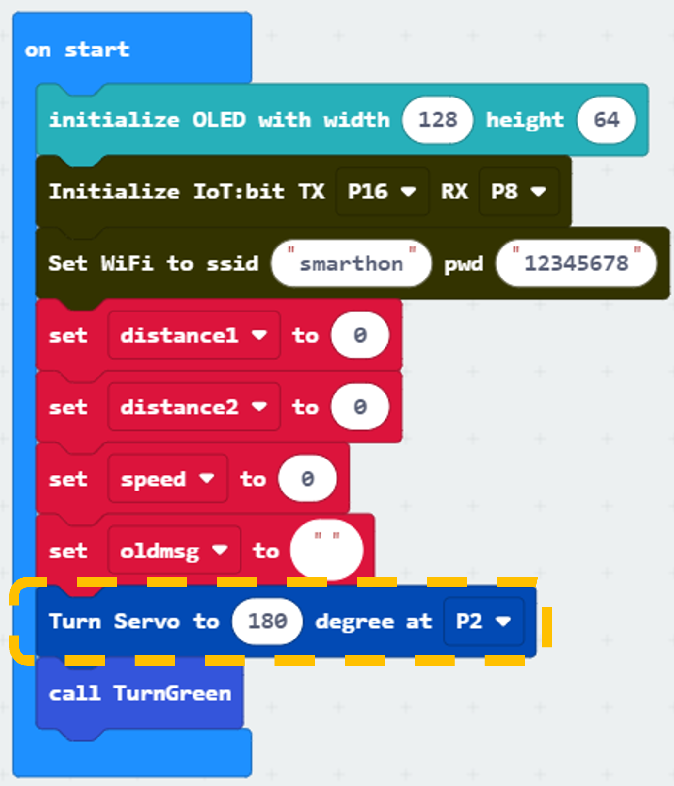

**Step 2. Open/close door by WAN command**

* If WAN command opendoor is received, turn servo to 45 degree at P2 (open door angle)
*If WAN command closedoor is received, turn servo to 180 degree at P2 (close door angle)

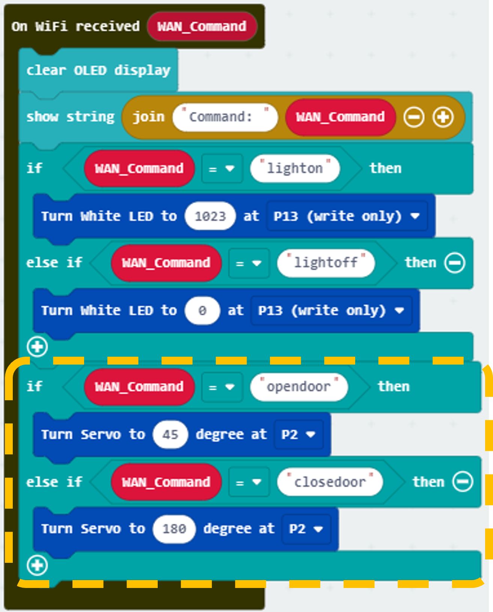

Part 5 Full Solution:

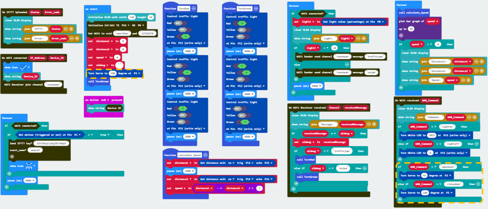

MakeCode: [https://makecode.microbit.org/S83728-02634-27399-17895](https://makecode.microbit.org/SS83728-02634-27399-17895) 

You could also download the program from the following website: 
<iframe src="https://makecode.microbit.org/#pub:S83728-02634-27399-17895" width="100%" height="500" frameborder="0"></iframe>

Part 5 Result

Input your device ID number in the textbox, then click button “opendoor” to send command “opendoor”. Click button “Close Door” to send command “closedoor”.

With app inventor and micro:bit, you can control the door open/close by mobile app!

