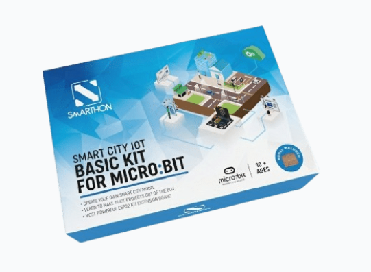
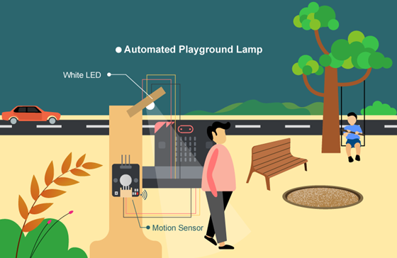
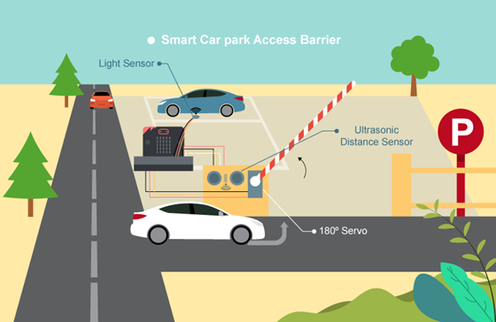

# Introduction

## Introduction
Smarthon Smart City IoT Starter kit is designed to introduce Internet of things (IoT). With basic knowledge of computing knowledge and electronics provided in the kit, you can be a city creator and build a unique IoT system in the city. Based on Smarthon IoT board, which is compatible with multiple sensors and actuators, you can design city features; for example: using sensors to detect traffic status and upload city information to the internet. 

 

## Application Scene
<H3>Automated Playground Lamp</H3>

<H3>Smart Car park Access Barrier</H3>

For more practical case, please refer to the materials.

## Component List

No | Component |Quantity|Remark
:-: | :-- | :--| :--
|Micro: bit|1|not included
1|Smarthon Basic:bit|1|
2|Raindrop sensor|1|
3|Traffic Light|1|
4|Ultrasonic Distance Sensor|1|
5|White LED|1|
6|Multi-Colour LED (WS2812)|1|
7|Light Sensor|1|
8|PIR Motion Sensor|1|
9|180° Servo|1|

