# Case 04: Urban noise detection

Level: 
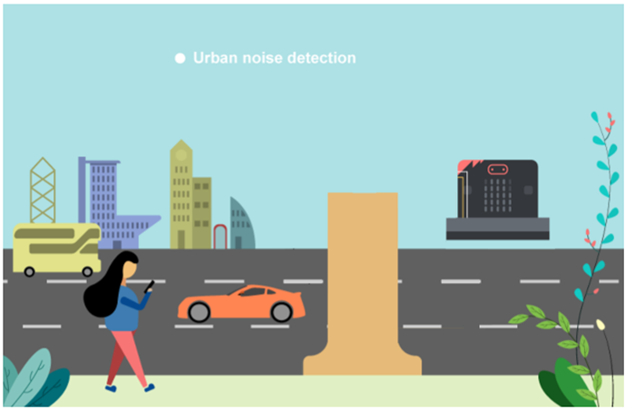

## Goal

Make a noise detection point to detect the noise volume near the roadside using noise sensor. 

## Background

What is urban noise detection?

It is a system to detect noise near the road as noise pollution caused by cars on the road seriously affect the living standard of people. By installing a monitor to detect the noise volume near the roadside can help engineer to gather noise information and find solution to solve the problem in the future. 

Noise detection operation

The noise sensor can detect the volume in dB near the roadside. A bar graph of sound intensity will be shown on the micro:bit LED display to represent the noise level in real-time. 

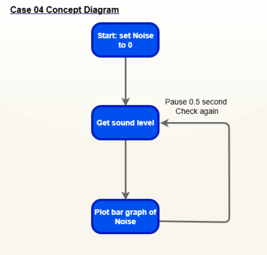

## Part List

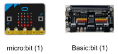

## Assembly step 

Step 1 Materials: micro:bit ,Basic:bit
.

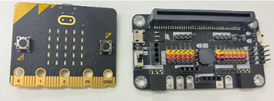

Step 2 Finished look:

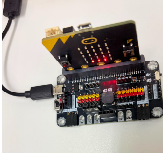

*You can buy the material set from smarthon website.
## Hardware connect

Connect Noise Sensor to P1 port of IoT:bit 

Extend the connection of OLED to I2C connection port of IoT:bit 

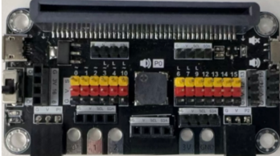

## Programming (MakeCode)

Step 1. Initialize the variable

* Drag Set `Noise` to `0` from the `variables` category to the on `start` block.
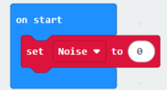

Step 2. Display the noise level as a bar graph on the LED matrix.

*In the `forever` block, Set `Noise` to sound level.
* Use the `plot bar graph` of block to visualize the `Noise` variable. Set the `maximum value` to `255` to represent the scale.
*Add a `pause (ms) 500` block to the `loop` for a smoother update interval.
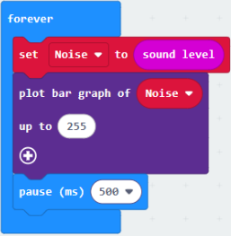

Full Solution 

MakeCode: <a href="https://makecode.microbit.org/_0kAEuieuuLqF" target="_blank">https://makecode.microbit.org/_0kAEuieuuLqF</a>

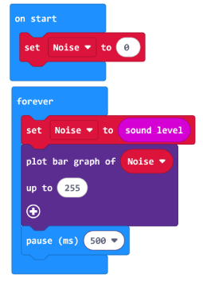

## Results

After the program starts, the micro:bit will display a real-time bar graph on its LED matrix representing the sound intensity. The more LEDs that light up, the louder the ambient noise. 

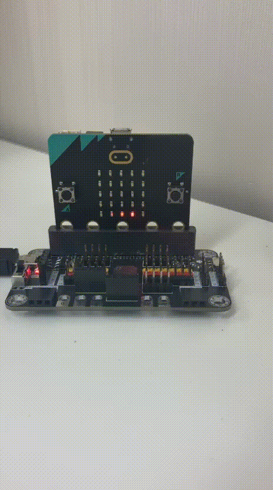

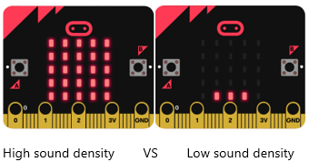

## Think

Q1. How to make a notification if noise pollution problem is serious? i.e. showing red LED 

