# Case 05: Car speed monitoring 

Level: 
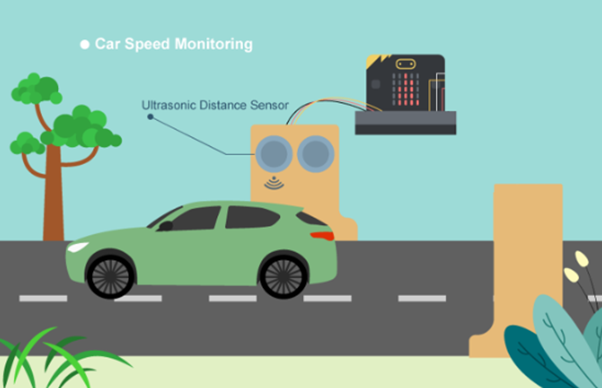

## Goal

Make a car speed monitor to detect car speed. When speed exceeds 70 cm/s, it triggers a sound alarm and shows the value. 

## Background

What is car speed monitoring?

It is an automatic system to check car speed on the road. By monitoring speed, we can issue warnings to prevent traffic accidents caused by over-speeding. 

Car speed monitor operation

The distance sensor measures two distances every 500ms. The system calculates the speed and displays a bar graph or speed value on the micro:bit LED matrix.
Alert Logic: If the speed reaches 70 cm/s, the buzzer will sound an alarm and the LED will display a warning "X" followed by the speed number. 

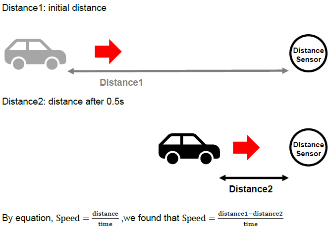

If distance 1 ≥ distance 2, the car is moving towards the sensor. The distance moved is distance1-distance2, and the speed is calculated as (distance1-distance2)/0.5 (unit: cm/s) 

Speed Alert Logic: 

If speed ≥ 70, the micro:bit displays an "X" icon, triggers the buzzer alarm, and scrolls the speed value.
If 0 ≤ speed < 70, it plots a bar graph on the LED matrix to show instant speed.
If speed < 0, it is the exceptional case (the car turns left/right and leave the road) and the display will be cleared.

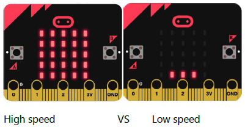

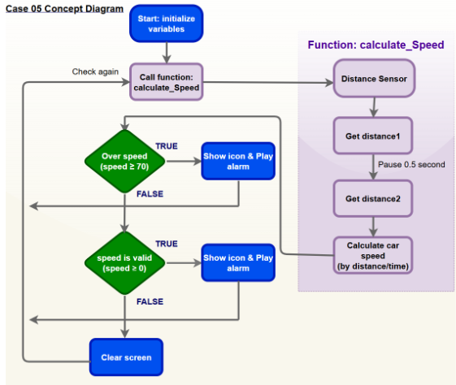

## Part List

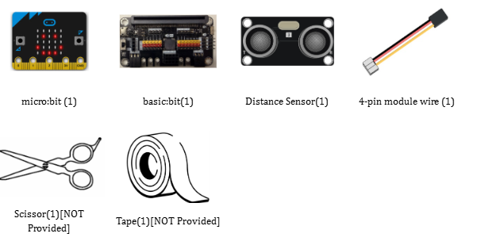

## Assembly step

1. Materials: Cardboard , scissors and tape. 

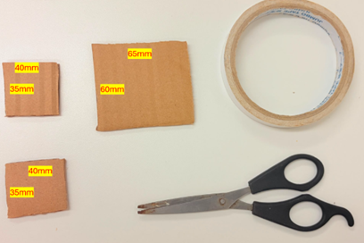

2. Make the holes: 

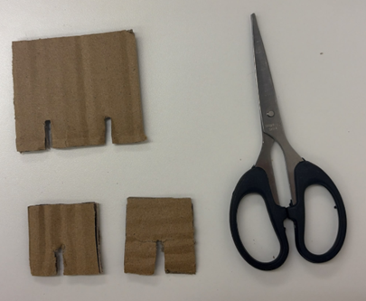

3. Finished look: 

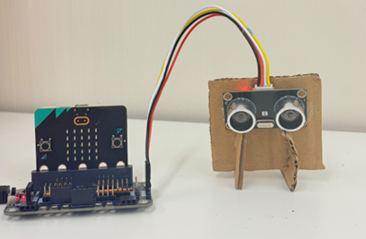

*You can buy the material set from smarthon website.

## Hardware connect

Connect the Distance Sensor to P14 (trig)/ P15 (echo) port of IoT:bit  

Extend the connection of OLED to the I2C connection port of IoT:bit  

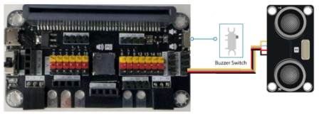

## Programming (MakeCode)

Step 1. Initialize Variables

* From the `Variables` category, drag the blocks to set `distance1`, `distance2`, and `speed` to `0` into the on `start block`.

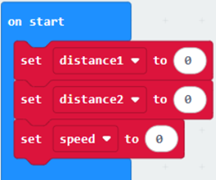

Step 2. Set up function (calculate_Speed)

* Set up a new `function` `calculate_Speed` from 'Advanced' > 'Functions'.
* Set `distance1` to get distance unit cm `trig P14` `echo P15` (distance from the car to the distance sensor before 0.5 second) Drag `Pause` to `wait 500ms` and set `distance2` to get `distance` unit cm `trig P14` `echo P15` (distance from the car to the distance sensor after 0.5 second)
* By the equation of speed = distance / time. We get the speed of the moving car to (distance1-distance2)/0.5 (unit: cm/s)
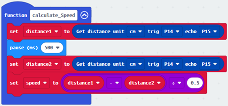

Step 3. Calculate car speed

* In block forever, call function `calculate_Speed` from `Advanced` > `Functions` to get the speed of the moving car
* Snap `If statement` into the loop
* If speed ≥70, then show icon `No`, play music, and show `number` speed. `Else if speed ≥ 0`, plot bar graph of speed up to `20`.
* Otherwise, `clear screen` from Basic to reset the display. 
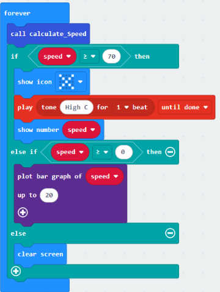

Full Solution 

MakeCode: <a href="https://makecode.microbit.org/_hPbD4dbAfD1a" target="_blank">https://makecode.microbit.org/_hPbD4dbAfD1a</a>

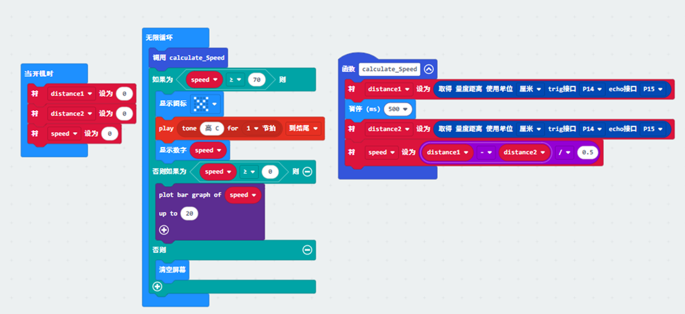

## Results

It will keep checking the distance of cars from distance sensor by distance sensor in every 500ms. If the speed is ≥ 70, a sound alarm will trigger and the speed value will be shown on micro:bit LED. A bar chart of speed will be shown on micro:bit LED when the speed is within the normal range. 

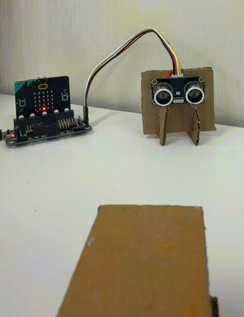

## Think

How can we set different sound frequencies or melodies to represent different levels of over-speeding? 

