# IoT Case 06: Weather Station 

Level: 
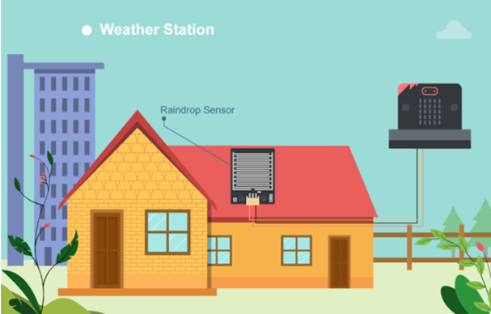

## Goal

Make a weather station which gets the values from the raindrop sensor and built-in temperature sensor. 

## Background

Local Data Monitoring 

The weather station provides an instant display of environmental data. In this case, we will use the Serial Monitor to observe the sensor data trends in real-time. 

Weather station operation 

Collecting temperature and raindrop values consistently. This helps us observe environmental changes more conveniently through data graphs on the computer. 

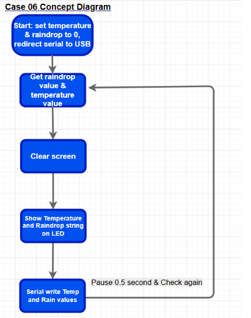

## Part List

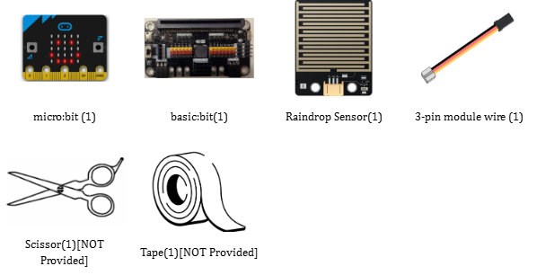

## Assembly step

1. Materials: 6 Cardboards(11.5cm x 13cm ) , scissors and tape. 

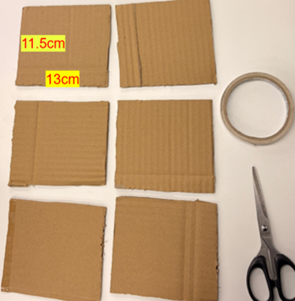

3. Finished look: 

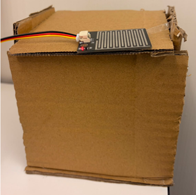

*You can buy the material set from smarthon website.

## Hardware connect

Connect the Raindrop Sensor to P0 port of Basic:Bit 

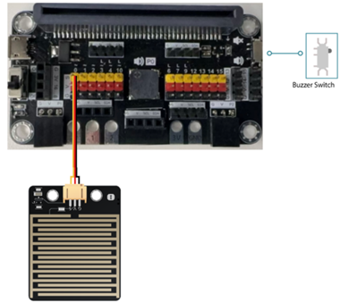

*Pull the buzzer switch 'up' to disconnect the buzzer in this execrise*

## Programming (MakeCode)

Step 1. Initialize variables and show status 

* Set `variable` `raindrop` and `temperature` to `0`. 
* Snap `show icon (tick)` from `Basic` to `on start` 
* Snap `serial redirect to USB` to `on start` 
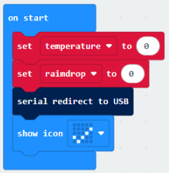

Step 2. Get temperature and raindrop values in loop 

* Drag the `forever block` from `Basic`. 
* Snap `set temperature` to temperature (°C) from `Input` 
* Snap `set raindrop` to get `raindrop` value (percentage) at Pin `P0` 
* Snap `serial write value` "Temp" = `temperature to send data to computer` 
* Snap `serial write value` "Rain" = `raindrop to send data to computer` 
* Snap pause (ms) 500 to the loop

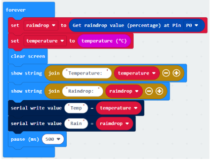

Full Solution 

MakeCode: <a href="https://makecode.microbit.org/_7f8VVCJ7WMAf" target="_blank">https://makecode.microbit.org/_7f8VVCJ7WMAf</a>

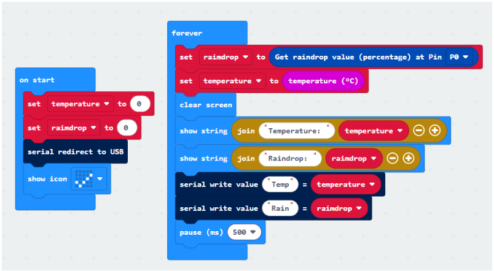

## Result

When micro:bit is turned on, the LED matrix will show a “tick” icon to indicate that the initialization is complete. The micro:bit will then consistently collect weather information, and you can see the real-time data values directly on the micro:bit device. 

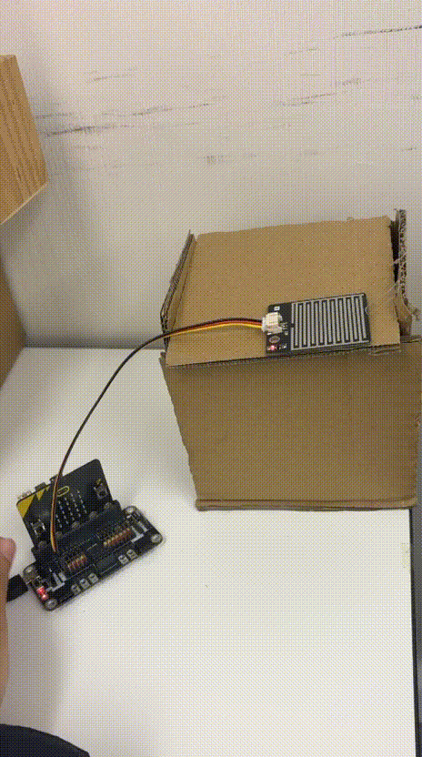

Additionally, by clicking the “Show console device” button in MakeCode, you can view more detailed data and instant graphs of temperature and raindrop values on your computer for better monitoring.

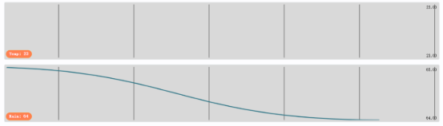

## Think

Q1. How can we monitor other sensor values (e.g., noise) using the Serial Monitor? 

