# IoT Case 07: Smart defense system

Level: 
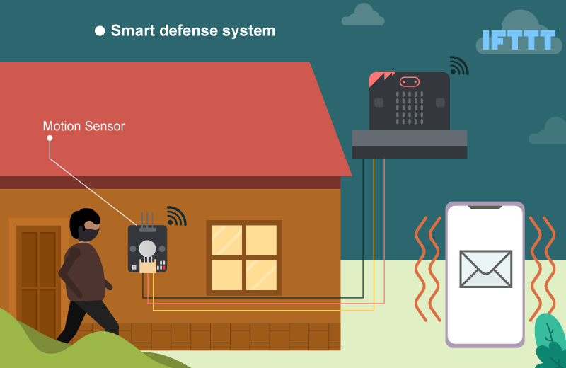

## Goal

Make a smart defense system which emits sound and sends an email to the house owner if there are any suspicious movement near the door. 

## Background

What is a Motion Sensor? 

A motion sensor (PIR) is a device that detects moving objects, especially people, by measuring infrared light radiating from objects in its field of view. 

Smart defense system operation 

The motion sensor can deliver a motion signal to the micro:bit. When the micro:bit detects the signal, the buzzer will emit sound to alert the owner immediately. Also, a monster icon will be shown on the micro:bit to warn any suspicious people passing by. 

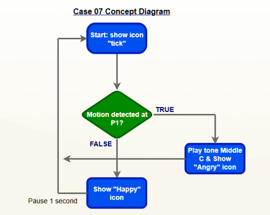

## Part List

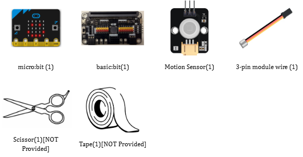

## DIY Installation & Mounting

1. Materials: 6 Cardboards(11.5cm x 13cm ) , scissors and tape. 

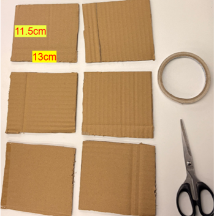

2. Make the holes: 

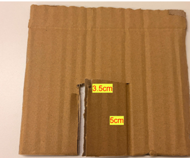

3. Finished look: 

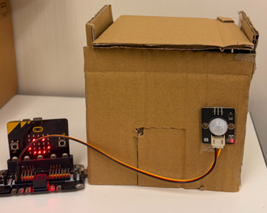

*You can buy the material set from smarthon website.

## Hardware connect

Connect the Motion Sensor to P1 port of IoT:bit 
Turn on the Buzzer Switch on P0 port of IoT:bit 
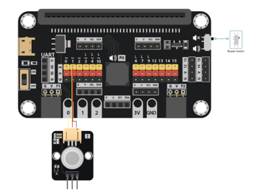

*Pull the buzzer switch <B>'down'</B> to connect the buzzer in this execrise*

## Programming (MakeCode)

Step 1. Initialize System 

* Snap `show icon (tick)` to `on start`. This indicates the program has started successfully and the system is ready. 
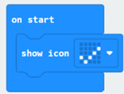

Step 2: Check motion sensor value 

* Snap `if statement` into `forever block`. `If Get motion` at `Pin P1 = true`, then it means someone is near the door.
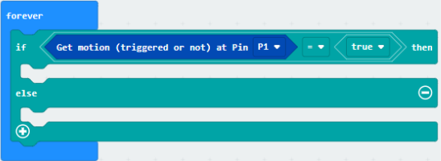

Step 3. Sound and Visual Alarm 

*If triggered, `play tone` `Middle C `for `1 beat` and show icon `monster`.
*Else, show icon `smile`.
*Snap `pause (ms) 1000` at the end of the `loop` for 1 second delay.
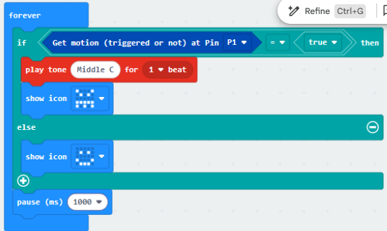

 
Full Solution 

MakeCode: <a href="https://makecode.microbit.org/_fmLDcg39ERhx" target="_blank">https://makecode.microbit.org/_fmLDcg39ERhx</a>
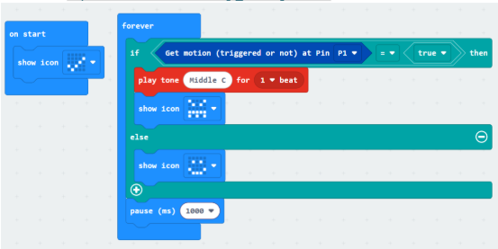

## Result 

If there is any suspicious movement detected near the door, the buzzer will emit an alarm sound immediately and a monster icon will be shown on the micro:bit to warn the intruder. When it is safe, a smile icon will be shown. 

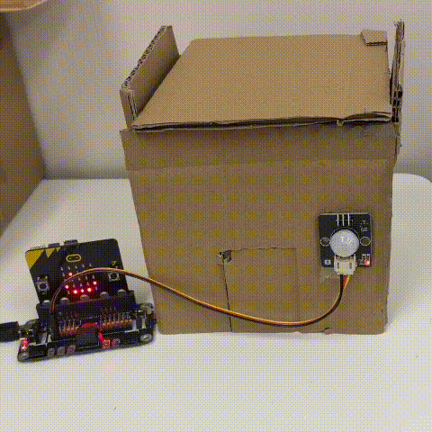

## Think

Q1. How to prevent the buzzer from beeping continuously when someone stays near the door? (tips: using a variable as a 'flag') 

Q2. How to let the owner pass without triggering the alarm (e.g. pressing a specific button as a password) 

