# IoT Case 08: Automated Traffic Light

Level: 

* For more details, please refer to “Chapter 5: Object to Object communication”
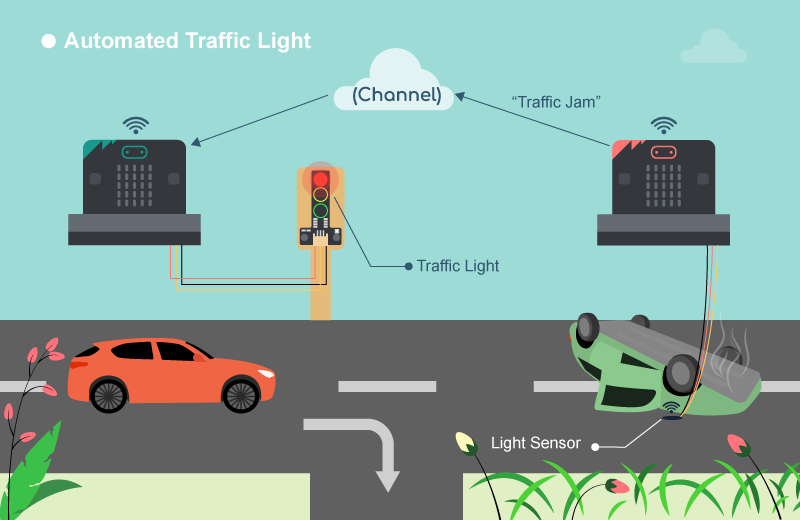

## Sender

### Goal

Make a sender to send signal to another micro:bit to show if there is traffic jam or not. 

### Background

How to send signal to another micro:bit?

Micro:bits can communicate with each other using their built-in Radio function. By setting both the sender and receiver to the same Radio Group, they can exchange messages instantly. When the sender detects a traffic jam (low light), it sends a radio string "trafficjam". When the road is clear, it sends "nojam". 

Sender micro:bit operation

When the light value detected is low, it represents a traffic jam, and the sender sends a "trafficjam" radio message to the receiver. When the light value detected is high, it represents no traffic jam, and the sender sends a "nojam" radio message to another micro:bit. 

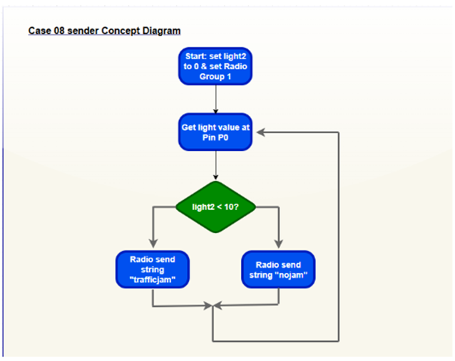

### Part List

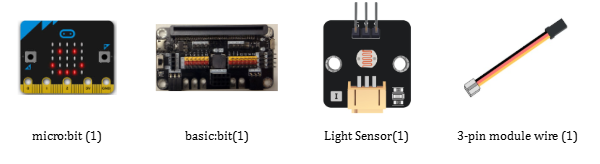

 
### Assembly step

N/A

### Hardware connect

Connect the Light Sensor to P0 port of Basic:bit 

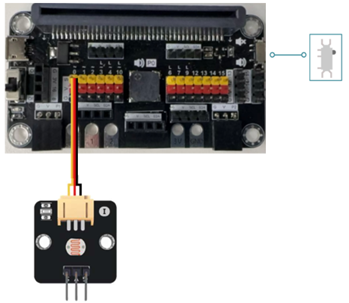

*Pull the buzzer switch 'up' to disconnect the buzzer in this execrise*

### Programming (MakeCode)

Step 1. Initialize Radio Group and variable

* Snap `Radio set group 1` from the `Radio` category to the `on start` block.
* Set `variable` `light2` to 0 from the `Variables` category. 

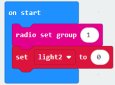

Step 2. Check traffic status

* Set `variable` `light2` to `get light sensor value from pin P0`.
* Snap `show number` from the `Basic` category to display the value of `light2` on the micro:bit LED matrix.
* Set `pause (ms)` to `1000` for the next checking.
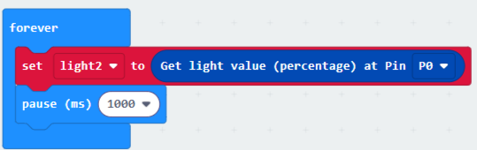

Step 3. Send notification based on traffic status

* Snap an `if statement` into the `loop`.
* Set the condition to `light2` `<` `10` (to detect a traffic jam).
* `If true`: Snap Radio `send string "trafficjam"` from the `Radio` category.
* Set `else-condition` (traffic jam is not detected)
* Else: Snap Radio send string "nojam" from the `Radio` category.

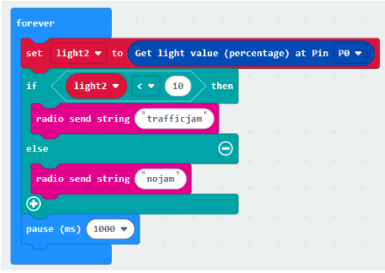

Full Solution 

MakeCode: <a href="https://makecode.microbit.org/_c47HLick1T6p" target="_blank">https://makecode.microbit.org/_c47HLick1T6p</a>

You could also download the program from the following website: 
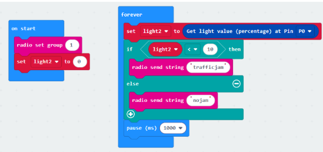

### Result

The light sensor is used to detect the traffic status. When the light intensity is low (sensor is covered), it indicates a traffic jam, and a radio message "trafficjam" will be sent to the receiver micro:bit. When the light intensity is high, it indicates no traffic jam, and a radio message "nojam" will be sent. 

 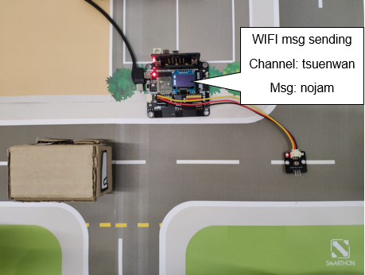

Once the light intensity is too low, it indicates that there is a traffic jam on the road. A radio message "trafficjam" will be sent to another micro:bit (receiver). 

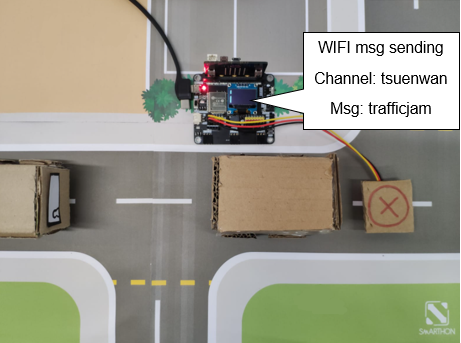

### Think

Q1. How can we use distance sensor to detect traffic status? 

## Receiver

### Goal

 

### Background

How to receive a signal from another micro:bit?

Micro:bits (sender and receiver) are set to the same Radio Group so messages can be sent between them instantly. If the receiver micro:bit receives a radio message "trafficjam" from the sender, the connected traffic light will turn red. 

Receiver micro:bit operation

When a radio message "trafficjam" is received, it means there is a traffic jam ahead. The traffic LED Module will turn red. When a radio message "nojam" is received, it means there is no traffic jam. The traffic LED Module will turn green. By using a smart traffic light, traffic congestion can be reduced through automatic traffic control. 

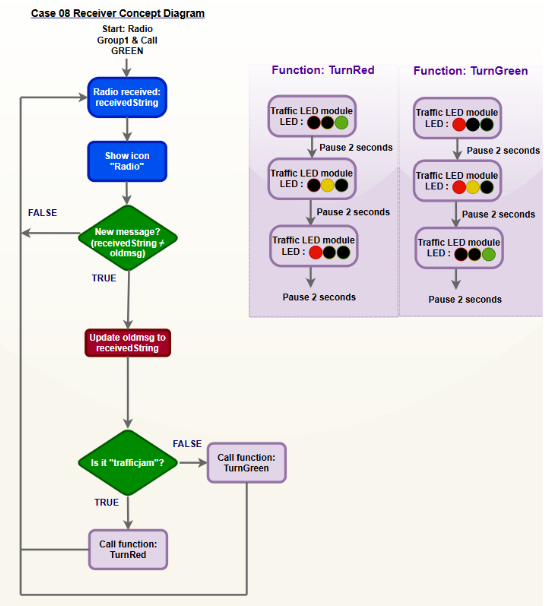

### Part List

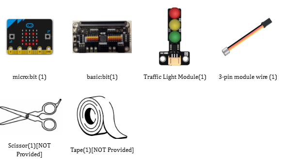

## DIY Installation & Mounting

1. Materials: Cardboard , scissors and tape. 

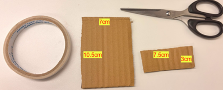

2. Make the holes: 

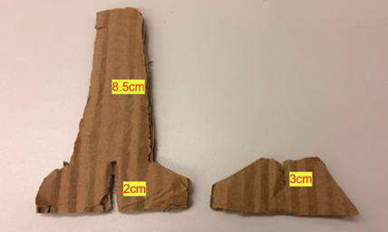

3. Finished look: 

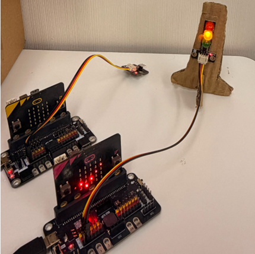

*You can buy the material set from smarthon website.

### Hardware connect

Connect the Traffic LED Module to P0 port of IoT:bit 

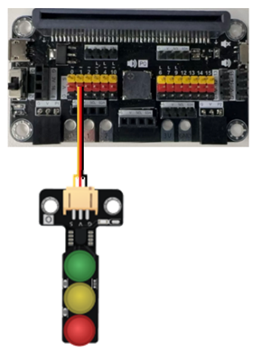

### Programming (MakeCode)

Step 1. Initialize System (on start)

* Snap `Radio set group 1` to `on start`.
* Set `variable` `oldmsg` to `"" (empty text)` from the `Variables` category. 
* Call `function` `TurnGreen` to set the initial state of the traffic light. 

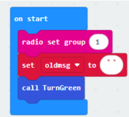

Step 2. Set up Radio Receiver block

* Snap the `event block` `on radio received` (receivedString) from the `Radio` category to the workspace.
* Snap `show icon (tick)` inside the block to provide visual feedback when a signal is received.

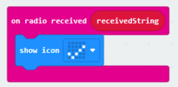

Step 3. Set up a new function (TurnRed)

* `Control traffic light` at `P1` `green on` from SmartCity > Output
* `Pause for 2000ms` from `basic
* `Control traffic light` at `P1` `yellow on`, `pause for 2000ms`
* `Control traffic light` at `P1` `red on` and `pause for 2000ms`.

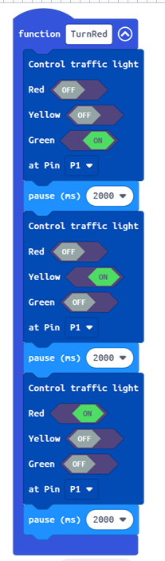

 
Step 4. Set up a new function (TurnGreen)

* `Control traffic light` at `P1` `red on` from SmartCity > Output
* `Pause for 2000ms` from `basic`
* `Control traffic light` at `P1` `red and yellow on`, `pause for 2000ms`
* `Control traffic light` at `P1` `green on` and `pause for 2000ms`.
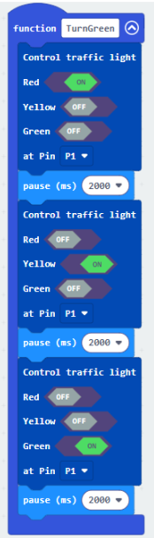

Step 5. Change traffic light status with logic.

* Snap an `if statement` into the `on radio received` block. Set the `condition` to `receivedString ≠ oldmsg`.
* Inside this block, set `oldmsg = receivedString` to update the latest traffic status.
* Snap a `nested if...else if statement` inside:
* If `receivedString == "trafficjam"`, call function `TurnRed`.
* `Else if receivedString == "nojam"`, call function `TurnGreen`.

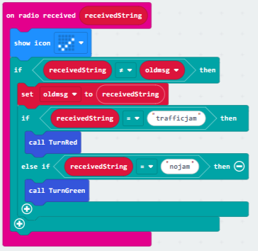

Full Solution 

MakeCode: <a href="https://makecode.microbit.org/_A4zCu0fuKY6f" target="_blank">https://makecode.microbit.org/_A4zCu0fuKY6f</a>

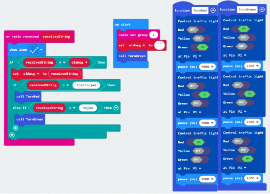

### Result

By receiving radio messages, the traffic LED module will turn to the corresponding color automatically. If there is no traffic jam ahead (detected by the light sensor), the sender micro:bit will send the radio message "nojam" to the receiver, and the traffic light will turn green. If there is a traffic jam ahead, the sender will send the radio message "trafficjam", and the receiver will turn the traffic light red.
 

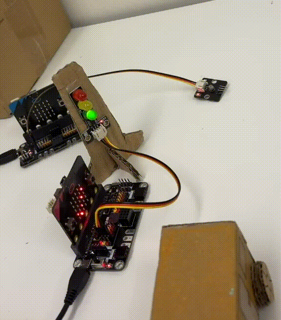

### Think

Q1. How can we add sound effect to the traffic LED Module according to the corresponding color? 

