# Case 09: Smart House door control

Level: 
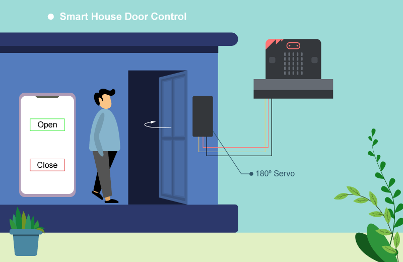

## Goal

Use the "IoT microbit" app to control the door of the house via Bluetooth.  

## Background

What is IoT microbit APP? 

IoT microbit is a ready-to-use application available on Google Play and App Store. It allows users to control micro:bit sensors and actuators (like LED and Servos) directly via Bluetooth without building an app from scratch. 

Smart House door operation 

When the micro:bit receives the Bluetooth signal "a" (triggered by the icon ON in the app), the 180° servo will turn to 45° to open the door.
When the micro:bit receives the Bluetooth signal "b" (triggered by the icon OFF in the app), the 180° servo will turn to 180° to close the door. 

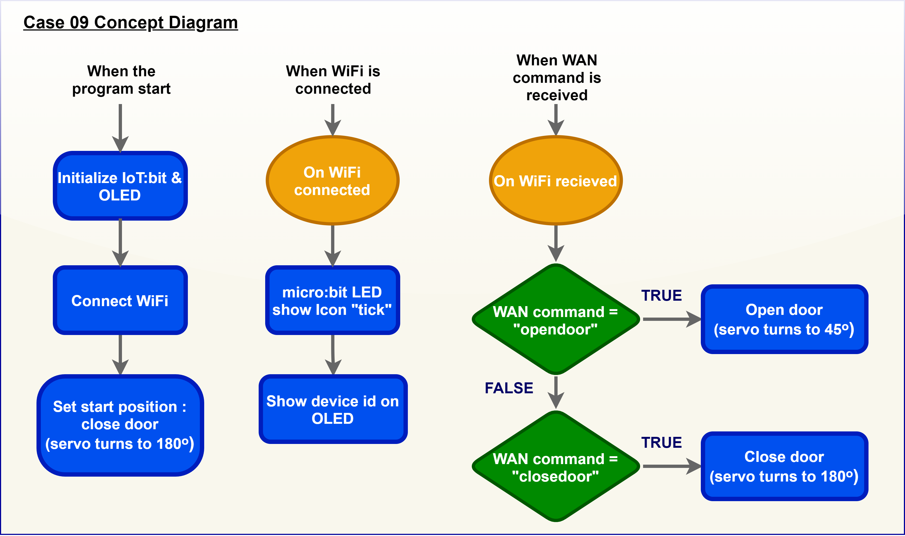

## Part List

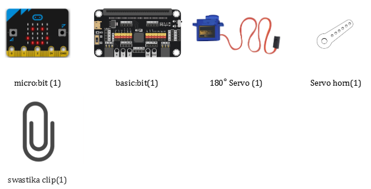

## Assembly step

* Materials: 6 Cardboards(11.5cm x 13cm ) , scissors , tape and swastika clip . 

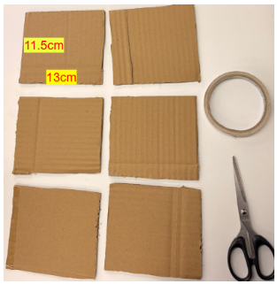

* Make the holes : 

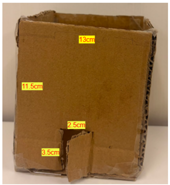

* Back: Attached to the 180° Servo using a swastika clip. 

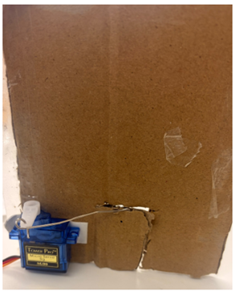

* Finished look: 

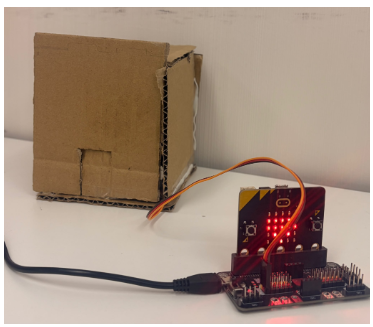

## Hardware connect

Connect the 180ᵒ servo to P0 port of Basic:bit 

Micro:bit P0|Servo
-:-|-:-
S (yellow)|S (orange)
V (red)|V (red)
G (black)|G (brown)

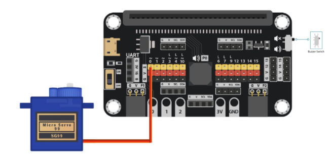

## Programming (MakeCode)

Step 1. Start-up:
* When the micro:bit powers on, `basic.showIcon(IconNames.Heart)` displays a heart icon on the LED screen to show the program is running. 
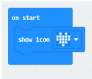

Step 2. Button A Action:  

* Pressing `Button A` triggers `pins.servoWritePin(AnalogPin.P0, 45)`, rotating the motor on pin `P0 to 0 degrees`, and displays a checkmark icon.
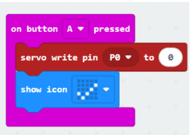

Step 3. .Button B Action:  

* Pressing `Button B` triggers `pins.servoWritePin(AnalogPin.P0, 180),` rotating the motor on pin `P0 to 90 degrees`, and displays an "X" icon.
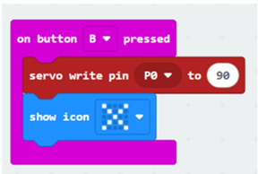

Full Solution 

MakeCode: [https://makecode.microbit.org/_1sH0s1bLTDdb](https://makecode.microbit.org/_1sH0s1bLTDdb) 

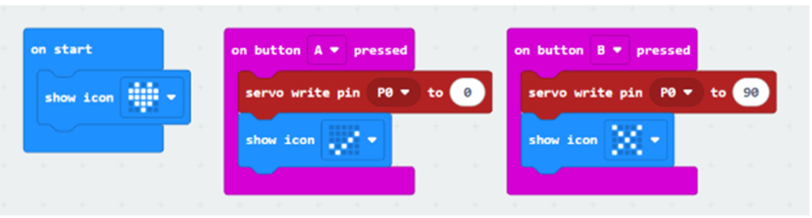

You could also download the program from the following website: 
<iframe src="https://makecode.microbit.org/_1sH0s1bLTDdb" width="100%" height="500" frameborder="0"></iframe>

## Result

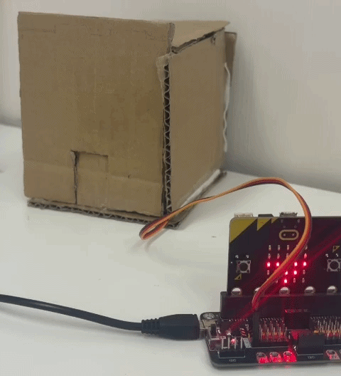

## Think

Q1. How can we add password authentication to open the door? 

Q2. We can install the servo to different position in the house (tips: modify the turning angle of the servo) 

