# IoT Case 10: Smart Street Light

Level: 
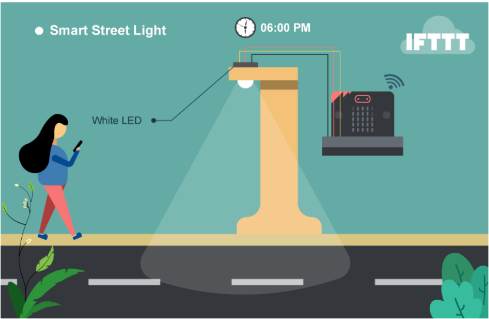

## Goal

Make a smart streetlight that automatically controls the LED based on simulated time and ambient light levels.  

## Background

What is Smart Street Light? 

To improve the living standards of citizens and save electricity, smart street lights can be automatically adjusted according to the time of day and environmental brightness. 

Smart Streetlight operation 

The system uses a timer to simulate a 24-hour cycle. During the active daytime period (e.g., 6 AM to 6 PM), the micro:bit monitors the light value at Pin P2. If the environment becomes too dark (light < 40%), the LED will automatically turn on to ensure safety. 

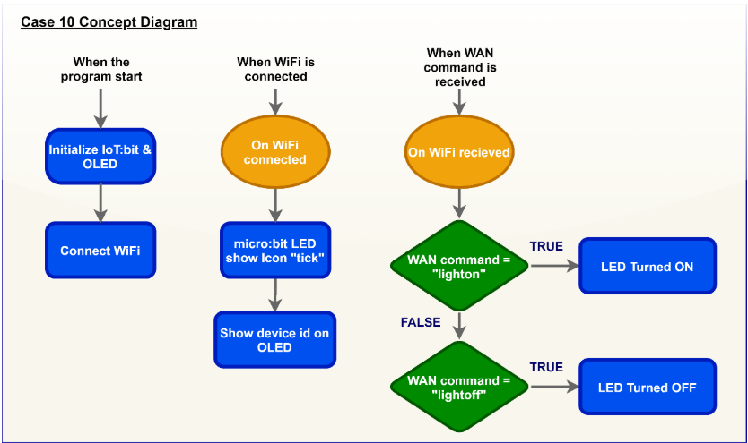

## Part List

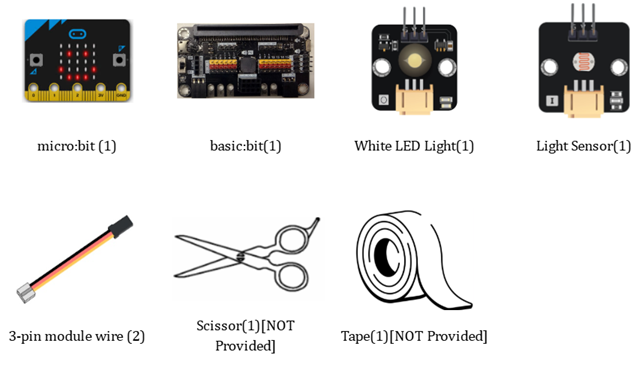

## Assembly step

* Materials:Cardboards, scissors and tape. 

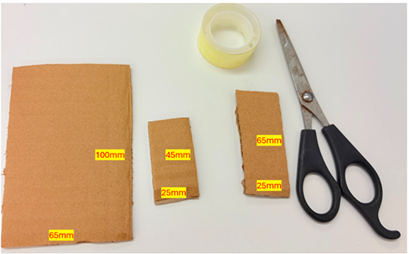

* Make the holes : 

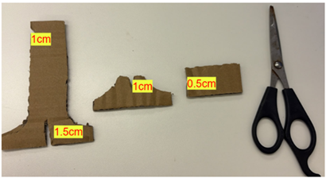

* Finished look : 

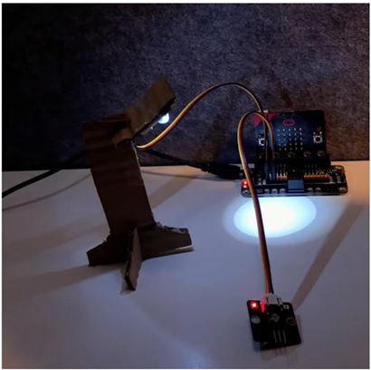

* You can buy the material set from smarthon website. 

## Hardware connect

Connect the white LED Light to P0 port of Basic:bit. 

Connect the Light Sensor to P2 port of Basic:bit. 

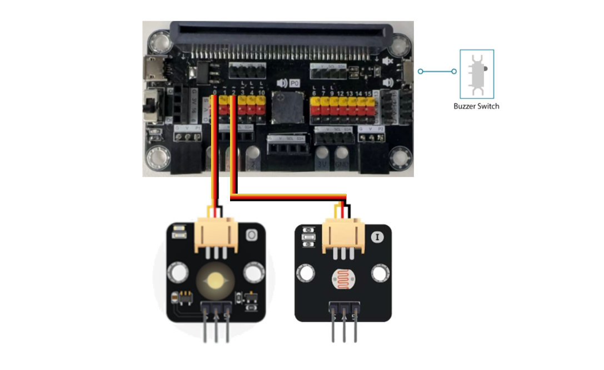

Pull the buzzer switch ‘up’ to disconnect the buzzer in this execrise 

## Programming (MakeCode)

Step 1. Initialize the simulated timer
* Create a new variable named time. 
* Snap `set time to 0` to `on start` 
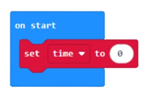

Step 2. Simulate Time and Read Light Levels 

* Snap `pause (ms) 3600000` into the `forever` block.This represents 1 hour (60 mins × 60 secs × 1000 ms).
* Create a new `variable` named light
* Below the `pause`, snap `change time by 1` to simulate the passing of each hour
* Snap `set light to Get light value (percentage) at Pin P2` below the time update
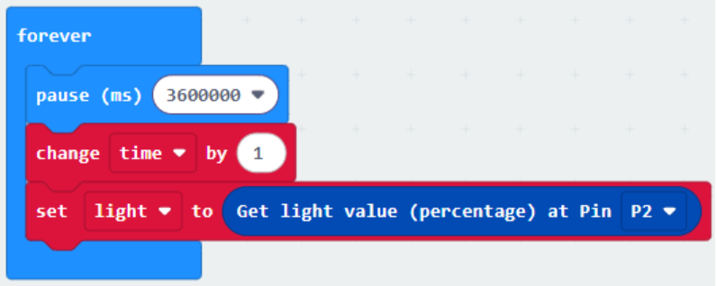

Step 3. Logic Judgment for Time and Brightness 

* Snap an `if block with the logic: time > 6 and time < 18`
* Inside the first `if`, nest another `if` block with the logic: `light < 40`
* If the condition is met, `Turn White LED to 1023 at P0`. Otherwise (else), `Turn White LED to 0 at P0`
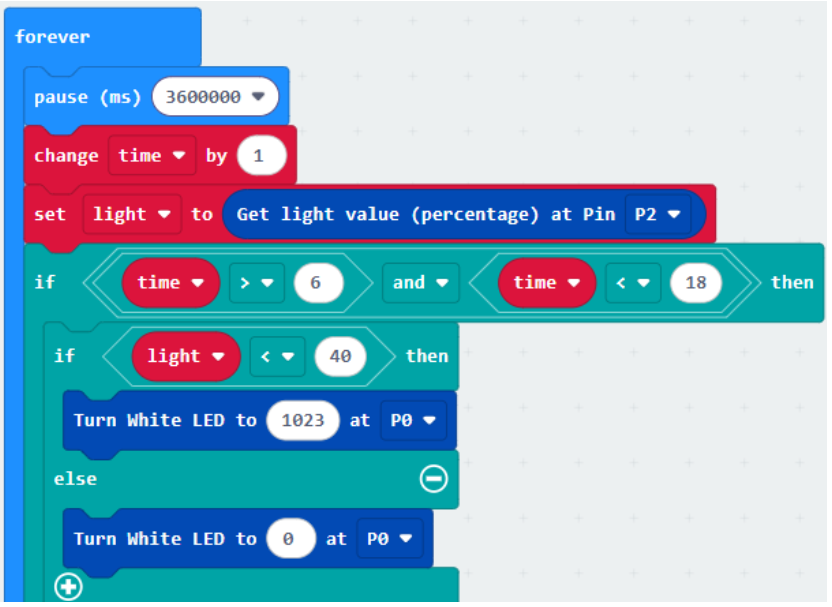

Step 4. Reset the Timer 

* Click the (+) on the bottom of the `if` block to add an `else if` section
* Set the condition to `time = 24`
* Snap `set time to 0` inside this section to restart the daily cycle
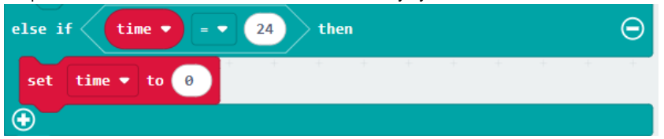

Full Solution 

MakeCode:<a href="https://makecode.microbit.org/_KbHfEVbTPaT8"
target="_blank">https://makecode.microbit.org/_KbHfEVbTPaT8</a> 

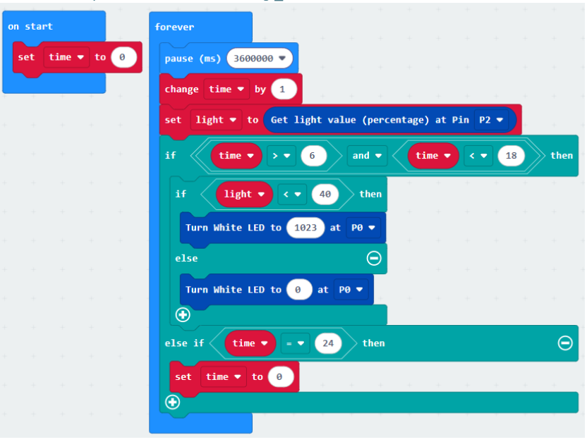

 
 
## Result
The micro:bit automatically monitors the time and ambient light levels. During the simulated daytime (6:00 to 18:00), the LED light will automatically turn on (intensity 1023) if the environment becomes dark (light < 40%). At all other times or when it is bright enough, the LED remains off. The timer resets to 0 every 24 hours to ensure continuous daily operation. 

## Think

Q1.  If the street light turns on too early in the evening, which value in the code should you adjust to make it more sensitive to darkness? 

