# IoT Case 11: Roof garden clothes rack

Level: 
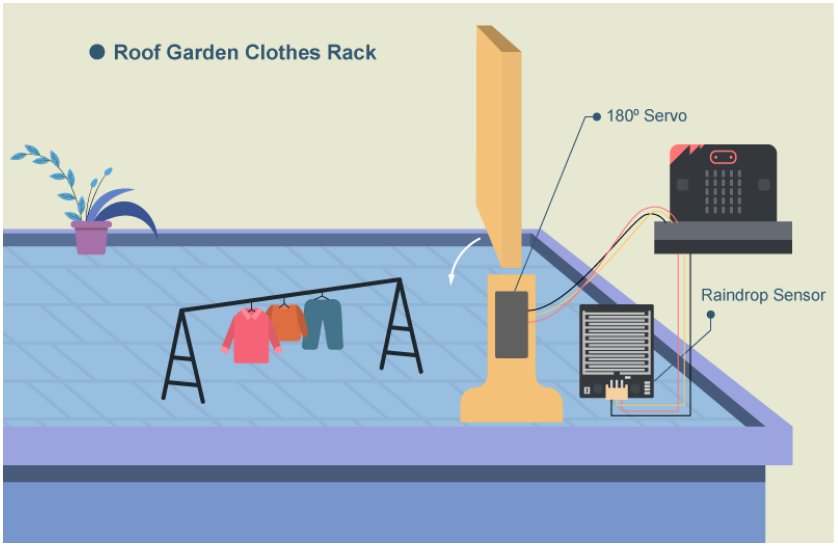

## Goal

Make a smart roof garden clothes rack, once the weather condition is changed, the rack can be opened/ closed automatically.  

## Background

What is Roof garden clothes rack? 

People no long need to rush up to the roof when raining as the clothes rack can be closed automatically even when house owner is not at home. 

Roof garden clothes rack operation 

The raindrop sensor detects the rain level. If the rain value is greater than 10, the servo will turn to 180ᵒ and the rack will be closed. If the weather is clear (value ≤ 10), the servo will turn to 90ᵒ and the rack will be opened. 

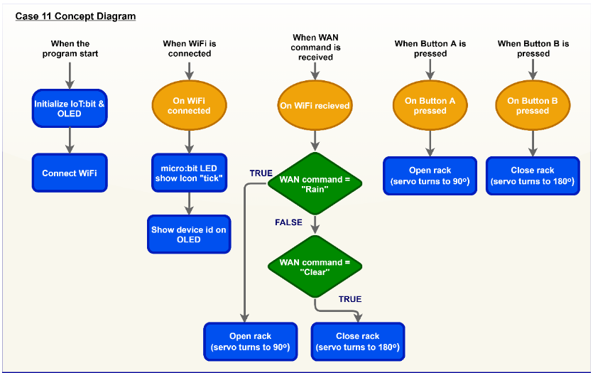

## Part List

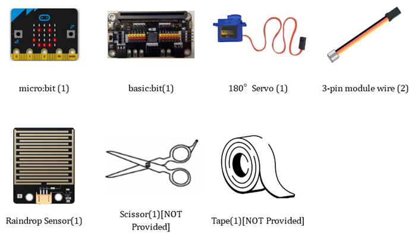

## Assembly step

* Materials:Cardboards, scissors and tape. 

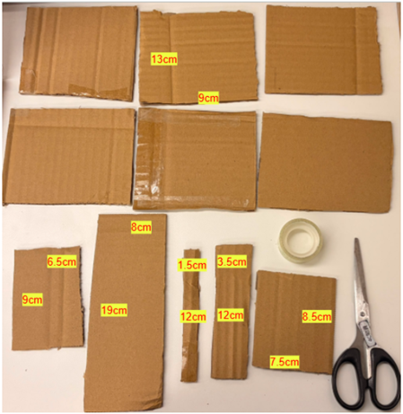

Step 1: 

Glue 6 pieces of 13cm by 9cm cardboard into cubes with tape 

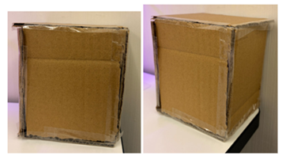

Step 2: 

Attach cardboard(19cmx8cm) to one of the sides 

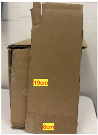

Step 3: 

Cut a 3cm by 1cm hole in the cardboard(9cmx6.5cm) piece to install the spinning machine, and insert it into the cardboard(19cmx8cm) piece 

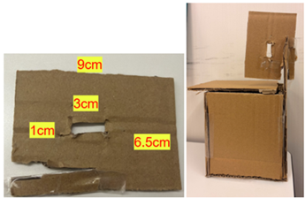

Step 4: 

Place cardboards (3.5cmx12cm), (1.5cmx12cm), and (8.5cmx7.5cm) together and plug them into the servo-horn
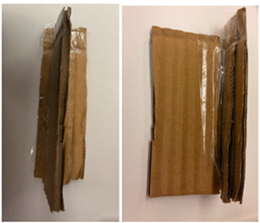

Finished look: 

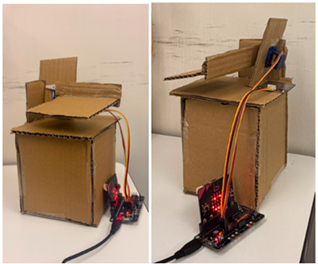

* You can buy the material set from smarthon website. 

## Hardware connect

Connect the 180° Servo to P1 and the Raindrop Sensor to P2 port of the extension board. 

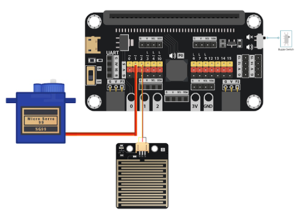

## Programming (MakeCode)

Step 1. Initialize servo position
* From the Variables category, drag the block to `set rain_value to 0` into the `on start` block
* Snap `Turn Servo to 90 degree at P1` from SmartCity > Output to `on start` to set the initial position of the clothes rack (Open)
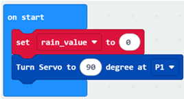

Step 2. Set up manual control buttons 

* From the Input category, drag the `on button A pressed` block. Snap `Turn Servo to 90 degree at P1` and `show string "OPEN"` inside.
* Drag the `on button B pressed` block. Snap `Turn Servo to 180 degree at P1` and `show string "CLOSE"` inside. 
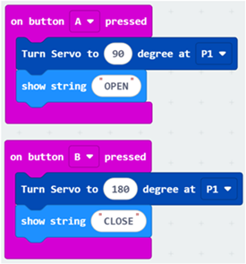

Step 3. Read raindrop sensor value 

* Drag the `forever` block from the Basic category
* Inside the loop, `set the variable rain_value to read raindrop sensor at P2` from the SmartCity > Sensor category

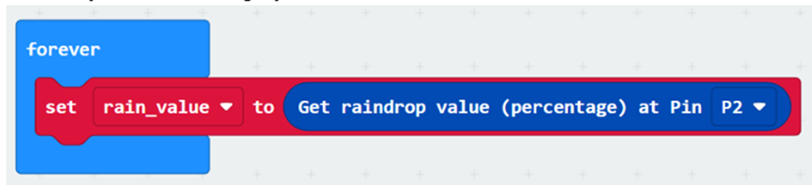

Step 4. Control rack open/close by sensor 

* Snap an `if-else` statement into the `forever` loop
* Set the condition to `rain_value > 10` 
* If true (Raining), snap `Turn Servo to 180 degree at P1` and `show icon Umbrella`
* Else (Clear), snap `Turn Servo to 90 degree at P1` and `show icon Happy`
* Add a pause 500ms
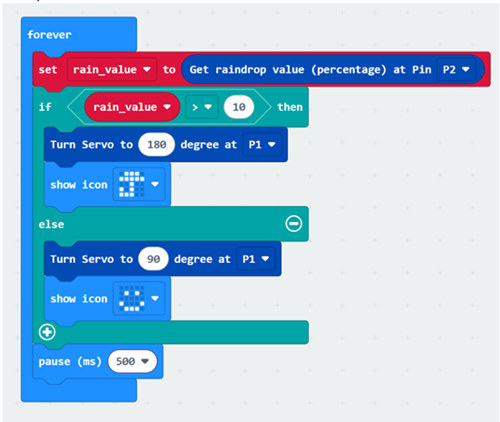

Full Solution 

MakeCode:<a href="https://makecode.microbit.org/_i8k8qfJA8MfU"
target="_blank">https://makecode.microbit.org/_i8k8qfJA8MfU</a>  

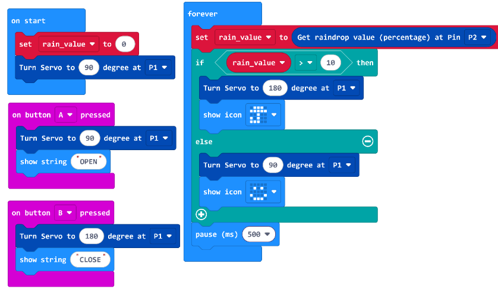

 
 
## Result
The clothes rack is controlled by the raindrop sensor. When the sensor detects rain (value > 10), the servo turns to 180° to close the rack and the LED screen shows an umbrella. When the weather is clear (value ≤ 10), the servo turns to 90° to open the rack and shows a happy face. 

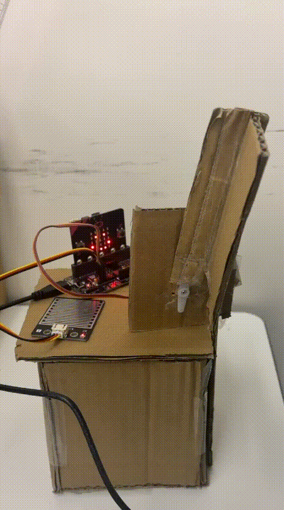

## Think

Q1.  Can you control the clothes rack by other environmental factors? (e.g., using a light sensor to close the rack at night, or a soil moisture sensor to water the garden). 
