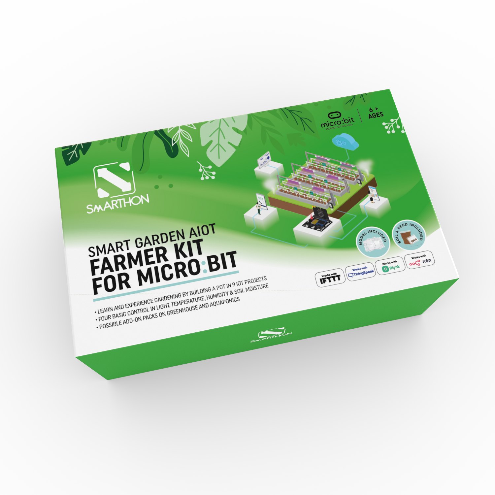
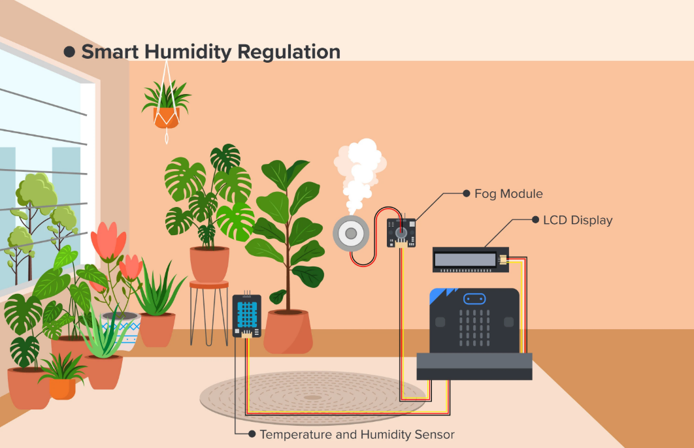

# Introduction

## Introduction

Smarthon Smart Garden AIoT Farmer Kit is designed to introduce the fundamentals of the Internet of Things (IoT) with a focus on plant care and environmental monitoring. This kit provides a comprehensive set of sensors and actuators tailored to study and optimize plant growth conditions. Using Smarthon IoT boards compatible with BBC micro:bit, users can explore real-world applications by creating intelligent systems such as automatic irrigation, lighting control and environmental monitoring. This kit empowers learners not only to become responsible caretakers of plants but also to develop skills in computer science, electronics and IoT development through engaging and practical projects.

## Application Scene

<H3>Grow Light Color Control LED</H3>

<H3>Smart Humidity Regulation</H3>

## Component List

No | Component |Quantity|Remark
:-: | :-- | :--| :--
|Micro: bit|1|not included
1|Smarthon IoT:bit|1|
2|LCD screen|1|
3|LED grow light|1|
4|Fog module|1|
5|Water pump|1|
6|Soil moisture sensor|1|
7|Digital light sensor|1|
8|Temperature and humidity sensor|1|
9|Module Wire|7|4Pin Female\*1,3Pin\*5,4Pin\*1|
10|Extension Wire|6| 3Pin\*4,4Pin\*2|
11|M3\*10mm Screw|6|
12|M4\*10mm Screw|10|
13|M3 Nut|6|
14|M4 Nut|10|
15|Screwdriver|1|
16|Blu Tack|1|
17|Wooden stick|1|
18|Iron wire|1|
19|Soil |1|
20|Seed |1|
21|Fog accessories|1|
22|Pump tube|1|
23|Humidifer cup|1|
24|Pump cup|1|
25|Pot tray|1|
26|USB cable|1|
27|Battery holder|1|
28|Acrylic Model|1
29|Plactic mat|1|

 

