# Case 01: Grow Light Color Control LED

Level: 
   
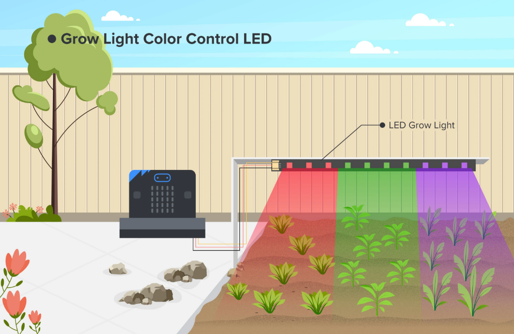

## Goal

Create a grow light that can be turned to different colors using the buttons on the micro:bit board.

## Background

What is a Grow LED Light Color Control?

Grow LED Light Color Control allows you to experiment and observe the effects of different colors of light on plant growth. With our multicolor LED, you can choose out of many different colors. By way of experimentation, you can determine a combination of blue and red lights which make purple, is the most efficient light for the plant. 

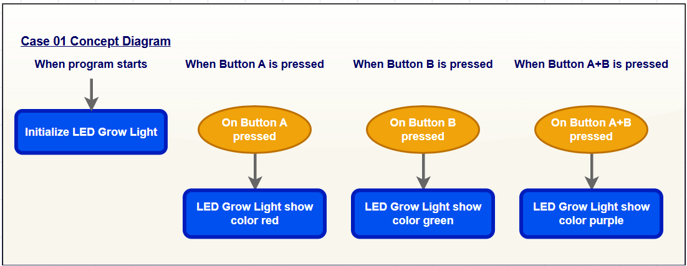

Know More: Effect on Plant with Different Light Color

Light is one of the most important aspects of plant growth. The use of supplemental grow lights is essential when you are considering cultivating plants at home. However, what many do not realise is that different colors of light have different effects on the growth of the plant.

Light color affects plant growth because different wavelengths of light influence the rate of photosynthesis. Chlorophyll primarily absorbs blue (around 430-450 nm) and red (around 640-680 nm) light most efficiently, driving higher photosynthetic rates, while green light (500-600 nm) is less absorbed and results in lower efficiency.

As a result, plants exposed to red or blue light typically grow faster and produce more glucose, while those under green light show slower growth. Therefore, by adjusting light colours through LED grow lights, growers can effectively influence plant growth rate.

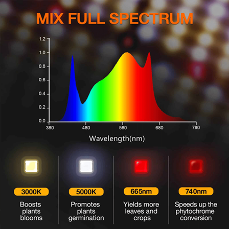

## Part List

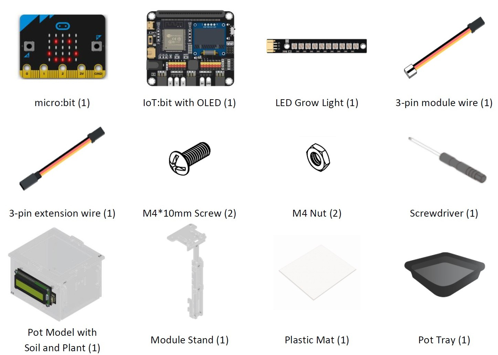

## Assembly Steps

Step 1 

To start with, build the plant pot model with soil and seedling. 

Step 2 

Connect the Module Stand with the Pot base. 

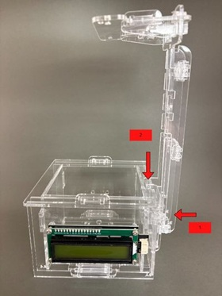

Step 3 

Insert screw with grow light led to part C1. 

Step 4 

Complete! 

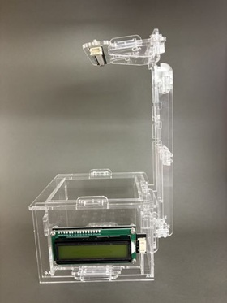

## Hardware Connection

1. Connect LED Grow Light to P1.

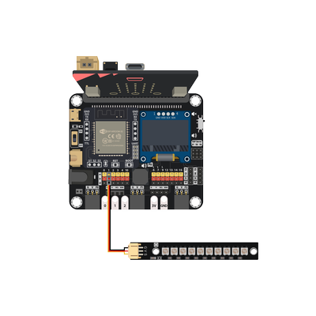

## Programming (MakeCode)

Step 1. Program Startup 

* Snap `set strip to NeoPixel at pin P1 with 10 leds as RGB (GRB format)`
* Set Brightness: `strip set brightness 255`

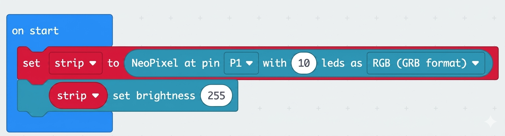

Step 2: Pressing Button A  

* Snap `on button A pressed`
* Snap `strip show color red`
* Instantly updates all 10 LEDs on the strip to solid Red.

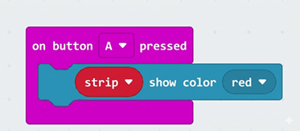

Step 3: Pressing Button B  

* Snap `on button B pressed`
* Snap `strip show color green`
* Instantly updates all 10 LEDs on the strip to solid Green.

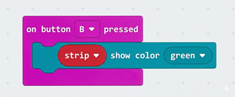

Step 4:  Pressing Buttons A + B Together  

* Snap `on button A+B pressed`
* Snap `strip set pixel color`
* Assign Individual Pixel Colors in Memory:
    Pixel 0: Red
    Pixel 1: Red
    Pixel 2: Blue
    Pixel 3: Red
    Pixel 4: Red
    Pixel 5: Blue
    Pixel 6: Red
    Pixel 7: Red
    Pixel 8: Blue
    Pixel 9: Red
* Render to the Hardware with `strip show` and send all stored color values from memory out to the physical LEDs at once.

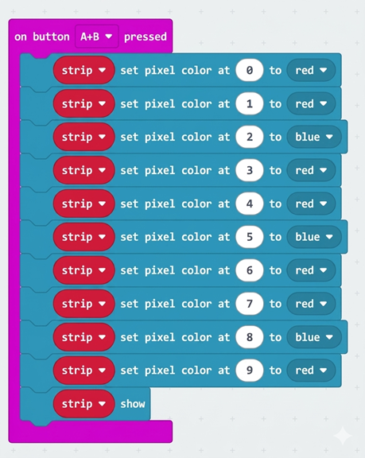

MakeCode: [https://makecode.microbit.org/\_Rkv31xWpm3ae](https://makecode.microbit.org/_Rkv31xWpm3ae) 
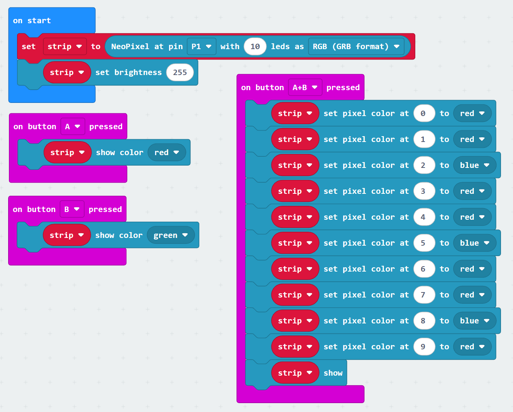

## Result

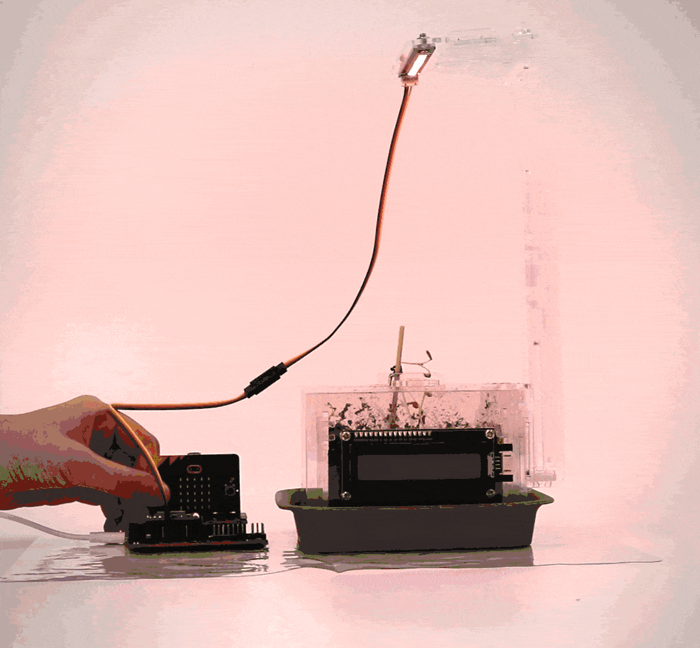

## Think

Q1. How do you mix the color to get the best effect for plant growth?